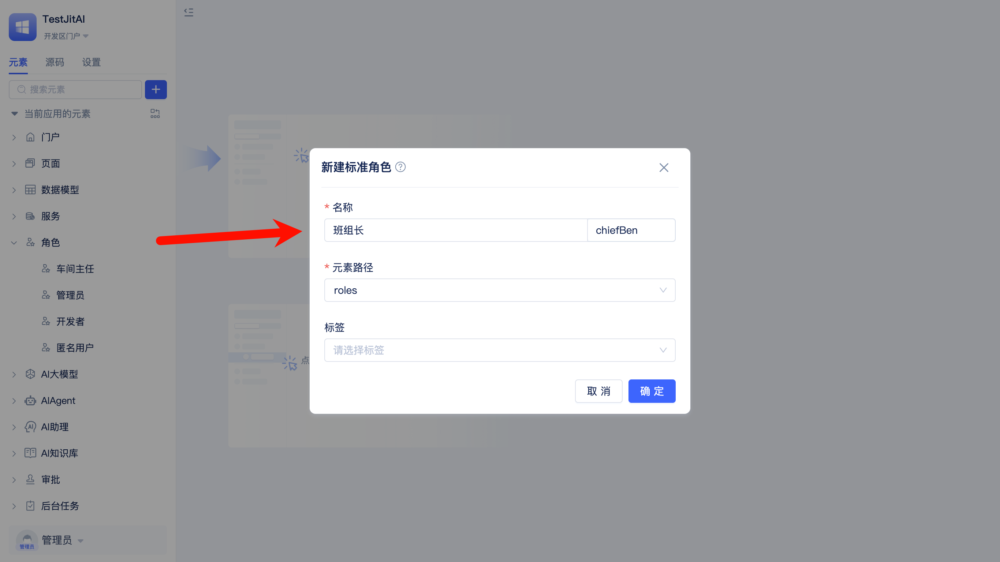
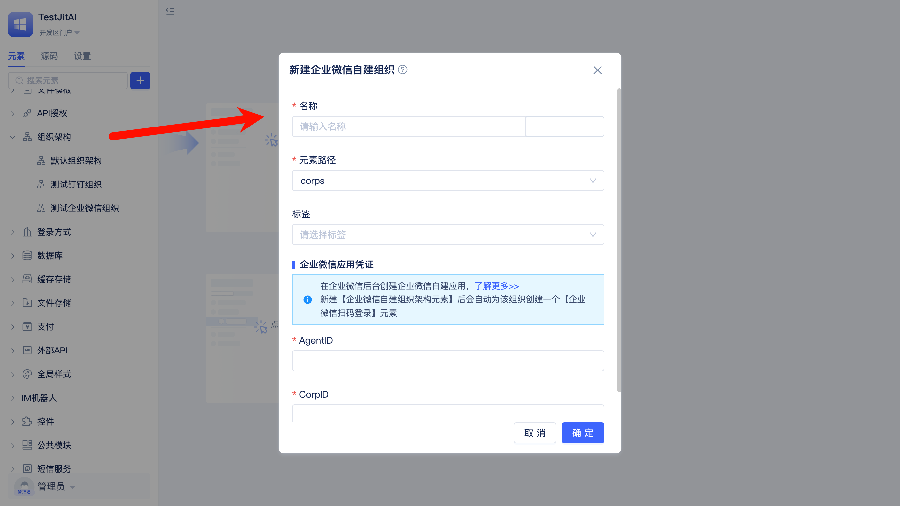
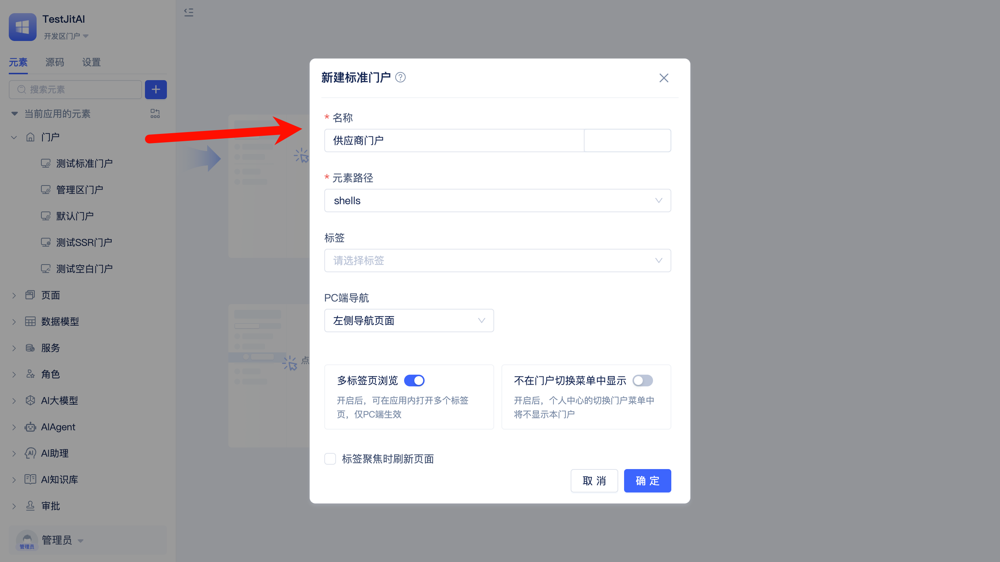
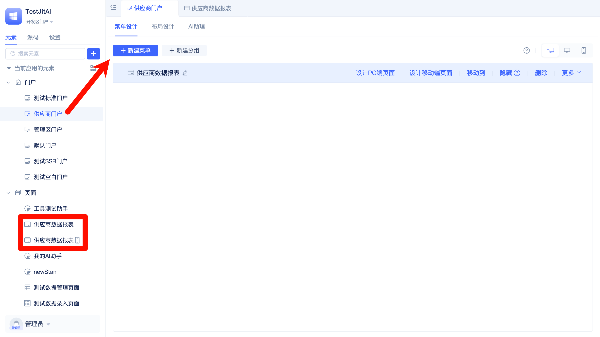
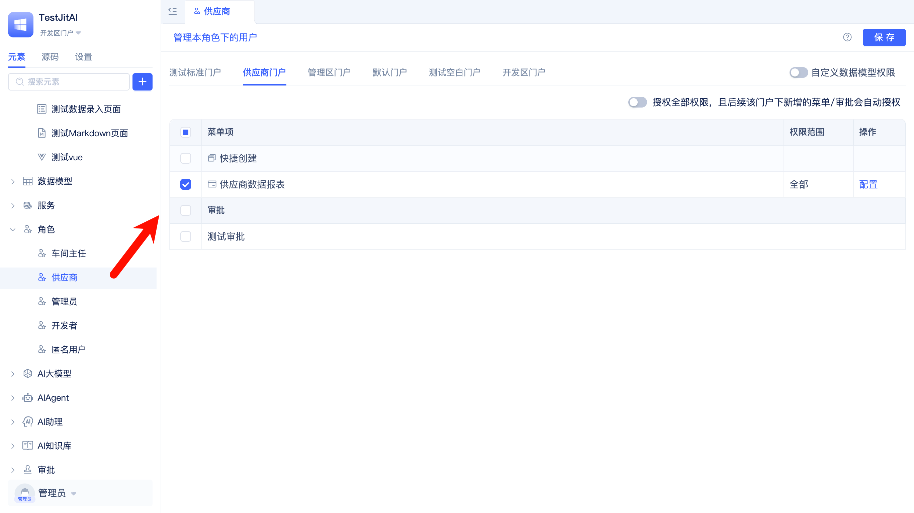
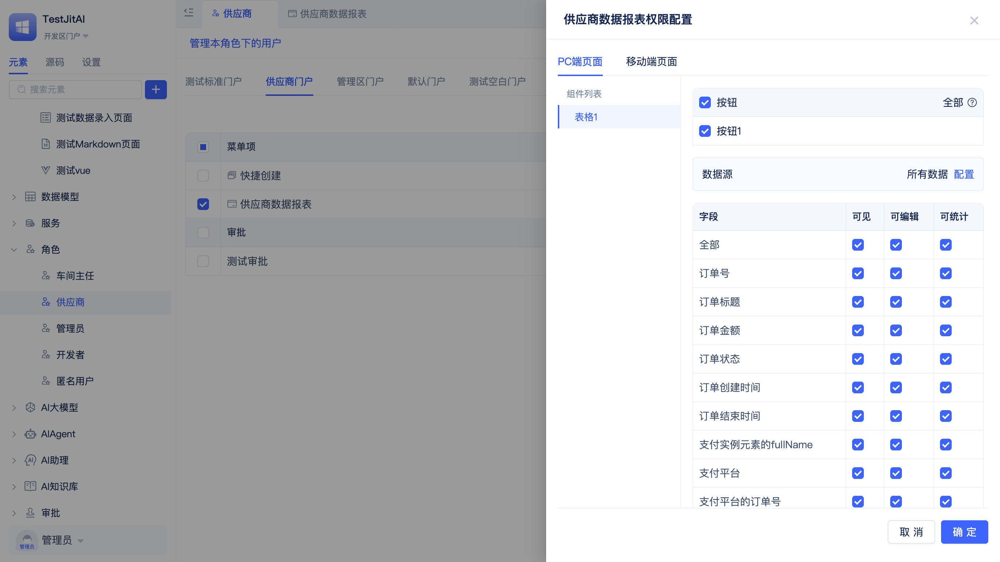

# 登录认证与权限管理

某制造企业要为MES生产管理系统设计权限体系，内部员工企业微信扫码登录并自动授予角色，外包人员使用临时账号，供应商通过微信公众号只读访问。

## 创建标准角色

创建业务所需[角色](/docs/reference/开发框架/JitAuth/标准角色.md)（如车间主任、班组长、操作工等），用于后续授权。

## 配置登录方式

接入[企业微信自建扫码登录](/docs/reference/开发框架/JitAuth/登录认证/企业微信自建扫码登录.md)与[微信公众号登录](/docs/reference/开发框架/JitAuth/登录认证/微信公众号登录.md)，满足内部/外部访问需求。

## 同步组织架构

集成[企业微信自建组织](/docs/reference/开发框架/JitAuth/企业组织/企业微信自建组织.md)，同步部门与成员，支持按组织授予数据范围权限。

## 创建专用门户

为不同人群创建专用[门户](/docs/reference/开发框架/JitWeb/门户/标准门户.md)（如供应商门户、客户门户），控制访问边界。

## 配置门户菜单与页面

在门户中添加菜单并选择“新建页面”，系统会自动创建[页面](/docs/category/页面)，随后在页面中配置组件。

相关文档：[系统界面设计与组件应用](./系统界面设计与组件应用.md)

## 为角色授予门户权限

在角色管理中将相应门户授权给对应角色，使角色获得页面访问入口。

## 配置组件内细粒度权限

在角色管理中为门户页面下组件配置按钮级、字段级与数据范围权限。

## 验证与运维交接

- 开发：完成角色、登录、组织、门户与组件权限配置
- 测试：用不同角色登录验证权限
- 交接：移交给IT管理员
- 运维：按需调整角色与权限，处理组织变更
