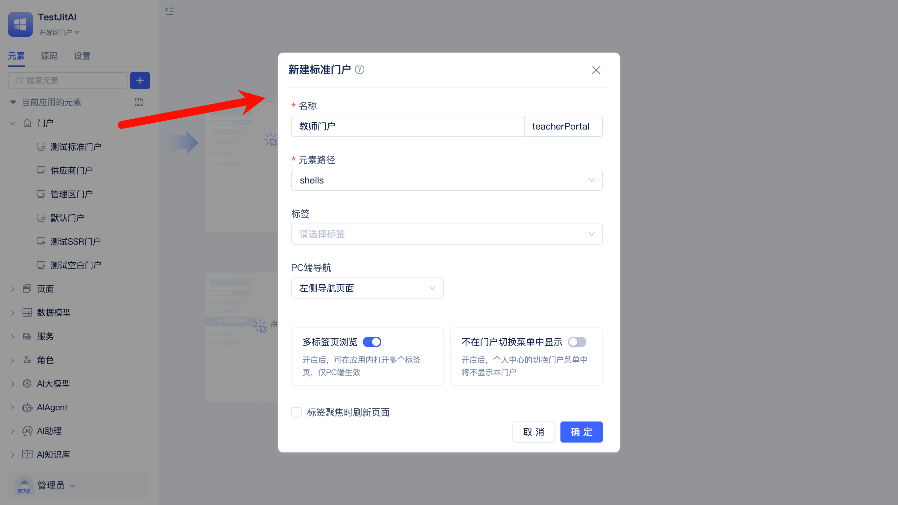
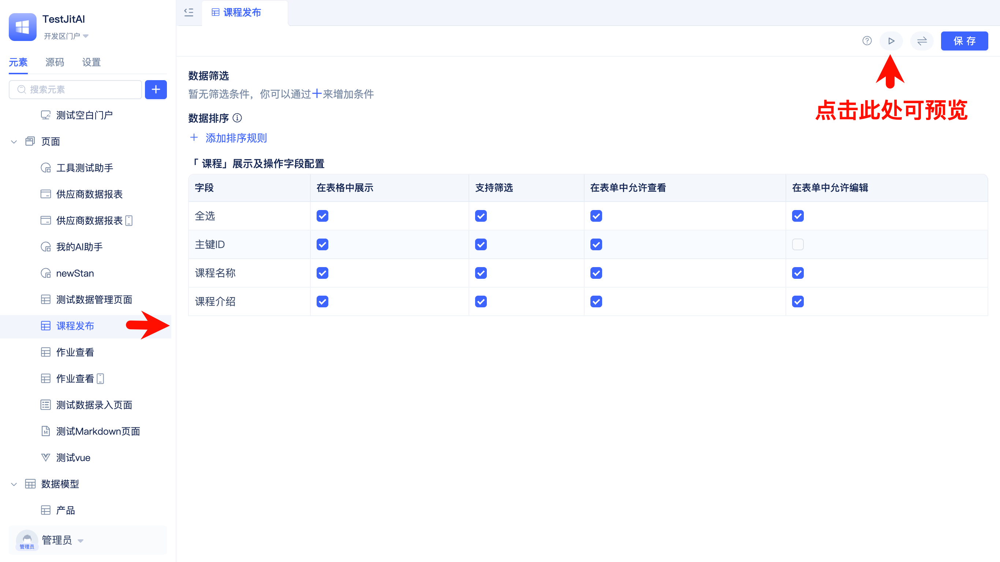
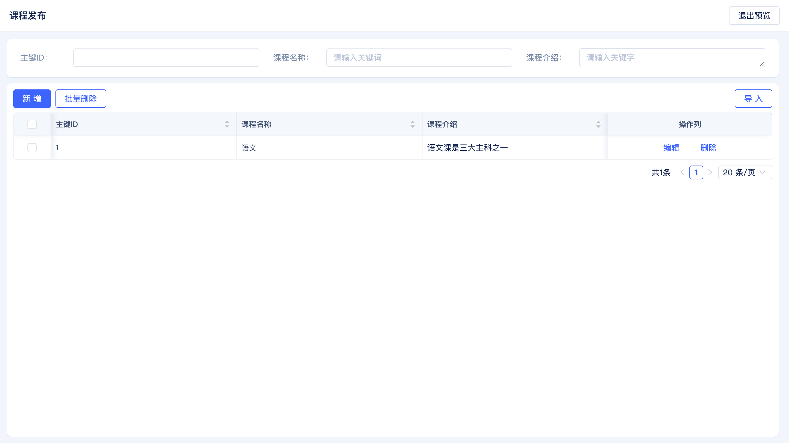
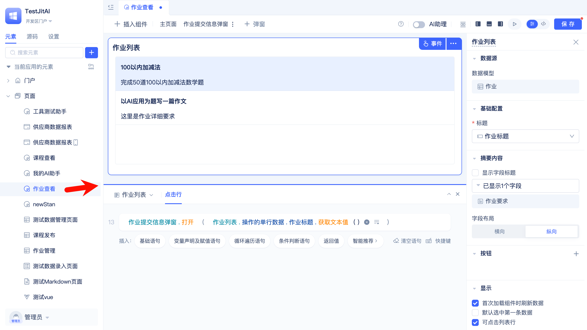

# 系统界面设计与组件应用

搭建课程管理系统的教师端与学员端界面，通过门户、页面与组件快速完成系统导航与界面布局。

## 创建按角色划分的门户

1. 创建教师门户，并新建课程发布、作业管理、作业批改三个菜单。

   

   配置教师门户的菜单

   
   
   配置菜单时选择“新建页面”，[页面类型](/docs/category/页面)如下：
     - 课程发布：AI数据管理页面
     - 作业管理：AI数据管理页面
     - 作业批改：AI数据管理页面

2. 创建学员门户并新建课程查看、作业查看两个菜单。

   配置菜单时选择“新建页面”，[页面类型](/docs/category/页面)如下：
      - 课程查看：常规页面
      - 作业查看：常规页面（提供作业提交入口）

## 为不同角色授权门户

参考[为角色授予门户权限](./登录认证与权限管理.md#为角色授予门户权限)。

## 配置页面组件

1. 课程发布页面：筛选条件、排序规则、字段的展示/支持筛选/允许查看/允许编辑等选项，可以按需修改。
   
   

   预览课程发布页面

   

   作业管理、作业批改页面同理。

2. 课程查看页面
   
   使用日历组件展示课程

   

3. 作业查看页面
   
   使用列表组件展示作业信息
   
   配置列表的`点击行`事件逻辑，用于触发作业提交弹窗。

   

   可以在弹窗内部新增表单组件，用于填写要提交的作业内容，[点击了解更多组件](/docs/category/组件)。

