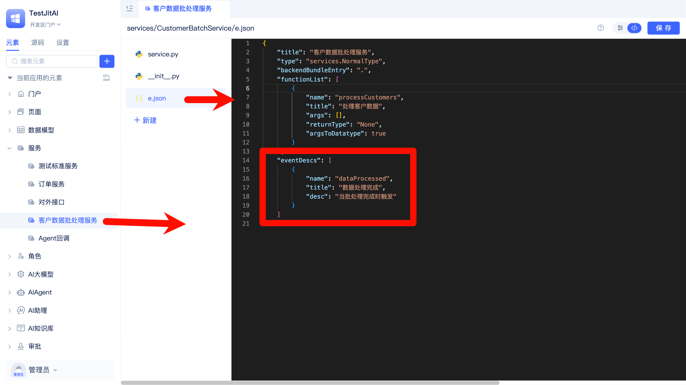
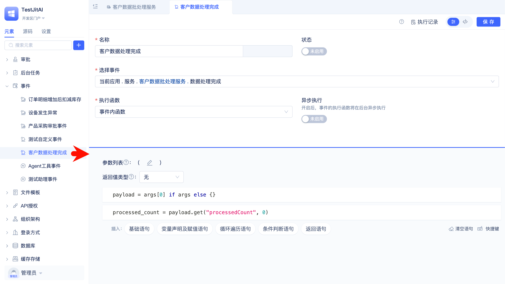

# 自定义业务事件的触发订阅与处理
在“客户数据服务”中完成一次批处理后，立即触发“数据处理完成”事件，交由独立的事件处理逻辑对事件进行响应和处理。

## 定义事件并在业务代码中实现触发逻辑

在[服务元素](/docs/reference/开发框架/JitService/自定义业务服务.md)中声明事件，并在业务代码中实现触发逻辑。

### 创建服务元素
可以通过JitAi可视化开发工具快速创建服务元素。

```text title="服务元素目录结构"
services/
├── CustomerBatchService/
│   ├── e.json
│   ├── service.py
│   └── __init__.py
```
### 在e.json中声明事件

在 `functionList` 定义批处理函数，在 `eventDescs` 定义事件（服务元素负责“声明事件”）。



```json title="services/CustomerBatchService/e.json"
{
    "title": "客户数据批处理服务",
    "type": "services.NormalType",
    "backendBundleEntry": ".",
    "functionList": [
        {
            "name": "processCustomers",
            "title": "处理客户数据",
            "args": [],
            "returnType": "None",
            "argsToDatatype": true
        }
    ],
    "eventDescs": [
        {
            "name": "dataProcessed",
            "title": "数据处理完成",
            "desc": "当批处理完成时触发"
        }
    ]
}
```

### 在服务函数中实现触发逻辑

在业务完成后触发事件，事件触发使用 `app.event.publish`，并以 “服务元素fullName.事件名” 作为 `sender`。

```python title="services/CustomerBatchService/service.py"
from services.NormalType import NormalService

class CustomerBatchService(NormalService):
    def processCustomers(self):
        # TODO执行业务逻辑
        app.event.publish(sender="services.CustomerBatchService.dataProcessed", args=({"processedCount": 100},))

```
 
## 创建自定义事件实例元素

创建[自定义事件](/docs/reference/开发框架/JitService/自定义事件.md)实例元素，订阅服务元素中声明的事件，并编写事件处理逻辑。



```text title="自定义事件元素目录结构"
events/
├── ArchiveStatistics/
│   ├── e.json
│   ├── inner.py
│   └── __init__.py
```

```json title="events/ArchiveStatistics/e.json"
{
  "type": "events.NormalType",
  "title": "归档统计事件",
  "funcType": "Inner",
  "asyncType": false,
  "enable": 1,
  "sender": "services.CustomerBatchService.dataProcessed",
  "backendBundleEntry": ".",
  "returnType": "None",
  "backendEpath": "events/ArchiveStatistics/element.pkg",
  "extendType": "self"
}
```
`sender` 必须为 “服务元素fullName.事件名”。

### 编写事件处理逻辑

```python title="events/ArchiveStatistics/inner.py"
from datatypes.Meta import datatypes

def customFunc(*args, **kwargs):
    # args[0] 为服务触发时传入的字典参数
    payload = args[0] if args else {}
    processed_count = payload.get("processedCount", 0)
    # TODO： 具体的事件处理逻辑

```
