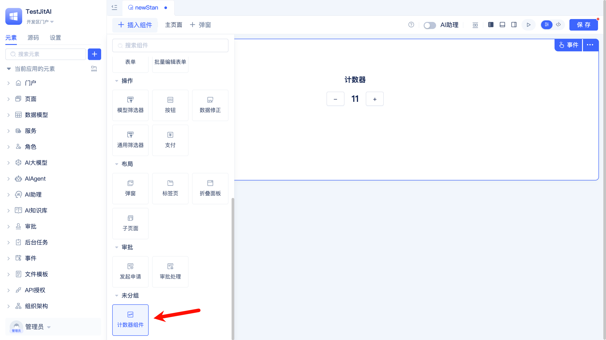

# Extend Your Own UI Component Type Elements
import Tabs from '@theme/Tabs';
import TabItem from '@theme/TabItem';

When the existing UI components in the JitAI development framework don't meet your specific business requirements, you can extend new components under `components.Meta` and integrate them into pages using the JitAI visual development tool.

In this guide, we'll walk through creating a simple counter component that demonstrates how to extend UI components. This counter features basic functionality including value display and increment/decrement buttons.

:::tip Tip
While JitAI's existing portal and page types are comprehensive and rarely need extension, UI components offer significant opportunities for customization to meet diverse presentation requirements.
:::

### Effect preview {#effect-preview}


### Element design {#element-design}
| Element Level | fullName | Main Responsibilities |
|---------|----------|----------|
| **Meta Element** | `components.Meta` | Existing Meta element in JitAI development framework (no need to create) |
| **Type Element** | `components.CounterType` | type points to `components.Meta`, encapsulates basic counter functionality, handles value increment/decrement, style configuration, etc. |
| **Configuration when used in pages** | Page scheme.json | Configure specific runtime parameters for components in pages and declare events, functions, variables |

#### Counter component directory structure {#counter-component-directory-structure}
```shell title="Recommended Directory Structure"
├── components/
│   └── CounterType/
│       ├── e.json
│       ├── constants.ts          # Constant definitions
│       ├── index.ts              # PC entry file
│       ├── index.mobile.ts       # Mobile entry file
│       ├── CounterComponent.ts   # Business logic layer (shared by PC and mobile)
│       └── render/
│           ├── pc/
│           │   └── CounterRender.tsx    # PC rendering component
│           └── mobile/
│               └── CounterRender.tsx    # Mobile rendering component
```

## Operation guide {#operation-guide}
### Creating directory structure {#creating-directory-structure}
In your JitAI application root directory, create directories according to the following structure:

```bash
# Execute in application root directory
mkdir -p components/CounterType
mkdir -p components/CounterType/render/pc
mkdir -p components/CounterType/render/mobile
```

### Implementing element files {#implementing-element-files}
<Tabs>
  <TabItem value="config" label="Element Definition File">

**Create element declaration file** `components/CounterType/e.json`:

```json title="components/CounterType/e.json"
{
  "frontBundleEntry": "./index.ts",
  "frontMobileBundleEntry": "./index.mobile.ts",
  "description": "Counter Type element, encapsulates core counter functionality",
  "title": "Counter Component",
  "type": "components.Meta",
  "outputName": "index"
}
```

  </TabItem>
  <TabItem value="entry" label="Entry Files">

**Create PC entry file** `components/CounterType/index.ts`:

```typescript title="components/CounterType/index.ts"
import Render from './render/pc/CounterRender';
import { CounterComponent } from './CounterComponent';
export { COUNTER_EVENTS } from './constants';

// Rename exports for JitAI tool recognition
export { CounterComponent as ComponentCls, Render };
```

**Create mobile entry file** `components/CounterType/index.mobile.ts`:

```typescript title="components/CounterType/index.mobile.ts"
import Render from './render/mobile/CounterRender';
import { CounterComponent } from './CounterComponent';
export { COUNTER_EVENTS } from './constants';

// Rename exports for JitAI tool recognition
export { CounterComponent as ComponentCls, Render };
```

  </TabItem>
  <TabItem value="render" label="Render Components">

**Create PC rendering component** `components/CounterType/render/pc/CounterRender.tsx`:

```tsx title="components/CounterType/render/pc/CounterRender.tsx"
import React, { useState } from 'react';
import { Button, Typography, Space } from 'antd';

const { Title, Text } = Typography;

interface CounterRenderProps {
  compIns: any; // Component instance
}

const CounterRender: React.FC<CounterRenderProps> = ({ compIns }) => {
  const [count, setCount] = useState(compIns.config?.initialValue || 0);

  const handleIncrement = () => {
    const newValue = count + 1;
    setCount(newValue);
    compIns.value = newValue;
  };

  const handleDecrement = () => {
    const newValue = count - 1;
    setCount(newValue);
    compIns.value = newValue;
  };

  return (
    <div>
      <Title level={4}>Counter</Title>
      <Space>
        <Button onClick={handleDecrement}>-</Button>
        <Text>{count}</Text>
        <Button onClick={handleIncrement}>+</Button>
      </Space>
    </div>
  );
};

export default CounterRender;
```

**Create mobile rendering component** `components/CounterType/render/mobile/CounterRender.tsx`:

```tsx title="components/CounterType/render/mobile/CounterRender.tsx"
import React, { useState } from 'react';
import { Button, Typography, Space } from 'antd';

const { Title, Text } = Typography;

interface CounterRenderProps {
  compIns: any; // Component instance
}

const CounterRender: React.FC<CounterRenderProps> = ({ compIns }) => {
  const [count, setCount] = useState(compIns.config?.initialValue || 0);

  const handleIncrement = () => {
    const newValue = count + 1;
    setCount(newValue);
    compIns.value = newValue;
  };

  const handleDecrement = () => {
    const newValue = count - 1;
    setCount(newValue);
    compIns.value = newValue;
  };

  return (
    <div>
      <Title level={5}>Counter</Title>
      <Space>
        <Button onClick={handleDecrement}>-</Button>
        <Text>{count}</Text>
        <Button onClick={handleIncrement}>+</Button>
      </Space>
    </div>
  );
};

export default CounterRender;
```

  </TabItem>
  <TabItem value="component" label="Business Logic">

**Create constants file** `components/CounterType/constants.ts`:

```typescript title="components/CounterType/constants.ts"
// Counter event type constants
export const COUNTER_EVENTS = {
  VALUE_CHANGE: 'valueChange'
} as const;
```

**Create component logic class** `components/CounterType/CounterComponent.ts`:

```typescript title="components/CounterType/CounterComponent.ts"
import type { ComponentConfig } from 'components/Meta/frontend/type';
import { Jit } from 'jit';

export class CounterComponent extends Jit.BaseComponent {

  /**
   * Must implement: Get component variable list
   * Used by visual editor to display available variables
    After the variable is declared here, Jit will automatically generate variables based on the name:  this.value = {
    value: 0,
    title: 'Current Value',
    } 
   */
  static getVariableList(compConfig: Record<string, any>) {
    return [
      {
        name: 'value',
        title: 'Current Value',
        dataType: 'Numeric',
        value:0
      }
    ];
  }

  /**
   * Must implement: Get component function list
   * Used by visual editor to display callable methods
   */
  static getFuncList(compConfig: Record<string, any>) {
    return [
      {
        title: 'Get Value',
        name: 'getValue',
        args: []
      }
    ];
  }

  /**
   * Must implement: Get component event list
   * Used by visual editor to display listenable events
   */
  static getEventList() {
    return [
      {
        name: 'valueChange',
        title: 'Value Change',
        data: 'eventData
      }
    ];
  }

  constructor(componentInfo: ComponentConfig<any>) {
    super(componentInfo);
    this.value.value = this.config?.initialValue || 0;
  }

  getValue(): number {
    return this.value.value;
  }

  async init() {
    await super.init();
  }
}
```

  </TabItem>
</Tabs>

:::important Required specifications for UI component Type elements
To ensure your component is properly recognized and loaded by the page editor, follow these requirements:

**1. Use exact export names**
- Component class must be exported as `ComponentCls`
- Renderer class must be exported as `Render`
- Internal class names can be customized (e.g., `CounterComponent`, `CounterRender`)

**2. Implement three static methods**  

```typescript
// Get component variable list (used by editor to display available variables)
static getVariableList(compConfig: Record<string, any>): Array<{
  name: string;
  title: string; 
  dataType: 'Numeric' | 'JSON' | 'Text';
  readonly?: boolean;
}>

// Get component function list (used by editor to display callable methods)
static getFuncList(compConfig: Record<string, any>): Array<{
  title: string;
  name: string;
  args: Array<{
    name: string;
    title: string;
    dataType: 'Numeric' | 'JSON' | 'Text';
  }>;
}>

// Get component event list (used by editor to display listenable events)
static getEventList(): Array<{
  name: string;
  title: string;
  data: string;
}>
```
**Method descriptions:**
- `getVariableList`: Declares component variables available for reference in pages
- `getFuncList`: Declares component methods available for invocation in pages
- `getEventList`: Declares events that the component will emit for pages to listen to
:::

### Testing {#testing}
#### Making new elements take effect {#making-new-elements-take-effect}
1. **Clear cache**: Delete the `dist` directory in the application directory  
2. **Restart service**: Restart the desktop client
3. **Trigger packaging**: Access the application page, the system will automatically repackage

#### Testing in generic pages {#testing-in-generic-pages}
Enter the JitAI visual development tool, create a `Generic Page`, and add the newly created `Counter` component to the page.

When switching to code mode, you'll see the following configuration automatically generated in the page's `scheme.json` file:

```json title="Page scheme.json Configuration"
{
    "layout": [
        {
            "i": "CounterType2",
            "x": 0,
            "y": 0,
            "w": 48,
            "h": 30
        }
    ],
    "componentList": [
        {
            "fullName": "components.CounterType",
            "type": "components.CounterType",
            "name": "CounterType2",
            "title": "Counter Component 2",
            "config": {
                "requireElements": []
            },
            "showTitle": true,
            "eventList": [
                {
                    "name": "valueChange",
                    "title": "Value Change",
                    "data": "eventData"
                }
            ],
            "functionList": [
                {
                    "title": "Get Value",
                    "name": "getValue",
                    "args": []
                }
            ],
            "variableList": [
                {
                    "name": "value",
                    "title": "Current Value",
                    "dataType": "Numeric"
                }
            ]
        }
    ],
    "autoIncrementId": 3,
    "variableList": [],
    "functionList": [],
    "matchUarParamsVariableNameList": []
}
```

**Verify basic functionality**:
- Confirm the counter component renders correctly on the page
- Click the plus button to verify value increments
- Click the minus button to verify value decrements
- Check that the component title displays properly

Try modifying configuration items in the `scheme.json` file (such as `name`, `title`, or `showTitle`), then switch to visual mode to observe the changes in the counter component.

## Summary {#summary}
**Core steps** for extending UI component Type elements:

1. **Create directory structure**: `components/YourType/` + required files
2. **Configure e.json**: Set `type: "components.Meta"`
3. **Implement component class**: Extend `BaseComponent` and implement three static methods
4. **Create render component**: Build a React component that receives the `compIns` parameter
5. **Export correctly**: Use `ComponentCls` and `Render` as export names

**Key points**:
- Export names `ComponentCls` and `Render` must not be changed
- The three static methods `getVariableList`, `getFuncList`, and `getEventList` must be implemented

## Advanced thinking {#advanced-thinking}
While manually modifying configuration items in the page's `scheme.json` file is feasible, it's not intuitive or user-friendly, making it inconvenient for business users during visual development.

How can we configure counter component parameters through the visual interface, just like the official components?

Please refer to [Developing Visual Editors for UI Component Type Elements](./develop-frontend-component-visual-editor).