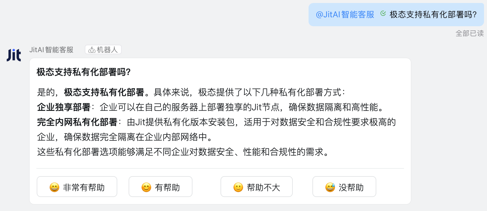

# 新增后端Type元素
当JitAi开发框架中现有的Type元素无法满足特定业务需求时，开发者可以通过两种方式扩展功能：
1. 复用现有Meta，创建新的Type元素：适合在已有族类内扩展功能。比如在消息服务框架下增加微信企业号通知、邮件通知，在支付服务框架下集成PayPal支付，在存储服务框架下对接腾讯云COS。以上都是指向已有Meta的新Type元素。
2. 创建全新元素族类：适合全新业务领域的扩展，自成体系的新元素族类。比如IoT集成，需要支持MQTT、Modbus等多种不同的协议。

本文将采用方式2，通过实战案例，一步步指导开发者完成智能客服和钉钉机器人的集成。

:::tip 你已经完成入门教程了吗？
如果你还没有完成[桌面版安装](../../tutorial/download-installation)和[入门教程导读](../../tutorial)，请先完成这些入门教程。
:::

## 实战指南：将智能客服集成到钉钉机器人
我们将`钉钉机器人`放到`IM机器人`这个顶级分类中，因此`IM机器人`就是Meta，`钉钉机器人`就是该分类下的Type之一，微信、企微、飞书等各类IM机器人都可以成为该分类下的新Type。

### 效果预览
完成后的钉钉机器人效果：用户在钉钉群中@机器人发送问题，机器人会调用配置的智能客服Agent，实现流式回复。



### 元素族类设计
| 元素层次 | fullName | 主要职责 |
|---------|----------|----------|
| **Meta元素** | `imRobots.Meta` | 定义IM机器人族类，统一管理各平台机器人 |
| **Type元素** | `imRobots.dingTalkStreamType` | 封装钉钉SDK，处理消息收发和Stream连接等技术复杂度，开发配置项 |
| **实例元素** | `imRobots.dingTalkDemo` | 配置具体的钉钉应用参数和智能体 |

#### 目录结构
```shell title="imRobots元素族类在App中的子目录结构"
├── imRobots/
│   ├── Meta/
│   │   ├── e.json
│   │   └── __init__.py
│   ├── dingTalkStreamType/
│   │   ├── e.json
│   │   ├── loader.py
│   │   ├── handler.py
│   │   ├── client_manager.py
│   │   └── __init__.py
│   └── dingTalkDemo/
│       ├── e.json
│       ├── config.json
│       └── __init__.py
├── requirements.txt
└── ...
```

:::tip 第三方依赖
需要在App根目录下的`requirements.txt`中添加依赖：
```text title="requirements.txt"
dingtalk-stream==0.24.2
python-socks==2.7.1
```
:::

### 元素族类实现
#### Meta元素
import Tabs from '@theme/Tabs';
import TabItem from '@theme/TabItem';

<Tabs>
  <TabItem value="ejson" label="e.json">

```json title="imRobots/Meta/e.json"
{
  "backendBundleEntry": ".",
  "description": "IM机器人元素族类",
  "title": "IM机器人",
  "type": ""
}
```

  </TabItem>
  <TabItem value="initpy" label="__init__.py">

```python title="imRobots/Meta/__init__.py"
# ...
```

  </TabItem>
</Tabs>

#### Type元素
<Tabs>
  <TabItem value="ejson" label="e.json">

```json title="imRobots/dingTalkStreamType/e.json"
{
  "backendBundleEntry": ".",
  "description": "封装钉钉机器人对接的细节，包括消息发送、接收、处理等，将配置参数开放",
  "title": "钉钉机器人",
  "type": "imRobots.Meta"
}
```

  </TabItem>
  <TabItem value="loader" label="loader.py">

```python title="imRobots/dingTalkStreamType/loader.py"
import json
import re

from .client_manager import ClientManager
from .handler import TextHandler

class Loader(object):
    def __init__(self, nodes):
        self.nodes = nodes

    def renderTemplateString(self, source, **context):
        pattern = r"\{\{(\w+)\}\}"

        def replaceVar(match):
            var_name = match.group(1)
            return str(context.get(var_name, ""))

        rendered = re.sub(pattern, replaceVar, source)
        return rendered

    def load(self):
        element = self.nodes[0]
        file = element.getFile("config.json")
        config = self.renderTemplateString(file, **app.envVars)
        config = json.loads(config)
        clientId = config.get("clientId")
        clientSecret = config.get("clientSecret")
        return self.start_client(clientId, clientSecret, config)

    def start_client(self, client_id: str, client_secret: str, config: dict):
        """c
        启动钉钉流式客户端

        Args:
            client_id: 钉钉应用的 Client ID
            client_secret: 钉钉应用的 Client Secret
            logger: 日志记录器
        """
        # 创建消息处理器
        message_handler = TextHandler(self.nodes[0], config)

        # 创建并启动客户端管理器
        client_manager = ClientManager(client_id, client_secret)
        client_manager.start(message_handler)

        return client_manager

```

  </TabItem>
  <TabItem value="handler" label="handler.py">

```python title="imRobots/dingTalkStreamType/handler.py"
import json
import time

import dingtalk_stream
from dingtalk_stream import AckMessage
from jit.commons.utils.logger import log as logger

class TextHandler(dingtalk_stream.ChatbotHandler):
    def __init__(self, element, config):
        super(dingtalk_stream.ChatbotHandler, self).__init__()
        self.logger = logger
        self.element = element
        self.config = config

    def _create_initial_card(self, question: str) -> dict:
        """创建初始思考中的卡片"""
        return {
            "config": {"autoLayout": True, "enableForward": True},
            "header": {"title": {"type": "text", "text": question}},
            "contents": [
                {
                    "type": "markdown",
                    "text": "[思考]正在分析您的问题，请稍候...",
                    "id": f"thinking_{int(time.time() * 1000)}",
                }
            ],
        }

    def _create_streaming_card(self, content: str, question: str) -> dict:
        """创建流式更新时的卡片"""
        current_time = int(time.time() * 1000)

        return {
            "config": {"autoLayout": True, "enableForward": True},
            "header": {"title": {"type": "text", "text": question}},
            "contents": [{"type": "markdown", "text": content, "id": f"answer_{current_time}"}],
        }

    def _create_final_card(self, response: str, incoming_message: dingtalk_stream.ChatbotMessage, text: str) -> dict:
        """创建最终带按钮的卡片"""
        return {
            "config": {"autoLayout": True, "enableForward": True},
            "header": {"title": {"type": "text", "text": text}},
            "contents": [
                {"type": "markdown", "text": response, "id": f"answer_{int(time.time() * 1000)}"},
                {"type": "divider", "id": f"divider_{int(time.time() * 1000)}"},
                {
                    "type": "action",
                    "actions": [
                        {
                            "type": "button",
                            "label": {
                                "type": "text",
                                "text": "😄 非常有帮助",
                                "id": f"text_helpful_{int(time.time() * 1000)}",
                            },
                            "actionType": "request",
                            "status": "normal",
                            "size": "small",
                            "id": f"button_helpful_{int(time.time() * 1000)}",
                            "value": json.dumps(
                                {
                                    "action": "feedback",
                                    "type": "helpful",
                                    "message_id": incoming_message.message_id,
                                    "original_text": text,
                                    "response": response,
                                }
                            ),
                        },
                        {
                            "type": "button",
                            "label": {
                                "type": "text",
                                "text": "😊 有帮助",
                                "id": f"text_helpful_{int(time.time() * 1000)}",
                            },
                            "actionType": "request",
                            "status": "normal",
                            "size": "small",
                            "id": f"button_helpful_{int(time.time() * 1000)}",
                            "value": json.dumps(
                                {
                                    "action": "feedback",
                                    "type": "helpful",
                                    "message_id": incoming_message.message_id,
                                    "original_text": text,
                                    "response": response,
                                }
                            ),
                        },
                        {
                            "type": "button",
                            "label": {
                                "type": "text",
                                "text": "🙂 帮助不大",
                                "id": f"text_unhelpful_{int(time.time() * 1000)}",
                            },
                            "actionType": "request",
                            "status": "normal",
                            "size": "small",
                            "id": f"button_unhelpful_{int(time.time() * 1000)}",
                            "value": json.dumps(
                                {
                                    "action": "feedback",
                                    "type": "unhelpful",
                                    "message_id": incoming_message.message_id,
                                    "original_text": text,
                                    "response": response,
                                }
                            ),
                        },
                        {
                            "type": "button",
                            "label": {
                                "type": "text",
                                "text": "😅 没帮助",
                                "id": f"text_unhelpful_{int(time.time() * 1000)}",
                            },
                            "actionType": "request",
                            "status": "normal",
                            "size": "small",
                            "id": f"button_unhelpful_{int(time.time() * 1000)}",
                            "value": json.dumps(
                                {
                                    "action": "feedback",
                                    "type": "unhelpful",
                                    "message_id": incoming_message.message_id,
                                    "original_text": text,
                                    "response": response,
                                }
                            ),
                        },
                    ],
                    "id": f"action_{int(time.time() * 1000)}",
                },
            ],
        }

    async def process(self, callback: dingtalk_stream.CallbackMessage):
        """
        处理钉钉消息
        """
        incoming_message = dingtalk_stream.ChatbotMessage.from_dict(callback.data)
        senderStuffId = incoming_message.sender_staff_id
        text = incoming_message.text.content.strip()
        # 发送初始卡片
        initial_card_data = self._create_initial_card(text)
        card_biz_id = self.reply_card(card_data=initial_card_data, incoming_message=incoming_message, at_sender=True)

        # 流式回调
        def create_stream_callback(card_biz_id: str, question: str) -> callable:
            full_response = []
            update_count = 0
            last_update_time = time.time()
            pending_updates = 0
            MAX_UPDATES = 20

            def stream_callback(chunk):
                nonlocal update_count, last_update_time, pending_updates, full_response
                if chunk:
                    content = chunk.get("data", {}).get("content", None)
                    if content:
                        full_response.append(content)
                        pending_updates += 1
                        current_time = time.time()

                        # 检查是否需要更新卡片
                        should_update = (
                            # 更新次数限制
                            update_count < MAX_UPDATES - 1  # 预留最后一次更新
                            # 时间间隔或消息数量条件
                            and (current_time - last_update_time >= 2 or pending_updates >= 5)
                        )

                        if should_update:
                            updated_card_data = self._create_streaming_card("".join(full_response), question)
                            self.update_card(card_biz_id, updated_card_data)
                            update_count += 1
                            last_update_time = current_time
                            pending_updates = 0

            return stream_callback

        response = ""
        with self.element.env.getReqContext(self.element.appId):
            CorpMember = app.getElement("corps.models.CorpMember")
            app.currentUser = CorpMember()
            agent = app.getElement(self.config.get("agent"))
            response = agent.run(
                params={"input_data": text},
                chatId=senderStuffId,
                stream_callback=create_stream_callback(card_biz_id, text),
            )

        # 更新最终卡片
        final_card_data = self._create_final_card(response, incoming_message, text)
        self.update_card(card_biz_id, final_card_data)
        return AckMessage.STATUS_OK, "OK"
```

  </TabItem>
  <TabItem value="clientmanager" label="client_manager.py">

```python title="imRobots/dingTalkStreamType/client_manager.py"
import asyncio
import threading
from typing import Optional

import dingtalk_stream
from jit.commons.utils.logger import log as logger

class ClientManager:
    def __init__(self, client_id: str, client_secret: str):
        """
        初始化 ClientManager

        Args:
            client_id: 钉钉应用的 Client ID
            client_secret: 钉钉应用的 Client Secret
        """
        self.client_id = client_id
        self.client_secret = client_secret
        self.client: Optional[dingtalk_stream.DingTalkStreamClient] = None
        self._thread: Optional[threading.Thread] = None
        self._stop_event = threading.Event()
        self._loop: Optional[asyncio.AbstractEventLoop] = None

    def start(self, message_handler):
        """
        启动客户端并在单独的线程中运行

        Args:
            message_handler: 消息处理器实例
        """
        if self._thread and self._thread.is_alive():
            logger.warning("Client is already running")
            return

        # 创建凭证和客户端
        credential = dingtalk_stream.Credential(self.client_id, self.client_secret)
        self.client = dingtalk_stream.DingTalkStreamClient(credential)

        # 注册消息处理器
        self.client.register_callback_handler(dingtalk_stream.chatbot.ChatbotMessage.TOPIC, message_handler)

        # 创建并启动线程
        self._thread = threading.Thread(target=self._run_client, daemon=True)
        self._thread.start()
        logger.info("Client started in background thread")

    def _run_client(self):
        """在线程中运行客户端"""
        try:
            # 尝试获取当前事件循环
            try:
                loop = asyncio.get_running_loop()
                logger.info("Found existing event loop")
            except RuntimeError:
                # 如果没有运行中的事件循环，创建一个新的
                loop = asyncio.new_event_loop()
                asyncio.set_event_loop(loop)
                logger.info("Created new event loop for client thread")

            self._loop = loop

            # 设置超时时间（秒）
            timeout = 300  # 5分钟超时

            # 如果当前事件循环正在运行，使用asyncio.run_coroutine_threadsafe
            if loop.is_running():
                logger.info("Using run_coroutine_threadsafe for running event loop")
                future = asyncio.run_coroutine_threadsafe(self.client.start_forever(), loop)
                try:
                    future.result(timeout=timeout)
                except asyncio.TimeoutError:
                    logger.error(f"Client startup timed out after {timeout} seconds")
                    return
                except Exception as e:
                    logger.exception(f"Error occurred while running client: {str(e)}")
                    return
            else:
                # 如果事件循环没有运行，使用run_until_complete
                logger.info("Using run_until_complete for new event loop")
                try:
                    loop.run_until_complete(asyncio.wait_for(self.client.start_forever(), timeout=timeout))
                except asyncio.TimeoutError:
                    logger.error(f"Client startup timed out after {timeout} seconds")
                    return
                except Exception as e:
                    logger.exception(f"Error occurred while running client: {str(e)}")
                    return

        except Exception as e:
            logger.exception(f"Error in client thread: {str(e)}")
        finally:
            try:
                # 清理事件循环
                if self._loop and self._loop.is_running():
                    logger.info("Stopping event loop")
                    self._loop.stop()
                if self._loop and not self._loop.is_closed():
                    logger.info("Closing event loop")
                    self._loop.close()
            except Exception as e:
                logger.error(f"Error cleaning up event loop: {e}")
            finally:
                self._stop_event.set()
                logger.info("Client thread finished")

    def stop(self):
        """停止客户端"""
        if not self._thread or not self._thread.is_alive():
            logger.warning("Client is not running")
            return

        try:
            if self.client:
                # 在事件循环中停止客户端
                if self._loop and self._loop.is_running():
                    self._loop.call_soon_threadsafe(self.client.stop)
                else:
                    self.client.stop()
            self._stop_event.wait(timeout=5)  # 等待线程结束，最多等待5秒
            logger.info("Client stopped")
        except Exception as e:
            logger.error(f"Error stopping client: {e}")

    def is_running(self) -> bool:
        """检查客户端是否正在运行"""
        return self._thread is not None and self._thread.is_alive()

```

  </TabItem>
  <TabItem value="initpy" label="__init__.py">

```python title="imRobots/dingTalkStreamType/__init__.py"
from .loader import Loader

__all__ = ["Loader"]
```

  </TabItem>
</Tabs>

#### 实例元素
<Tabs>
  <TabItem value="ejson" label="e.json">

```json title="imRobots/dingTalkDemo/e.json"
{
  "backendBundleEntry": ".",
  "backendLoadTime": "afterAppInit",
  "type": "imRobots.dingTalkStreamType",
  "title": "钉钉智能客服",
  "description": "JitAi智能客服钉钉机器人实例，配置具体参数"
}
```

  </TabItem>
  <TabItem value="config" label="config.json">

```json title="imRobots/dingTalkDemo/config.json"
{
    "agent":"<agent fullName>",
    "clientId": "<clientId>",
    "clientSecret": "<clientSecret>"
}
```

:::tip 配置说明
1. `agent`: 智能客服AIAgent的fullName，如`aiagents.ragTest`
2. `clientId`/`clientSecret`: 需要从钉钉开发者平台获取，按以下步骤操作：

**钉钉账号与企业准备**
1. 注册并登录钉钉账号
2. 创建属于自己的企业

**钉钉开发平台应用创建**
1. 登录[钉钉开发者平台](https://open-dev.dingtalk.com)
2. 进入`应用开发` → `企业内部应用` → `钉钉应用`
3. 点击`创建应用`，设置应用名称、应用描述
4. 进入`应用能力` → `添加应用能力`，找到`机器人`并添加
5. 机器人配置中的`消息接收模式`选择`Stream模式`
6. 发布应用
7. 创建一个企业内部群，并添加刚才创建的机器人
8. 进入`基础信息` → `凭证与基础信息` → `应用凭证`，获取`Client ID`和`Client Secret`
:::

  </TabItem>
  <TabItem value="initpy" label="__init__.py">

```python title="imRobots/dingTalkDemo/__init__.py"
# 实例元素通常只需要空文件
```
  </TabItem>
</Tabs>

### 测试
#### 使新元素族类生效
1. **清理缓存**：删除应用目录中的`dist`目录
2. **重启服务**：重启桌面端
3. **触发打包**：访问应用页面，系统自动重新打包
4. **检查日志**：观察日志，确认元素加载成功，与钉钉开发者平台的长连接是否建立成功

#### 功能测试
1. 在钉钉群中@机器人发送消息
2. 机器人应该回复"思考中"卡片
3. AI处理完成后更新为最终回复卡片

## 总结回顾
通过钉钉机器人这个实战案例，我们完整学习了Type元素扩展开发的全流程：

1. **设计决策**：如何选择扩展方式（复用vs新建）
2. **架构设计**：Meta、Type、实例三层架构的职责划分
3. **技术实现封装**：第三方SDK集成、异步处理、参数配置等技术复杂度统统封装到Type元素中
4. **实例元素**：实例元素负责配置具体运行参数

开发者应发散思维，将上述思路应用到其他业务场景中。

## 进阶思考
手动创建实例元素目录虽然可行，但却繁琐。怎样像官方元素一样，在可视化界面中一键添加和配置新的钉钉机器人实例元素呢？

请参考 [开发后端元素可视化编辑器](./develop-backend-element-visual-editor)。