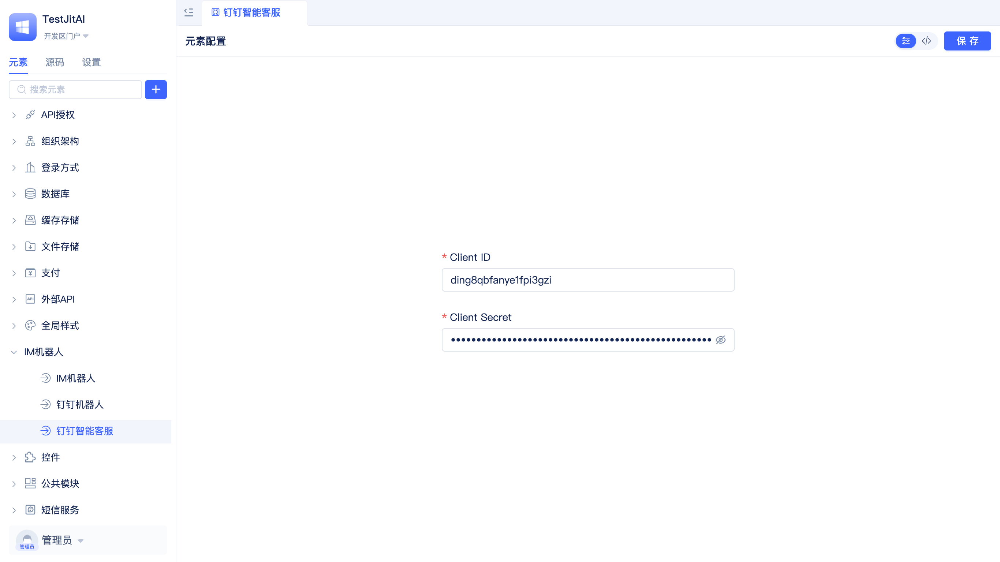
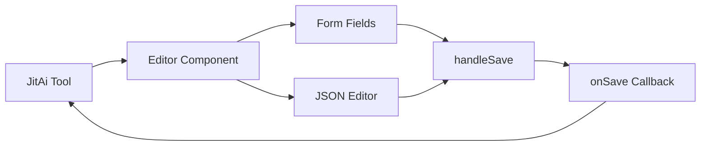

# Developing Visual Editors for Backend Type Elements
import Tabs from '@theme/Tabs';
import TabItem from '@theme/TabItem';

After completing the [Extend Your Own Element Families](./extend-element-family-classes) tutorial, you can create and run element instances. However, configuration parameters must be manually modified in files, which presents a challenge for business developers unfamiliar with code.

This guide demonstrates how to develop a visual configuration editor for a DingTalk robot, delivering the same graphical configuration experience as official JitAi elements.

## Effect preview {#effect-preview}


## Editor architecture {#editor-architecture}
| Element Level | fullName | Main Responsibilities |
|---------|----------|----------|
| **Editor Element** | `imRobots.dingTalkStreamType.Editor` | Type points to `editors.React`; provides visual configuration interface for DingTalk robot |
| **Target Element** | `imRobots.dingTalkStreamType` | The backend Type element being edited, completed in previous chapters |

### Editor directory structure {#editor-directory-structure}
```shell title="Add Editor subdirectory under dingTalkStreamType"
imRobots/
└── dingTalkStreamType/              # Backend Type element (completed)
    ├── e.json                       # Type element definition
    ├── config.json                  # Configuration template
    ├── loader.py                    # Loader implementation
    ├── client_manager.py           # Client management
    ├── handler.py                  # Message handler
    └── Editor/                     # Editor directory (new)
        ├── e.json                  # Editor element definition
        ├── index.ts               # Editor entry file
        ├── Editor.tsx             # Editor implementation file
        ├── Editor.style.ts        # Style file
        └── utils.ts               # Utility functions
```

## Step-by-step guide {#step-by-step-guide}
### Creating the editor directory {#creating-editor-directory}
Create an Editor subdirectory under the dingTalkStreamType directory:

```bash
# Execute in dingTalkStreamType directory
mkdir -p Editor
```

### Installing dependencies {#installing-dependencies}
Add the Monaco Editor dependency to your project's `package.json`:

```json title="package.json"
{
  "dependencies": {
    "@monaco-editor/react": "^4.7.0"
  }
}
```

### Implementing editor files {#implementing-editor-files}
<Tabs>
  <TabItem value="config" label="Element Definition File">

**Create the editor element definition file** `Editor/e.json`:

:::tip Editors are elements too
In JitAi, editors are elements with their own `e.json` definition files.
:::

```json title="Editor/e.json"
{
  "frontBundleEntry": "./index.ts",
  "outputName": "index",
  "tag": "editor",
  "targetType": [
    "imRobots.dingTalkStreamType"
  ],
  "title": "DingTalk Robot Configuration Editor",
  "type": "editors.React"
}
```

**Editor element configuration:**

<ul>
<li><code>title</code>: Display name for the editor element</li>
<li><code>type</code>: Must be <code>editors.React</code> to indicate a React editor element</li>
<li><code>tag</code>: Must be <code>editor</code> to indicate a backend element editor</li>
<li><code>targetType</code>: Full name of the target backend element</li>
<li><code>frontBundleEntry</code>: Entry point for the editor</li>
</ul>

  </TabItem>
  <TabItem value="index" label="Entry File">

**Create the editor entry file** `Editor/index.ts`:

```typescript title="Editor/index.ts"
export { Editor } from './Editor';
```

:::important Editor export convention
Backend element editors must export a component named `Editor`. This is a fixed convention that enables JitAi tools to recognize the editor.
:::

  </TabItem>
  <TabItem value="editor" label="Editor Implementation">

**Create the main editor file** `Editor/Editor.tsx`:

```tsx title="Editor/Editor.tsx"
import type { FC } from 'react';
import { useState, useEffect, useRef } from 'react';
import { Form, Input, Select, Button, message, Space, Card } from 'antd';
import { Editor as MonacoEditor } from '@monaco-editor/react';
import { editorStyles } from './Editor.style';
import { validateConfig, formatConfigJson } from './utils';

interface DingTalkEditorProps {
  elementInfo: {
    fullName: string;
    config: Record<string, any>;
    title: string;
  };
  onSave: (config: Record<string, any>) => Promise<void>;
  onCancel: () => void;
}

const DingTalkEditor: FC<DingTalkEditorProps> = ({ elementInfo, onSave, onCancel }) => {
  const [form] = Form.useForm();
  const [configJson, setConfigJson] = useState('');
  const [loading, setLoading] = useState(false);
  const didMountRef = useRef(false);

  // Initialize form data
  useEffect(() => {
    if (!didMountRef.current) {
      didMountRef.current = true;
      const config = elementInfo.config || {};
      
      // Set form field values
      form.setFieldsValue({
        agent: config.agent || '',
        clientId: config.clientId || '',
        clientSecret: config.clientSecret || ''
      });

      // Set JSON editor content
      setConfigJson(formatConfigJson(config));
    }
  }, [elementInfo, form]);

  // Handle form submission
  const handleSave = async () => {
    try {
      setLoading(true);
      
      // Validate form fields
      const formValues = await form.validateFields();
      
      // Validate JSON configuration
      const jsonConfig = validateConfig(configJson);
      
      // Merge form data and JSON configuration
      const finalConfig = {
        ...jsonConfig,
        ...formValues
      };

      await onSave(finalConfig);
      message.success('Configuration saved successfully');
    } catch (error) {
      console.error('Save failed:', error);
      message.error('Save failed, please check configuration');
    } finally {
      setLoading(false);
    }
  };

  // Handle JSON editor changes
  const handleJsonChange = (value: string | undefined) => {
    setConfigJson(value || '');
  };

  return (
    <div style={editorStyles.container}>
      <Card title="DingTalk Robot Configuration" style={editorStyles.card}>
        <Form
          form={form}
          layout="vertical"
          style={editorStyles.form}
        >
          <Form.Item
            label="AI Agent"
            name="agent"
            rules={[{ required: true, message: 'Please select AI Agent' }]}
          >
            <Select
              placeholder="Select AI Agent"
              showSearch
              filterOption={(input, option) =>
                (option?.label ?? '').toLowerCase().includes(input.toLowerCase())
              }
              options={[
                { value: 'aiagents.ragTest', label: 'RAG Test Agent' },
                { value: 'aiagents.chatBot', label: 'Chat Bot Agent' },
                // Add more agent options as needed
              ]}
            />
          </Form.Item>

          <Form.Item
            label="Client ID"
            name="clientId"
            rules={[{ required: true, message: 'Please enter Client ID' }]}
          >
            <Input placeholder="Enter DingTalk application Client ID" />
          </Form.Item>

          <Form.Item
            label="Client Secret"
            name="clientSecret"
            rules={[{ required: true, message: 'Please enter Client Secret' }]}
          >
            <Input.Password placeholder="Enter DingTalk application Client Secret" />
          </Form.Item>
        </Form>

        <div style={editorStyles.jsonSection}>
          <h4>Advanced Configuration (JSON)</h4>
          <MonacoEditor
            height="200px"
            language="json"
            theme="vs-dark"
            value={configJson}
            onChange={handleJsonChange}
            options={{
              minimap: { enabled: false },
              scrollBeyondLastLine: false,
              fontSize: 14,
              wordWrap: 'on'
            }}
          />
        </div>

        <div style={editorStyles.actions}>
          <Space>
            <Button onClick={onCancel}>
              Cancel
            </Button>
            <Button 
              type="primary" 
              loading={loading}
              onClick={handleSave}
            >
              Save Configuration
            </Button>
          </Space>
        </div>
      </Card>
    </div>
  );
};

export { DingTalkEditor as Editor };
```

  </TabItem>
  <TabItem value="styles" label="Style File">

**Create the style file** `Editor/Editor.style.ts`:

```typescript title="Editor/Editor.style.ts"
import type { CSSProperties } from 'react';

export const editorStyles: Record<string, CSSProperties> = {
  container: {
    padding: '20px',
    height: '100%',
    overflow: 'auto'
  },
  
  card: {
    maxWidth: '800px',
    margin: '0 auto'
  },
  
  form: {
    marginBottom: '24px'
  },
  
  jsonSection: {
    marginBottom: '24px'
  },
  
  actions: {
    textAlign: 'right' as const,
    borderTop: '1px solid #f0f0f0',
    paddingTop: '16px'
  }
};
```

  </TabItem>
  <TabItem value="utils" label="Utility Functions">

**Create the utility functions file** `Editor/utils.ts`:

```typescript title="Editor/utils.ts"
/**
 * Validate JSON configuration
 */
export function validateConfig(configJson: string): Record<string, any> {
  try {
    if (!configJson.trim()) {
      return {};
    }
    
    const parsed = JSON.parse(configJson);
    
    if (typeof parsed !== 'object' || parsed === null) {
      throw new Error('Configuration must be a JSON object');
    }
    
    return parsed;
  } catch (error) {
    throw new Error(`JSON configuration format error: ${error.message}`);
  }
}

/**
 * Format configuration as JSON string
 */
export function formatConfigJson(config: Record<string, any>): string {
  try {
    // Remove form fields, only keep advanced configuration
    const { agent, clientId, clientSecret, ...advancedConfig } = config;
    
    if (Object.keys(advancedConfig).length === 0) {
      return '{\n  \n}';
    }
    
    return JSON.stringify(advancedConfig, null, 2);
  } catch (error) {
    console.error('Format JSON failed:', error);
    return '{\n  \n}';
  }
}

/**
 * Get available AI Agent list
 */
export function getAvailableAgents(): Array<{ value: string; label: string }> {
  // In actual implementation, this would fetch from API
  return [
    { value: 'aiagents.ragTest', label: 'RAG Test Agent' },
    { value: 'aiagents.chatBot', label: 'Chat Bot Agent' },
    { value: 'aiagents.knowledgeBase', label: 'Knowledge Base Agent' },
  ];
}
```

  </TabItem>
</Tabs>

## Editor working principles {#editor-working-principles}
### Backend element editor vs frontend component editor {#backend-vs-frontend-editor}

| Aspect | Backend Element Editor | Frontend Component Editor |
|--------|----------------------|---------------------------|
| **Target** | Backend Type elements (like DingTalk robot) | Frontend UI components (like Counter) |
| **Configuration Scope** | Instance-level configuration files | Component runtime parameters |
| **Interface** | `elementInfo` + `onSave`/`onCancel` | `CompEditorProps` + `onChangeCompConfig` |
| **Save Method** | Asynchronous save via `onSave` callback | Real-time sync via `onChangeCompConfig` |

### Data flow {#data-flow}


1. **Configuration Reception**: Editor receives current element configuration through `elementInfo`
2. **Form Initialization**: Initialize form fields and JSON editor content
3. **User Interaction**: User modifies form fields or JSON configuration
4. **Validation**: Validate form data and JSON format
5. **Save**: Call `onSave` callback to persist configuration

## Testing the editor {#testing-the-editor}
### Making the editor take effect {#making-editor-take-effect}
1. **Clear cache**: Delete the `dist` directory in the application directory
2. **Restart service**: Restart the desktop client  
3. **Trigger packaging**: Access the application page, the system will automatically repackage

### Verifying editor functionality {#verifying-editor-functionality}
1. **Open element management**: Enter JitAi development tool's element management interface
2. **Find target element**: Locate the DingTalk robot element instance
3. **Open editor**: Click edit button, the visual editor should open
4. **Test configuration**: Try modifying AI Agent, Client ID and other configurations
5. **Save verification**: Save configuration and restart element, confirm configuration takes effect

### Troubleshooting common issues {#troubleshooting-common-issues}
- **Editor not opening**: Check if `targetType` in `e.json` correctly points to the target element
- **Configuration not saving**: Confirm if `onSave` callback is called correctly and handles errors properly
- **JSON format error**: Check if JSON editor content format is correct

## Advanced features {#advanced-features}
### Dynamic agent list {#dynamic-agent-list}
You can enhance the editor by dynamically loading available AI Agent lists:

```tsx
const [agentOptions, setAgentOptions] = useState([]);

useEffect(() => {
  // Load available agents
  const loadAgents = async () => {
    try {
      const agents = await fetchAvailableAgents(); // API call
      setAgentOptions(agents);
    } catch (error) {
      console.error('Failed to load agents:', error);
    }
  };
  
  loadAgents();
}, []);
```

### Configuration validation {#configuration-validation}
Add more comprehensive configuration validation:

```typescript
export function validateDingTalkConfig(config: any): string[] {
  const errors: string[] = [];
  
  if (!config.agent) {
    errors.push('AI Agent is required');
  }
  
  if (!config.clientId) {
    errors.push('Client ID is required');
  }
  
  if (!config.clientSecret) {
    errors.push('Client Secret is required');
  }
  
  if (config.clientId && !/^[a-zA-Z0-9]+$/.test(config.clientId)) {
    errors.push('Client ID format is invalid');
  }
  
  return errors;
}
```

## Summary {#summary}
**Core steps** for developing visual editors for backend elements:

1. **Create Editor directory** + configure editor element definition file `e.json` (`type: "editors.React"`)
2. **Implement Editor component**: Receive `elementInfo` + render configuration form
3. **Correct export**: Export component named `Editor`
4. **Configuration persistence**: Save configuration through `onSave` callback

**Key differences from frontend component editors**:
- Use `elementInfo` interface instead of `CompEditorProps`
- Asynchronous save via `onSave` callback instead of real-time sync
- Target backend Type elements instead of frontend UI components
- Handle instance-level configuration instead of component runtime parameters

**Key points**:
- Export name `Editor` cannot be changed
- Must handle asynchronous save operations and error handling
- JSON editor is suitable for complex configuration scenarios
- Form validation ensures configuration correctness
