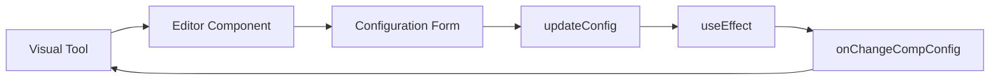

# Developing Visual Editors for UI Component Type Elements
import Tabs from '@theme/Tabs';
import TabItem from '@theme/TabItem';

After completing [Extend Your Own UI Component Type Elements](./add-frontend-components), components can be used in pages, but their configuration parameters must be manually modified in the `scheme.json` file. This is not user-friendly for business experts who lack coding skills.

This guide demonstrates how to develop a visual configuration editor for counter components, providing the same graphical configuration experience as JitAI's official components.

## Preview of the editor interface {#preview-of-editor-interface}
Once development is complete, selecting a counter component in the visual development tool displays a user-friendly configuration interface in the right property panel:


## Editor architecture {#editor-architecture}
| Element Level | fullName | Main Responsibilities |
|---------|----------|----------|
| **Editor Element** | `components.CounterType.Editor` | Type points to `editors.React`; provides a visual configuration interface for CounterType |
| **Target Component** | `components.CounterType` | The target component being edited; completed in previous chapters |

### Editor directory structure {#editor-directory-structure}
```shell title="Add Editor subdirectory under CounterType"
components/
└── CounterType/
    ├── e.json                          # Component declaration file
    ├── index.ts                        # Component PC entry
    ├── index.mobile.ts                 # Component mobile entry
    ├── CounterComponent.ts             # Component business logic
    ├── render/                         # Component render layer
    │   ├── pc/
    │   └── mobile/
    └── Editor/                         # Editor directory (new)
        ├── e.json                      # Editor element definition file
        ├── index.ts                    # Editor entry file
        └── Editor.tsx                  # Editor implementation file
```

## Implementation guide {#implementation-guide}
### Creating the editor directory {#creating-editor-directory}
Create an Editor subdirectory under the CounterType directory:

```bash
# Execute in the CounterType directory
mkdir -p Editor
```

### Implementing editor files {#implementing-editor-files}
<Tabs>
  <TabItem value="config" label="Element Definition File">

**Create the editor element definition file** `components/CounterType/Editor/e.json`:

:::tip Editors are elements too
In JitAI, editors are also elements with their own `e.json` definition files.
:::

```json title="components/CounterType/Editor/e.json"
{
    "title": "Counter Component Editor",          
    "type":"editors.React",             
    "tag": "config",                    
    "targetType": "components.CounterType",   
    "frontBundleEntry": "index.ts"
}
```

**Editor element configuration properties:**

<ul>
<li><code>title</code>: Display name of the editor element</li>
<li><code>type</code>: Fixed as <code>editors.React</code> to indicate a React-based editor element</li>
<li><code>tag</code>: Fixed as <code>config</code> to indicate a configuration editor</li>
<li><code>targetType</code>: The fullName of the target component</li>
<li><code>frontBundleEntry</code>: Entry file for the editor</li>
</ul>

  </TabItem>
  <TabItem value="entry" label="Entry File">

**Create the editor entry file** `components/CounterType/Editor/index.ts`:

```typescript title="components/CounterType/Editor/index.ts"
import CounterEditor from "./Editor";
export const Editor = CounterEditor;
```

:::important Editor export naming convention
Editors must export a component named `Editor`. This is a fixed convention that JitAI tools use to recognize editors.
:::

  </TabItem>
  <TabItem value="editor" label="Editor Implementation">

**Create the editor implementation file** `components/CounterType/Editor/Editor.tsx`:

```tsx title="components/CounterType/Editor/Editor.tsx"
import type { FC } from 'react';
import type { CompEditorProps } from 'components/common/types';
import { useState, useEffect, useRef } from 'react';
import { Form, InputNumber } from 'antd';

const CounterEditor: FC<CompEditorProps> = (props) => {
  const { onChangeCompConfig } = props;
  const didMountRef = useRef(false); // Prevent triggering callback during initialization

  // 1. Manage component configuration state
  const [compConfig, setCompConfig] = useState(props.compConfig);

  // 2. Configuration update function
  const updateConfig = (updates: Record<string, any>) => {
    const newConfig = {
      ...compConfig,
      config: {
        ...compConfig.config,
        ...updates,
      },
    };
    setCompConfig(newConfig);
  };

  // 3. Notify parent component when configuration changes (skip initialization)
  useEffect(() => {
    if (!didMountRef.current) {
      didMountRef.current = true;
      return; // Skip callback during component initialization
    }
    onChangeCompConfig?.(compConfig);
  }, [compConfig, onChangeCompConfig]);

  // 4. Render configuration interface
  return (
    <div style={{ padding: '16px' }}>
      <Form layout="vertical">
        <Form.Item label="Initial Value">
          <InputNumber
            value={compConfig.config?.initialValue || 0}
            onChange={(value) => updateConfig({ initialValue: value || 0 })}
            placeholder="Please enter counter initial value"
          />
        </Form.Item>
      </Form>
    </div>
  );
};

export default CounterEditor;
```

  </TabItem>
</Tabs>

## How the editor works {#how-editor-works}
### Data flow mechanism {#data-flow-mechanism}


1. **Configuration reception**: The editor component receives the current component configuration through `props.compConfig`
2. **State management**: Uses `useState` to manage the configuration state within the editor  
3. **Configuration update**: The `updateConfig` function merges and updates the configuration object
4. **Change monitoring**: `useEffect` monitors configuration changes
5. **Callback notification**: Notifies the tool that the configuration has changed through the `onChangeCompConfig` callback

### Core interface specifications {#core-interface-specifications}
#### CompEditorProps interface {#compeditorprops-interface}
:::info Interface provided by JitAI
`CompEditorProps` is a standard interface provided by JitAI IDEApp. Developers can directly import it from `components/common/types` without defining it themselves.
:::

```typescript
// Import from JitAI—no need to define yourself
import type { CompEditorProps } from 'components/common/types';

interface CompEditorProps {
  compConfig: {
    name: string;           // Component instance name
    title: string;          // Component display title  
    showTitle: boolean;     // Whether to show title
    config: {               // Component custom configuration
      initialValue?: number;
      // Other configuration items...
    };
    // Other system configurations...
  };
  onChangeCompConfig?: (newConfig: any) => void;  // Configuration change callback
}
```

#### Configuration update best practices {#configuration-update-best-practices}
```typescript
// ✅ Correct configuration update approach
const updateConfig = (updates: Record<string, any>) => {
  const newConfig = {
    ...compConfig,                    // Preserve existing configuration
    config: {
      ...compConfig.config,           // Preserve existing config
      ...updates,                     // Merge new configuration
    },
  };
  setCompConfig(newConfig);
};

// ❌ Incorrect configuration update approach
const updateConfig = (updates: Record<string, any>) => {
  setCompConfig({ config: updates }); // This will lose other configurations
};
```

## Testing {#testing}
### Making the editor take effect {#making-editor-take-effect}
1. **Clear cache**: Delete the `dist` directory in the application directory  
2. **Restart service**: Restart the desktop client
3. **Trigger repackaging**: Access the application page; the system will automatically repackage

### Verifying editor functionality {#verifying-editor-functionality}
1. **Open the page editor**: Open a page containing counter components in the JitAI development tool
2. **Select the component**: Click the counter component in the page
3. **View the property panel**: The right property panel should display the "Initial Value" configuration item
4. **Modify configuration**: Try modifying the initial value and observe whether the component updates in real-time
5. **Verify persistence**: Save the page and reopen it to confirm the configuration has been persisted

### Common issue troubleshooting {#common-issue-troubleshooting}
- **Editor not displaying**: Check whether `targetType` in `e.json` correctly points to the component
- **Configuration not saving**: Confirm whether the `onChangeCompConfig` callback is being called correctly
- **Initialization error**: Check whether `didMountRef` correctly prevents the initial callback

## Advanced extensions {#advanced-extensions}
To add more configuration options for the counter component, simply add the corresponding form controls to the editor:

```tsx
<Form layout="vertical">
  <Form.Item label="Initial Value">
    <InputNumber
      value={compConfig.config?.initialValue || 0}
      onChange={(value) => updateConfig({ initialValue: value || 0 })}
    />
  </Form.Item>
  
  <Form.Item label="Step">
    <InputNumber
      value={compConfig.config?.step || 1}
      min={1}
      onChange={(value) => updateConfig({ step: value || 1 })}
    />
  </Form.Item>
  
  <Form.Item label="Maximum Value">
    <InputNumber
      value={compConfig.config?.max}
      onChange={(value) => updateConfig({ max: value })}
    />
  </Form.Item>
</Form>
```

Supported Ant Design components include: `InputNumber`, `Input`, `Switch`, `Select`, `DatePicker`, and more.

## Summary {#summary}
**Core steps** for developing visual editors for UI components:

1. **Create the Editor directory** and configure the editor element definition file `e.json` with `type: "editors.React"`
2. **Implement the Editor component**: Accept `CompEditorProps` and render the configuration form  
3. **Export correctly**: Export a component named `Editor`
4. **Synchronize configuration**: Update configuration through the `onChangeCompConfig` callback

**Key points**:
- The export name `Editor` must not be changed
- `CompEditorProps` is provided by JitAI—import it directly
- Configuration objects must be merged and updated correctly
- Use `didMountRef` to prevent invalid callbacks during initialization
