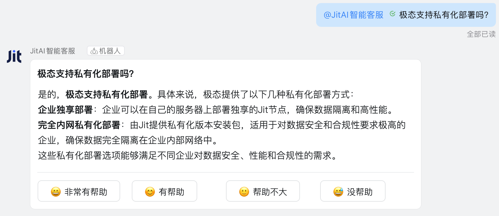

# Extend Your Own Element Families

When existing Type elements in the JitAi development framework cannot meet specific business requirements, developers can extend functionality through two approaches:

1. **Reuse existing Meta and create new Type elements**: Suitable for extending functionality within existing families. For example, adding email notifications under the messaging service framework, or integrating PayPal payments under the payment service framework. These are all new Type elements pointing to existing Meta.
2. **Create entirely new element families**: Suitable for extensions in completely new business domains, forming self-contained new element families. For example, IoT integration that needs to support various protocols like MQTT, Modbus, etc.

This article adopts approach 2, using a practical example to guide developers step by step through integrating intelligent customer service with DingTalk robots.

:::tip Have you completed the getting started tutorials?
If you haven't completed the [Desktop Version Installation](../tutorial/download-installation) and [Getting Started](../tutorial), please complete these tutorials first.
:::

## Integrating intelligent customer service with DingTalk robots {#integrating-intelligent-customer-service}

We place `DingTalk Robot` under the top-level category `IM Robot`, so `IM Robot` is the Meta, and `DingTalk Robot` is one of the Types under this category. WeChat, Enterprise WeChat, Feishu, and other IM robots can all become new Types under this category.

### Effect preview {#effect-preview}

The final DingTalk robot effect: Users @mention the robot in DingTalk groups to send questions, and the robot calls the configured intelligent customer service Agent to provide streaming replies.



### Element family design {#element-family-design}
| Element Level | fullName | Main Responsibilities |
|---------|----------|----------|
| **Meta Element** | `imRobots.Meta` | Define IM robot family, unified management of robots across platforms |
| **Type Element** | `imRobots.dingTalkStreamType` | Encapsulate DingTalk SDK, handle message sending/receiving and Stream connection technical complexity, expose configuration options |
| **Instance Element** | `imRobots.dingTalkDemo` | Configure specific DingTalk application parameters and intelligent agents |

#### Directory structure {#directory-structure}

```shell title="imRobots element family subdirectory structure in App"
├── imRobots/
│   ├── Meta/
│   │   ├── e.json
│   │   └── __init__.py
│   ├── dingTalkStreamType/
│   │   ├── e.json
│   │   ├── loader.py
│   │   ├── handler.py
│   │   ├── client_manager.py
│   │   └── __init__.py
│   └── dingTalkDemo/
│       ├── e.json
│       ├── config.json
│       └── __init__.py
├── requirements.txt
└── ...
```

:::tip Third-party dependencies
Add dependencies to `requirements.txt` in the App root directory:
```text title="requirements.txt"
dingtalk-stream==0.24.2
python-socks==2.7.1
```
:::

### Element family implementation {#element-family-implementation}

#### Meta element {#meta-element}
import Tabs from '@theme/Tabs';
import TabItem from '@theme/TabItem';

<Tabs>
  <TabItem value="ejson" label="e.json">

```json title="imRobots/Meta/e.json"
{
  "backendBundleEntry": ".",
  "description": "IM Robot element family",
  "title": "IM Robot",
  "type": ""
}
```

  </TabItem>
  <TabItem value="initpy" label="__init__.py">

```python title="imRobots/Meta/__init__.py"
# ...
```

  </TabItem>
</Tabs>

#### Type element {#type-element}

<Tabs>
  <TabItem value="ejson" label="e.json">

```json title="imRobots/dingTalkStreamType/e.json"
{
  "backendBundleEntry": ".",
  "description": "Encapsulate DingTalk robot integration details, including message sending, receiving, processing, etc., exposing configuration parameters",
  "title": "DingTalk Robot",
  "type": "imRobots.Meta"
}
```

  </TabItem>
  <TabItem value="loader" label="loader.py">

```python title="imRobots/dingTalkStreamType/loader.py"
import json
import re

from .client_manager import ClientManager
from .handler import TextHandler

class Loader(object):
    def __init__(self, nodes):
        self.nodes = nodes

    def renderTemplateString(self, source, **context):
        pattern = r"\{\{(\w+)\}\}"

        def replaceVar(match):
            var_name = match.group(1)
            return str(context.get(var_name, ""))

        rendered = re.sub(pattern, replaceVar, source)
        return rendered

    def load(self):
        element = self.nodes[0]
        file = element.getFile("config.json")
        config = self.renderTemplateString(file, **app.envVars)
        config = json.loads(config)
        clientId = config.get("clientId")
        clientSecret = config.get("clientSecret")
        return self.start_client(clientId, clientSecret, config)

    def start_client(self, client_id: str, client_secret: str, config: dict):
        """
        Start DingTalk streaming client

        Args:
            client_id: DingTalk application Client ID
            client_secret: DingTalk application Client Secret
            logger: Logger instance
        """
        # Create message handler
        message_handler = TextHandler(self.nodes[0], config)

        # Create and start client manager
        client_manager = ClientManager(client_id, client_secret)
        client_manager.start(message_handler)

        return client_manager

```

  </TabItem>
  <TabItem value="handler" label="handler.py">

```python title="imRobots/dingTalkStreamType/handler.py"
import json
import time

import dingtalk_stream
from dingtalk_stream import AckMessage
from jit.commons.utils.logger import log as logger

class TextHandler(dingtalk_stream.ChatbotHandler):
    def __init__(self, element, config):
        super(dingtalk_stream.ChatbotHandler, self).__init__()
        self.logger = logger
        self.element = element
        self.config = config

    def _create_initial_card(self, question: str) -> dict:
        """Create initial thinking card"""
        return {
            "config": {"autoLayout": True, "enableForward": True},
            "header": {"title": {"type": "text", "text": question}},
            "contents": [
                {
                    "type": "markdown",
                    "text": "[Thinking] Analyzing your question, please wait...",
                    "id": f"thinking_{int(time.time() * 1000)}",
                }
            ],
        }

    def _create_streaming_card(self, content: str, question: str) -> dict:
        """Create streaming update card"""
        current_time = int(time.time() * 1000)

        return {
            "config": {"autoLayout": True, "enableForward": True},
            "header": {"title": {"type": "text", "text": question}},
            "contents": [{"type": "markdown", "text": content, "id": f"answer_{current_time}"}],
        }

    def _create_final_card(self, response: str, incoming_message: dingtalk_stream.ChatbotMessage, text: str) -> dict:
        """Create final card with buttons"""
        return {
            "config": {"autoLayout": True, "enableForward": True},
            "header": {"title": {"type": "text", "text": text}},
            "contents": [
                {"type": "markdown", "text": response, "id": f"answer_{int(time.time() * 1000)}"},
                {"type": "divider", "id": f"divider_{int(time.time() * 1000)}"},
                {
                    "type": "action",
                    "actions": [
                        {
                            "type": "button",
                            "label": {
                                "type": "text",
                                "text": "😄 Very Helpful",
                                "id": f"text_helpful_{int(time.time() * 1000)}",
                            },
                            "actionType": "request",
                            "status": "normal",
                            "size": "small",
                            "id": f"button_helpful_{int(time.time() * 1000)}",
                            "value": json.dumps(
                                {
                                    "action": "feedback",
                                    "type": "helpful",
                                    "message_id": incoming_message.message_id,
                                    "original_text": text,
                                    "response": response,
                                }
                            ),
                        },
                        {
                            "type": "button",
                            "label": {
                                "type": "text",
                                "text": "😊 Helpful",
                                "id": f"text_helpful_{int(time.time() * 1000)}",
                            },
                            "actionType": "request",
                            "status": "normal",
                            "size": "small",
                            "id": f"button_helpful_{int(time.time() * 1000)}",
                            "value": json.dumps(
                                {
                                    "action": "feedback",
                                    "type": "helpful",
                                    "message_id": incoming_message.message_id,
                                    "original_text": text,
                                    "response": response,
                                }
                            ),
                        },
                        {
                            "type": "button",
                            "label": {
                                "type": "text",
                                "text": "🙂 Somewhat Helpful",
                                "id": f"text_unhelpful_{int(time.time() * 1000)}",
                            },
                            "actionType": "request",
                            "status": "normal",
                            "size": "small",
                            "id": f"button_unhelpful_{int(time.time() * 1000)}",
                            "value": json.dumps(
                                {
                                    "action": "feedback",
                                    "type": "unhelpful",
                                    "message_id": incoming_message.message_id,
                                    "original_text": text,
                                    "response": response,
                                }
                            ),
                        },
                        {
                            "type": "button",
                            "label": {
                                "type": "text",
                                "text": "😅 Not Helpful",
                                "id": f"text_unhelpful_{int(time.time() * 1000)}",
                            },
                            "actionType": "request",
                            "status": "normal",
                            "size": "small",
                            "id": f"button_unhelpful_{int(time.time() * 1000)}",
                            "value": json.dumps(
                                {
                                    "action": "feedback",
                                    "type": "unhelpful",
                                    "message_id": incoming_message.message_id,
                                    "original_text": text,
                                    "response": response,
                                }
                            ),
                        },
                    ],
                    "id": f"action_{int(time.time() * 1000)}",
                },
            ],
        }

    async def process(self, callback: dingtalk_stream.CallbackMessage):
        """
        Process DingTalk messages
        """
        incoming_message = dingtalk_stream.ChatbotMessage.from_dict(callback.data)
        senderStuffId = incoming_message.sender_staff_id
        text = incoming_message.text.content.strip()
        # Send initial card
        initial_card_data = self._create_initial_card(text)
        card_biz_id = self.reply_card(card_data=initial_card_data, incoming_message=incoming_message, at_sender=True)

        # Streaming callback
        def create_stream_callback(card_biz_id: str, question: str) -> callable:
            full_response = []
            update_count = 0
            last_update_time = time.time()
            pending_updates = 0
            MAX_UPDATES = 20

            def stream_callback(chunk):
                nonlocal update_count, last_update_time, pending_updates, full_response
                if chunk:
                    content = chunk.get("data", {}).get("content", None)
                    if content:
                        full_response.append(content)
                        pending_updates += 1
                        current_time = time.time()

                        # Check if card update is needed
                        should_update = (
                            # Update count limit
                            update_count < MAX_UPDATES - 1  # Reserve last update
                            # Time interval or message count conditions
                            and (current_time - last_update_time >= 2 or pending_updates >= 5)
                        )

                        if should_update:
                            updated_card_data = self._create_streaming_card("".join(full_response), question)
                            self.update_card(card_biz_id, updated_card_data)
                            update_count += 1
                            last_update_time = current_time
                            pending_updates = 0

            return stream_callback

        response = ""
        with self.element.env.getReqContext(self.element.appId):
            CorpMember = app.getElement("corps.models.CorpMember")
            app.currentUser = CorpMember()
            agent = app.getElement(self.config.get("agent"))
            response = agent.run(
                params={"input_data": text},
                chatId=senderStuffId,
                stream_callback=create_stream_callback(card_biz_id, text),
            )

        # Update final card
        final_card_data = self._create_final_card(response, incoming_message, text)
        self.update_card(card_biz_id, final_card_data)
        return AckMessage.STATUS_OK, "OK"
```

  </TabItem>
  <TabItem value="clientmanager" label="client_manager.py">

```python title="imRobots/dingTalkStreamType/client_manager.py"
import asyncio
import threading
from typing import Optional

import dingtalk_stream
from jit.commons.utils.logger import log as logger

class ClientManager:
    def __init__(self, client_id: str, client_secret: str):
        """
        Initialize ClientManager

        Args:
            client_id: DingTalk application Client ID
            client_secret: DingTalk application Client Secret
        """
        self.client_id = client_id
        self.client_secret = client_secret
        self.client: Optional[dingtalk_stream.DingTalkStreamClient] = None
        self._thread: Optional[threading.Thread] = None
        self._stop_event = threading.Event()
        self._loop: Optional[asyncio.AbstractEventLoop] = None

    def start(self, message_handler):
        """
        Start client and run in separate thread

        Args:
            message_handler: Message handler instance
        """
        if self._thread and self._thread.is_alive():
            logger.warning("Client is already running")
            return

        # Create credentials and client
        credential = dingtalk_stream.Credential(self.client_id, self.client_secret)
        self.client = dingtalk_stream.DingTalkStreamClient(credential)

        # Register message handler
        self.client.register_callback_handler(dingtalk_stream.chatbot.ChatbotMessage.TOPIC, message_handler)

        # Create and start thread
        self._thread = threading.Thread(target=self._run_client, daemon=True)
        self._thread.start()
        logger.info("Client started in background thread")

    def _run_client(self):
        """Run client in thread"""
        try:
            # Try to get current event loop
            try:
                loop = asyncio.get_running_loop()
                logger.info("Found existing event loop")
            except RuntimeError:
                # If no running event loop, create a new one
                loop = asyncio.new_event_loop()
                asyncio.set_event_loop(loop)
                logger.info("Created new event loop for client thread")

            self._loop = loop

            # Set timeout (seconds)
            timeout = 300  # 5 minute timeout

            # If current event loop is running, use asyncio.run_coroutine_threadsafe
            if loop.is_running():
                logger.info("Using run_coroutine_threadsafe for running event loop")
                future = asyncio.run_coroutine_threadsafe(self.client.start_forever(), loop)
                try:
                    future.result(timeout=timeout)
                except asyncio.TimeoutError:
                    logger.error(f"Client startup timed out after {timeout} seconds")
                    return
                except Exception as e:
                    logger.exception(f"Error occurred while running client: {str(e)}")
                    return
            else:
                # If event loop is not running, use run_until_complete
                logger.info("Using run_until_complete for new event loop")
                try:
                    loop.run_until_complete(asyncio.wait_for(self.client.start_forever(), timeout=timeout))
                except asyncio.TimeoutError:
                    logger.error(f"Client startup timed out after {timeout} seconds")
                    return
                except Exception as e:
                    logger.exception(f"Error occurred while running client: {str(e)}")
                    return

        except Exception as e:
            logger.exception(f"Error in client thread: {str(e)}")
        finally:
            try:
                # Clean up event loop
                if self._loop and self._loop.is_running():
                    logger.info("Stopping event loop")
                    self._loop.stop()
                if self._loop and not self._loop.is_closed():
                    logger.info("Closing event loop")
                    self._loop.close()
            except Exception as e:
                logger.error(f"Error cleaning up event loop: {e}")
            finally:
                self._stop_event.set()
                logger.info("Client thread finished")

    def stop(self):
        """Stop client"""
        if not self._thread or not self._thread.is_alive():
            logger.warning("Client is not running")
            return

        try:
            if self.client:
                # Stop client in event loop
                if self._loop and self._loop.is_running():
                    self._loop.call_soon_threadsafe(self.client.stop)
                else:
                    self.client.stop()
            self._stop_event.wait(timeout=5)  # Wait for thread to end, max 5 seconds
            logger.info("Client stopped")
        except Exception as e:
            logger.error(f"Error stopping client: {e}")

    def is_running(self) -> bool:
        """Check if client is running"""
        return self._thread is not None and self._thread.is_alive()

```

  </TabItem>
  <TabItem value="initpy" label="__init__.py">

```python title="imRobots/dingTalkStreamType/__init__.py"
from .loader import Loader

__all__ = ["Loader"]
```

  </TabItem>
</Tabs>

#### Instance element {#instance-element}

<Tabs>
  <TabItem value="ejson" label="e.json">

```json title="imRobots/dingTalkDemo/e.json"
{
  "backendBundleEntry": ".",
  "backendLoadTime": "afterAppInit",
  "type": "imRobots.dingTalkStreamType",
  "title": "DingTalk Intelligent Customer Service",
  "description": "JitAi intelligent customer service DingTalk robot instance, configure specific parameters"
}
```

  </TabItem>
  <TabItem value="config" label="config.json">

```json title="imRobots/dingTalkDemo/config.json"
{
    "agent":"<agent fullName>",
    "clientId": "<clientId>",
    "clientSecret": "<clientSecret>"
}
```

:::tip Configuration instructions
1. `agent`: The fullName of the intelligent customer service AIAgent, such as `aiagents.ragTest`
2. `clientId`/`clientSecret`: These need to be obtained from DingTalk Developer Platform by following these steps:

**DingTalk account and enterprise preparation**
1. Register and log in to your DingTalk account
2. Create your own enterprise

**DingTalk Developer Platform application creation**
1. Log in to [DingTalk Developer Platform](https://open-dev.dingtalk.com)
2. Navigate to `Application Development` → `Enterprise Internal Applications` → `DingTalk Applications`
3. Click `Create Application`, then set the application name and description
4. Navigate to `Application Capabilities` → `Add Application Capabilities`, find `Robot` and add it
5. In robot configuration, select `Stream Mode` for `Message Receiving Mode`
6. Publish the application
7. Create an enterprise internal group and add the robot you just created
8. Navigate to `Basic Information` → `Credentials and Basic Information` → `Application Credentials` to obtain `Client ID` and `Client Secret`
:::

  </TabItem>
  <TabItem value="initpy" label="__init__.py">

```python title="imRobots/dingTalkDemo/__init__.py"
# Instance elements usually only need empty files
```
  </TabItem>
</Tabs>

### Testing {#testing}

#### Making new element family effective {#making-new-element-family-effective}

1. **Clear cache**: Delete the `dist` directory in the application directory
2. **Restart service**: Restart the desktop application
3. **Trigger packaging**: Access the application page, the system will automatically repackage
4. **Check logs**: Observe logs to confirm successful element loading and whether the long connection with DingTalk Developer Platform is established successfully

#### Functional testing {#functional-testing}

1. @mention the robot in a DingTalk group to send messages
2. The robot should reply with a "Thinking" card
3. After AI processing completes, the card updates to the final reply

## Summary and review {#summary-and-review}

Through this DingTalk robot practical case, we have learned the complete process of Type element extension development:

1. **Design decisions**: How to choose an extension approach (reusing existing Meta vs. creating new element families)
2. **Architecture design**: Responsibility division across the Meta, Type, and Instance three-layer architecture
3. **Technical implementation encapsulation**: Third-party SDK integration, asynchronous processing, parameter configuration, and other technical complexities are all encapsulated in Type elements
4. **Instance elements**: Instance elements are responsible for configuring specific runtime parameters

Developers should think creatively and apply this approach to other business scenarios.

## Advanced thinking {#advanced-thinking}

While manually creating instance element directories is feasible, it can be cumbersome. How can we add and configure new DingTalk robot instance elements with one click in the visual interface like official elements?

Please refer to [Develop Visual Editors for Backend Type Elements](./develop-backend-element-visual-editor).