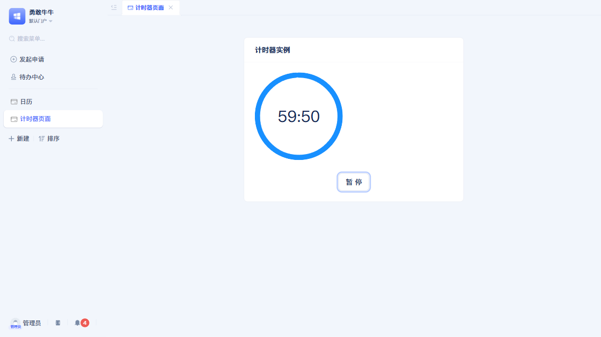
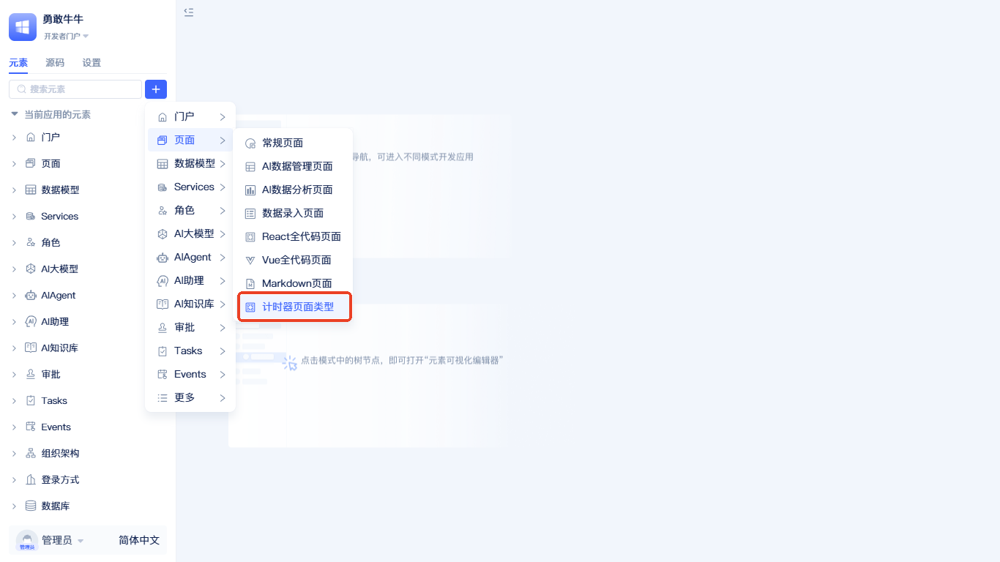
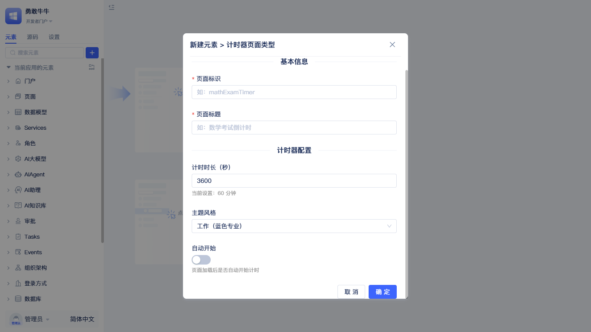
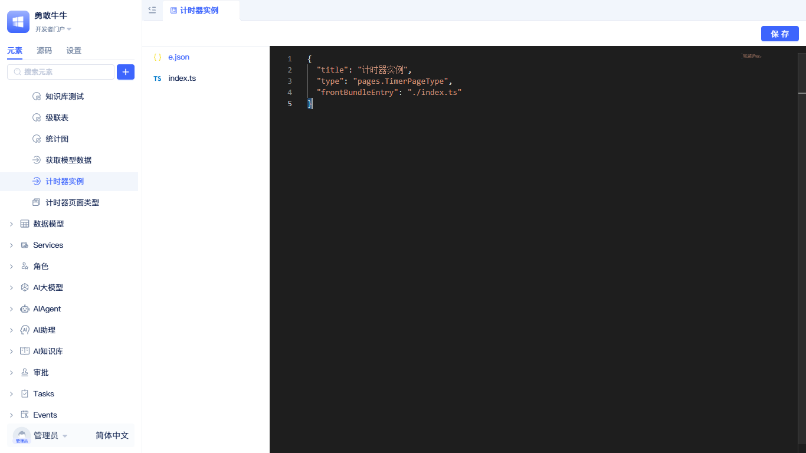

# Extend Your Own Page Type and Editor

Imagine you need to develop a countdown timer page for an online examination system. You open JitAi and review the existing page types: generic pages are too simple, data management pages don't fit, Markdown pages are even less suitable... At this point, you realize you need to create an entirely new page type.

This guide will walk you through the complete experience of developing a custom page Type element. More importantly, you'll understand how JitAi's clever design makes this seemingly complex task remarkably simple.

## Understanding how pages are loaded {#understanding-how-pages-are-loaded}

Before we start coding, let's understand a core concept: when a user accesses a page, how does JitAi locate and load the correct code?

### The page loading journey {#the-page-loading-journey}

Let's trace the complete process from URL to rendering:

```typescript
// User visits: /pages/examTimer
```

When this request arrives, JitAi embarks on an elegant discovery journey:

```typescript
// Step 1: runApp.ts starts the application
await runtimeApp.getElement('pages.examTimer');

// Step 2: app.ts begins element lookup
async getElement(elementPath: string) {
    // Locate the element definition
    const elements = this.findElement(elementPath);

    // Key: Find the appropriate loader
    return await this.loadElement(elements);
}
```

Here we encounter the first key concept: **Loader**.

### Loader - the secret to flexibility {#loader-the-secret-to-flexibility}

The Loader is one of JitAi's most ingenious designs. It's not a fixed loading logic, but rather an **inheritable, overridable function chain**.

```typescript
// Finding a loader is like finding the right key
async getElementLoader(elementPath: string) {
    // 1. Does this page have its own dedicated key?
    if (element.define.loader) {
        return element.loader;
    }

    // 2. No? Does its Type have a universal key?
    if (element.define.type) {
        const typeModule = await this.getElement(element.type);
        if (typeModule?.loader) {
            return typeModule.loader;
        }
    }

    // 3. Still no? Use the master key (Meta's loader)
    const metaModule = await this.getElement('pages.Meta');
    return metaModule?.loader;
}
```

The elegance of this design lies in:
- **Instance specialization**: Specific pages can have their own loading logic
- **Type-level management**: Similar pages share loading mechanisms
- **Meta fallback**: Ensures there's always a loader available

You might ask: why do we need such a complex mechanism? Let's understand through a real-world example.

### Why Vue pages need custom loaders {#why-vue-pages-need-custom-loaders}

Let's compare the loading requirements of React pages versus Vue pages:

```typescript
// React pages: standard loading (default loader provided by Meta)
export default async (elements) => {
    const pageModule = await import(path);
    // Expected exports: PageCls and Render

    // Wrap with HOC, inject page instance
    const Render = pageHOC(PageWrapper, {
        PageCls: pageModule.PageCls,
        PageRender: pageModule.Render
    });

    return { PageCls, Render };
}

// Vue pages: special requirements (custom loader)
export default async (elements) => {
    const pageModule = await import(path);
    // Same expected exports: PageCls and Render

    // But! Vue needs a DOM element to mount
    const Render = vueHOC(VuePageWrapper, {
        PageCls: pageModule.PageCls,
        // Vue's Render needs to receive a DOM element
        PageRender: (dom, page) => {
            createApp(VueApp, { page }).mount(dom);
        }
    });

    return { PageCls, Render };
}
```

See the difference? Vue pages require a real DOM element to mount, while React only needs to return virtual DOM. This is why Vue Types need custom loaders—they must change how pages are loaded and rendered.

## Developing a timer page Type {#developing-a-timer-page-type}

Now that we understand the principles, let's develop a timer page Type. This process will truly demonstrate JitAi's power. Let's first look at the final result:

 "Instance Demo"

### Complete composition of a page Type {#complete-composition-of-a-page-type}

Before we start coding, let's understand what components a complete page Type requires:

| Component | Runtime Environment | Primary Responsibility | File Location |
|---------|----------|----------|----------|
| **Type Element Core** | Usage Zone | Define page class (PageCls) and render component (Render) | `pages/TimerPageType/` |
| **Element Definition Editor** | IDE | Provide visual form for page creation | `pages/TimerPageType/DefineEditor/` |
| **CRUD API** | IDE | Generate page instance code based on configuration | `pages/TimerPageType/Api/` |
| **Element Editor** | IDE | Provide code editing interface | `pages/TimerPageType/editor/` |

These components have clear divisions of responsibility:
- **Usage Zone Components**: Handle actual page execution and rendering
- **IDE Components**: Handle page creation, configuration, and editing

### Step 1: Planning the directory structure {#step-1-planning-the-directory-structure}

A complete page Type requires files in two locations:

```bash
# Usage Zone: Page runtime files
pages/
└── TimerPageType/
    ├── e.json           # Element definition, mark loadTime: "startUp"
    ├── index.ts         # Entry file, exports PageCls and Render
    ├── TimerPage.ts     # Page class, extends Jit.BasePage
    ├── Render.tsx       # Render component
    ├── DefineEditor/    # Creation configurator
    │   ├── e.json
    │   ├── index.ts
    │   └── Editor.tsx
    └── Api/             # CRUD interfaces
        ├── e.json
        ├── index.ts
        ├── create.ts
        └── update.ts
```

### Step 2: Designing Type capabilities {#step-2-designing-type-capabilities}

Before we start coding, we need to think: what capabilities should a timer page have?

```typescript
// Our expected usage pattern
const timerPage = new TimerPage({
    duration: 3600,        // 60 minutes
    onTimeout: () => {     // When time is up
        alert('Exam finished!');
    }
});

timerPage.start();        // Start timer
timerPage.pause();        // Pause
timerPage.getRemaining(); // Get remaining time
```

### Step 3: Creating the Type element {#step-3-creating-the-type-element}

Now, let's create TimerPageType. Since we're not defining a custom loader, we'll use Meta's loader, which means we must follow Meta's convention: export `PageCls` and `Render`.

```typescript title="pages/TimerPageType/TimerPage.ts"
import { Jit } from 'jit';

// This is the Type-level page class, defining common timer page capabilities
export class TimerPage extends Jit.BasePage {
    protected duration: number = 0;
    protected remaining: number = 0;
    protected timerId?: ReturnType<typeof window.setInterval>;
    protected status: 'idle' | 'running' | 'paused' | 'finished' = 'idle';

    // Configuration structure defined by Type - all instances will follow
    config?: {
        duration: number;      // Total duration (seconds)
        autoStart?: boolean;   // Auto-start
        warnAt?: number;       // Warning time point
        theme?: 'exam' | 'game' | 'work';
    };

    constructor(options: any) {
        super(options);
        this.duration = this.config?.duration || 3600;
        this.remaining = this.duration;
    }

    // Core methods - for instances to use or override
    start(): void {
        if (this.status === 'finished') return;

        this.status = 'running';
        this.timerId = setInterval(() => {
            this.remaining--;

            // Publish event to let UI respond
            this.publishEvent('TIMER_TICK', {
                remaining: this.remaining,
                percentage: (this.remaining / this.duration) * 100
            });

            // Warning check
            if (this.config?.warnAt && this.remaining === this.config.warnAt) {
                this.onWarning();
            }

            // Finish check
            if (this.remaining <= 0) {
                this.finish();
            }
        }, 1000);
    }

    pause(): void {
        if (this.timerId) {
            clearInterval(this.timerId);
            this.status = 'paused';
            this.publishEvent('TIMER_PAUSED');
        }
    }

    finish(): void {
        this.pause();
        this.status = 'finished';
        this.publishEvent('TIMER_FINISHED');
        this.onTimeout();
    }

    // Hook methods that instances can override
    onWarning(): void {
        console.log('Time is running out!');
    }

    onTimeout(): void {
        console.log('Time is up!');
    }

    // Format display - instances may need different formats
    formatTime(seconds: number): string {
        const hours = Math.floor(seconds / 3600);
        const minutes = Math.floor((seconds % 3600) / 60);
        const secs = seconds % 60;

        if (hours > 0) {
            return `${hours}:${minutes.toString().padStart(2, '0')}:${secs.toString().padStart(2, '0')}`;
        }
        return `${minutes}:${secs.toString().padStart(2, '0')}`;
    }

    // Methods to get remaining time and status (needed by Render component)
    getRemaining(): number {
        return this.remaining;
    }

    getStatus(): 'idle' | 'running' | 'paused' | 'finished' {
        return this.status;
    }
}

export default TimerPage;
```

Note the design philosophy here:
- **Type defines common capabilities**: start, pause, finish methods needed by all timers
- **Extension points reserved**: onWarning, onTimeout can be overridden by instances
- **Event-driven**: Decouples UI from logic through events
- **Inherits BasePage**: Gains foundational page capabilities (lifecycle, event system, etc.)

### Step 4: Creating the render component {#step-4-creating-the-render-component}

```tsx title="pages/TimerPageType/Render.tsx"
import React, { useState, useEffect } from 'react';
import { Progress, Button, Card, Typography } from 'antd';
import type { TimerPage } from './TimerPage';

interface TimerRenderProps {
    page: TimerPage;
}

const TimerRender: React.FC<TimerRenderProps> = ({ page }) => {
    const [remaining, setRemaining] = useState(page.getRemaining());
    const [percentage, setPercentage] = useState(100);
    const [status, setStatus] = useState(page.getStatus());

    useEffect(() => {
        // Subscribe to timer events
        const handlerIds: string[] = [];

        const tickHandlerId = page.subscribeEvent('TIMER_TICK', (e) => {
            const data = e as any;
            setRemaining(data.remaining);
            setPercentage(data.percentage);
        });
        handlerIds.push(tickHandlerId);

        const pausedHandlerId = page.subscribeEvent('TIMER_PAUSED', () => {
            setStatus('paused');
        });
        handlerIds.push(pausedHandlerId);

        const finishedHandlerId = page.subscribeEvent('TIMER_FINISHED', () => {
            setStatus('finished');
            setPercentage(0);
        });
        handlerIds.push(finishedHandlerId);

        // If auto-start is configured
        if (page.config?.autoStart) {
            page.start();
        }

        return () => {
            // Clean up event listeners
            handlerIds.forEach(id => {
                page.unSubscribeEvent(id);
            });
        };
    }, [page]);

    const getThemeColor = (): string => {
        const theme = page.config?.theme;
        if (theme === 'exam') return '#ff4d4f';
        if (theme === 'game') return '#52c41a';
        return '#1890ff';
    };

    return (
        <Card
            title={page.title || "Timer"}
            style={{ maxWidth: 500, margin: '50px auto' }}
        >
            <Progress
                type="circle"
                percent={percentage}
                format={() => page.formatTime(remaining)}
                size={200}
                strokeColor={getThemeColor()}
            />

            <div style={{ marginTop: 30, textAlign: 'center' }}>
                {status === 'idle' || status === 'paused' ? (
                    <Button
                        type="primary"
                        size="large"
                        onClick={() => {
                            page.start();
                            setStatus('running');
                        }}
                    >
                        {status === 'idle' ? 'Start' : 'Resume'}
                    </Button>
                ) : status === 'running' ? (
                    <Button
                        size="large"
                        onClick={() => {
                            page.pause();
                            setStatus('paused');
                        }}
                    >
                        Pause
                    </Button>
                ) : (
                    <Typography.Title level={3} type="danger">
                        Time's Up!
                    </Typography.Title>
                )}
            </div>
        </Card>
    );
};

export default TimerRender;
```

Now let's create the Type's entry file, following Meta loader conventions:

```typescript title="pages/TimerPageType/index.ts"
import TimerPage from './TimerPage';
import Render from './Render';

// Must export PageCls and Render, this is Meta loader's convention
const PageCls = TimerPage;

export {
    TimerPage as default,
    PageCls,    // Meta loader requires this
    Render      // Meta loader requires this
};
```

Additionally, we need to mark this Type for startup loading in e.json:

```json title="pages/TimerPageType/e.json"
{
    "title": "Timer Page Type",
    "type": "pages.Meta",
    "frontBundleEntry": "./index.ts",
    "loadTime": "startUp"  // Key: mark for startup loading
}
```

### Step 5: Understanding dynamic inheritance {#step-5-understanding-dynamic-inheritance}

Here's an elegant design pattern - **dynamic inheritance**. When the application starts, JitAi:

```typescript
// app.ts - loads elements marked as startUp during initialization
async loadNecessaryElements() {
    const startUpElements = findElementsByLoadTime('startUp');

    for (const element of startUpElements) {
        const module = await this.getElement(element);

        // If module exports default with a name property
        if (module?.default?.name) {
            // Register to Jit global object
            Jit.bindModule(module.default.name, module.default);
            // Now accessible via Jit.TimerPage!
        }
    }
}
```

This is why we can write in instances:

```typescript
// Not import { TimerPage } from '../TimerPageType'
// But directly access from Jit object
class ExamTimer extends Jit.TimerPage {  // Dynamic inheritance!
    // ...
}
```

The elegance of this design:
- **Decoupled dependencies**: Instances don't need to know Type's physical location
- **Dynamic loading**: Types can come from anywhere (local, remote, extension packages)
- **Unified management**: All page classes accessed through Jit object

### Step 6: Creating an exam timer instance {#step-6-creating-an-exam-timer-instance}

Now that the Type is ready, let's create a specific exam timer:

```typescript title="pages/examTimer/index.ts"
// Note: Not direct import, but accessed through Jit
// Because TimerPage is registered to Jit object at startup
import { Jit } from 'jit';

// Dynamic inheritance: get TimerPage class from Jit object
class ExamTimerPage extends Jit.TimerPage {
    private answers: Map<string, string> = new Map();
    private autoSaveTimer?: ReturnType<typeof window.setInterval>;
    private examId: string = 'exam_001'; // Add examId property

    constructor(options: any) {
        super(options);

        // Exam page specific configuration
        this.config = {
            duration: 7200,      // 2 hours
            autoStart: false,    // Requires student to click start
            warnAt: 300,         // Warning at last 5 minutes
            theme: 'exam'
        };
    }

    // Override start method, add auto-save
    start(): void {
        super.start();

        // Auto-save answers every 30 seconds
        this.autoSaveTimer = setInterval(() => {
            this.saveAnswers();
        }, 30000);
    }

    // Override warning method
    onWarning(): void {
        // More than just console.log
        this.app.showNotification({
            type: 'warning',
            message: 'Only 5 minutes remaining, please save your work!'
        });

        // Highlight the timer
        this.publishEvent('HIGHLIGHT_TIMER');
    }

    // Override timeout method
    onTimeout(): void {
        // Force submit exam
        this.submitExam();

        // Navigate to results page
        this.app.navigate('/exam/result');
    }

    // Override pause method, stop auto-save
    pause(): void {
        super.pause();
        if (this.autoSaveTimer) {
            clearInterval(this.autoSaveTimer);
            this.autoSaveTimer = undefined;
        }
    }

    // Exam-specific methods
    saveAnswers(): void {
        const data = Array.from(this.answers.entries());
        this.app.request('saveExamProgress', { answers: data });
    }

    submitExam(): void {
        // Stop auto-save
        if (this.autoSaveTimer) {
            clearInterval(this.autoSaveTimer);
            this.autoSaveTimer = undefined;
        }

        this.saveAnswers();
        this.app.request('submitExam', {
            examId: this.examId,
            duration: this.duration - this.remaining // Use inherited protected property
        });
    }
}

// Export following conventions
const PageCls = ExamTimerPage;
export { ExamTimerPage as default, PageCls };
```

See? Through dynamic inheritance, the exam timer:
- **Reuses** the timer's core logic (via `Jit.TimerPage`)
- **Extends** exam-specific features like auto-save and forced submission
- **Overrides** warning and timeout behaviors
- **Doesn't need to care** about TimerPage's specific location

This is the charm of the Type mechanism - **finding the perfect balance between reuse and customization**.

Actually, JitAi's built-in page types work the same way:
- `Jit.BasePage` - Base class for all pages
- `Jit.GridPage` - Class used by regular pages
- `Jit.DataManagePage` - Class used by data management pages

Your TimerPage has now become part of this family: `Jit.TimerPage`!

 "Visible in Visual Editor"

After these steps, you can see the newly created page type in the visual editor.

## Making Type configurable in IDE {#making-type-configurable-in-ide}

At this point, our TimerPageType is functional. But how do we make it convenient for other developers to create timer pages in the IDE? This requires three supporting tools.

### DefineEditor - simplifying creation {#defineeditor-simplifying-creation}

DefineEditor provides a visual creation interface for page Types. Clicking create in the visual editor will invoke this component, with the following effect:

 "Definition Editor"

It requires special e.json configuration:
```json title="pages/TimerPageType/DefineEditor/e.json"
{
    "type": "editors.React",
    "title": "Timer Page Type Definition Editor",
    "targetType": ["pages.TimerPageType"],
    "tag": "defineEditor",
    "outputName": "index",
    "frontBundleEntry": "./index.ts"
}
```

**Key configuration explained:**
- `type`: Must be `"editors.React"`, identifying this as a React editor element
- `targetType`: Array format, specifies which page Type this editor serves, here `["pages.TimerPageType"]`
- `tag`: Must be `"defineEditor"`, identifying this as a definition editor
- `outputName`: Export module name, typically `"index"`
- `frontBundleEntry`: Frontend entry file path

```tsx title="pages/TimerPageType/DefineEditor/Editor.tsx"
import React, { useState } from 'react';
import { Form, Input, InputNumber, Select, Switch, Divider, Button } from 'antd';

interface TimerDefineEditorProps {
    onSave: (data: any) => void;
    onCancel: () => void;
}

const TimerDefineEditor: React.FC<TimerDefineEditorProps> = ({ onSave, onCancel }) => {
    const [formData, setFormData] = useState({
        name: '',
        title: '',
        path: 'pages', // Add default path
        duration: 3600,
        theme: 'work',
        autoStart: false
    });

    const handleSave = () => {
        // Validate required fields
        if (!formData.name || !formData.title) {
            alert('Please fill in page identifier and title');
            return;
        }
        onSave(formData);
    };

    return (
        <div>
            <Form layout="vertical">
                <Divider>Basic Information</Divider>

                <Form.Item label="Page Identifier" required>
                    <Input
                        placeholder="e.g.: mathExamTimer"
                        value={formData.name}
                        onChange={e => setFormData({...formData, name: e.target.value})}
                    />
                </Form.Item>

                <Form.Item label="Page Title" required>
                    <Input
                        placeholder="e.g.: Math Exam Countdown"
                        value={formData.title}
                        onChange={e => setFormData({...formData, title: e.target.value})}
                    />
                </Form.Item>

                <Divider>Timer Configuration</Divider>

                <Form.Item label="Duration (seconds)">
                    <InputNumber
                        min={1}
                        value={formData.duration}
                        onChange={v => setFormData({...formData, duration: v || 3600})}
                        style={{ width: '100%' }}
                    />
                    <div style={{ color: '#999', fontSize: 12, marginTop: 4 }}>
                        Current setting: {Math.floor(formData.duration / 60)} minutes
                    </div>
                </Form.Item>

                <Form.Item label="Theme Style">
                    <Select
                        value={formData.theme}
                        onChange={v => setFormData({...formData, theme: v})}
                    >
                        <Select.Option value="exam">Exam (Red Alert)</Select.Option>
                        <Select.Option value="game">Game (Green Vitality)</Select.Option>
                        <Select.Option value="work">Work (Blue Professional)</Select.Option>
                    </Select>
                </Form.Item>

                <Form.Item label="Auto Start">
                    <Switch
                        checked={formData.autoStart}
                        onChange={v => setFormData({...formData, autoStart: v})}
                    />
                    <div style={{ color: '#999', fontSize: 12, marginTop: 4 }}>
                        Whether to auto-start timer after page loads
                    </div>
                </Form.Item>
            </Form>

            <div style={{ marginTop: 24, textAlign: 'right' }}>
                <Button onClick={onCancel} style={{ marginRight: 8 }}>Cancel</Button>
                <Button type="primary" onClick={handleSave}>OK</Button>
            </div>
        </div>
    );
};

export default TimerDefineEditor;
```

### API - generating correct code {#api-generating-correct-code}

The API element provides CRUD interfaces for page Types. It also requires special e.json configuration:

```json title="pages/TimerPageType/Api/e.json"
{
    "title": "Timer Page Type API",
    "type": "elementApis.Meta",
    "targetType": "pages.TimerPageType",
    "functionList": [
        {
            "name": "create",
            "title": "create",
            "args": []
        },
        {
            "name": "update",
            "title": "Edit",
            "args": []
        }
    ],
    "outputName": "index",
    "frontBundleEntry": "./index.ts"
}
```

**Key configuration explained:**
- `type`: Must be `"elementApis.Meta"`, identifying this as an API element
- `targetType`: String format, specifies the target type this API serves, here `"pages.TimerPageType"`
- `functionList`: Array defining the list of functions provided by the API
  - `name`: Function name, corresponds to actual exported function
  - `title`: Display name, shown to users in the IDE
  - `args`: Parameter list, empty array here means parameters handled internally by the function
- `outputName`: Export module name, typically `"index"`
- `frontBundleEntry`: Frontend entry file path

```typescript title="pages/TimerPageType/Api/create.ts"
import { getRuntimeApp } from 'jit';

interface CreateFormData {
    name: string;
    title: string;
    path: string;
    duration: number;
    theme: string;
    autoStart: boolean;
}

export default async function create(formData: CreateFormData) {
    const app = getRuntimeApp();
    const { name, title, path, duration, theme, autoStart } = formData;
    const fullName = `${path}.${name}`;

    // Generate page code - note use of Jit.TimerPage instead of import
    const code = `import { Jit } from 'jit';

class ${name}Page extends Jit.TimerPage {
    constructor(options) {
        super(options);
        this.config = {
            duration: ${duration},
            theme: '${theme}',
            autoStart: ${autoStart}
        };
    }
}

const PageCls = ${name}Page;
export { ${name}Page as default, PageCls };
`;

    // Generate e.json configuration
    const eJsonContent = {
        title,
        type: 'pages.TimerPageType',
        frontBundleEntry: './index.ts'
    };

    // Save to filesystem
    await app.saveElement([{
        ePath: `${fullName.split('.').join('/')}/e.json`,
        define: eJsonContent,
        resources: {
            'index.ts': code,
            'e.json': JSON.stringify(eJsonContent, null, 2)
        }
    }]);

    return {
        fullName,
        title,
        name,
        type: 'pages.TimerPageType'
    };
}
```

### Editor - making modifications easier {#editor-making-modifications-easier}

The editor element is optional. If you don't define a dedicated editor for your page Type, the system will automatically use a generic code editor as fallback. The generic editor provides basic source code editing capabilities, including syntax highlighting, code hints, and file management. Here's the effect:

 "Default Editor Effect"

Of course, if you want to provide users with a more professional editing experience, you can design a specialized editing interface based on your page Type's characteristics.

#### Core editor APIs {#core-editor-apis}

JitAi provides two core APIs to support editor development:

**1. Getting source code**
```typescript
// Get all source files of an element
const resources = await app.services.ElementSvc.getElementResource(
    fullName,    // Element full name
    [],          // List of files to ignore
    [],          // List of files to fetch (empty array means fetch all)
    true         // Whether extended information is needed
);
// Return format: { 'index.ts': 'file content', 'config.json': 'config content', ... }
```

**2. Saving source code**
```typescript
// Save modified source files
await app.saveElementResource(
    fullName,      // Element full name
    elementFiles   // File content object: { 'filename': 'file content' }
);
```

#### Editor design recommendations {#editor-design-recommendations}

- **Multi-file support**: Use Tabs component to support editing multiple files
- **Syntax highlighting**: Select appropriate language mode based on file extension
- **Save detection**: Compare original and current content, prompt for unsaved changes
- **Error handling**: Gracefully handle errors during loading and saving
- **User experience**: Provide common functions like refresh, undo, etc.

The specific editor interface design is entirely up to the developer based on the page Type's characteristics.

## More application scenarios {#more-application-scenarios}

Besides timer pages, JitAi's page Type mechanism can support many other scenarios:

### Special requirement types {#special-requirement-types}

- **3D pages**: Integrate Three.js or Babylon.js
- **Real-time collaboration pages**: Integrate WebSocket or WebRTC
- **Mobile pages**: Optimized interactions for mobile devices
- **Print pages**: Specifically designed for print output
