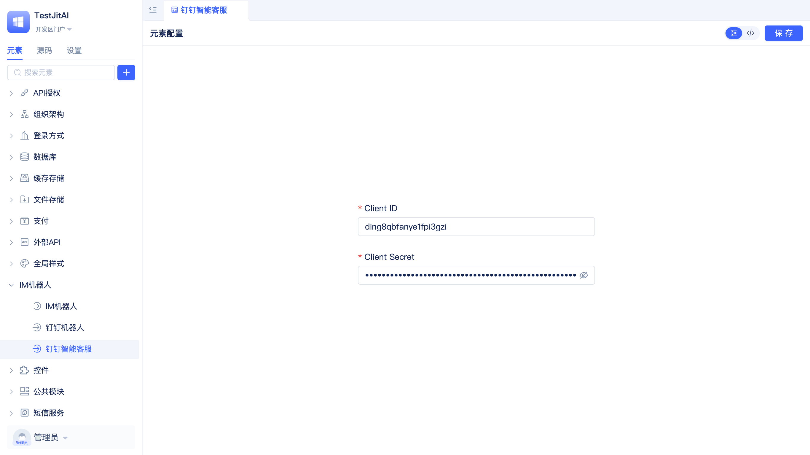

# 开发后端元素可视化编辑器

import Tabs from '@theme/Tabs';
import TabItem from '@theme/TabItem';

当我们完成了[新增后端Type元素](/docs/extguide/后端/新增后端Type元素.md)后，虽然可以创建实例并运行，但配置参数需要手动修改文件，这对不熟悉代码的业务开发者来说并不友好。

本文将介绍如何为钉钉机器人开发可视化配置编辑器，实现在JitAi开发工具中像官方元素一样的图形化配置体验。

## 效果预览



## 编辑器架构

| 元素层次 | fullName | 主要职责 |
|---------|----------|----------|
| **编辑器元素** | `imRobots.dingTalkStreamType.Editor` | type指向`editors.React`，为钉钉机器人提供可视化配置界面 |
| **目标元素** | `imRobots.dingTalkStreamType` | 被编辑的目标后端Type元素，已在前面章节完成 |

### 编辑器目录结构

```shell title="在dingTalkStreamType下新增Editor子目录"
imRobots/
└── dingTalkStreamType/              # 后端Type元素（已完成）
    ├── e.json                       # Type元素定义
    ├── config.json                  # 配置模板
    ├── loader.py                    # 加载器实现
    ├── client_manager.py           # 客户端管理
    ├── handler.py                  # 消息处理器
    └── Editor/                     # 编辑器目录（新增）
        ├── e.json                  # 编辑器元素定义
        ├── index.ts               # 编辑器入口文件
        ├── Editor.tsx             # 编辑器实现文件
        ├── Editor.style.ts        # 样式文件
        └── utils.ts               # 工具函数
```

## 操作指南

### 创建编辑器目录

在dingTalkStreamType目录下创建Editor子目录：

```bash
# 在dingTalkStreamType目录下执行
mkdir -p Editor
```

### 安装依赖

在项目的`package.json`中添加Monaco编辑器依赖：

```json title="package.json"
{
  "dependencies": {
    "@monaco-editor/react": "^4.7.0"
  }
}
```

### 实现编辑器文件

<Tabs>
  <TabItem value="config" label="元素定义文件">

**创建编辑器元素定义文件** `Editor/e.json`：

:::tip 编辑器也是元素
在JitAi中，编辑器本身也是一个元素，拥有自己的`e.json`定义文件。
:::

```json title="Editor/e.json"
{
  "frontBundleEntry": "./index.ts",
  "outputName": "index",
  "tag": "editor",
  "targetType": [
    "imRobots.dingTalkStreamType"
  ],
  "title": "钉钉机器人配置编辑器",
  "type": "editors.React"
}
```

**编辑器元素配置说明：**

<ul>
<li><code>title</code>: 编辑器元素显示名称</li>
<li><code>type</code>: 固定为<code>editors.React</code>，表示React编辑器元素</li>
<li><code>tag</code>: 固定为<code>editor</code>，表示后端元素编辑器</li>
<li><code>targetType</code>: 目标后端元素的fullName</li>
<li><code>frontBundleEntry</code>: 编辑器入口文件</li>
</ul>

  </TabItem>
  <TabItem value="index" label="入口文件">

**创建编辑器入口文件** `Editor/index.ts`：

```typescript title="Editor/index.ts"
export { Editor } from './Editor';
```

:::important 编辑器导出规范
编辑器必须导出名为`Editor`的组件，这是JitAi工具识别编辑器的固定约定。
:::

  </TabItem>
  <TabItem value="utils" label="工具函数">

**创建工具函数** `Editor/utils.ts`：

```typescript title="Editor/utils.ts"
type TreeData = { key: string; title: string; children?: TreeData[]; };

export const file2Tree = (files: Record<string, string>) => {
    const result: TreeData[] = [];
    Object.keys(files).forEach((path) => {
        if (path.includes('/')) {
            addToTree(result, path);
        } else {
            result.push({ key: path, title: path });
        }
    });
    return result;
};

const addToTree = (tree: TreeData[], path: string, level = 0): void => {
    const parts = path.split('/');
    if (level >= parts.length) return;
    const key = parts.slice(0, level + 1).join('/');
    const name = parts[level];
    const isFile = level === parts.length - 1;
    let node = tree.find(n => n.key === key);
    if (!node) {
        node = { key, title: name };
        if (!isFile) node.children = [];
        tree.push(node);
    }
    if (!isFile) addToTree(node.children!, path, level + 1);
};

const iconMap: Record<string, string> = {
    json: '📄', md: '📝', ts: '🔷', tsx: '🔷', js: '🟨', jsx: '🟨', css: '🎨', scss: '🎨', html: '🌐'
};

const langMap: Record<string, string> = {
    json: 'json', md: 'markdown', ts: 'typescript', tsx: 'typescript',
    js: 'javascript', jsx: 'javascript', css: 'css', scss: 'scss', html: 'html'
};

export const getFileIcon = (fileName: string): string => {
    const ext = fileName.split('.').pop() || '';
    return iconMap[ext] || '📄';
};

export const getLanguageByFileName = (fileName: string): string => {
    const ext = fileName.split('.').pop() || '';
    return langMap[ext] || 'plaintext';
};
```

  </TabItem>
  <TabItem value="styles" label="样式文件">

**创建样式文件** `Editor/Editor.style.ts`：

```typescript title="Editor/Editor.style.ts"
import type { GlobalToken } from 'antd';
import { css } from '@emotion/react';

export const editorStyle = (token: GlobalToken) => css`
    width: 100%; height: 100%; text-align: left;

    .ant-tree-treenode { border-radius: 4px; height: 40px; &:hover { background-color: ${token.colorPrimaryBg}; } }
    .code-editor-container { display: flex; width: 100%; height: 100%; background-color: #fff; }
    .file-list-container { width: 280px; flex-shrink: 0; border-right: 1px solid rgba(189, 198, 217, 0.24); display: flex; flex-direction: column; padding: 10px; background-color: ${token.colorBgContainer}; }
    .file-list-title { font-size: 14px; font-weight: 500; margin-bottom: 10px; color: ${token.colorTextSecondary}; }
    .gui-container { display: flex; justify-content: center; align-items: center; height: 100%; background-color: ${token.colorBgContainer}; }
    .gui-form { width: 100%; max-width: 400px; margin: 0 auto; }
`;

export const titleContentStyle = (token: GlobalToken) => css`
    display: flex; align-items: center; justify-content: space-between; width: 100%;
    .title-left { font-size: 14px; font-weight: 500; color: ${token.colorText}; }
    .title-right { display: flex; align-items: center; gap: 8px; 
        .ant-segmented { background: ${token.colorFill}; border-radius: 32px;
            .ant-segmented-item-selected { background-color: ${token.colorPrimary}; border-radius: 28px; color: ${token.colorBgBase}; }
        }
    }
    .file-path { color: ${token.colorTextSecondary}; font-family: Monaco, Consolas, monospace; font-size: 13px; }
`;
```

  </TabItem>
  <TabItem value="editor" label="编辑器实现">

**创建主编辑器文件** `Editor/Editor.tsx`：

```tsx title="Editor/Editor.tsx"
import type React from 'react';
import type { ForwardedRef } from 'react';
import { getRuntimeApp } from 'jit';
import { forwardRef, useCallback, useEffect, useImperativeHandle, useState } from 'react';
import { Button, Content, Tree, Icon } from 'jit-ui';
import { Form, Input, message, Badge, theme, Segmented } from 'antd';
import MonacoEditor, { loader } from '@monaco-editor/react';
import { editorStyle, titleContentStyle } from './Editor.style';
import { file2Tree, getFileIcon, getLanguageByFileName } from './utils';

loader.config({ paths: { vs: `${window.PUBLIC_RESOURCE}/wanyun/package/monaco-editor@0.41.0/min/vs` } });

interface EditorProps { fullName: string; enablePageCloseTip: (flag: boolean) => void; }
interface DingTalkConfig { clientId?: string; clientSecret?: string; agent?: string; }
export enum TitleOptSwitchEnum { CONFIG = 'config', CODE = 'code' }

const TitleOpt: React.FC<{ value: TitleOptSwitchEnum; onChange: (v: TitleOptSwitchEnum) => void; }> = ({ value, onChange }) => (
    <Segmented value={value} onChange={onChange} size="small" options={[
        { value: TitleOptSwitchEnum.CONFIG, icon: <Icon name="peizhi" /> },
        { value: TitleOptSwitchEnum.CODE, icon: <Icon name="IDEyuanma" /> }
    ]} />
);

export const MyEditor = forwardRef((props: EditorProps, ref: ForwardedRef<any>) => {
    const { fullName, enablePageCloseTip } = props;
    const { token } = theme.useToken();
    const [config, setConfig] = useState<DingTalkConfig>({});
    const [elementFiles, setElementFiles] = useState<Record<string, string>>({});
    const [activeFile, setActiveFile] = useState('config.json');
    const [tabName, setTabName] = useState<TitleOptSwitchEnum>(TitleOptSwitchEnum.CONFIG);
    const [loading, setLoading] = useState(false);
    const [changed, setChanged] = useState(false);
    const [expandedKeys, setExpandedKeys] = useState<string[]>([]);

    const loadFiles = useCallback(async () => {
        try {
            const app = getRuntimeApp();
            const resources = await app.getElementResource(fullName);
            const files: Record<string, string> = {};
            Object.keys(resources).forEach(fileName => { files[fileName] = resources[fileName] || ''; });
            if (!files['config.json']) files['config.json'] = JSON.stringify({}, null, 2);
            setElementFiles(files);
            try { setConfig(JSON.parse(files['config.json'] || '{}')); } catch { message.error('配置文件格式错误'); setConfig({}); }
            const fileKeys = Object.keys(files);
            setActiveFile(fileKeys.includes('config.json') ? 'config.json' : fileKeys[0]);
        } catch (error) { message.error(`加载失败: ${(error as Error).message}`); }
    }, [fullName]);

    const saveFiles = useCallback(async () => {
        setLoading(true);
        try {
            const app = getRuntimeApp();
            const filesToSave = { ...elementFiles };
            if (tabName === TitleOptSwitchEnum.CONFIG) {
                if (!config.clientId || !config.clientSecret || !config.agent) { message.error('请填写完整的配置信息'); return false; }
                filesToSave['config.json'] = JSON.stringify(config, null, 2);
            } else if (activeFile === 'config.json') {
                try { setConfig(JSON.parse(elementFiles[activeFile])); } catch { message.error('config.json格式错误'); return false; }
            }
            await app.saveElementResource(fullName, filesToSave);
            setElementFiles(filesToSave); message.success('保存成功'); enablePageCloseTip(false); setChanged(false); return true;
        } catch (error) { message.error('保存失败'); return false; } finally { setLoading(false); }
    }, [fullName, config, elementFiles, activeFile, tabName, enablePageCloseTip]);

    const markChanged = () => { setChanged(true); enablePageCloseTip(true); };
    const updateConfig = (field: keyof DingTalkConfig, value: string) => {
        const newConfig = { ...config, [field]: value }; setConfig(newConfig);
        elementFiles['config.json'] = JSON.stringify(newConfig, null, 2); setElementFiles({ ...elementFiles }); markChanged();
    };
    const updateFileContent = (value: string) => { elementFiles[activeFile] = value; setElementFiles({ ...elementFiles }); markChanged(); };

    useImperativeHandle(ref, () => ({ save: saveFiles }));
    useEffect(() => { loadFiles(); }, [loadFiles]);

    return (
        <Content title={null} titleContent={
            <div css={titleContentStyle(token)}>
                <div className="title-left">{tabName === TitleOptSwitchEnum.CONFIG ? '元素配置' : <span className="file-path">{fullName.replace('.', '/')}/{activeFile}</span>}</div>
                <div className="title-right"><TitleOpt value={tabName} onChange={setTabName} /><Badge dot={changed}><Button type="primary" size="small" loading={loading} onClick={saveFiles}>保存</Button></Badge></div>
            </div>
        }>
            <div css={editorStyle(token)}>
                {tabName === TitleOptSwitchEnum.CONFIG ? (
                    <div className="gui-container"><Form layout="vertical" className="gui-form">
                        <Form.Item label="Client ID" required><Input value={config.clientId || ''} onChange={(e) => updateConfig('clientId', e.target.value)} placeholder="请输入Client ID" /></Form.Item>
                        <Form.Item label="Client Secret" required><Input.Password value={config.clientSecret || ''} onChange={(e) => updateConfig('clientSecret', e.target.value)} placeholder="请输入Client Secret" /></Form.Item>
                        <Form.Item label="AiAgent Fullname" required><Input value={config.agent || ''} onChange={(e) => updateConfig('agent', e.target.value)} placeholder="请输入AiAgent Fullname" /></Form.Item>
                    </Form></div>
                ) : (
                    <div className="code-editor-container">
                        <div className="file-list-container"><div className="file-list-title">文件列表</div>
                            <Tree treeData={file2Tree(elementFiles)} expandedKeys={expandedKeys} onExpand={setExpandedKeys}
                                onSelect={(keys) => keys[0] && setActiveFile(keys[0])} selectedKeys={[activeFile]} showIcon
                                icon={({ data, expanded }: any) => data.children ? (expanded ? '📂' : '📁') : getFileIcon(data.title)}
                                titleRender={(node: any) => <span style={{ fontSize: '14px' }}>{node.title}</span>} />
                        </div>
                        <div style={{ flex: 1, position: 'relative', width: '100%' }}>
                            <MonacoEditor height="100%" language={getLanguageByFileName(activeFile)} value={elementFiles[activeFile] || ''} theme="vs-dark"
                                onChange={(value) => updateFileContent(value || '')} options={{ automaticLayout: true, wordWrap: 'on', minimap: { enabled: false }, fontSize: 14, tabSize: 2, lineNumbers: 'on' }} />
                        </div>
                    </div>
                )}
            </div>
        </Content>
    );
});

export const Editor = MyEditor;
```

  </TabItem>
</Tabs>

## 定制您的编辑器

### 修改元素配置

在 `Editor/e.json` 中，将 `targetType` 改为您的后端元素：

```json
{
  "targetType": ["yourOrg.YourBackendType"],
  "title": "您的元素编辑器"
}
```

### 定义配置结构

在 `Editor.tsx` 中，修改配置接口和表单：

```tsx
// 修改配置接口
interface YourConfig {
    apiKey?: string;
    endpoint?: string;
    timeout?: number;
}

// 修改状态类型
const [config, setConfig] = useState<YourConfig>({});

// 修改表单字段
<Form.Item label="API Key" required>
    <Input
        value={config.apiKey || ''}
        onChange={(e) => updateConfig('apiKey', e.target.value)}
        placeholder="请输入API Key"
    />
</Form.Item>

// 修改验证逻辑
if (!config.apiKey || !config.endpoint) {
    message.error('请填写完整配置');
    return false;
}
```

## 测试

### 使编辑器生效
1. **清理缓存**：删除应用目录中的`dist`目录  
2. **重启服务**：重启桌面端
3. **触发打包**：访问应用页面，系统自动重新打包

### 验证编辑器功能
1. **创建元素实例**：在JitAi开发工具中创建钉钉机器人元素实例
2. **打开编辑器**：点击元素实例进入编辑器
3. **切换模式**：点击配置/代码图标，验证模式切换
4. **修改配置**：尝试在GUI模式修改配置，观察代码模式是否同步
5. **保存验证**：保存后重新打开，确认配置已持久化

### 常见问题排查
- **编辑器不显示**：检查`targetType`中的后端元素名称是否正确
- **Monaco编辑器不显示**：检查`@monaco-editor/react`依赖是否安装
- **保存失败**：查看浏览器控制台，检查API调用是否正常

## 总结

为后端元素开发可视化编辑器的**核心步骤**：

1. **创建Editor目录** + 配置编辑器元素定义文件`e.json`（`type: "editors.React"`）
2. **实现Editor组件**：支持GUI/代码双模式 + 文件管理 + 双向同步
3. **定制配置结构**：根据后端元素需求调整配置接口和表单
4. **测试验证**：确保编辑器在JitAi中正常工作

**关键要点**：
- 导出名`Editor`不可更改
- `targetType`必须正确指向后端元素
- 使用`getElementResource`和`saveElementResource` API进行文件管理
- GUI模式与代码模式需要保持数据同步