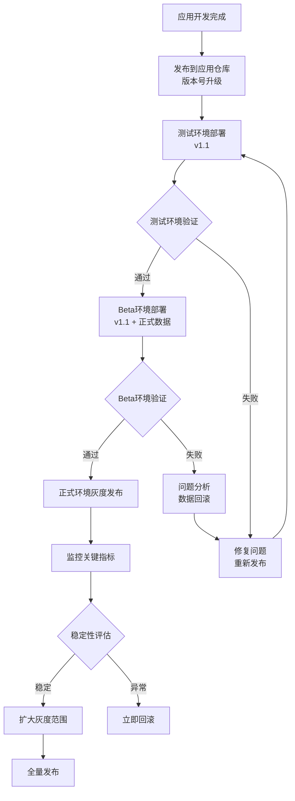
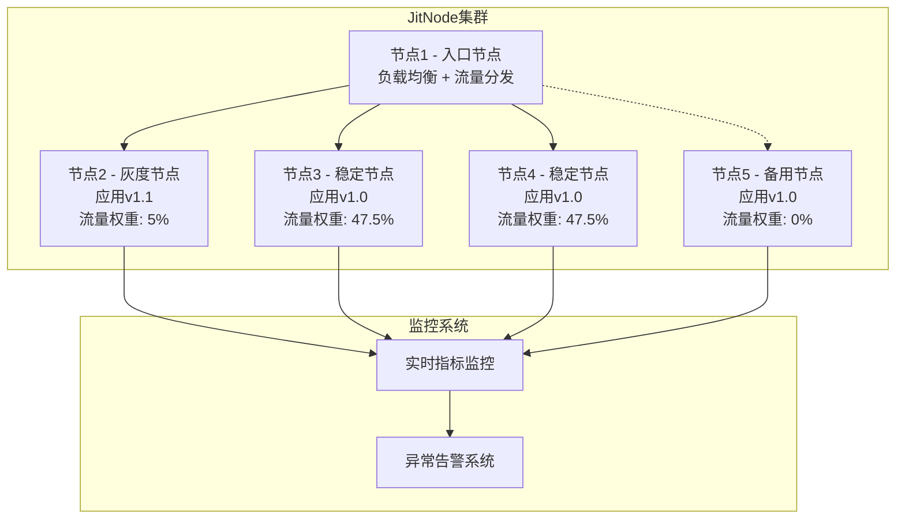
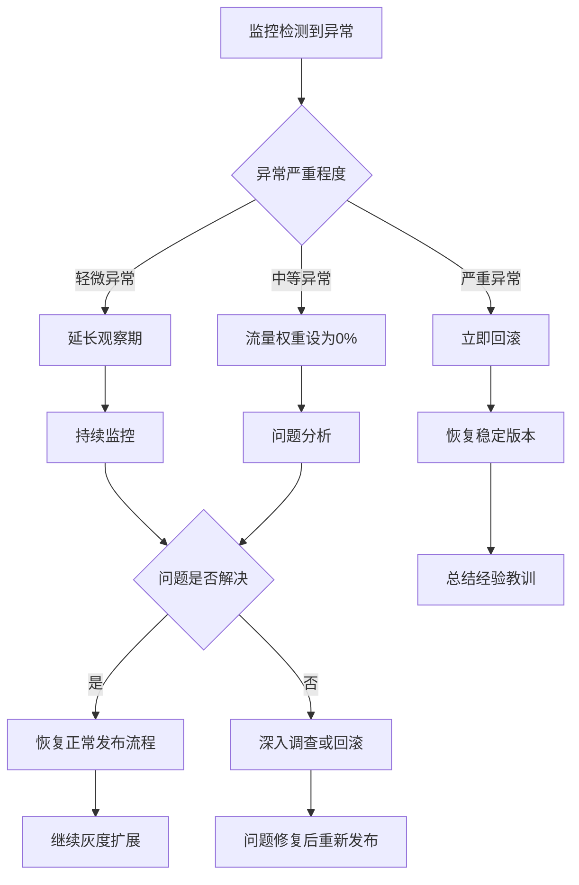
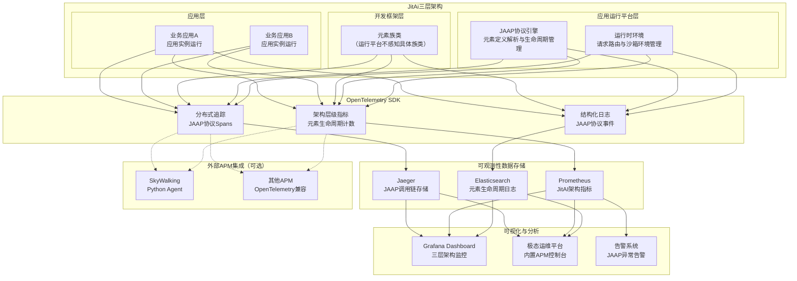

import Tabs from '@theme/Tabs';
import TabItem from '@theme/TabItem';

# 应用层稳定性保障

JitAi有能力支撑行业主流和领先的应用层稳定性保证措施。

应用层更新具有**影响范围相对局部、更新频率较高、用户体验敏感**的特点，需要在保证稳定性的同时支持快速迭代。

:::tip 
- 🎯 **局部影响**：单个或少数应用更新，风险可控
- ⚡ **快速迭代**：支持频繁更新，响应业务需求  
- 👤 **用户控制**：用户可选择升级时机，降低强制升级风险
- 🔄 **独立部署**：不影响其他应用运行，故障隔离
:::

## 渐进式验证流程

### 多运行环境

在JitAi运维平台创建多个运行环境，采用**测试环境 → Beta环境 → 正式环境**的渐进式验证流程：



### 环境配置策略

<Tabs>
<TabItem value="test" label="🧪 测试环境" default>

:::info 测试环境配置
**功能定位**：功能验证和基础性能测试

🔧 **环境特征**
- **数据源**：模拟数据或脱敏数据
- **流量来源**：测试团队和开发人员
- **资源配置**：中等规模，满足功能测试需求

✅ **验证重点**
- 业务逻辑正确性验证
- 用户界面和交互体验测试
- 基础性能和响应时间测试
- 与其他系统的集成功能测试
:::

</TabItem>
<TabItem value="beta" label="🚀 Beta环境">

:::info Beta环境配置  
**功能定位**：真实环境验证，连接正式环境数据

🔧 **环境特征**
- **数据源**：正式环境数据（只读模式或副本）
- **流量来源**：内部用户和少量外部用户
- **资源配置**：接近生产环境规模

✅ **验证重点**
- 真实数据的兼容性验证
- 生产级性能和稳定性测试
- 完整业务流程的端到端验证
- 数据安全性和一致性检查
:::

</TabItem>
<TabItem value="prod" label="🌐 正式环境">

:::info 正式环境配置
**功能定位**：生产服务，服务真实用户

🔧 **环境特征**
- **数据源**：生产数据
- **流量来源**：全量用户流量
- **资源配置**：生产级资源配置

✅ **验证重点**
- 系统整体稳定性监控
- 用户体验和满意度指标
- 业务关键指标监控
- 7x24小时可用性保障
:::

</TabItem>
</Tabs>

### 版本管理与发布策略

| 发布阶段 | 版本状态 | 验证周期 | 通过标准 | 失败处理 |
|---------|---------|---------|---------|---------|
| **应用仓库** | 开发完成版本 | 代码审查 | 代码规范 + 功能完整性 | 重新开发修复 |
| **测试环境** | 功能测试版本 | 1-2天 | 功能正确性 + 基础性能 | 回到开发阶段 |
| **Beta环境** | 准生产版本 | 3-5天 | 真实数据兼容 + 生产性能 | 数据问题分析 |
| **正式环境** | 生产版本 | 持续监控 | 稳定性指标 + 用户体验 | 灰度回滚 |

## 灰度发布机制

### 节点级灰度发布

在JitAi集群架构中，其中一个JitNode节点承担负载均衡器角色，负责流量分发控制。运行环境入口地址就是解析到该节点。



### 灰度发布流程控制

#### 稳定性与可用性双重评估

灰度发布需要同时评估**稳定性**和**可用性**两个维度：

- **稳定性**：系统运行的错误率、响应时间等技术指标
- **可用性**：业务功能的正常服务能力、用户体验指标

| 灰度阶段 | 灰度节点数 | 流量比例 | 观察期 | 稳定性标准 | 可用性标准 | 异常处理 |
|---------|----------|---------|--------|----------|----------|----------|
| **初始灰度** | 1个节点 | 5% | 2小时 | 错误率 &lt; 0.01% | 业务可用性 &gt; 99.9% | 流量权重设为0% |
| **小规模扩展** | 2个节点 | 20% | 4小时 | 错误率 &lt; 0.005% | 业务可用性 &gt; 99.95% | 流量权重设为0% |
| **中等规模** | 50%节点 | 50% | 8小时 | 错误率 &lt; 0.001% | 业务可用性 &gt; 99.98% | 立即回滚或流量设为0% |
| **全量发布** | 全部节点 | 100% | 持续监控 | 系统稳定 | 业务正常 | 紧急回滚 |

:::tip 灰度节点流量归零机制
当灰度节点表现异常时，可以**立即将其流量权重设置为0%**，实现秒级故障隔离：
- 🚨 **即时响应**：无需等待回滚部署，直接切断异常节点流量
- 🛡️ **用户保护**：确保用户请求不会路由到异常节点
- 🔄 **快速恢复**：问题修复后可快速恢复该节点的流量分配
- 📊 **数据保留**：节点继续运行，便于问题分析和调试
:::

### 灰度发布操作流程

**标准发布流程：**

1. **选择灰度节点**：选择1个节点作为初始灰度节点
2. **调整流量权重**：将该节点流量权重调整为5%
3. **部署新版本**：在灰度节点上部署新版本应用
4. **启动监控**：开启全方位监控和告警
5. **双重评估**：同时评估稳定性和可用性指标
6. **决策执行**：根据评估结果决定下一步操作
7. **逐步扩展**：稳定后逐步增加灰度节点和流量比例
8. **完成发布**：所有节点升级完成，恢复正常流量分发

**异常处理流程：**



**流量归零操作步骤：**

1. **异常检测**：监控系统检测到稳定性或可用性指标异常
2. **即时隔离**：将灰度节点流量权重设置为0%（耗时 &lt; 10秒）
3. **状态确认**：确认用户流量已完全切换到稳定节点
4. **问题诊断**：在隔离状态下进行问题分析和调试
5. **修复验证**：问题修复后进行功能验证
6. **流量恢复**：验证通过后逐步恢复该节点的流量分配

## 可观测性

:::info
可观测性相关能力正在建设中，即将上线
:::

### OpenTelemetry及APM生态集成

JitAi应用运行平台支持[OpenTelemetry](https://opentelemetry.io/)，这是可观测性领域的核心标准，在技术演进、生态整合和行业实践中具有不替代的地位。



### 观测指标体系

基于JAAP协议和JitAI三层架构的OpenTelemetry规范可观测性体系：

**1. Metrics（指标体系与判断标准）**

**HTTP状态码分布指标**
```yaml
# 关键成功率指标
http_status_metrics:
  - status_2xx_rate: ">99.9%"        # 成功响应率（必须>99.9%）
  - status_4xx_rate: "<0.1%"         # 客户端错误率
  - status_5xx_rate: "0%"            # 服务端错误率（零容忍）
  - status_404_count: "0"            # 404错误数量（应为0）
```

**应用运行平台核心指标**
```yaml
# 应用实例管理指标
application_runtime_metrics:
  - app_instance_start_success_rate: ">99.9%"            # 应用实例启动成功率
  - app_runtime_availability: ">99.95%"                  # 应用运行时可用性
  - app_environment_switch_success_rate: ">99.9%"        # 应用环境切换成功率
  - app_instance_running_count: "当前运行应用实例数量"
  - app_instance_uptime_duration: "应用实例运行时长分布"
  - app_environment_switch_duration: "<1s"               # 应用环境切换耗时

# 元素运行时管理指标（不感知具体族类）
element_runtime_metrics:
  - element_load_success_rate: ">99.99%"                 # 元素加载成功率
  - element_instantiation_success_rate: ">99.95%"        # 元素实例化成功率
  - element_lifecycle_completion_rate: ">99.9%"          # 元素生命周期完成率
  - element_active_instances_count: "活跃元素实例总数"
  - element_inheritance_resolution_success: "100%"       # 元素继承解析成功率

# JAAP协议执行指标  
jaap_protocol_metrics:
  - jaap_element_definition_validation_rate: "100%"      # 元素定义验证成功率
  - jaap_element_config_parse_success_rate: ">99.99%"   # 元素配置解析成功率
  - jaap_inheritance_chain_resolution_rate: "100%"       # 继承链解析成功率
  - jaap_element_loader_invocation_duration: "<100ms"    # 元素加载器调用耗时
```

**运行平台请求处理指标**
```yaml
platform_request_metrics:
  - request_routing_success_rate: ">99.9%"              # 请求路由成功率
  - environment_routing_accuracy: "100%"                # 环境路由准确率
  - request_processing_duration: "请求处理耗时分布"
  - concurrent_request_handling_capacity: "并发请求处理能力"

# 虚拟沙箱环境指标
sandbox_environment_metrics:
  - sandbox_creation_success_rate: ">99.95%"            # 沙箱环境创建成功率
  - environment_isolation_effectiveness: "100%"          # 环境隔离有效性
  - resource_isolation_integrity: "100%"                 # 资源隔离完整性
  - environment_cleanup_success_rate: "100%"             # 环境清理成功率
```

**业务功能可用性指标**
```yaml
# 业务层面的关键指标
business_metrics:
  - page_load_success_rate: ">99.9%"        # 页面加载成功率
  - api_endpoint_availability: ">99.95%"    # API端点可用性
  - transaction_completion_rate: ">99.9%"   # 业务交易完成率
  - user_session_success_rate: ">99.8%"     # 用户会话成功率
```

#### 2. Traces（分布式追踪）

**应用运行平台调用链追踪**
```json
{
  "platform_runtime_trace": {
    "trace_id": "platform-trace-20241201-001",
    "root_span": {
      "span_id": "request-001",
      "operation_name": "user_request_processing",
      "tags": {
        "platform.app_id": "wanyun.CustomerService",
        "platform.app_version": "1.2.0", 
        "platform.environment": "production",
        "platform.org_id": "wanyun",
        "platform.sandbox_id": "sandbox-abc123"
      }
    },
    "platform_spans": [
      {
        "span_id": "routing-001",
        "parent_span_id": "request-001",
        "operation_name": "request_routing",
        "tags": {
          "platform.routing_type": "environment_routing",
          "platform.target_environment": "production",
          "platform.routing_success": "true"
        }
      },
      {
        "span_id": "app-loading-001",
        "parent_span_id": "routing-001", 
        "operation_name": "application_loading",
        "tags": {
          "platform.app_loading_type": "lazy_loading",
          "platform.app_inheritance_depth": "2",
          "platform.app_extends_from": "wanyun.BaseApp"
        }
      },
      {
        "span_id": "element-runtime-001",
        "parent_span_id": "app-loading-001",
        "operation_name": "element_lifecycle_management", 
        "tags": {
          "platform.element_type": "Instance",
          "platform.element_id": "pages.CustomerServicePage",
          "platform.lifecycle_event": "onCalled",
          "platform.inheritance_resolved": "true"
        },
        "logs": [
          {
            "timestamp": "2024-12-01T10:00:00Z",
            "fields": {
              "event": "element_lifecycle",
              "lifecycle_stage": "onLoad",
              "config_validation": "success",
              "instantiation_result": "success"
            }
          }
        ]
      }
    ]
  }
}
```

**JAAP协议执行追踪**
```json
{
  "jaap_protocol_trace": {
    "trace_id": "jaap-protocol-20241201-001",
    "protocol_spans": [
      {
        "span_id": "protocol-parsing-001",
        "operation_name": "jaap_protocol_parsing",
        "tags": {
          "jaap.protocol_version": "1.2.0",
          "jaap.element_definition_file": "app.jit",
          "jaap.parsing_result": "success"
        }
      },
      {
        "span_id": "element-definition-001",
        "parent_span_id": "protocol-parsing-001",
        "operation_name": "element_definition_validation",
        "tags": {
          "jaap.element_id": "services.CustomerService",
          "jaap.element_type": "Instance",
          "jaap.type_reference": "services.BaseService",
          "jaap.validation_result": "success"
        }
      },
      {
        "span_id": "inheritance-resolution-001", 
        "parent_span_id": "element-definition-001",
        "operation_name": "inheritance_chain_resolution",
        "tags": {
          "jaap.inheritance_chain": "BaseService->ServiceTemplate->CustomerService",
          "jaap.inheritance_depth": "3",
          "jaap.resolution_result": "success"
        }
      },
      {
        "span_id": "element-instantiation-001",
        "parent_span_id": "inheritance-resolution-001",
        "operation_name": "element_instantiation",
        "tags": {
          "jaap.instantiation_type": "lazy_loading",
          "jaap.config_merge_result": "success",
          "jaap.lifecycle_initialization": "success"
        }
      }
    ]
  }
}
```

#### 3. Logs（结构化日志）

**JAAP协议结构化日志**
```json
{
  "timestamp": "2024-12-01T10:00:00.123Z",
  "level": "INFO",
  "logger": "jaap.protocol.engine",
  "message": "Element lifecycle event processed",
  "attributes": {
    "jaap.protocol_version": "1.2.0",
    "jaap.element_id": "services.CustomerService",
    "jaap.element_type": "Instance", 
    "jaap.element_family": "JitService",
    "jaap.lifecycle_event": "onCreate",
    "jaap.parent_type": "services.BaseService",
    "jaap.config_hash": "sha256:abc123...",
    "execution.duration_ms": 45,
    "execution.success": true
  },
  "resource": {
     "service.name": "jitai-application",
     "service.version": "1.2.0",
     "deployment.environment": "production"
   }
 }
 ```
