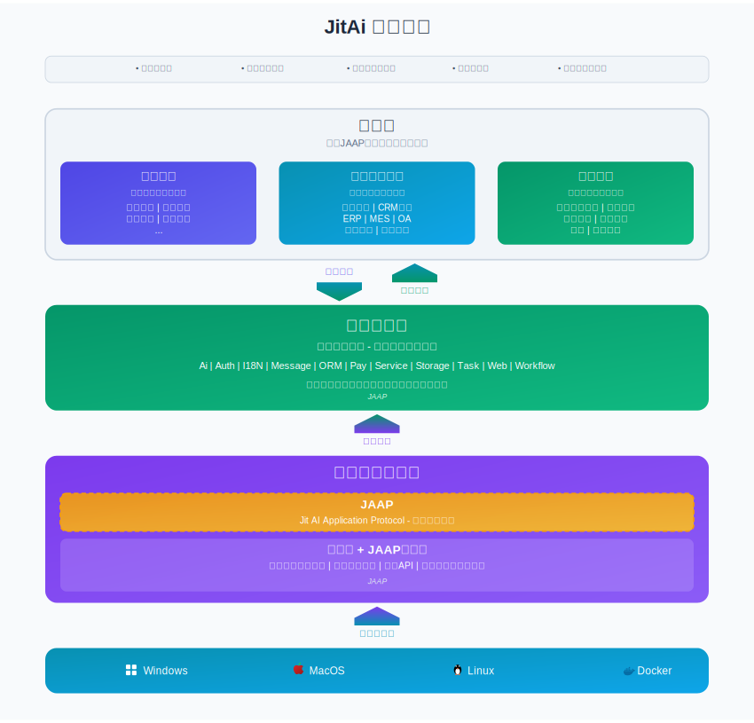
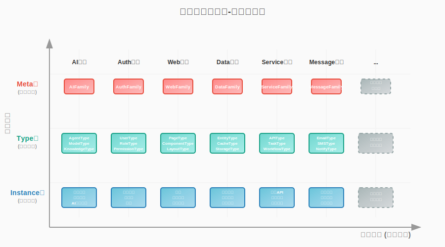

# 体系结构与原理

JitAi作为面向AI时代的应用开发技术体系，其核心原理体现在架构设计和运行机制两个层面。本章将从**架构**和**机制**的角度，帮助开发者建立对JitAi技术体系的深入理解。

## 技术架构总览



JitAi构建了一个开放的三层技术架构，实现从基础设施到业务应用的全栈整合。

## JAAP的结构定义与过程驱动

软件系统的复杂性体现在静态和动态两个方面。静态方面，系统由大量相互关联的组件构成，关系复杂难以理解和管理。动态方面，系统在运行时的行为模式复杂，状态变化难以预测和控制。

JAAP（Jit AI Application Protocol）通过**结构定义**并驱动运行平台的**过程执行**，优雅地解决了这一问题。

### 结构定义的原理

#### 认知外化

人类认知具有局限性，人脑同时处理的信息量有限（通常为7±2个对象），复杂系统的组件数量远超人类认知容量，缺乏标准化表达会导致理解偏差。通过统一的结构定义语言，将复杂系统的组织方式外化为可读、可理解、可传递的标准化描述。

#### 机器可读

传统架构文档停留在"人类可读"层面，机器无法理解自然语言或图形化的架构描述，设计与实现之间存在无法自动化的鸿沟。结构化定义中，每个组件的类型、关系、属性都是明确的，计算机可以直接理解和处理结构信息，为自动化部署、监控、优化提供了基础。

### 过程驱动的原理

#### 声明到执行的桥梁

静态结构定义只能描述"系统是什么样的"，无法直接回答"系统如何运行"，需要额外的机制将静态描述转化为动态行为。通过驱动引擎（即应用运行平台），将静态的结构定义转化为具体的执行步骤和运行时行为。

### AI理解和参与

自然语言描述的架构文档歧义性大，图形化架构图缺乏精确的语义信息，都会使大模型的理解出现歧义。格式统一、语义明确的结构化信息，便于AI理解，AI也可以直接操作结构定义，为AI参与提供了基础。

## 矩阵型元架构的构成

通过元素族类、元素分层、应用继承机制的有机结合，JitAi构建了一套具有强大复用性和扩展性的架构模式。

### 矩阵化的元素族类

JitAi通过Meta、Type、Instance分层，形成横向族类与纵向分层的矩阵型系统模块构成形态：



#### 分层协作机制
- **Meta层（族类根节点）**：定义族类标准，提供Type元素的加载机制和规范约束
- **Type层（类型封装）**：封装技术实现，提供配置器、加载器和实例化能力
- **Instance层（业务实例）**：承载具体业务逻辑，通过Type层获得技术能力，通过Meta层获得族类约束

#### 矩阵扩展维度

- **Meta层扩展**：新增族类定义，扩展业务领域覆盖范围
- **Type层扩展**：在现有族类下新增类型，丰富技术实现选择
- **Instance层扩展**：基于现有类型创建新实例，满足个性化需求

### 继承机制

#### 元素族内的继承
JitAi通过Meta/Type/Instance三层架构实现了递进式的继承机制：
```
Meta层规范 → Type层实现 → Instance层配置
    ↓           ↓            ↓
  族类约束   技术能力封装   业务逻辑承载
```
- **Meta层继承**：族类规范的标准化传承，确保同族元素的一致性约束
- **Type层继承**：技术实现的模块化复用，通过配置器和加载器实现能力传递
- **Instance层继承**：业务逻辑的参数化定制，通过配置覆盖实现个性化

#### 应用级继承
应用级继承是在矩阵型元架构基础上构建的复用机制，通过继承链实现跨应用的元素共享和配置传递。

应用继承通过 `app.json` 中的 `extends` 配置实现，支持多级继承链：

```json
{
  "appId": "wanyun.MyApp",
  "extends": [
    {
      "appId": "wanyun.BaseApp",
      "version": "1.0.0"
    }
  ]
}
```

**继承复用机制**：
1. **元素族类复用**：子应用可以使用父应用中定义的元素族类，创建type指向父应用中某个Type元素的实例元素
2. **元素重写**：子应用可以重写父应用中的已有元素，实现功能定制

## 运行时机制

JitAi通过微内核架构和解释型执行模式，实现了应用的动态加载、热更新和智能路由等关键能力。

### 流程概览

- **请求处理流程**：运行环境路由、应用路由、元素路由
- **应用实例化流程**：应用资源自动热部署、应用目录校验、构建状态判断、应用实例化
- **元素查找流程**：运行时容器查询、应用配置查询、继承链追溯
- **加载器获取流程**：加载器选择策略、加载器层次结构
- **性能优化机制**：懒加载策略、多层缓存机制

### 请求处理流程

#### 1. 运行环境路由

JitNode内置的WebServer接收来自客户端的 HTTP 请求后，按照以下优先级进行环境路由：

| 优先级 | 参数类型 | 说明 |
|--------|----------|------|
| 1 | `envId` 请求头 | 显式指定运行环境ID |
| 2 | 域名/端口组合 | 基于请求路径识别运行环境 |

#### 2. 应用路由

应用路由基于 `OrgId.AppId` 组合标识进行精确匹配。

**路由决策流程**：
1. **解析应用标识**：从请求中提取 `OrgId.AppId` 组合
2. **容器检索**：在进程级应用容器中查找应用实例
3. **实例化处理**：
   - ✅ **实例存在**：直接转发请求
   - 🔄 **实例缺失**：触发应用实例化流程

#### 3. 元素路由

应用实例接收请求后，执行细粒度的元素路由：

1. **路径解析**：提取元素 `fullname` 和目标方法名
2. **元素定位**：通过元素查找流程获取元素实例
3. **方法调用**：执行元素的目标方法

#### 4. 响应封装

内核将所有执行结果标准化为统一的响应格式，包含：
- **状态码**：标识请求成功或错误类型
- **业务数据体**：实际的响应数据内容
- **错误信息**：详细的错误描述信息
- **调试信息**：包含 RequestId、请求耗时等元数据

### 应用实例化流程

#### 1. 应用目录校验

系统首先验证应用资源的完整性：
- 验证 `OrgId/AppId/Version` 应用文件夹是否存在
- 检查核心配置文件和构建产物的完整性

> **资源缺失处理**：当本地缺少应用资源时，系统将自动从 JCS（Jit Center Service）下载最新版本的应用资源包。

#### 2. 构建状态判断

系统根据资源状态选择最优的加载策略：

| 构建状态 | 资源要求 | 处理策略 |
|----------|----------|----------|
| **预构建模式** | `dist/app.jit` + 元素构建产物 | ⚡ 直接加载，性能最优 |
| **源码模式** | `app.json` + 完整源码 | 🔧 即时编译，灵活性高，可调试 |
| **异常模式** | 资源不完整 | ❌ 抛出异常，需人工介入 |

### 元素查找流程

#### 1. 运行时容器查询

系统首先在当前应用的运行时元素容器中进行高速查询，利用内存缓存机制提升查找效率。

#### 2. 应用配置查询

若运行时缓存未命中，系统将查询 `app.jit` 配置文件中的元素列表：

1. **配置匹配**：在元素列表中匹配 `fullname`
2. **元素实例化**：创建元素对象实例
3. **缓存更新**：将新实例加入运行时容器缓存

#### 3. 继承链追溯

支持跨应用的元素继承和复用，按照继承链顺序查找：当前应用 → 父应用 → 祖应用，直到找到元素或抛出未找到异常。

### 加载器获取流程

> **元素自描述、自加载**是JitNode微内核的重要体现，是应用系统模块被AI动态感知、动态调用、动态编排的基础。

#### 加载器选择策略

系统按照以下优先级选择加载器：

1. **Type元素加载器**：优先使用元素 `type` 指向的 Type 元素定义的加载器
2. **父Type元素加载器**：继续递归向上查找父 Type 元素的加载器
3. **系统默认加载器**：当无自定义加载器时，使用默认的内核加载器

### 性能优化机制

#### 1. 懒加载策略

JitAi采用多层次的懒加载机制：
- **应用级懒加载**：应用仅在首次访问时实例化
- **元素级懒加载**：元素按需加载，减少内存占用
- **资源级懒加载**：静态资源按需下载

#### 2. 多层缓存机制

| 缓存层级 | 缓存内容 | 生命周期 |
|----------|----------|----------|
| **进程级缓存** | 应用实例、元素实例 | 进程生命周期 |
| **请求线程级缓存** | 临时计算结果 | 单次请求 |
| **持久化缓存** | 编译产物、资源文件 | 版本更新前 |
