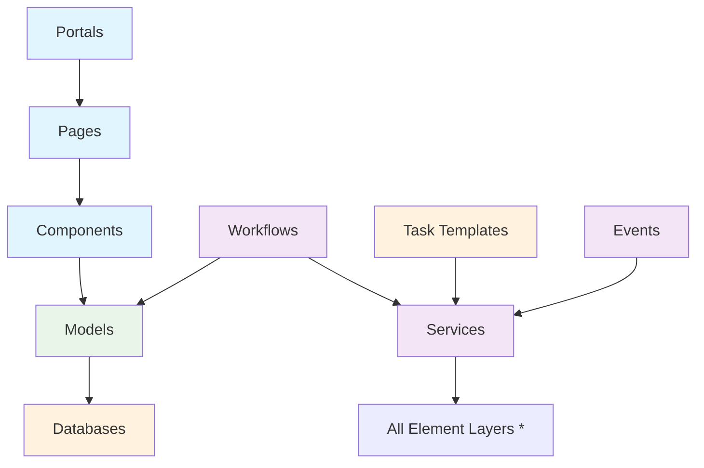

# Framework Overview
Through years of development in enterprise application development, numerous universal and common patterns/component models have been established. The JitAi development framework encapsulates these common components into different element family classes. Developers can extend and define their own element family classes, or inherit and modify official element family classes to meet specific business requirements.

Based on the abstract concept of "System = Structure + Process", the development process for enterprise application systems becomes **selecting appropriate elements for structural design, then implementing the invocation process**.

## Core Element Family Classes
### User Interface Layer
- **Portals**: System visit entry points, applications provide three types of portals by default
  - User Area Portal: Operation interface for end users
  - Developer Portal: Configuration interface for developers  
  - Manager Portal: Management interface for system administrators
  - Extended Portals: Custom dedicated entry points based on business requirements

- **Pages**: Functional module interfaces that implement specific business functions through component-based layout or code development

- **Components**: Reusable UI building units that provide standardized interface interaction capabilities

### Business Logic Layer
- **Services**: Business logic processing interfaces that encapsulate core business rules and processes

- **Workflows**: Business process management that defines approval nodes and flow rules

- **Events**: Event-driven mechanisms that support model change events and process trigger events

### Data Model Layer
- **Models**: Data structure definitions that integrate database operation capabilities and provide unified data access interfaces

### Permission Management Layer
- **Roles**: Permission control system based on RBAC (Role-Based Access Control)

- **Organizations**: Enterprise organizational structure management that supports hierarchical permission allocation

- **Authentication Types**: Diversified identity authentication mechanism configuration

### Task Scheduling Layer
- **Task Templates**: Execution templates for scheduled tasks and batch processing tasks

### Infrastructure Layer
- **Databases**: Data persistence storage that provides transactional data operation capabilities

- **File Storages**: Multimedia file storage that supports local disk and cloud OSS services

- **Cache Storages**: High-performance caching services that support memory cache and distributed Redis cache

## Common Invocation Relationships
The various element family classes in the system follow clear dependency relationships and invocation hierarchies:

| Caller | Callee | Relationship Description |
|--------|--------|-------------------------|
| Portals | Pages | Portals load and display page content |
| Pages | Components | Pages build user interfaces through components |
| Components | Models | Components call models for data interaction |
| Services | All Elements | Services serve as the business logic center and can be called by all layers |
| Models | Databases | Models perform data persistence through databases |
| Workflows | Models, Services | Approval processes call models and services to execute business logic |
| Tasks | Services | Scheduled tasks execute predefined business operations through services |
| Events | Services | Events call corresponding services to handle logic when triggered |
