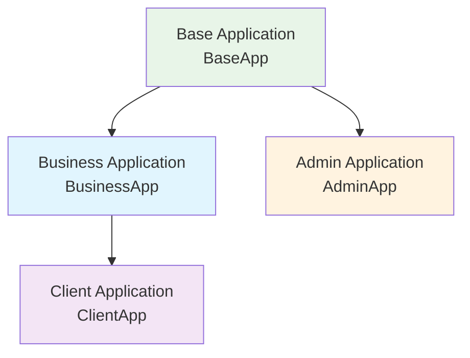
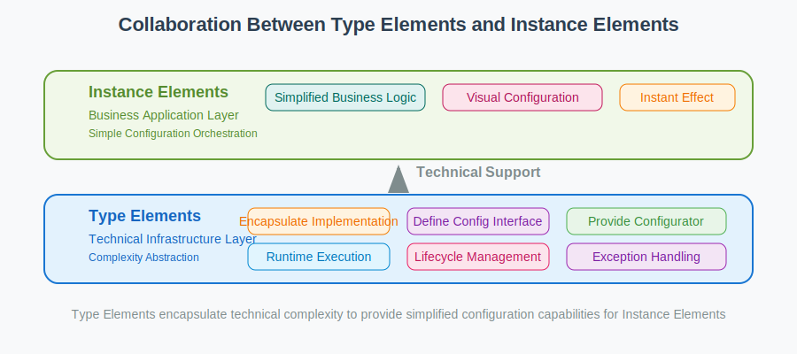
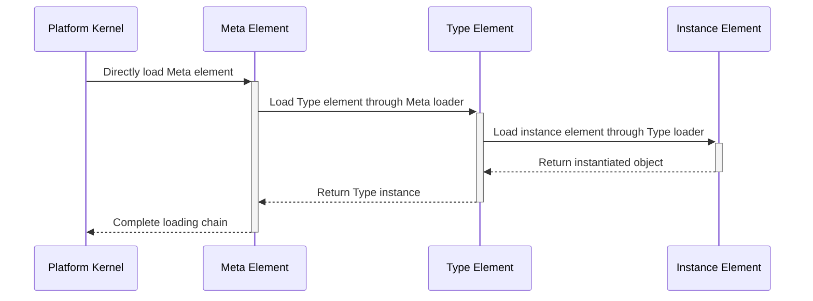
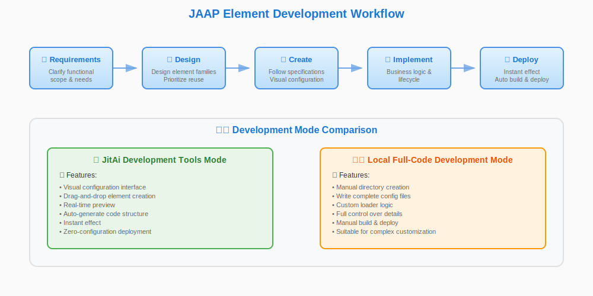

# JAAP (JitAI Ai Application Protocol)
The emergence of operating systems marked a significant turning point in computer development history. Through hardware abstraction, operating systems enabled programmers to focus on algorithmic logic by transferring complexities such as CPU architecture, memory management, process management, and device drivers to the operating system itself. Today, modern application development has evolved from writing single programs to complex integration of multiple technology stacks, preventing developers from focusing on business logic implementation.

We need to build upon operating systems and continue their philosophy by abstracting the complexity of application development, enabling business experts to focus maximally on orchestrating high-level business logic.

**JAAP (JitAI Ai Application Protocol)** serves as a unified architectural language that achieves the aforementioned complexity abstraction through structural definition and process-driven approaches, defining construction standards and modular architecture for application systems, while the application runtime-platform is responsible for interpreting and executing JAAP applications. JAAP consists of two parts: **Application Specification** and **Element Specification**, which together build a complete application development and runtime system.

## 🏗️ Application Specification
An application is a collection of related elements that implement specific business functions, with each application corresponding to an independent folder structure. Applications achieve modular management and inheritance reuse through standardized directory structures and configuration files.

### Application Deployment Path
Applications follow standardized deployment path rules:

```
Runtime Environment Directory/Organization ID/Application ID/Application Version
```

**Example Path**: `home/environs/JRE_MWcVmUZjEq/wanyun/MyApp/1_0_0`

### Application Directory Structure
```plaintext title="Standard Application Directory Structure"
MyApp/                     # Application root directory
├── app.json               # Application configuration manifest
├── requirements.txt       # Python dependency declarations
│
├── appData/               # Application data storage
├── dist/                  # Compiled build artifacts
├── commons/               # Common code library
├── test/                  # Test case collection
│
├── 📁 Data Layer Elements
│   ├── models/            # Data model elements
│   ├── databases/         # Database connection elements
│   ├── caches/           # Cache service elements
│   └── storages/         # Storage service elements
│
├── 📁 Business Layer Elements
│   ├── services/         # Business service elements
│   ├── workflows/        # Workflow process elements
│   ├── tasks/           # Task scheduling elements
│   └── events/          # Event handling elements
│
├── 📁 Presentation Layer Elements
│   ├── pages/           # Page elements
│   ├── components/      # UI component elements
│   ├── shells/         # Application portal elements
│   └── themes/         # Theme style elements
│
├── 📁 Permission Control Elements
│   ├── roles/          # Role permission elements
│   ├── auths/         # Authentication service elements
│   ├── apiAuths/      # API authentication elements
│   ├── corps/         # Enterprise organization elements
│   └── interceptors/  # Request interceptor elements
│
├── 📁 Integration Service Elements
│   ├── externalAPIs/  # External API integration elements
│   └── messages/      # Message communication elements
```

In MyApp, `commons` is not an element directory and cannot be referenced using the `app.getElement` syntax. The `commons` directory serves as a backend Python package / frontend shared folder used by other elements within MyApp, typically for storing shared code such as constants, global variables, utility functions, and common components.

### Application Configuration Manifest
`app.json` is the core configuration file of the application, defining the application's basic information and runtime parameters:

```json title="app.json Configuration Example"
{
  "appId": "orgId.appName",           // Application unique identifier
  "name": "appName",                  // Application internal name
  "title": "Application Title",       // Application display title
  "version": "1.0.0",                // Application version number
  "orgId": "orgId",                  // Organization ID
  "icon": "icon_identifier",         // Application icon identifier
  "theme": "#3d65fd",               // Application theme color
  "encrypted": 0,                   // Encryption flag (0:No 1:Yes)
  
  "extends": [                      // Application inheritance configuration
    {
      "appId": "wanyun.BaseApp",
      "version": "1.0.0"
    }
  ],
  
  "settings": {                     // Application runtime settings
    "defaultElement": {
      "defaultCache": "caches.Default",
      "defaultDatabase": "databases.Default", 
      "defaultShell": "shells.Main",
      "defaultStorage": "storages.Default"
    }
  }
}
```

### Build Artifacts Directory
The `dist/` directory stores the application's compiled build artifacts:

| File Type | Description | Naming Convention |
|---------|------|----------|
| **Element Package** | Encrypted element files | `element.pkg` |
| **Application Manifest** | Application structure description file | `app.jit` |

:::info Build Artifacts Description
- **Directory Structure**: Maintains consistency with source code directory
- **File Format**: Element files are encrypted
- **Manifest File**: `app.jit` is automatically generated based on `app.json`, containing compile-time information and actual element composition for runtime loading
:::

### Application Inheritance Mechanism
JitAI applications support multi-level inheritance, where child applications inherit elements and configurations from parent applications through `extends` configuration, achieving code reuse and functionality extension.



**Inheritance Features**:
- **Element Override**: Child applications can override parent application elements with the same name
- **Configuration Override**: Child application configurations have higher priority than parent applications
- **Incremental Development**: Functionality extension based on parent applications

## 🧩 Element Specification
JitAI adopts a three-layer element architecture design, achieving high scalability and reusability. Both Type elements and instance elements support complete lifecycle management mechanisms:



### Element Hierarchy Definition
#### 🏗️ Meta Elements (Metaclass Elements)
**Core Characteristics**:
- `type` field is empty, loaded directly by platform kernel
- Serves as root node for element families
- Implements loader mechanism for Type elements

**Technical Constraints**:
- Backend: Must be developed using **Python**
- Frontend: Must be developed using **TypeScript/JavaScript**

**Responsibility Scope**: Type element loader implementation

#### 🔧 Type Elements (Type Elements)
**Core Characteristics**:
- `type` field points to Meta elements or other Type elements
- Encapsulates complete infrastructure for technical domains
- Provides standardized interfaces and configuration parameters
- Implements instance element loaders
- Provides visual configurators
- Responsible for loading and managing instance elements
- Supports lifecycle management (onCreate, onUpdate, onDelete, etc.)

**Implementation Patterns**:
| Pattern Type | Description | Applicable Scenarios |
|---------|------|----------|
| **Inheritance Pattern** | Provides basic implementation as parent class | Scenarios requiring code inheritance |
| **Template Pattern** | Encapsulates technical implementation, exposes configuration parameters | Configuration-driven scenarios |

**Responsibility Scope**: Technical implementation, instance element loaders and visual configurators, lifecycle management

#### 🏢 Instance Elements
**Core Characteristics**:
- `type` field must point to Type elements
- Contains only business-related configuration and lightweight logic
- Generated through visual configurators provided by Type elements
- Loaded through Type element loaders
- Supports lifecycle management (onLoad, onCalled, onAppExit, etc.)

**Responsibility Scope**: Business configuration and application logic, lifecycle event handling

### Element Loading Mechanism


### Element Directory Specification {#element-directory-specification} 
Each element follows a unified directory structure and file naming conventions:

```plaintext title="Standard Element Directory Structure"
element-name/
├── e.json              # Element definition manifest
├── config.json         # Runtime configuration
├── loader.py           # Element loader (non-instance elements)
├── lifecycle.py        # Lifecycle management
├── xxx.py              # Element logic implementation (e.g., model.py for Model elements, service.py for Service elements)
```

#### Frontend-Backend Composite Element Directory Structure
For composite elements that contain both frontend and backend code, use `frontend` and `backend` subdirectories for code separation:

```plaintext title="Composite Element Directory Structure"
element-name/
├── e.json              # Element definition manifest
├── frontend/           # Frontend code directory
│   ├── index.ts        # Frontend entry file
│   └── config.json     # Runtime configuration
├── backend/            # Backend code directory
│   ├── loader.py       # Element loader
│   ├── lifecycle.py    # Lifecycle management
│   └── xxx.py          # Backend business logic
│   └── config.json     # Runtime configuration
```

:::info Description
- **Directory Separation**: Frontend and backend code are physically separated through subdirectories
- **fullName Uniqueness**: Subdirectories do not affect the element's fullName. Elements with paths `x/y/frontend` and `x/y/backend` both have fullName `x.y`
- **Entry Configuration**: Specify frontend and backend entries respectively through `backendBundleEntry` and `frontBundleEntry` in `e.json`
- **Loading Mechanism**: Frontend and backend code are loaded according to their respective loading timing and rules
:::

```json title="Composite Element e.json Configuration Example"
{
  "title": "User Interface Component",
  "type": "components.StandardType",
  "backendBundleEntry": "./backend",     // Points to backend subdirectory
  "frontBundleEntry": "./frontend/index.ts",      // Points to entry file in frontend subdirectory
  "frontMobileBundleEntry": "./frontend/mobile.ts" // Mobile entry file
}
```

#### Core File Details
##### 📋 Element Definition File (e.json)
Defines the basic information and metadata of the element:

```json title="e.json Complete Configuration"
{
  // Basic Information
  "title": "User Data Model",                    // Element display name
  "type": "models.NormalType",              // Type reference
  "icon": "user",                          // Element icon
  "description": "Provides user information management functionality",       // Function description
  "tag": "Data Model,User Management",                // Classification tags
  
  // Entry Configuration
  "backendBundleEntry": ".",               // Backend entry
  "frontBundleEntry": "index.js",          // Frontend entry
  "frontMobileBundleEntry": "mobile.js",   // Mobile entry
  
  // Loading Configuration
  "loadTime": "afterStartUp",              // Frontend loading timing
  "backendLoadTime": "afterAppInit",       // Backend loading timing
  "cacheLevel": 0,                        // Cache level
  
  // Access Control
  "accessModifier": "public",              // Access modifier
  
  // Function Interfaces
  "functionList": [                        // External interface definition
    {
      "name": "getUserById",
      "title": "Get User by ID",
      "async": true,
      "returnType": "JitDict",
      "ignoreSign": false,                // Whether to ignore signature verification, default false
      "loginRequired": 1,                 // Whether login is required, default 1, 0 means no login required, 1 means login required
      "args": [
        {
          "name": "userId",
          "title": "User ID", 
          "dataType": "Stext"
        }
      ]
    }
  ]
}
```

functionList is the only way for elements to declare their external interfaces, and is a prerequisite for accessing element interfaces through HTTP requests and for being added as tools by AIAgent.

###### Loading Timing Control
**Frontend Element Loading Timing**:

| Configuration Value | Trigger Timing | Applicable Scenarios |
|-------|----------|----------|
| `startUp` | Before application startup | Low-level Meta/Type elements |
| `afterStartUp` | Immediately after application startup | Core pre-loaded elements |
| *Not configured* | On-demand loading | Regular business elements |

**Backend Element Loading Timing**:

| Configuration Value | Trigger Timing | Applicable Scenarios |
|-------|----------|----------|
| `afterAppInit` | After application initialization | Database, model Type elements |
| `beforeHandleRequest` | Before request processing | Request interceptor elements |
| *Not configured* | On-demand loading | General business elements |

###### Access Permission Control
| Modifier | Permission Scope | Inheritance Feature | Use Cases |
|-------|----------|----------|----------|
| `private` | Within current application | Not inheritable | Internal service elements |
| `protected` | Within inheritance chain | Inheritable, not overridable | Core business logic |
| `public` | Globally accessible | Inheritable and overridable | General business elements |

###### Cache Level Configuration
| Level | Cache Scope | Lifecycle | Use Cases |
|------|----------|----------|----------|
| `0` | Process level | During application runtime | Global shared data |
| `1` | Thread level | During single request | Request context data |

##### 🚀 Element Loader (loader.py)
:::warning Important Reminder
Instance elements do not need to implement `loader.py`, as they are loaded by their Type elements
:::

```python title="Standard Loader Implementation"
class Loader(object):
    """Element loader base class"""
    
    def load(self):
        """
        Execute element loading logic
        
        Returns:
            object: Loaded element instance
        """
        # self.nodes[0] gets the current element object
        current_element = self.nodes[0]
        
        # Execute initialization logic
        self._initialize_element(current_element)
        
        return current_element
    
    def _initialize_element(self, element):
        """Initialize element resources and configuration"""
        # Read configuration, initialize connections, etc.
        pass
```

##### 🔄 Lifecycle Management (lifecycle.py)
Both Type elements and instance elements support lifecycle management, with lifecycle functions having different trigger timings based on element types:

**Instance Element Lifecycle Functions**:

```python title="Instance Element Lifecycle Functions"
def onLoad():
    """Execute after element loading is complete"""
    print("Instance element loaded")

def onCalled():
    """Execute when element is called"""  
    print("Instance element called")

def onAppExit(exc_val=None, resData=None, **kwargs):
    """Execute when request session ends"""
    if exc_val:
        print(f"Request ended with exception: {exc_val}")
    else:
        print("Request ended normally")
```

**Type Element Lifecycle Functions**:

```python title="Type Element Lifecycle Functions"
def onCreate(fullName: str):
    """Called when instance element is created"""
    print(f"Created instance: {fullName}")
    return {"status": "success"}

def onUpdate(fullName: str):
    """Called when instance element is updated"""
    print(f"Updated instance: {fullName}")
    return {"status": "success"}

def onDelete(fullName: str):
    """Called when instance element is deleted"""
    print(f"Deleted instance: {fullName}")
    return {"status": "success"}

def onException(fullName: str, title: str, exc: Exception):
    """Called during exception handling"""
    print(f"Element exception [{fullName}]: {title} - {exc}")
    return {"status": "error", "message": str(exc)}
```

### Element Business Configuration File
Instance elements provide runtime configuration through `config.json`:

```json title="config.json Configuration Example"
{
  "database": {
    "alias": "Default",
    "type": "sqlite", 
    "config": {
      "database": "appData/databases/Default/sqlite.db",
      "pool_size": 10,
      "max_overflow": 20
    }
  }
}
```

:::tip Configuration Description
config.json is the runtime configuration file for instance elements. The format and content of the configuration is completely determined by the Type element loader logic.
:::

### Element Invocation
#### Calling Elements in Business Logic {#call-elements-in-business-logic}
Call element instances through standardized APIs:

```python title="Element Invocation Example"
# Data model invocation
user_model = app.getElement("models.User")
user_data = user_model.getById(user_id)

# Business service invocation
auth_service = app.getElement("services.AuthService")
login_result = auth_service.authenticate(username, password)
```

#### Calling Elements via HTTP Interface
In addition to standard element invocation interfaces, the JAAP protocol also supports direct invocation of element instances through HTTP protocol, enabling cross-platform and cross-language service integration.

##### HTTP Invocation Mechanism
With functionList configured, any element only needs to implement the `requestHandle(self, request)` function to enable remote invocation through HTTP protocol. This function serves as an HTTP request router, responsible for forwarding external requests to target business functions, and developers can customize routing logic.

```python title="HTTP Request Handler Implementation Example"
def requestHandle(self, request):
    """
    HTTP request handler
    
    Args:
        request: Platform-enhanced HTTP Request object (inherits from Flask HTTP Request)
        
    Returns:
        dict: Response data, will be automatically serialized to JSON
    """
    # Extract target function name from request path
    func = request.path.strip("/").split("/")[-1]
    
    # Get request parameters (platform-enhanced attributes)
    argsDict = request.argsDict
    
    # Get target function object
    funcObj = getattr(self, func, None)
    if funcObj is None:
        raise AttributeError(f"Function '{func}' not found")
    
    # Call target function
    return funcObj(**argsDict)
```

##### HTTP Invocation Path Specification
HTTP invocation follows standardized URL path specifications:

```
https://[Runtime Environment Entry Domain]/api/[orgId]/[appId]/[elementPath]/[functionName]
```

**Path Parameter Description**:

| Parameter | Description | Example |
|------|------|------|
| `Runtime Environment Entry Domain` | Access domain for application deployment | `app.example.com` |
| `orgId` | Organization identifier | `wanyun` |
| `appId` | Application identifier | `MyApp` |
| `elementPath` | Element path (`.` in fullName replaced with `/`) | `services/UserService` |
| `functionName` | Target function name | `getUserById` |

**Invocation Example**:

```bash title="HTTP Invocation Example"
# Call getUserById function of user service
curl -X POST https://app.example.com/api/wanyun/MyApp/services/UserService/getUserById \
  -H "Content-Type: application/json" \
  -d '{"userId": "12345"}'
```

## 🚀 Element Development Best Practices
### Development Workflow


#### Development Steps Details
##### 1. 📋 Requirements Analysis
**Goal**: Clarify functional scope and requirements
- **Analyze business requirements**: Understand specific problems to solve
- **Define functional boundaries**: Clarify element responsibility scope
- **Evaluate technical feasibility**: Analyze technical implementation challenges
- **Develop development plan**: Estimate development cycle and resource requirements

##### 2. 🎯 Element Design
**Goal**: Design element families based on requirement breakdown
- **Analyze requirement breakdown**: Decompose complex requirements into specific functional modules
- **Design element families**: Determine required Meta, Type, Instance element structure
- **Prioritize existing reuse**: Find and reuse existing element families
- **Determine architecture level**: Clarify element positioning in three-layer architecture

##### 3. 📁 Create Element Directory
**Goal**: Implement various files according to element specifications
- **JitAI Development Tools**: Visual configuration interface, drag-and-drop creation
- **Local Full-Code Development**: Support manual creation of standard directory structure, can use JitAI development tools simultaneously during full-code development
- **Initialize core files**: e.json, config.json, loader.py, etc.
- **Version control**: Include in Git version management

:::info Development Mode Description
- **JitAI Development Tool Mode**: Supports visual configuration, immediate effect, zero-configuration deployment
- **Local Full-Code Development Mode**: Complete control over implementation details, suitable for complex customization requirements. Refer to [Local Development and Debugging](../../devguide/advanced-guide/local-development-and-debugging) to master local development and debugging techniques.
:::

##### 4. 💻 Implement Element Logic
**Goal**: Develop business logic and lifecycle
- **Business logic implementation**: Core functionality code development
- **Lifecycle configuration**: Event handling such as onLoad, onCalled, onAppExit
- **Interface implementation**: External API interfaces
- **Error handling**: Exception handling mechanisms

### Quality Checklist
#### 📋 Development Checklist
- [ ] **Requirements Analysis**: Functional scope is clear and complete
- [ ] **Element Design**: Architecture level is reasonable, reuse existing elements
- [ ] **Directory Structure**: Complies with JAAP specifications
- [ ] **Configuration Files**: e.json fields are complete and valid
- [ ] **Business Logic**: Core functionality is implemented correctly
- [ ] **Lifecycle**: Event handling functions are implemented correctly
- [ ] **Interface Definition**: functionList configuration is accurate
- [ ] **Exception Handling**: Error scenarios are handled completely

#### 🔍 Configuration Specification Check
- [ ] **Sensitive Information**: Avoid storing keys in configuration
- [ ] **Environment Variables**: Correctly use variables configuration
- [ ] **Cache Configuration**: cacheLevel setting is reasonable
- [ ] **Loading Timing**: loadTime configuration is appropriate
- [ ] **Inheritance Relationship**: type reference is correct and valid
- [ ] **Access Control**: Permission modifiers are set reasonably

:::tip Development Recommendations
1. **Follow Single Responsibility**: Each element focuses on specific functional areas
2. **Use Inheritance Reasonably**: Make full use of Type element template capabilities
3. **Focus on Performance Optimization**: Reasonably configure caching and loading timing
4. **Improve Error Handling**: Implement robust exception handling mechanisms
5. **Keep Documentation Synchronized**: Update element descriptions and interface documentation in a timely manner
:::

---

By following JAAP, developers can build standardized, scalable, and maintainable JitAI application systems. The protocol's layered design and standardized interfaces ensure high quality and long-term evolution capabilities of applications. 

:::tip Advanced Cases
After mastering JAAP, you can deepen your understanding through advanced cases: [Extend Your Own Element Families](../../extguide/extend-element-family-classes), learn to implement custom element families.
:::