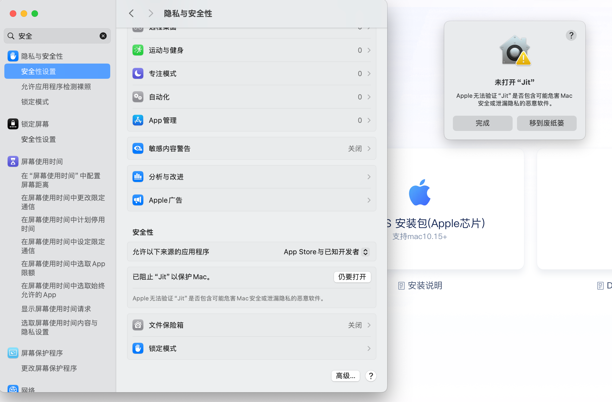

# 下载安装

:::tip
由于`test`是一个特殊目录，JitAi安装目录的路径中不能包含`test`，否则会导致应用无法正常运行。

安装完成后，建议您详细了解 JitAi 的目录组织架构，以便更好地进行后续开发和管理工作，请参阅 [JitNode目录详解](./02JitNode目录详解) 。
:::

JitAi安装包分为桌面版（支持Windows、Mac）和服务器版（支持Docker）。

## 桌面版

用于开发者在个人电脑上开发、运行、调试、测试、发布应用，不支持多节点集群。

根据操作系统类型，桌面版分为 Windows 安装包 和  Mac 安装包。

### Windows

适用于 Windows 10（64 位）、Windows 11 （64 位）的操作系统。

安装步骤：

1. [点击此处下载](https://apk.jit.pro/latest/windows/jit.exe)安装包。
2. 双击exe文件安装。
3. 按页面流程激活

### Mac

Mac 安装包，适用于 MacOS 12.6.0 (Monterey) 及以上版本。

根据您的Mac芯片类型，选择对应的安装包：

**Intel 芯片 Mac：**
1. [点击此处下载](https://apk.jit.pro/latest/darwin/x64/jit.dmg)安装包。
2. 双击dmg文件安装。
3. 按页面流程激活。

**Apple 芯片 Mac (M1/M2/M3等)：**
1. [点击此处下载](https://apk.jit.pro/latest/darwin/arm/jit.dmg)安装包。
2. 双击dmg文件安装。
3. 按页面流程激活。


## 服务器版

用于部署在服务器上运行应用系统（多进程、支持集群、高性能），可用作应用系统的测试环境和生产环境。也支持在线开发，但不支持代码调试。目前服务器版安装包只支持通过 Docker 安装。

### 安装步骤

1. 按 [Docker 官方文档](https://docs.docker.com/manuals/)安装 Docker。

2. 通过以下命令运行 JitNode 容器：

   ```bash title="快速启动 JitNode 容器"
   docker run -itd --name jit \
     -p 80:80 \
     -p 3306:3306 \
     --init --privileged \
     -v 本机映射目录(如：/Users/desktop/JitNode):/data/JitNode \
     registry.cn-hangzhou.aliyuncs.com/jitpro/jit
   ```

3. 在浏览器中访问 `http://{服务器IP地址}:80`，按页面流程激活。


### 容器参数说明

| 是否必填 | 参数 | 说明 |
|---------|------|------|
| **必填** | `--name {ContainerName}` | 指定容器名称 |
| **必填** | `-p {WebPort}:80` | 指定 Web 服务对外暴露的端口号 |
| **必填** | `-p {MySQLPort}:3306` | 指定 JitNode 内置 MySQL 对外暴露的端口号，新建应用时默认使用该数据库存储数据 |
| **选填** | `-p {RedisPort}:6379` | 指定 JitNode 内置 Redis 对外暴露的端口号 |
| **选填** | `-e NODE_ADDRESS={URL}` | 用于部署集群环境时配置当前节点地址，集群节点之间转发请求时通过该地址转发到当前节点。可不配置，进入 admin 后在界面中配置 |
| **选填** | `-v {LocalDir}:/data/JitNode` | 容器中 `/data/JitNode` 目录存储：节点许可证信息、MySQL 数据、Redis 数据、node.json、运行环境配置等数据。用于备份/迁移运行环境数据 |

### 完整参数使用示例

```bash title="完整参数启动"
docker run -itd --name jitnode \
  -p 80:80 \
  -p 3306:3306 \
  -p 6379:6379 \
  -e NODE_ADDRESS=http://your-server-ip:80 \
  --init --privileged \
  -v /your/local/path:/data/JitNode \
  registry.cn-hangzhou.aliyuncs.com/jitpro/jit
```

:::note 路径说明
请将 `/your/local/path` 替换为宿主机实际路径，例如：`/Users/username/JitNode` 或 `/opt/jitnode`
:::

## 常见问题

import Tabs from '@theme/Tabs';
import TabItem from '@theme/TabItem';

<Tabs>
  <TabItem value="common" label="通用" default>

<details>
<summary>怎样修改运行的端口号？</summary>

修改 `./home/node.json` 中的 PORT 值。默认是 8080。

</details>

<details>
<summary>手动关闭命令行窗口/电脑重启后怎样再次启动 jit？</summary>

双击文件夹中的启动文件即可：
- **Windows**: `runJitNode.bat`
- **Mac**: `runJitNode.command`

</details>

<details>
<summary>想要迁移文件夹位置？</summary>

关掉命令行窗口后，直接迁移文件夹，然后双击文件夹中的启动文件即可：
- **Windows**: `runJitNode.bat`  
- **Mac**: `runJitNode.command`

</details>

<details>
<summary>新建应用的源码存储在哪里？</summary>

`home/environs` 文件夹下

</details>

<details>
<summary>本地每个文件/夹有什么用途？</summary>

详情见 [文档链接](https://alidocs.dingtalk.com/i/nodes/Obva6QBXJw962MokiZq7lakEWn4qY5Pr?utm_scene=team_space)

</details>

<details>
<summary>安装包有新版本怎么办？</summary>

支持自动升级，每次双击启动文件时，会检测是否有新版本更新，有的话就自动下载更新，不需要人为干预：
- **Windows**: `runJitNode.bat`
- **Mac**: `runJitNode.command`

</details>

  </TabItem>
  <TabItem value="windows" label="Windows">

:::note 内容完善中
Windows 版安装包相关常见问题正在持续整理中，我们欢迎开发者积极反馈遇到的问题，共同完善文档内容。

您可以通过 [GitHub Issues](https://github.com/jitai-team/jitai-docs/issues) 或[官方社区](/docs/community/intro)群组分享您的经验和解决方案。
:::

  </TabItem>
  <TabItem value="mac" label="Mac">

<details>
<summary>Apple安全验证问题：Apple无法验证"Jit"是否包含可能危害Mac安全或泄露隐私的恶意软件】</summary>



1. 点击"完成"按钮。

2. 进入系统设置->隐私与安全性->安全性，将"允许以下来源的应用程序"设置为"App Store与已知开发者"。

3. 点击`仍要打开`。

</details>

  </TabItem>
  <TabItem value="server" label="服务器版">

:::note 内容完善中
服务器版安装包相关常见问题正在持续整理中，我们欢迎开发者积极反馈遇到的问题，共同完善文档内容。

您可以通过 [GitHub Issues](https://github.com/jitai-team/jitai-docs/issues) 或[官方社区](/docs/community/intro)群组分享您的经验和解决方案。
:::

  </TabItem>
</Tabs>
