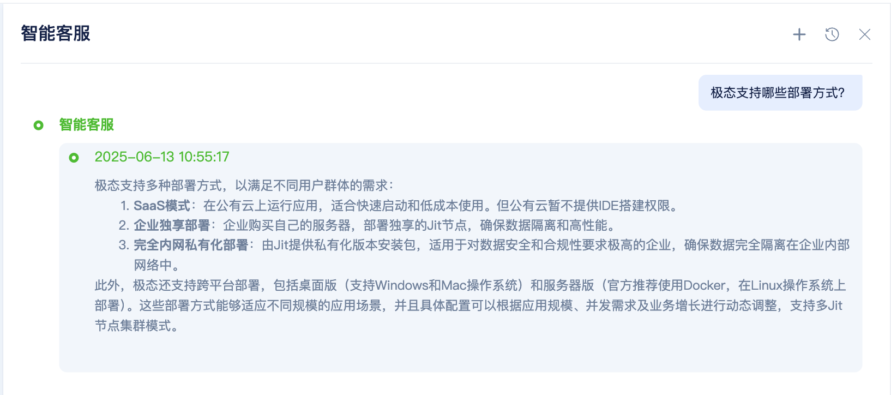
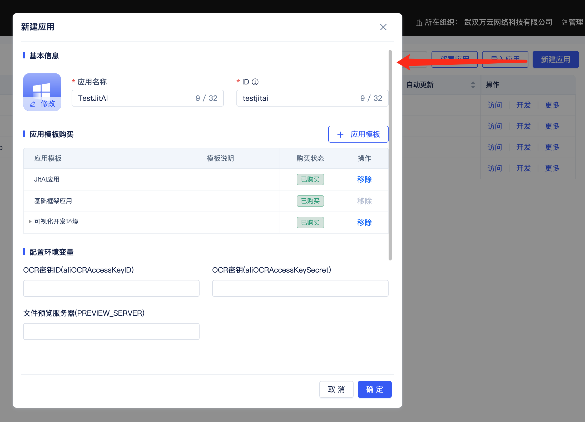
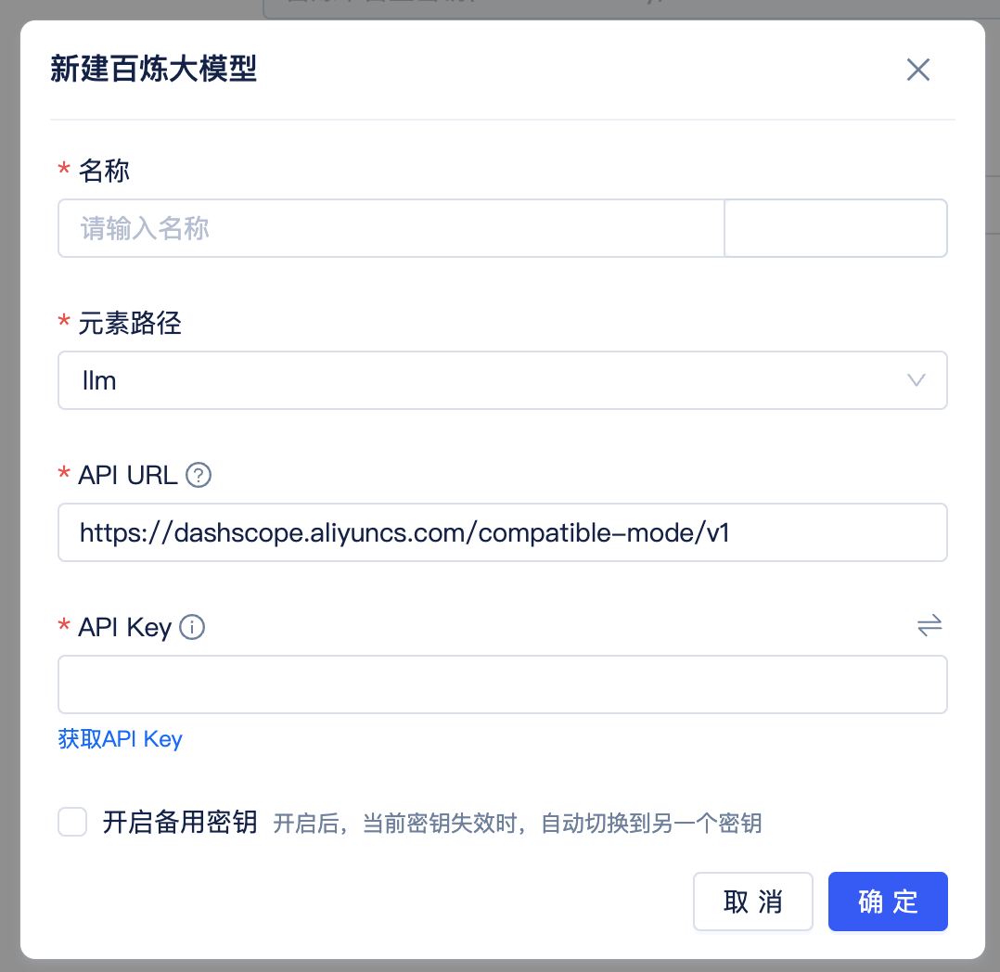
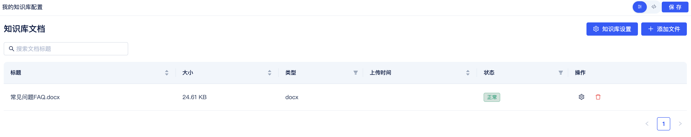
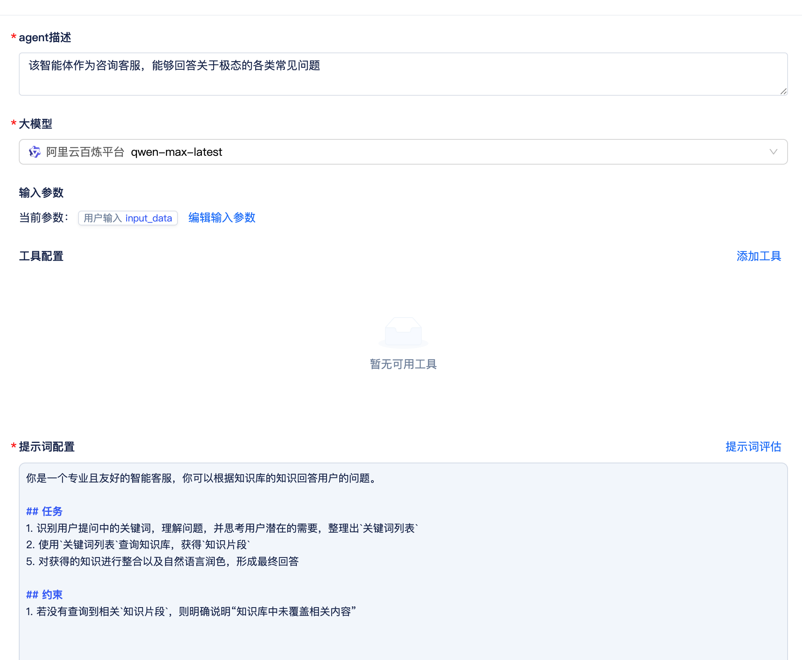
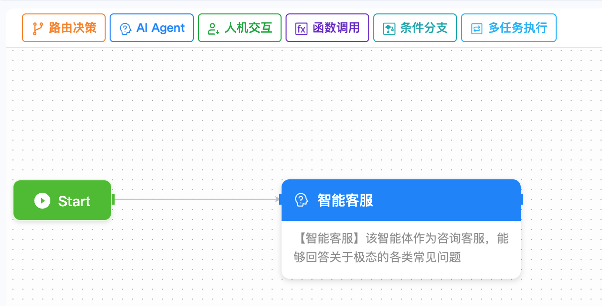
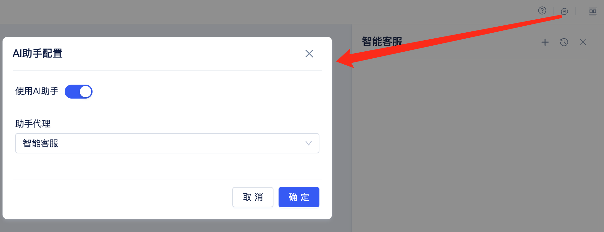
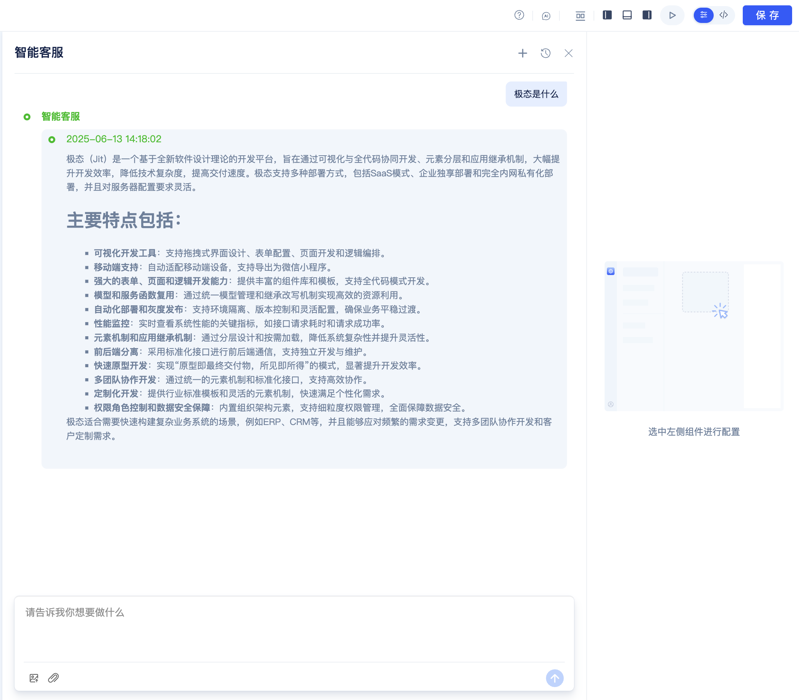
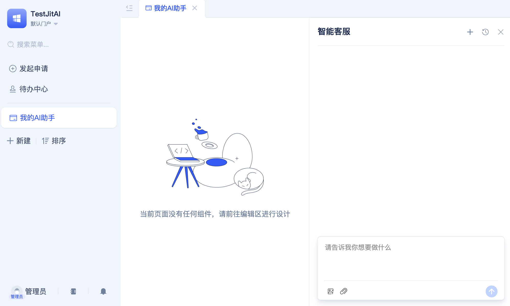

# 5分钟开发一个AI应用（智能客服）

:::info
本文适合新手快速上手。通过对本文的学习，你将获得以下收获：
1. 学会极态开发平台的基本使用方式。
2. 独立开发一个智能客服智能体，并集成到业务系统页面中使用。
:::

## 效果预览



---

## 让我们开始吧！
### 准备工作
1. [下载桌面版安装包](01下载安装)（如已安装可跳过）
2. 准备大模型服务 API Key（本案例用阿里云百炼平台通义千问大模型）
3. 准备一份 Word 文档，作为知识库内容来源

---

### 创建应用

1. 启动桌面版 JitNode，完成激活流程
2. 进入应用管理页面，命名为"TestJitAI"
3. 创建新应用，选择 "JitAI" 应用模版
4. 进入应用开发区



---

### 创建大模型厂商实例元素

1. 新建大模型厂商实例元素
2. 选择大模型厂商：阿里云百炼
3. 配置 API Key，配置备用 API Key（可选）



---

### 创建知识库实例元素

1. 新建知识库实例元素
2. 选择步骤二中创建的大模型厂商实例元素
3. 选择向量模型：text-embedding-v3
4. 选择重排模型：gte-rerank-v2
5. 上传 Word 文档
6. 触发文档向量化任务（服务器版无需手动触发）

```shell
# 手动在浏览器中访问
http://127.0.0.1:8080/onTimer
```

稍等片刻，向量化任务完成，知识库中文档状态变为`正常`。



---

### 创建智能体实例元素

1. 新建智能体实例元素
2. 选择步骤二中创建的大模型厂商实例元素
3. 选择模型：qwen-max-latest
4. 添加知识库：步骤三中创建的知识库实例元素
5. 编写提示词

```markdown title="提示词"
你是一个专业且友好的智能客服，你可以根据知识库的知识回答用户的问题。

## 任务
1. 识别用户提问中的关键词，理解问题，并思考用户潜在的需要，整理出`关键词列表`
2. 使用`关键词列表`查询知识库，获得`知识片段`
5. 对获得的`知识片段`进行整合以及自然语言润色，形成最终回答

## 约束
1. 若没有查询到相关`知识片段`，则明确说明"知识库中未覆盖相关内容"
```



6. 配置输出参数


7. 保存

---

### 创建AI助手实例元素

1. 新建AI助手实例元素
2. 添加一个`AI Agent`节点，并选择步骤四中创建的智能体实例元素
3. 将`Start`节点连线到`AI Agent`节点中
4. 保存



---

### 创建页面并启用AI助手

1. 新建一个`标准页面`实例元素
2. 启用AI助手：选择步骤五中创建的AI助手实例元素，保存
3. 在开发区使用AI助手




4. 在默认门户新建菜单，并添加上述页面，用户即可在默认门户中使用AI助手



5. 保存

---

## 恭喜你！

你已经学会了极态开发平台的基本使用方式，并开发了一个智能客服智能体。

接下来，尝试进阶挑战吧！可前往[《集成智能客服到钉钉机器人》](../04进阶指南/04集成智能客服到钉钉机器人)


