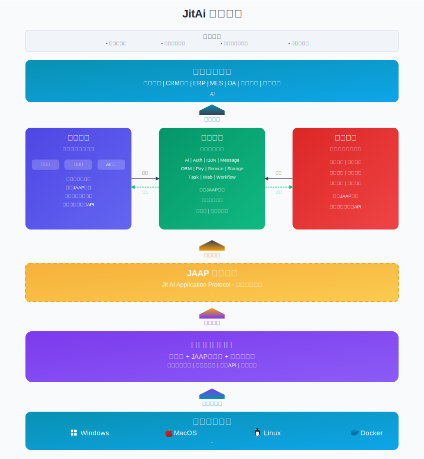

# 极态是什么？

## 概述

**JitAi = Jit + AI**，Just In Time 即时、快速构建，for AI application。

**极态**，极客态度（Geek Attitude），是为AI而生的下一代应用开发技术体系，旨在加快企业级AI应用落地，开启AI应用规模化时代。

JitAi通过解释型系统、矩阵型元架构、图形化编排开发、自动化运维的有机结合，建立了一套完整的AI应用开发方法论和技术体系，为企业数字化转型和AI赋能提供了标准化、工业化的技术底座，为行业降本增效。

## 技术架构总览

JitAi构建了一个开放的三层技术架构，**以[JAAP(Jit AI Application Protocol)](/docs/tutorial/01概述/01JAAP)为统一架构语言，实现从基础设施到业务应用的全栈整合**。

## 四大核心技术组件

- **[JitAi开发工具](/docs/category/开发工具)** - 符合[JAAP](/docs/tutorial/01概述/01JAAP)规范的三模（可视化、全代码、AI生成）统一的企业级AI应用开发工具，由应用运行平台解释运行，提供编排式编程体验
- **[JitAi开发框架](/docs/category/开发框架)** - 高度可复用、可扩展架构的模块化开发框架。提供Ai、Auth、I18N、Message、ORM、Pay、Service、Storage、Task、Web、Workflow等全栈业务开发组件，这些组件均遵循JAAP规范，在开发工具中开箱即用
- **[JitAi运维平台](/docs/category/运维平台)** - 符合[JAAP](/docs/tutorial/01概述/01JAAP)规范的一站式自动化运维管理平台，由应用运行平台解释运行，支持应用的创建、发布、部署、运维
- **[JitAi应用运行平台](/docs/category/应用运行平台)** - 微内核的[JAAP](/docs/tutorial/01概述/01JAAP)应用解释与运行平台，提供系统级API，开发者可搭配系统API和开发框架开发应用

## 核心特性概述

### 解释型系统

极态开创性地提出了**解释型AI应用架构协议[JAAP](/docs/tutorial/01概述/01JAAP)**，并提供**解释型应用运行平台**。

JAAP让应用系统成为可被AI动态感知、动态调用、动态编排的解释型系统，将传统应用生态带入AI驱动和AI编排时代。

JAAP由**应用规范**和**元素规范**组成，应用规范解释**系统的构成与接口**，元素规范解释**模块的构成与接口**。

### 矩阵型元架构

元素族类、元素分层、应用继承机制共同构成**矩阵型元架构**，提供无与伦比的复用和扩展能力，是**通用统一的架构语言**。

基于矩阵型元架构的JitAi**编排式编程框架**，具备高集成度和高开放度，让业务层高度可编排，**显著降低开发复杂度和工程量**。

### 可视化编排开发

支持可视化编排和编程的开发工具和开发方式，**大幅提升开发效率**，让开发者从容应对AI应用的复杂多变。

### 自动化运维

自动化的DevOps工具，让AI应用的创建、发布、部署和运维简单化、轻量化，大幅降低运维成本和复杂度。
