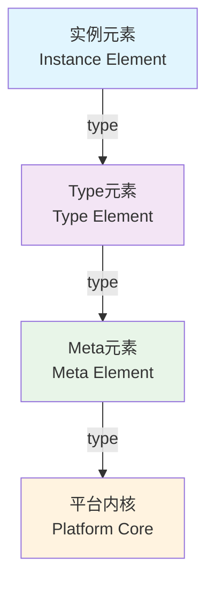
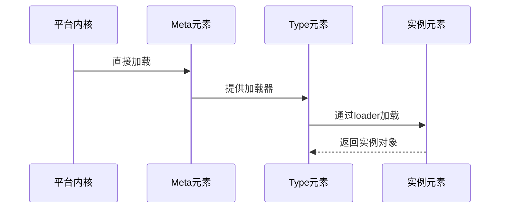
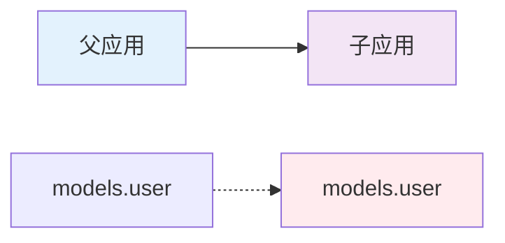

# JAAP(Jit AI Application Protocol)
:::tip 提示
当你已经了解JAAP，可以通过一个进阶案例加深理解：[集成智能客服到钉钉机器人](../04进阶指南/04集成智能客服到钉钉机器人)，通过该案例你可以学会自定义元素族类。
:::
**JAAP** 由应用规范和元素规范组成，应用规范解释应用系统构成，元素规范解释应用系统模块。

## 应用规范

应用是一组相关元素的集合，用于实现特定的业务功能，每个应用对应一个独立的应用文件夹。

### 路径规则

运行环境目录/组织ID/应用ID/应用版本，例如`home/environs/JRE_MWcVmUZjEq/wanyun/MyApp/1_0_0`

### App目录

```plaintext title="典型应用目录结构"
MyApp/                     # 应用根目录
├── app.json               # 应用配置文件
├── requirements.txt       # Python依赖配置
│
├── appData/            # 应用数据目录
├── dist/               # 构建输出目录
│
├── models/             # 数据模型元素
├── services/           # 服务元素
├── databases/          # 数据库元素
├── caches/            # 缓存元素
├── storages/          # 存储元素
├── roles/             # 角色权限元素
├── interceptors/      # 拦截器元素
├── commons/           # 一个非元素特殊目录，放公共代码。
│
├── components/        # UI组件元素
├── pages/            # 页面元素
├── shells/           # 门户元素
├── themes/           # 主题元素
│
├── workflows/         # 工作流元素
├── events/           # 事件元素
├── tasks/            # 任务元素
├── messages/         # 消息元素
│
├── auths/            # 认证元素
├── apiAuths/         # API认证元素
├── corps/            # 企业组织元素
│
├── externalAPIs/     # 外部API元素
│
└── test/             # 测试用例目录
```

#### app.json

`app.json`是应用的配置文件，定义了应用的基本信息、继承关系等，例如：

```json title="app.json示例"
{
  // 应用的唯一标识符，格式通常为 "组织ID.应用名称"
  "appId": "orgId.appName",

  // 应用的简短名称，用于内部引用
  "name": "appName",

  // 应用的显示标题，用于UI展示
  "title": "Application Title",

  // 应用版本号
  "version": "1.0.0",

  // 组织ID，标识应用所属的组织
  "orgId": "orgId",

  // 应用图标，可以是base64编码的图片或图标标识符
  "icon": "icon_identifier",

  // 应用主题色
  "theme": "#3d65fd",

  // 是否加密，1表示加密，0表示不加密
  "encrypted": 0,

  // 继承关系配置，定义当前应用继承的其他应用
  "extends": [
    {
      "appId": "wanyun.BaseApp",
      "version": "1.0.0"
    }
  ],

  // 文件配置
  "files": {
    "common": {}
  },

  // 应用依赖项
  "requirements": [],

  // 应用设置
  "settings": {
    // 默认元素配置
    "defaultElement": {
      // 默认缓存配置
      "defaultCache": "caches.Default",
      // 默认数据库配置
      "defaultDatabase": "databases.Default",
      // 默认Shell配置
      "defaultShell": "shells.Main",
      // 默认存储配置
      "defaultStorage": "storages.Default"
    }
  }
}
```
#### dist

该目录中是App被编译打包后的产物，元素目录结构和App源码目录一致。

不同的是每个元素目录下是加密后的元素文件，命名一般为`element.pkg`。

在dist目录下会生成一个名为`app.jit`的文件。app.jit是一个JSON格式的文件，用于描述应用的基本信息和结构，原始内容来自app.json，另一部分内容在编译打包过程中自动生成。

### 应用继承

极态应用支持继承关系，子应用在app.json中通过extends指定继承的父应用及其版本，从而复用或重写父应用的元素。元素的详细规范参考：[元素规范](#元素规范)

### 应用开发流程

开发一个新的应用通常包括以下步骤：

1.  **创建应用**：使用运维管理后台创建应用，指定应用ID、名称、描述等基本信息。
    
2.  **设计数据模型**：根据业务需要设计应用的数据模型，包括实体、关系、字段等。
    
3.  **实现业务逻辑**：实现应用的业务逻辑，包括服务、工作流等。
    
4.  **设计用户界面**：设计应用的用户界面，包括页面、组件、交互等。
    

从第2步开始，都是在按照元素规范创建各类元素。

## 元素规范

### 概述

元素是 JitAI 平台的核心组件，通过三级架构设计实现了高度的可扩展性和复用性。本文档详细介绍元素的分层架构、目录结构、配置规范和开发流程。

### 元素分层架构

#### 三级元素架构

JitAI 平台采用三级元素架构，从底层到顶层分别是：Meta元素、Type元素、实例元素。



#### 元素层级详解

##### 🏗️ Meta元素

:::info Meta元素特征
- **属性特征**：`type` 字段值为空
- **技术职责**：实现 Type 元素的加载器
- **特殊权限**：直接由平台内核加载器实例化
:::

**实现约束**：
- 后端 Meta 元素：必须使用 **Python** 语言开发
- 前端 Meta 元素：必须使用 **TypeScript/JavaScript** 语言开发

##### 🔧 Type元素

:::info Type元素特征
- **属性特征**：`type` 字段指向 Meta 元素或其他 Type 元素的 fullname
- **技术职责**：完整封装目标技术领域的基础设施，通过标准化接口暴露可配置参数
- **核心责任**：提供 loader，用于实例元素的加载
:::

**典型形态**：

| 形态类型 | 描述 | 使用场景 |
|---------|------|----------|
| 🔨 **父类形态** | 提供基础实现供实例继承 | 需要继承扩展的场景 |
| 📋 **模板形态** | 实现技术细节，开放业务参数 | 配置驱动的场景 |

##### 🏢 实例元素

:::info 实例元素特征
- **属性特征**：`type` 字段必须指向 Type 元素的 fullname
- **业务职责**：仅包含业务相关配置和轻量逻辑
- **生成方式**：支持通过可视化工具生成
:::

#### 加载机制与元素形态

##### 🔄 加载流程



##### 📝 元素形态对比

| 模式类型 | Type元素角色 | 实例元素角色 | 加载过程 |
|----------|-------------|-------------|----------|
| **继承模式** | 父类/基类 | 子类实现 | 子类实例化 |
| **模板模式** | 技术逻辑容器 | 配置参数载体 | 模板实例化 |

### 元素目录结构

每个元素的代码目录都遵循统一的结构规范，包含以下核心组件：

```plaintext title="典型元素目录结构示例"
element-directory/
├── e.json              # 元素定义文件
├── loader.py           # 加载器（实例元素除外）
├── lifecycle.py        # 生命周期管理
├── config.json         # 配置文件（可选）
├── model.py           # 逻辑实现（Model元素）
├── service.py         # 逻辑实现（Service元素）
└── index.js           # 前端入口（前端元素）
```

#### 📄 定义文件 (e.json)

元素的核心配置文件，定义了元素的基本信息和配置参数：
:::warning 注意
元素运行时使用的配置应使用`实例元素配置`文件，而不是 `e.json` 文件。
:::

```json title="e.json 示例"
{
  "title": "用户模型",
  "type": "models.NormalType",
  "backendBundleEntry": ".",
  "frontBundleEntry": "index.js",
  "icon": "user",
  "description": "用户数据模型，提供用户信息的增删改查功能",
  "tag": "模型,数据库"
}
```

#### 🚀 加载器 (loader.py)

:::caution 注意
实例元素不需要 loader.py 文件，由其 Type 元素的 loader 负责加载
:::

```python title="loader.py 示例"
class Loader(object):
    """元素加载器"""
    
    def load(self):
        """
        加载元素实例
        
        Returns:
            加载后的元素对象
        """
        # self.nodes 是继承链上的元素对象列表
        # node[0] 是当前元素
        node = self.nodes[0]
        
        # 在这里执行元素初始化逻辑
        # 例如：读取配置、初始化资源等
        
        return node
```

#### 🔄 生命周期 (lifecycle.py)

生命周期管理文件负责处理元素在不同阶段的行为：

```python title="lifecycle.py 完整示例"
from typing import Optional, Any

# ============ 实例元素生命周期 ============

def onLoad():
    """
    元素加载完成后执行
    在 Loader 的 load 函数执行后触发
    """
    print("元素已加载")

def onCalled():
    """
    元素被调用时执行
    每次通过 app.getElement 获取元素时触发
    """
    print("元素被调用")

def onAppExit(exc_val: Optional[Exception] = None, 
              resData: Optional[Any] = None, 
              **kwargs):
    """
    请求会话结束时执行
    
    Args:
        exc_val: 异常信息（如果有）
        resData: 响应数据
        **kwargs: 其他参数
    """
    if exc_val:
        print(f"请求异常结束: {exc_val}")
    else:
        print("请求正常结束")

# ============ Type元素生命周期 ============

def onCreate(fullName: str):
    """
    实例元素创建时调用（在Type元素中实现）
    
    Args:
        fullName: 实例元素的完整名称
    
    Returns:
        创建结果
    """
    print(f"创建实例元素: {fullName}")
    return {"status": "success", "message": "创建成功"}

def onUpdate(fullName: str):
    """
    实例元素更新时调用（在Type元素中实现）
    
    Args:
        fullName: 实例元素的完整名称
    
    Returns:
        更新结果
    """
    print(f"更新实例元素: {fullName}")
    return {"status": "success", "message": "更新成功"}

def onDelete(fullName: str):
    """
    实例元素删除时调用（在Type元素中实现）
    
    Args:
        fullName: 实例元素的完整名称
    
    Returns:
        删除结果
    """
    print(f"删除实例元素: {fullName}")
    return {"status": "success", "message": "删除成功"}

def onException(fullName: str, title: str, exc: Exception) -> Any:
    """
    发生异常时调用
    用于处理异常、记录日志等
    
    Args:
        fullName: 元素的完整名称
        title: 异常标题
        exc: 异常对象
    
    Returns:
        异常处理结果
    """
    print(f"元素异常 [{fullName}]: {title} - {exc}")
    return {"status": "error", "message": str(exc)}
```

:::warning 重要提醒
请注意区分实例元素和 Type 元素各自的生命周期函数：
- **实例元素**：`onLoad`、`onCalled`、`onAppExit`
- **Type元素**：`onCreate`、`onUpdate`、`onDelete`、`onException`
:::

#### 💼 逻辑实现文件

根据元素类型不同，逻辑实现文件的命名和内容也不同：

| 元素类型 | 实现文件 | 主要功能 |
|----------|----------|----------|
| **Model元素** | `model.py` | 数据模型定义 |
| **Service元素** | `service.py` | 业务逻辑和服务函数 |
| **Page元素** | `index.js/ts` | 用户界面和交互逻辑 |

### 元素调用与配置

#### 🔗 元素调用

在 JitAI 平台中，通过 `app.getElement(fullName)` 获取元素对象：

```python title="元素调用示例"
# 调用 Model 元素
user_model = app.getElement("models.user")
user = user_model.get(user_id)

# 调用 Service 元素
auth_service = app.getElement("services.auth")
token = auth_service.login(username, password)

# 调用 AI 相关元素
ai_agent = app.getElement("ai.agents.customer_service")
response = ai_agent.chat(user_message)
```

#### ⚙️ 实例元素配置

Type 元素开放可配置的参数，实例元素提供配置文件：

```json title="config.json 配置示例"
{
  "dbAlias": "Default",
  "dbConfig": {
    "database": "appData/databases/Default/sqlite.db",
    "pool_size": 10,
    "max_overflow": 20
  },
  "dbType": "sqlite",
  "cacheConfig": {
    "enabled": true,
    "ttl": 3600
  }
}
```

#### 🔄 元素继承重写

基于应用的继承机制，子应用可以通过实现相同 fullname 的元素来重写父应用中的对应元素。



### 开发流程
官方元素族类均支持在可视化开发工具中直接创建实例，用户也可以手动按规范创建元素。

#### 📋 开发步骤

按照以下步骤进行元素开发：

1. **📁 创建元素目录**
   ```bash
   mkdir -p models/user
   cd models/user
   ```

2. **📝 编写 e.json 定义文件**
   ```json
   {
     "title": "用户模型",
     "type": "models.NormalType",
     "backendBundleEntry": "."
   }
   ```

3. **⚙️ 编写配置文件**（如 `config.json` 或 `settings.json`）

4. **🔨 实现 loader.py**（实例元素无需此步骤）

5. **💻 编写元素实现逻辑**（根据需要）

6. **🔄 实现 lifecycle.py**（根据需要）


#### ✅ 开发检查清单

- [ ] 元素目录结构正确
- [ ] e.json 配置完整
- [ ] loader.py 实现正确（如需要）
- [ ] 生命周期函数正确分类
- [ ] 配置文件格式正确
- [ ] 代码符合规范

### e.json 配置详解

#### 📊 通用配置

所有元素共享以下配置项：

##### 基础配置

| 配置项 | 说明 | 类型 | 必填 | 示例 |
|-------|------|------|------|------|
| `title` | 元素标题 | `string` | ✅ | `"用户模型"` |
| `type` | 元素的 type 指向 | `string` | Meta元素可为空 | `"models.NormalType"` |
| `icon` | 元素图标 | `string` | ❌ | `"user"` |
| `tag` | 元素标签（多个用 `,` 分隔） | `string` | ❌ | `"模型,数据库"` |
| `frontBundleEntry` | 前端打包入口文件 | `string` | 有前端时必填 | `"index.js"` |
| `frontMobileBundleEntry` | 移动端打包入口文件 | `string` | 移动端时必填 | `"mobile.js"` |
| `backendBundleEntry` | 后端打包入口文件 | `string` | 有后端时必填 | `"."` |
| `description` | 元素描述信息 | `string` | ❌ | `"用户数据模型"` |

##### 高级配置

| 配置项 | 说明 | 类型 | 必填 | 默认值 |
|-------|------|------|------|-------|
| `functionList` | 可供外部调用的函数列表 | `array` | ❌ | `[]` |
| `variables` | 环境变量声明信息 | `object` | ❌ | `{}` |
| `cacheLevel` | 后端缓存级别 | `number` | ❌ | `0` |
| `accessModifier` | 访问修饰符 | `string` | ❌ | `"public"` |

:::info 缓存级别说明
- `0`: 进程级别缓存
- `1`: 线程级别缓存
:::

##### 加载时机配置

**前端元素加载时机 (`loadTime`)**：

| 值 | 说明 | 适用场景 |
|---|------|----------|
| `startUp` | app 启动前加载 | 前端底层 Meta/Type 元素 |
| `afterStartUp` | app 启动后立即加载 | 需要预加载的元素 |
| 未填写 | 按需加载 | 大部分元素 |

**后端元素加载时机 (`backendLoadTime`)**：

| 值 | 说明 | 适用场景 |
|---|------|----------|
| `afterAppInit` | app 初始化后立即加载 | 数据库、模型 Type 元素 |
| `beforeHandleRequest` | 请求前加载 | 请求处理相关元素 |
| 未填写 | 按需加载 | 大部分元素 |

#### 🛠️ functionList 配置

函数列表配置用于定义元素对外暴露的方法：

```json title="functionList 配置示例"
{
  "functionList": [
    {
      "name": "getUserById",
      "title": "根据ID获取用户",
      "async": true,
      "returnType": "object",
      "args": [
        {
          "name": "userId",
          "title": "用户ID",
          "dataType": "string"
        }
      ],
      "resultConfig": {
        "name": "user",
        "title": "用户信息",
        "dataType": "object"
      }
    }
  ]
}
```

##### 函数配置字段

| 字段名 | 说明 | 类型 | 必填 |
|-------|------|------|------|
| `name` | 方法名 | `string` | ✅ |
| `title` | 标题（GUI显示） | `string` | ✅ |
| `args` | 方法参数描述 | `array` | ❌ |
| `async` | 是否异步方法 | `boolean` | ✅ |
| `returnType` | 返回值类型 | `string` | ✅ |
| `resultConfig` | 返回值详细描述 | `object` | ❌ |

##### 参数配置字段

| 字段名 | 说明 | 类型 | 必填 |
|-------|------|------|------|
| `name` | 参数名 | `string` | ✅ |
| `title` | 参数标题 | `string` | ✅ |
| `dataType` | 参数类型 | `string` | ✅ |

##### 返回值配置字段

| 字段名 | 说明 | 类型 | 必填 |
|-------|------|------|------|
| `name` | 返回值名称 | `string` | ✅ |
| `title` | 返回值标题 | `string` | ✅ |
| `dataType` | 返回值类型 | `string` | ✅ |

#### 🔒 访问修饰符

| 修饰符 | 权限范围 | 使用场景 |
|-------|----------|----------|
| `private` | 不允许被继承的 app 使用 | 底层服务元素 |
| `protect` | 允许被继承使用，但不允许重写 | 核心业务逻辑 |
| `public` | 允许被继承使用和重写 | 一般业务元素（默认） |

#### 🎨 元素自定义配置

除通用配置外，每种元素可在 e.json 中添加自定义配置，需遵循以下原则：

:::tip 配置原则
1. **仅包含未运行时必需的配置项**
   - ✅ 正确：`hideInRole`（在门户未运行时使用）
   - ❌ 错误：`hideApply`（仅在门户运行时需要）

2. **避免存储敏感信息**
   - ❌ 避免：第三方平台密钥
   - ✅ 推荐：使用环境变量或配置文件
::: 