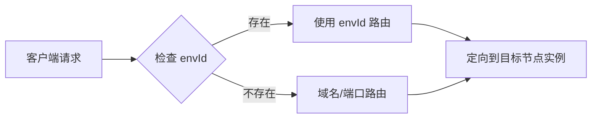
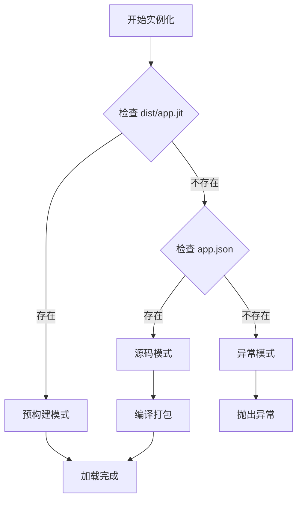
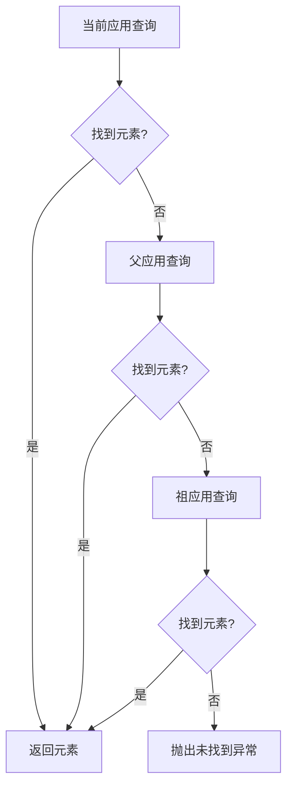
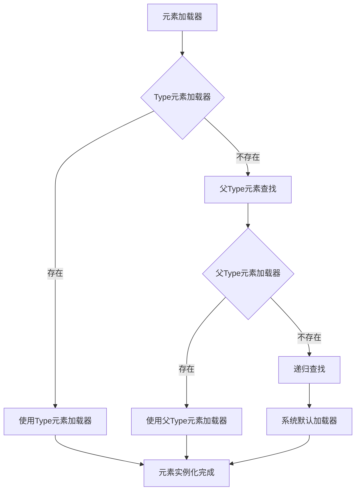

# 运行时机制

通过微内核架构和解释型执行模式，实现了应用的动态加载、热更新和智能路由等关键能力。本章深入解析应用运行平台的内部工作机制，包括请求处理、应用实例化、元素查找、性能优化等核心流程。

## 核心流程概览

- **请求处理流程**：运行环境路由、应用路由、元素路由
- **应用实例化流程**：应用资源自动热部署、应用目录校验、构建状态判断、应用实例化
- **元素查找流程**：运行时容器查询、应用配置查询、继承链追溯
- **加载器获取流程**：加载器选择策略、加载器层次结构
- **性能优化机制**：懒加载策略、多层缓存机制

## 请求处理流程

### 1. 运行环境路由

JIT 内核接收来自客户端的 HTTP 请求后，按照以下优先级进行环境路由：

#### 路由参数优先级

| 优先级 | 参数类型 | 说明 |
|--------|----------|------|
| 1 | `envId` 请求头 | 显式指定运行环境ID |
| 2 | 域名/端口组合 | 基于请求路径识别运行环境 |

### 2. 应用路由

应用路由基于 `OrgId.AppId` 组合标识进行精确匹配。

#### 路由决策流程

1. **解析应用标识**：从请求中提取 `OrgId.AppId` 组合
2. **容器检索**：在进程级应用容器中查找应用实例
3. **实例化处理**：
   - ✅ **实例存在**：直接转发请求
   - 🔄 **实例缺失**：触发[应用实例化流程](#应用实例化流程)

### 3. 元素路由

应用实例接收请求后，执行细粒度的元素路由：

#### 路由步骤

1. **路径解析**：提取元素 `fullname` 和目标方法名
2. **元素定位**：通过[元素查找流程](#元素查找流程)获取元素实例
3. **方法调用**：执行元素的目标方法

### 4. 响应封装

内核将所有执行结果标准化为统一的响应格式，包含以下组成部分：

- **状态码**：标识请求成功或错误类型
- **业务数据体**：实际的响应数据内容
- **错误信息**：详细的错误描述信息
- **调试信息**：包含 RequestId、请求耗时等元数据

## 应用实例化流程

### 1. 应用目录校验

系统首先验证应用资源的完整性，检查运行环境目录结构：

- 验证 `OrgId/AppId/Version` 应用文件夹是否存在
- 检查核心配置文件和构建产物的完整性

:::warning 资源缺失处理
当本地缺少应用资源时，系统将自动从 JCS（Jit Center Service）下载最新版本的应用资源包。此过程可能影响首次访问性能。
:::

### 2. 构建状态判断

系统根据资源状态选择最优的加载策略：

| 构建状态 | 资源要求 | 处理策略 |
|----------|----------|----------|
| **预构建模式** | `dist/app.jit` + 元素构建产物 | ⚡ 直接加载，性能最优 |
| **源码模式** | `app.json` + 完整源码 | 🔧 即时编译，灵活性高 |
| **异常模式** | 资源不完整 | ❌ 抛出异常，需人工介入 |

## 元素查找流程

### 1. 运行时容器查询

系统首先在当前应用的运行时元素容器中进行高速查询，利用内存缓存机制提升查找效率。

### 2. 应用配置查询

若运行时缓存未命中，系统将查询 `app.jit` 配置文件中的元素列表：

1. **配置匹配**：在元素列表中匹配 `fullname`
2. **元素实例化**：创建元素对象实例
3. **缓存更新**：将新实例加入运行时容器缓存

### 3. 继承链追溯

支持跨应用的元素继承和复用：

:::note 继承机制
继承链追溯支持应用间的元素共享和复用，提高了系统模块化程度和复用效率。
:::

## 加载器获取流程

:::info 元素自描述、自加载
元素自描述、自加载是JitNode微内核的重要体现，是应用系统模块被AI动态感知、动态调用、动态编排的基础。
:::

### 加载器选择策略

系统按照以下优先级选择加载器：

1. **Type元素加载器**：优先使用元素 `type` 指向的 Type 元素定义的加载器
2. **父Type元素加载器**：继续递归向上查找父 Type 元素的加载器
3. **系统默认加载器**：当无自定义加载器时，使用默认的内核加载器

### 加载器层次结构

## 性能优化机制

### 1. 懒加载策略

极态采用多层次的懒加载机制：

- **应用级懒加载**：应用仅在首次访问时实例化
- **元素级懒加载**：元素按需加载，减少内存占用
- **资源级懒加载**：静态资源按需下载

### 2. 多层缓存机制

| 缓存层级 | 缓存内容 | 生命周期 |
|----------|----------|----------|
| **进程级缓存** | 应用实例、元素实例 | 进程生命周期 |
| **请求线程级缓存** | 临时计算结果 | 单次请求 |
| **持久化缓存** | 编译产物、资源文件 | 版本更新前 |
