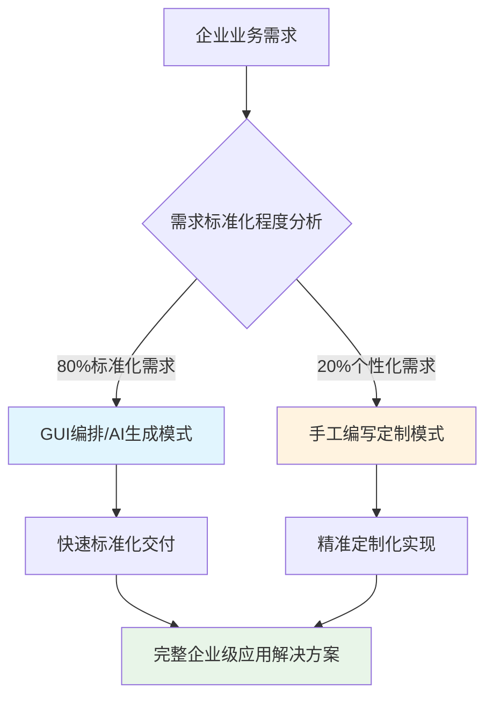
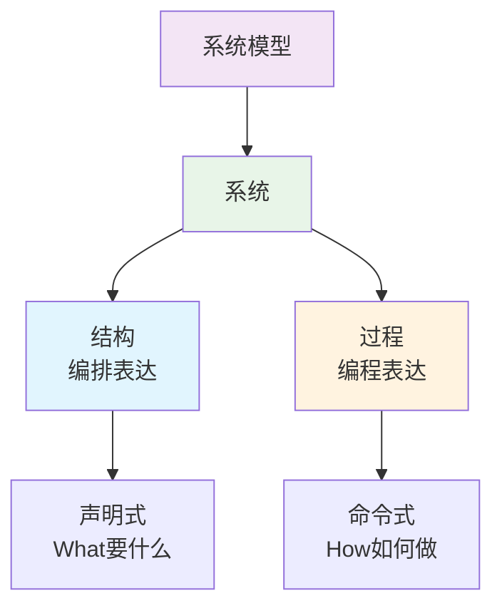
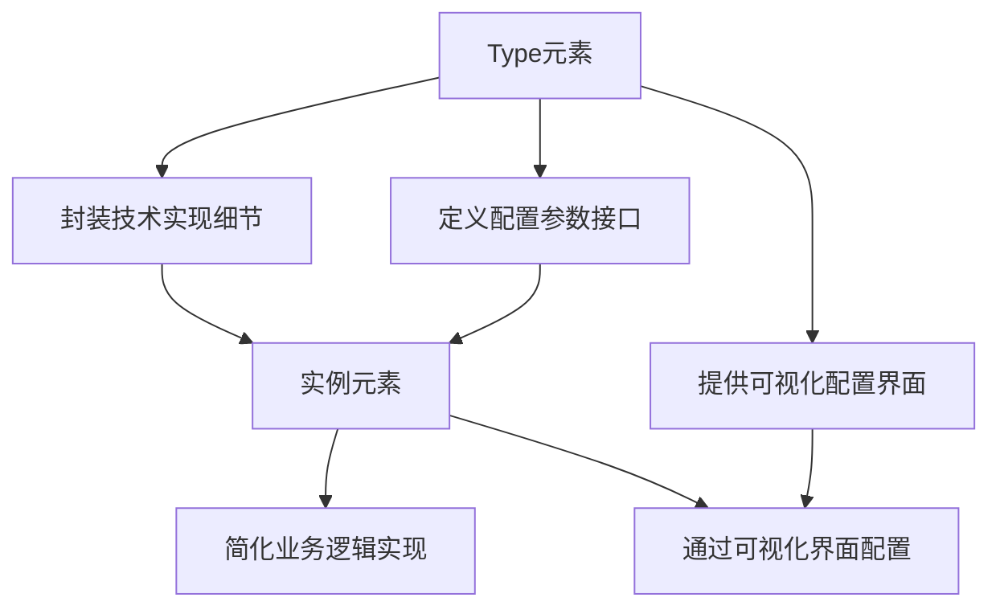

# 三模同源的企业级AI应用开发工具

JitAi提供强大的可视化开发工具IDEApp，帮助开发者高效构建企业级应用。

## 概述

**IDEApp** 是JitAi打造的可视化开发环境，本身也是基于[JAAP（Jit AI Application Protocol）](/docs/tutorial/01概述/01JAAP)开发的独立应用。IDEApp为开发者提供完整的可视化开发生态，显著降低企业级应用开发的技术门槛和复杂度。

:::tip 核心设计理念
IDEApp采用**GUI编排/AI生成/手工编写三模同源**的架构设计，同时支持**编程模式**和**编排模式**两种开发范式，开发者可根据具体业务场景和技术要求选择最适合的开发方式。
:::
## 破解企业定制开发难题

### 不可规避的现实问题

企业级系统建设中存在不可规避的技术现实：

:::warning 80/20定律的技术体现
**任何标准化产品都无法100%满足企业的个性化需求**

- 🔧 **80%标准化需求**：通过标准组件、模板和配置化方式高效实现
- ⚡ **20%个性化需求**：必须通过深度定制开发满足特定业务场景
:::

企业级应用面临的核心挑战：

| 挑战维度 | 具体表现 | 解决方案 |
|----------|----------|----------|
| **业务复杂性** | 行业特有的业务流程和决策规则 | GUI编排 + 手工编写定制 |
| **系统集成** | 与现有IT基础设施的深度集成 | JAAP架构的标准化接口 |
| **性能要求** | 特定场景下的高性能计算需求 | 手工编写模式精确优化 |
| **合规约束** | 行业监管和安全合规的特殊要求 | 定制化安全机制和审计功能 |

### JAAP架构的优势

基于JAAP架构的JitAi应用在企业级定制化开发中展现**压倒性技术优势**：

- **架构层面**：松耦合的元素化软件模块设计，定制代码与标准代码完全隔离
- **开发层面**：增量式开发模式，热插拔机制，版本兼容保障
- **运维层面**：代码可追溯，影响范围可控，支持团队并行协作

## 编程与编排的理论

为了更好地理解IDEApp的设计理念，我们来了解编程和编排两种范式的本质区别：

### 系统的双重构成

任何复杂系统都由**结构**和**过程**两个基本要素构成：

- **结构（Structure）**：系统的组成模块及其相互关系，通过**编排**来表达
- **过程（Process）**：系统运行时的行为序列和逻辑流程，通过**编程**来表达

**系统模型**作为更高层次的抽象，统一描述系统的结构和过程。

### 编排与编程相互依赖

编排和编程相互依赖、相互促进：
- **编排依赖编程**：编程产生函数，将"函数嵌入对象中"就是编排
- **编程依赖编排**：编排产生对象，"在函数中使用对象"就是编程

:::tip 系统模型
JitAi将系统模型抽象为元素族类，请参考[系统模型](/docs/tutorial/01概述/02系统模型)了解更多。
:::

## 三模同源架构解析

IDEApp的核心优势在于深度契合JAAP以及**三模同源**的架构创新，为企业级应用开发提供前所未有的灵活性和效率。

**"三模同源"不是简单的三种开发模式并列，而是一个深层次的架构统一理念**。其核心在于"殊途同归" - 无论走哪条路，最终都能到达同一个目标，并且路径之间可以随时切换。

### 🎨 GUI编排模式
通过可视化界面进行应用开发，提供直观高效的开发体验：

- **可视化设计**：基于拖拽式图形界面构建应用，自动分析应用源代码目录结构和依赖关系
- **高质量代码生成**：通过图形化编排自动生成结构描述代码和过程描述代码，确保代码质量
- **开发即生产**：开发环境中的配置和效果与生产环境完全一致，确保开发阶段的预览效果即为最终上线效果
- **统一管理界面**：在统一界面中展示和管理所有元素，通过可视化界面进行元素配置和开发操作

### 🤖 AI生成模式  
基于人工智能的智能化开发模式，显著提升开发效率：

- **自然语言驱动**：通过自然语言描述业务需求，AI深度理解需求语义内容
- **智能代码生成**：AI自动生成高质量代码，分析业务逻辑的复杂关系并转换为技术实现
- **人机协同开发**：AI负责繁重的代码编写工作，开发者专注于业务逻辑设计和代码审核优化

### 💻 手工编写模式
为专业开发者提供完整的编程控制能力：

- **完全编程控制**：提供完整的代码编写和控制能力，满足复杂业务逻辑和高度定制化需求
- **混合开发模式**：与GUI编排、AI生成模式无缝切换和实时同步，在同一项目中灵活组合使用
- **企业级定制**：深度系统集成、性能精细化调优、安全合规保障等企业级特性实现
- **零厂商锁定**：不受厂商限制的自由扩展和重写

### 三种模式统一于四个维度

#### 1. 技术架构统一
- 三种模式都基于**JAAP架构**
- 产生相同的**元素结构**和**代码输出**
- 遵循统一的**系统模型**抽象

#### 2. 开发体验统一
- **即时响应机制**：自动即时保存、增量编译机制、按需加载、实时预览反馈
- **统一操作范式**：所有应用元素均遵循统一的CRUD操作模式（查看、添加、编辑、删除）
- **无缝模式切换**：三种开发模式可在同一项目中灵活切换和混合使用
- **场景化适配**：针对不同开发场景和复杂度需求选择最优开发模式

#### 3. 结果等价统一
- 三种方式可以产生**功能完全相同**的应用
- **开发即生产**：开发环境效果等同生产环境
- **质量标准一致**：无论用哪种方式都能保证可控的代码质量

#### 4. 理论基础统一
- 都基于**系统=结构+过程**的理论模型
- **编排表达结构，编程表达过程**
- 通过**系统模型**统一描述两者

:::info 革命性突破
🎯 **消除工具割裂**：不同开发方式之间无缝协作，避免"技术孤岛"  
⚡ **效率最大化**：根据场景选择最优方式，发挥各模式优势  
🛡️ **降低风险**：统一架构保证质量，多种方式提供灵活性  
✨ **门槛平衡**：既能让新手快速上手，又能满足专家深度定制
:::

## 可视化配置器

在JAAP中，**Type元素**承担关键的技术抽象和封装职责，**实例元素**则通过可视化界面进行配置，形成了完整的开发生态。

:::note 配置器技术特性
JitAi为开发框架中的每个Type元素都开发了对应的可视化配置界面。应用开发者只需让业务应用继承IDEApp，即可直接使用这些预置的配置界面，实现开箱即用的开发体验。开发者也可根据需求进行配置器定制化、功能扩展增强，或为自定义Type元素开发专门的可视化配置界面。
:::

## 开始使用IDEApp

创建应用时选择继承IDEApp，进入应用开发区即可直接使用。
