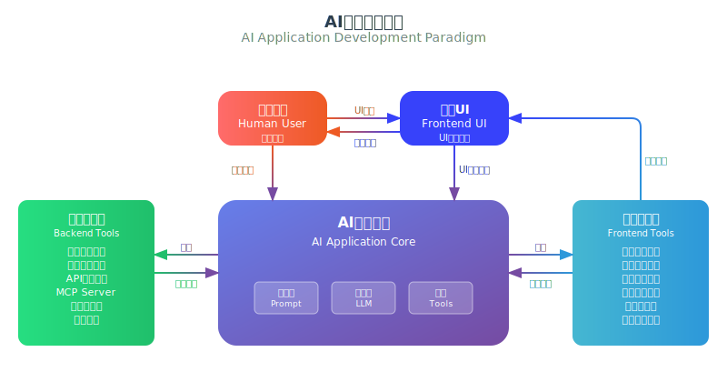
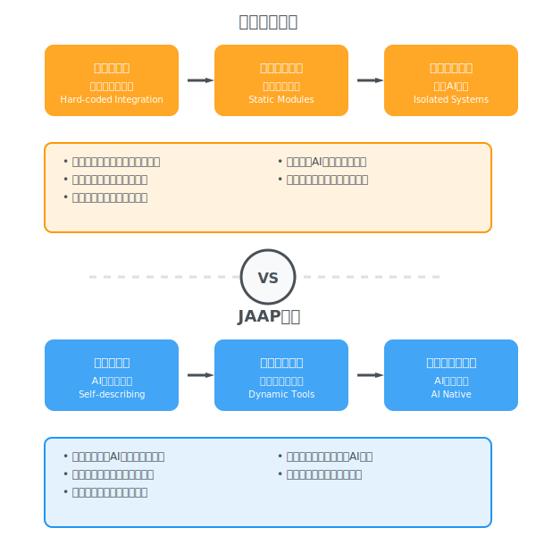
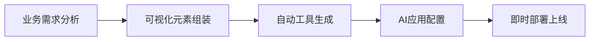

# AI原生的企业级应用开发范式

在企业数字化转型的关键节点，传统软件架构面临着前所未有的AI适配挑战。随着国产大模型的快速崛起，企业乃至整个社会都面临着AI焦虑：AI如何真正落地？AI如何有效赋能现有业务流程和业务系统？

要回答这些问题，我们必须首先理解AI应用开发的本质规律。JitAi深度洞察AI应用开发范式，创新性地提出[JAAP（Jit AI Application Protocol）](/docs/tutorial/01概述/01JAAP)架构，真正实现了AI能力与企业核心业务系统的深度原生融合。

## AI应用的通用开发范式

AI应用的开发范式由其使用方式决定，无论采用LangGraph、CrewAI还是其它任何开发框架，都无法逃离AI应用开发的本质范式。这种范式的核心在于：**AI应用一定是AI+人协作完成目标的过程，追求人机协作的最大化价值**。

### 开发范式全景图

下图展示了AI应用开发范式的完整结构和交互过程：

**结构特征**：
- **中央AI核心**：由提示词(Prompt)、大模型(LLM)、工具(Tools)三大组件构成，是整个AI应用的智能决策中心
- **四层交互架构**：人类用户、前端UI、后端工具集、前端工具集四个交互层，形成完整的全栈交互生态
- **全栈工具调用**：AI核心可以统一调用前后端工具集，实现前所未有的全栈智能化操作

**过程特征**：
- **双模驱动机制**：支持语言指令驱动和界面操作驱动两种交互模式，满足不同用户群体的使用习惯
- **全栈智能编排**：AI根据任务需求智能选择和编排前后端工具，实现业务流程的完全自动化
- **实时状态同步**：前后端工具执行结果实时反馈给AI核心，确保决策基于最新状态
- **智能界面更新**：前端工具集可直接更新前端UI，实现AI驱动的界面动态变化
- **闭环反馈机制**：从用户操作到AI决策，再到工具执行和界面反馈，形成完整的智能化闭环

### 技术要求 

基于上述开发范式，企业级AI应用开发必须满足下列技术要求：

| 技术要求 | 传统应用 | AI应用 | 关键差异 |
|---------|----------|--------|----------|
| **工具编排** | 硬编码集成 | 动态发现与智能编排 | 支持运行时组合与状态管理 |
| **权限控制** | 用户级授权 | 工具级精细控制 | 支持AI动态调用模式 |
| **界面交互** | 静态页面逻辑 | AI驱动的动态交互 | AI直接操作UI与多模态支持 |
| **数据处理** | 预定义业务逻辑 | 智能化数据推理 | 支持自然语言查询与上下文理解 |
| **系统集成** | 点对点集成 | 标准化工具协议 | 简化集成开发复杂度 |

## 核心价值主张

前述AI应用开发范式在企业级应用场景中得到最完整的体现。企业级AI应用需要深度融入现有业务体系，对技术实现提出了更高的标准。

### 消费级 VS 企业级

消费级AI应用追求通用性和易用性，而企业级AI应用则需要深度的业务集成和精细化管控。JitAi深刻洞察企业级AI应用的本质需求，从架构设计、功能定制、权限管控、部署模式到数据安全等多个维度，构建了与消费级AI应用截然不同的应用开发技术体系。

### 企业级AI应用的技术挑战

要在企业级场景中实现AI应用开发范式，传统应用架构显露出根本性的能力不足：

| 挑战领域 | 传统架构局限 | 业务影响 |
|---------|-------------|----------|
| **工具集成** | 缺乏标准化的AI工具接口 | AI应用无法有效调用业务模块 |
| **动态编排** | 静态功能模块，难以运行时组合 | 无法适应AI应用的动态决策需求 |
| **权限管控** | 粗粒度授权 | 难以实现工具级精细权限控制 |
| **开发效率** | 传统编译部署流程 | 无法支持AI应用的高频调试迭代 |
| **系统集成** | 孤立的应用架构 | AI应用难以与企业业务系统深度融合 |

#### 关于深度集成的技术要求

为了实现"全栈工具调用"能力，AI应用要与传统软件系统模块深度集成，这种集成体现在"工具"层面：

**1. 自描述能力**

软件模块必须能够向AI应用清晰描述自己的功能、参数和用法：

- **功能描述**：模块能够清晰表达自己的核心功能和业务价值
- **参数规范**：自动生成输入输出参数的详细说明和约束条件
- **调用示例**：提供标准化的调用接口和实际使用案例
- **上下文理解**：AI应用能够自动理解和正确调用业务模块

**技术实现**：基于JAAP协议的元素天然具备这种自描述能力，无需额外的文档编写工作。

**2. 热插拔可替换**

AI应用对工具的使用是高度动态的，需要支持运行时的灵活调整：

- **动态需求**：AI应用能力迭代过程中对工具的需求不断变化
- **实时加载**：支持运行时动态加载新的工具模块
- **无缝替换**：支持在不停机的情况下替换和升级工具
- **组合编排**：支持多个工具模块的动态组合和编排

**应用价值**：确保AI应用能够快速适应业务变化，满足企业级应用的高可用性要求。

**3. 全栈工具调用**

突破传统后端服务调用的局限，实现前后端统一的工具调用能力：

- **后端模块调用**：数据服务、业务逻辑、API接口等传统后端功能
- **前端元素调用**：UI组件、页面元素、用户交互等前端功能
- **全栈统一接口**：AI对前后端全栈元素的统一调用能力
- **标准协议支持**：支持MCP（Model Context Protocol）等标准化工具协议

## JAAP-AI原生应用架构

面对上述企业级AI应用的技术挑战，JitAi创新性地提出了JAAP解决方案。**[JAAP（Jit AI Application Protocol）](/docs/tutorial/01概述/01JAAP)** 从协议层面重新设计了应用架构，原生支持AI应用开发范式。

### 元素自描述能力

JAAP下的元素具有极强的自描述能力，能够向AI应用清晰表达：

- **功能和用途**：元素能够清晰描述自己的核心功能
- **参数规范**：自动生成输入输出参数的详细说明
- **调用方式**：提供标准化的调用接口和使用示例
- **安全边界**：明确权限要求和操作约束条件

这种自描述能力让AI应用能够自主理解和使用业务模块，无需人工编写复杂的工具说明文档。

### 动态按需加载

元素支持运行时动态加载和组合，AI应用可以：

- **智能选择工具**：根据任务需求动态选择最合适的工具
- **实时组装流程**：即时组装业务流程和功能链路
- **快速适应变化**：快速适应业务变化和需求迭代
- **热插拔更新**：支持零停机的工具更新和替换

这种动态特性确保AI应用能够灵活应对不断变化的业务需求，实现真正的自适应智能系统。

### 原生AI集成

可以非常容易地将元素封装为AI应用的可用工具，实现无缝集成：

- **后端模块集成**：数据模型操作、服务函数调用等
- **前端组件集成**：UI组件和交互元素的直接操作
- **流程节点集成**：业务流程和工作流节点的智能调度
- **外部服务集成**：第三方服务和API接口的统一接入

通过JAAP，任何业务元素都能成为AI应用的"工具箱"，实现真正的原生AI集成。

### 架构优势对比

| 技术特性 | 传统架构 | JAAP架构 | AI应用价值 |
|---------|----------|----------|------------|
| **模块描述** | 文档说明 | 自描述协议 | AI应用直接理解功能 |
| **功能调用** | 硬编码集成 | 标准化接口 | 支持动态工具编排 |
| **权限控制** | 应用级授权 | 工具级精细控制 | 基于角色的安全AI |
| **系统集成** | 紧耦合架构 | 松耦合可组合 | 灵活的AI应用构建 |
| **部署方式** | 单体应用 | 元素化部署 | 支持AI应用规模化 |

:::success 技术优势
与面向C端的消费级AI应用不同，基于JAAP协议的企业级AI应用能够与传统软件（ERP/CRM/OA）原生一体，深度集成到企业业务流程的各个专业环节。
:::

### 规模化开发能力

基于JAAP，JitAi构建了完整的AI应用规模化开发体系：

#### 快速开发流程

**核心能力**：
- **标准化元素库**：提供丰富的预制业务组件，支持开箱即用
- **可视化开发环境**：通过拖拽式界面降低AI应用开发门槛
- **即改即生效**：支持实时热更新，满足AI应用高频调试和迭代需求
- **自动工具生成**：业务元素自动转换为AI应用可调用的工具接口
- **标准化部署**：统一的应用打包和部署流程，支持批量上线

## AI产品组件

JitAi构建了四个核心AI产品组件，与JitAi技术体系协同，形成完整的企业级AI应用生态。

### AI大模型

企业级大模型服务网关，对接各个大模型服务厂商，提供统一的模型调用接口。

**核心能力**：
- 屏蔽不同大模型厂商的API差异
- 提供统一的调用标准和错误处理机制
- 支持业务层按需选择模型与参数
- 负载均衡与故障转移

> 📖 详细了解：[AI大模型](./AI大模型/intro)

### AI知识库

基于RAG技术的企业知识管理系统，支持多种数据源的智能检索和知识增强。

**核心能力**：
- **RAG技术支持**：检索增强生成，提升AI回答的准确性和专业性
- **多格式兼容**：支持文档、数据库、API等多种知识源
- **实时更新**：知识库内容动态同步，保证信息时效性
- **语义检索**：基于向量数据库的智能语义匹配和检索

**应用场景**：
- 企业内部文档和制度的智能问答
- 产品手册和技术文档的自动检索
- 客户服务知识库的智能匹配
- 行业知识和最佳实践的智能推荐

> 📖 详细了解：[AI知识库](./AI知识库/intro)

### AIAgent

AI应用的核心执行引擎，负责工具编排、状态管理和任务执行。

**核心能力**：
- **工具编排**：动态组合和调用各种业务工具和服务
- **状态管理**：维护对话上下文和任务执行状态
- **任务执行**：复杂业务逻辑的分解和执行
- **权限控制**：基于用户角色的工具访问权限管理

> 📖 详细了解：[AIAgent](./AI%20Agent/intro)

### AI助理

AI应用与用户交互的统一界面，这是AI应用和用户之间的交互界面。

**核心能力**：
- **可视化编排**：通过可视化界面实现路由决策、AI Agent编排、人机交互设计
- **多Agent协同**：助理中可以编排多个Agent，实现Multi Agent协作
- **智能路由**：根据用户意图自动选择合适的Agent处理任务
- **函数调用与条件分支**：支持复杂的业务逻辑控制和多任务执行
- **一键集成**：以不同形态的入口集成到业务系统的各个角落

> 📖 详细了解：[AI助理](./AI助理/intro)

:::info 产品协同生态
四个组件构成有机整体，从底层模型服务到上层用户交互，建立了完整的AI应用开发和运行生态。通过JAAP协议的支撑，实现了从AI大模型到业务应用的端到端集成，真正实现业务流程的智能化。
:::

## 前瞻技术创新与突破

JitAi在多个关键技术领域实现了突破性创新，将理论范式转化为具体的技术能力和产品价值。

### 标准化工具协议

基于前述的AI应用开发范式，JitAi实现了业界领先的标准化工具协议解决方案。

**核心突破**：
- **工具生态丰富**：支持前后端元素、组件、MCP协议等多种工具类型
- **自描述协议**：通过JAAP协议实现工具的自描述和动态编排
- **热插拔架构**：运行时动态加载、替换和组合工具模块
- **权限精细化**：工具级权限控制，确保企业级安全合规

### 全栈AI驱动交互

突破性的AI-GUI技术创新，实现AI应用对前后端的统一调用。

**后端工具调用**：
- 数据模型操作和业务逻辑执行
- 服务函数调用和API集成
- 工作流节点和业务流程控制
- 数据库查询和事务处理

**前端UI操作**：
- 页面元素和组件的直接操作
- 用户界面的智能交互控制
- 前端事件的触发和响应
- 动态表单生成和数据绑定

**技术领先性**：
- 实现了AI应用对前后端全栈元素的统一调用能力
- 为企业级AI应用提供了端到端的自动化解决方案
- 开创了AI直接操作用户界面的新范式

### 企业系统原生集成

与消费级AI应用的表层对接不同，JitAi实现了与企业系统的原生一体化集成。

**集成深度**：
- **深度业务集成**：与ERP、CRM、OA等核心业务系统无缝对接
- **专业环节覆盖**：深入企业业务流程的各个专业环节
- **数据层集成**：直接访问企业数据库和数据仓库
- **流程层集成**：嵌入现有的业务流程和审批环节

**技术保障**：
- **标准协议支持**：除了自有工具外，还支持MCP等标准化工具协议
- **安全可控部署**：本地化部署，确保企业数据安全和业务合规
- **权限继承机制**：自动继承企业现有的权限体系和安全策略

 