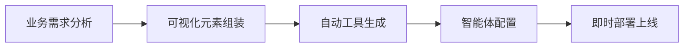

# 企业级AI应用开发

在企业数字化转型的关键节点，传统软件架构面临着前所未有的AI适配挑战。随着国产大模型的快速崛起，企业乃至整个社会都面临着AI焦虑：AI如何真正落地？AI如何有效赋能现有业务流程和业务系统？

JitAi是为AI而生的下一代应用开发技术体系，真正实现了AI能力与企业核心业务系统的深度原生融合。JitAi开创性地提出[JAAP（Jit AI Application Protocol）](/docs/tutorial/01概述/01JAAP)架构，重新定义企业软件的开发范式，加快AI应用进程，开启AI应用规模化时代。

## 核心价值主张

### 消费级 VS 企业级

消费级AI应用追求通用性和易用性，而企业级AI应用则需要深度的业务集成和精细化管控。JitAi深刻洞察企业级AI应用的本质需求，从架构设计、功能定制、权限管控、部署模式到数据安全等多个维度，构建了与消费级AI应用截然不同的应用开发技术体系。

### 企业级AI应用的技术挑战

传统应用开发架构在AI应用场景中存在显著局限性：

| 挑战领域 | 传统架构局限 | 业务影响 |
|---------|-------------|----------|
| **工具集成** | 缺乏标准化的AI工具接口 | 智能体无法有效调用业务模块 |
| **动态编排** | 静态功能模块，难以运行时组合 | 无法适应智能体的动态决策需求 |
| **权限管控** | 应用级粗粒度授权 | 难以实现工具级精细权限控制 |
| **开发效率** | 传统编译部署流程 | 无法支持智能体的高频调试迭代 |
| **系统集成** | 孤立的应用架构 | AI应用难以与企业业务系统深度融合 |

#### 关于深度集成的技术要求

智能体要与传统软件系统模块深度集成，这种集成体现在"工具"层面：

**1. 自描述能力**

软件模块必须能够向智能体清晰描述自己的功能、参数和用法：

- **功能描述**：模块能够清晰表达自己的核心功能和业务价值
- **参数规范**：自动生成输入输出参数的详细说明和约束条件
- **调用示例**：提供标准化的调用接口和实际使用案例
- **上下文理解**：智能体能够自动理解和正确调用业务模块

**技术实现**：基于JAAP协议的元素天然具备这种自描述能力，无需额外的文档编写工作。

**2. 热插拔可替换**

智能体对工具的使用是高度动态的，需要支持运行时的灵活调整：

- **动态需求**：智能体能力迭代过程中对工具的需求不断变化
- **实时加载**：支持运行时动态加载新的工具模块
- **无缝替换**：支持在不停机的情况下替换和升级工具
- **组合编排**：支持多个工具模块的动态组合和编排

**应用价值**：确保智能体能够快速适应业务变化，满足企业级应用的高可用性要求。

**3. 全栈工具调用**

突破传统后端服务调用的局限，实现前后端统一的工具调用能力：

- **后端模块调用**：数据服务、业务逻辑、API接口等传统后端功能
- **前端元素调用**：UI组件、页面元素、用户交互等前端功能
- **全栈统一接口**：AI对前后端全栈元素的统一调用能力
- **标准协议支持**：支持MCP（Model Context Protocol）等标准化工具协议

:::tip 前瞻技术实践
JitAi实现了智能体对UI界面的直接操作能力，这是企业级AI应用的重要技术突破。
:::

### 智能体工程化

JitAi将智能体定义为三个核心要素的有机结合：

**要素解析**：
- **提示词**：智能体的认知逻辑和决策机制，定义智能体的"思考方式"
- **大模型**：提供推理能力和知识基础，是智能体的"大脑"
- **工具**：软件模块作为智能体的"手和脚"，执行具体业务操作
- **工程化**：作为"躯干"，连接和协调各个组件，实现整体智能体系统

:::info 认知洞察
当前大语言模型虽然在语言理解和生成方面表现卓越，但在复杂业务逻辑推理、精确数值计算和专业领域操作等方面仍存在固有局限性。企业级AI应用的核心挑战在于如何将大模型的通用智能与专业化的业务执行能力有机结合。在这一技术范式下，**提示词工程决定了智能体的认知边界，工具编排定义了智能体的执行边界**，两者构成了企业级智能体的核心技术壁垒。
:::

## JAAP-AI原生应用架构

**[JAAP（Jit AI Application Protocol）](/docs/tutorial/01概述/01JAAP)** 是专为AI应用设计的下一代应用开发协议，从根本上解决了传统架构的AI适配问题。

### 元素自描述能力

JAAP协议下的元素具有极强的自描述能力，能够向智能体清晰表达：

- **功能和用途**：元素能够清晰描述自己的核心功能
- **参数规范**：自动生成输入输出参数的详细说明
- **调用方式**：提供标准化的调用接口和使用示例
- **安全边界**：明确权限要求和操作约束条件

这种自描述能力让智能体能够自主理解和使用业务模块，无需人工编写复杂的工具说明文档。

### 动态按需加载

元素支持运行时动态加载和组合，智能体可以：

- **智能选择工具**：根据任务需求动态选择最合适的工具
- **实时组装流程**：即时组装业务流程和功能链路
- **快速适应变化**：快速适应业务变化和需求迭代
- **热插拔更新**：支持零停机的工具更新和替换

这种动态特性确保智能体能够灵活应对不断变化的业务需求，实现真正的自适应智能系统。

### 原生AI集成

可以非常容易地将元素封装为智能体的可用工具，实现无缝集成：

- **后端模块集成**：数据模型操作、服务函数调用等
- **前端组件集成**：UI组件和交互元素的直接操作
- **流程节点集成**：业务流程和工作流节点的智能调度
- **外部服务集成**：第三方服务和API接口的统一接入

通过JAAP，任何业务元素都能成为智能体的"工具箱"，实现真正的原生AI集成。

### 架构优势对比

| 技术特性 | 传统架构 | JAAP架构 | AI应用价值 |
|---------|----------|----------|------------|
| **模块描述** | 文档说明 | 自描述协议 | 智能体直接理解功能 |
| **功能调用** | 硬编码集成 | 标准化接口 | 支持动态工具编排 |
| **权限控制** | 应用级授权 | 工具级精细控制 | 基于角色的安全AI |
| **系统集成** | 紧耦合架构 | 松耦合可组合 | 灵活的AI应用构建 |
| **部署方式** | 单体应用 | 元素化部署 | 支持AI应用规模化 |

:::success 技术优势
与面向C端的消费级智能体不同，基于JAAP协议的企业级AI应用能够与传统软件（ERP/CRM/OA）原生一体，深度集成到企业业务流程的各个专业环节。
:::

### 规模化开发能力

基于JAAP，JitAi构建了完整的AI应用规模化开发体系：

#### 快速开发流程

**核心能力**：
- **标准化元素库**：提供丰富的预制业务组件，支持开箱即用
- **可视化开发环境**：通过拖拽式界面降低AI应用开发门槛
- **即改即生效**：支持实时热更新，满足智能体高频调试和迭代需求
- **自动工具生成**：业务元素自动转换为智能体可调用的工具接口
- **标准化部署**：统一的应用打包和部署流程，支持批量上线

## AI产品组件

JitAi构建了四个核心AI产品组件，形成完整的企业级AI应用生态：

### AI大模型

企业级大模型服务网关，对接各个大模型服务厂商，提供统一的模型调用接口。

**核心能力**：
- 屏蔽不同大模型厂商的API差异
- 提供统一的调用标准和错误处理机制
- 支持业务层按需选择模型与参数
- 负载均衡与故障转移

> 📖 详细了解：[AI大模型](./AI大模型/intro)

### AI知识库

基于RAG技术的企业知识管理系统，支持多种数据源的智能检索和知识增强。

**核心能力**：
- **RAG技术支持**：检索增强生成，提升AI回答的准确性和专业性
- **多格式兼容**：支持文档、数据库、API等多种知识源
- **实时更新**：知识库内容动态同步，保证信息时效性
- **语义检索**：基于向量数据库的智能语义匹配和检索

**应用场景**：
- 企业内部文档和制度的智能问答
- 产品手册和技术文档的自动检索
- 客户服务知识库的智能匹配
- 行业知识和最佳实践的智能推荐

> 📖 详细了解：[AI知识库](./AI知识库/intro)

### AIAgent

智能体的核心执行引擎，负责工具编排、状态管理和任务执行。

**核心能力**：
- **工具编排**：动态组合和调用各种业务工具和服务
- **状态管理**：维护对话上下文和任务执行状态
- **任务执行**：复杂业务逻辑的分解和执行
- **权限控制**：基于用户角色的工具访问权限管理

> 📖 详细了解：[AIAgent](./AI%20Agent/intro)

### AI助理

智能体与用户交互的统一界面，这是智能体和用户之间的交互界面。

**核心能力**：
- **可视化编排**：通过可视化界面实现路由决策、AI Agent编排、人机交互设计
- **多智能体协同**：助理中可以编排多个Agent，实现Multi Agent协作
- **智能路由**：根据用户意图自动选择合适的智能体处理任务
- **函数调用与条件分支**：支持复杂的业务逻辑控制和多任务执行
- **一键集成**：可以不同形态的入口集成到业务系统的各个角落

> 📖 详细了解：[AI助理](./AI助理/intro)

:::info 产品协同生态
四个组件构成有机整体，从底层模型服务到上层用户交互，建立了完整的AI应用开发和运行生态。通过JAAP协议的支撑，实现了从AI大模型到业务应用的端到端集成，真正实现业务流程的智能化。
:::

## 前瞻技术创新与突破

### 智能体工程化

基于`智能体 = 工程化（提示词 + 大模型 + 工具）`理念，JitAi实现了业界领先的智能体工程化解决方案。

**核心突破**：
- **工具生态丰富**：支持前后端元素、组件、MCP协议等多种工具类型
- **自描述协议**：通过JAAP协议实现工具的自描述和动态编排
- **热插拔架构**：运行时动态加载、替换和组合工具模块
- **权限精细化**：工具级权限控制，确保企业级安全合规

### 全栈AI驱动交互

突破性的AI-GUI技术创新，实现智能体对前后端的统一调用。

**后端工具调用**：
- 数据模型操作和业务逻辑执行
- 服务函数调用和API集成
- 工作流节点和业务流程控制
- 数据库查询和事务处理

**前端UI操作**：
- 页面元素和组件的直接操作
- 用户界面的智能交互控制
- 前端事件的触发和响应
- 动态表单生成和数据绑定

**技术领先性**：
- 实现了智能体对前后端全栈元素的统一调用能力
- 为企业级AI应用提供了端到端的自动化解决方案
- 开创了AI直接操作用户界面的新范式

### 企业系统原生集成

与消费级AI应用的表层对接不同，JitAi实现了与企业系统的原生一体化集成。

**集成深度**：
- **深度业务集成**：与ERP、CRM、OA等核心业务系统无缝对接
- **专业环节覆盖**：深入企业业务流程的各个专业环节
- **数据层集成**：直接访问企业数据库和数据仓库
- **流程层集成**：嵌入现有的业务流程和审批环节

**技术保障**：
- **标准协议支持**：除了自有工具外，还支持MCP等标准化工具协议
- **安全可控部署**：本地化部署，确保企业数据安全和业务合规
- **权限继承机制**：自动继承企业现有的权限体系和安全策略

 