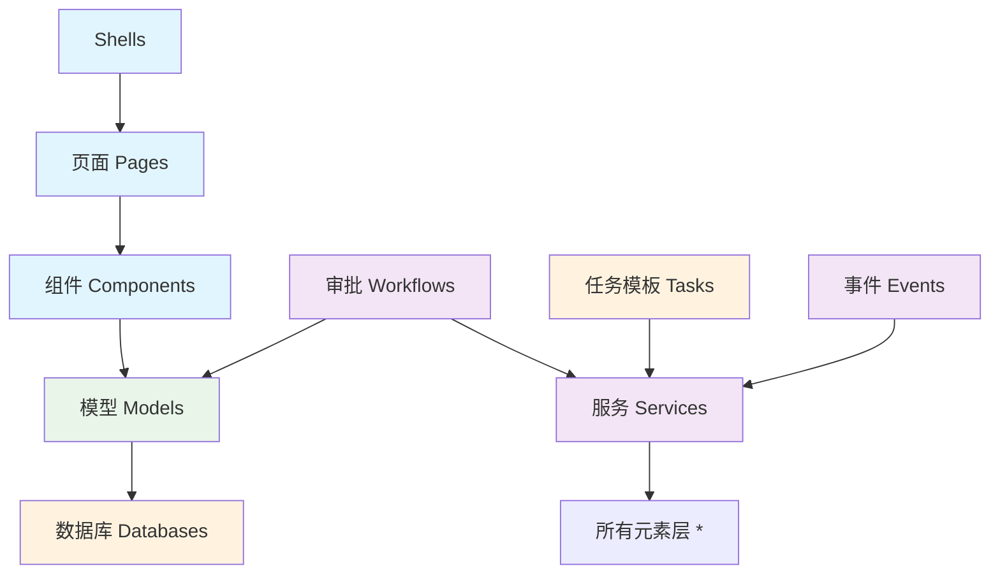

# 系统模型

企业级Web应用系统由多种功能模块组成（例如：页面、模型、服务），即多个元素族类，分属不同元素族类的实例元素之间相互调用，形成具有特定业务功能集合的系统。

:::info 可扩展的元素族类
系统模型是极态对企业级Web应用系统的抽象建模，极态官方提供默认的元素族类，用户也可以扩展自己的元素族类、继承改写官方元素族类。
:::

## 核心元素族类

### 用户接口层
- **门户（Shells）**: 系统访问入口，应用默认提供三类门户
  - 使用区门户：面向最终用户的操作界面
  - 开发区门户：面向开发人员的配置界面  
  - 管理区门户：面向系统管理员的管理界面
  - 扩展门户：根据业务需求自定义的专用入口

- **页面（Pages）**: 功能模块界面，通过组件化布局或代码开发实现特定业务功能

- **组件（Components）**: 可复用的UI构建单元，提供标准化的界面交互能力

### 业务逻辑层
- **服务（Services）**: 业务逻辑处理接口，封装核心业务规则和流程

- **审批（Workflows）**: 业务流程管理，定义审批节点和流转规则

- **事件（Events）**: 事件驱动机制，支持模型变更事件和流程触发事件

### 数据模型层
- **模型（Models）**: 数据结构定义，集成数据库操作能力，提供统一的数据访问接口

### 权限管理层
- **角色（Roles）**: 基于RBAC（Role-Based Access Control）的权限控制体系

- **组织架构（Organizations）**: 企业组织结构管理，支持层级化权限分配

- **登录方式（Authentication Types）**: 多元化身份认证机制配置

### 任务调度层
- **任务模板（Task Templates）**: 定时任务和批处理任务的执行模板

### 基础设施层
- **数据库（Databases）**: 数据持久化存储，提供事务性数据操作能力

- **文件存储（File Storages）**: 多媒体文件存储，支持本地磁盘和云端OSS服务

- **缓存存储（Cache Storages）**: 高性能缓存服务，支持内存缓存和分布式Redis缓存

## 常见调用关系

系统各元素族类之间遵循清晰的依赖关系和调用层次：

| 调用方 | 被调用方 | 关系描述 |
|--------|----------|----------|
| 门户 | 页面 | 门户加载和展示页面内容 |
| 页面 | 组件 | 页面通过组件构建用户界面 |
| 组件 | 模型 | 组件调用模型进行数据交互 |
| 服务 | 所有元素 | 服务作为业务逻辑中心，可被各层调用 |
| 模型 | 数据库 | 模型通过数据库进行数据持久化 |
| 审批 | 模型、服务 | 审批流程调用模型和服务执行业务逻辑 |
| 任务 | 服务 | 定时任务通过服务执行预定义的业务操作 |
| 事件 | 服务 | 事件触发时调用相应的服务处理逻辑 |
