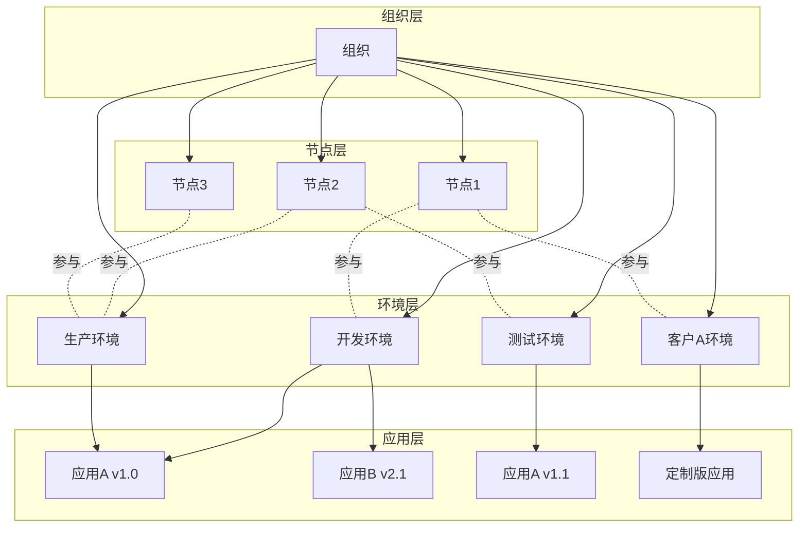
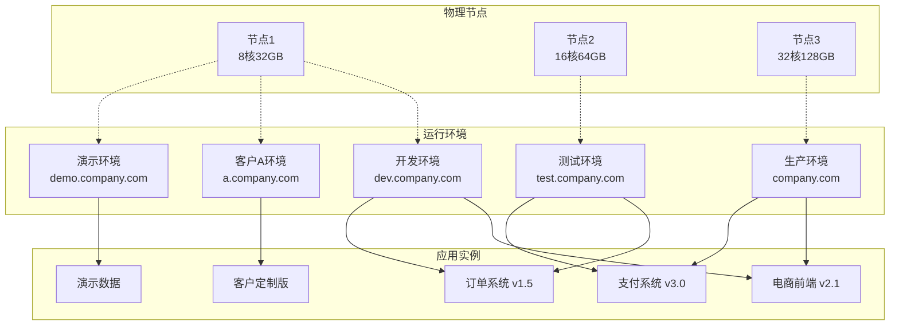

import Tabs from '@theme/Tabs';
import TabItem from '@theme/TabItem';

# 运维架构与管理指南

JitNode 安装激活后会自动部署 **AdminApp**，用于统一管理节点的运行环境、应用部署和系统配置。

## 核心功能模块

### 🖥️ 本地节点控制台
- **功能定位**：单节点应用生命周期管理
- **核心功能**：针对当前节点的应用创建、部署、配置、导入导出、删除等操作

详细功能请参考[本地节点控制台](./02本地节点控制台.md)

### 🌐 组织管理控制台  
- **功能定位**：企业级多节点集群管理
- **核心功能**：集群管理、资源调度

详细功能请参考[组织管理控制台](./03组织管理控制台.md)

:::info 控制台使用说明
每个 JitNode 节点都同时提供两个控制台，用户可以根据具体需求选择使用：
- **本地节点控制台**：专注于当前节点的应用管理
- **组织管理控制台**：用于多节点集群的统一管理
:::

## 网络拓扑架构

极态云采用灵活的四层架构，支持复杂的企业级部署需求：

### 架构层级关系

### 核心概念说明

<Tabs>
<TabItem value="organization" label="🏢 组织" default>

:::info 组织（Organization）
**最高级别的管理单元，对应企业或团队**

🎯 **主要功能**
- 统一管理所有节点、环境和应用
- 提供企业级的权限控制和资源调度
:::

</TabItem>
<TabItem value="node" label="⚙️ 节点">

:::info JitNode 节点
**实际的运行实体，承载应用的物理或虚拟服务器**

🔧 **版本类型**
- **桌面版**（Windows/Mac）：适合本地开发，支持全代码开发和调试
- **服务器版**（Docker）：适合生产部署和团队协作

🚀 **部署方式**
- **一机一节点**（推荐）：独立部署，资源隔离
- **一机多节点**：需要端口和目录隔离
:::

</TabItem>
<TabItem value="environment" label="🌍 运行环境">

:::info 运行环境（Runtime Environment）
**基于虚拟化沙箱技术的独立应用运行空间**

🔒 **技术特性**
- 采用虚拟化沙箱技术，确保应用间完全隔离
- 理论上单个节点可同时存在无限个环境（仅受硬件限制）
- 支持动态创建、配置和销毁

🎨 **灵活定义**
用户可按不同维度自定义运行环境：

| 分类维度 | 环境示例 | 使用场景 |
|----------|----------|----------|
| **按阶段** | 开发、测试、生产 | 标准软件开发流程 |
| **按业务** | 电商、支付、物流 | 业务模块隔离 |
| **按客户** | 客户A、客户B、演示 | 多租户部署 |
| **按用途** | 性能测试、安全测试 | 专项测试需求 |

🌐 **入口地址**
- 每个环境可配置多个入口地址
- 支持域名、子域名、端口等多种方式
- 系统自动检测并阻止地址冲突
:::

</TabItem>
<TabItem value="application" label="📱 应用">

:::info 应用（Application）
**实际的业务系统或服务**

🏗️ **应用特性**
- 基于 JAAP 架构的可视化应用
- 支持多版本管理和灰度发布
- 内置完整的生命周期管理

⚖️ **版本约束**
- ✅ 同一环境内不同应用的任意版本组合
- ✅ 不同环境内同一应用的不同版本
- ❌ 同一环境内同一应用的多个版本

🔄 **部署策略**
- 支持一键部署和批量部署
- 支持应用间的依赖管理
- 支持配置参数的环境差异化
:::

</TabItem>
</Tabs>

### 企业级部署架构参考

**入口地址配置示例：**

| 运行环境 | 主入口地址 | 备用入口地址 | 端口入口 |
|----------|------------|-------------|----------|
| 开发环境 | dev.company.com | dev2.company.com | :8080 |
| 测试环境 | test.company.com | staging.company.com | :8081 |
| 生产环境 | company.com | backup.company.com | :80 |
| 客户A环境 | a.company.com | a1.company.com | :8082 |
| 演示环境 | demo.company.com | - | :8083 |

## DevOps 最佳实践

**桌面版开发流程（推荐）：**

1. **本地开发** → 使用 JitNode 桌面版（Windows/Mac）进行应用开发
2. **版本发布** → 开发完成后发布应用版本
3. **测试部署** → 在测试环境部署对应版本进行验证
4. **生产部署** → 测试通过后在生产环境部署该版本

**服务器版协作流程：**

1. **开发节点** → 使用服务器版节点作为共享开发环境
2. **模块开发** → 多人分别开发应用的不同模块
3. **集成测试** → 在开发节点边开发边测试，或发布版本后在专门测试环境验证
4. **生产发布** → 测试通过后部署到生产环境

:::warning 生产环境安全
虽然平台支持即改即生效，但强烈建议不要直接对生产环境进行修改，应严格按照开发→测试→生产的流程进行部署。
:::

<!-- 需要配图：完整的网络拓扑示意图，展示组织、节点、环境、应用的层级关系 -->

## 约束规则

<Tabs>
<TabItem value="version" label="📦 版本管理" default>

:::tip 版本管理约束
**确保应用版本的合理部署和管理**

| 场景 | 规则 | 状态 | 说明 |
|------|------|------|------|
| 同环境不同应用 | 任意版本组合 | ✅ 允许 | 如：开发环境同时部署应用A v1.0 和应用B v2.1 |
| 不同环境同应用 | 不同版本部署 | ✅ 允许 | 如：开发环境部署应用A v1.0，生产环境部署应用A v1.1 |
| 同环境同应用 | 多版本并存 | ❌ 禁止 | 同一环境内同一应用只能存在一个版本 |

**最佳实践：**
- 🔄 使用不同环境来测试应用的不同版本
- 🚀 通过环境切换实现应用版本的平滑升级
- 📋 建立清晰的版本命名和发布规范
:::

</TabItem>
<TabItem value="access" label="🌐 入口地址">

:::tip 入口地址约束
**保证网络访问的唯一性和稳定性**

| 操作类型 | 规则描述 | 状态 | 示例 |
|----------|----------|------|------|
| 多地址配置 | 一个环境配置多个入口 | ✅ 允许 | 生产环境：`app.com` + `backup.app.com` |
| 动态修改 | 运行时修改环境入口 | ✅ 允许 | 临时切换域名或增加备用入口 |
| 地址共享 | 多环境共享同一入口 | ❌ 禁止 | 两个环境不能同时使用 `test.com` |
| 冲突检测 | 系统自动检测冲突 | 🔍 自动 | 配置时实时检查并提示冲突 |

**配置建议：**
- 🏷️ 使用有意义的域名前缀区分环境
- 🔒 为重要环境配置备用入口地址
- ⚡ 避免频繁修改生产环境的入口地址
:::

</TabItem>
</Tabs>
