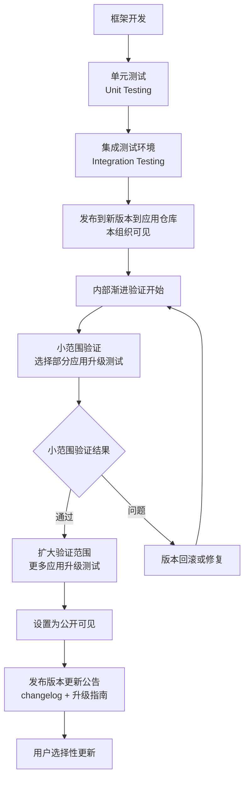
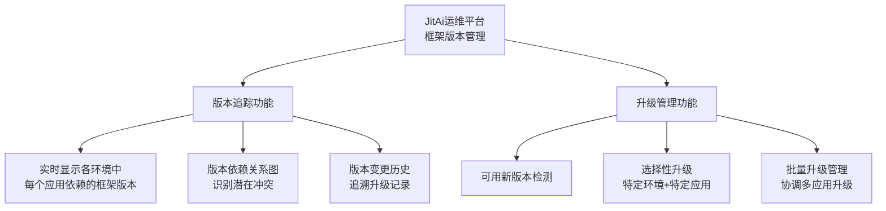

# 开发框架层稳定性保障

JitAi开发框架层承载着整个生态的技术基座，其更新具有**影响范围广泛、向后兼容性要求严格**的特点，其稳定性保障直接影响所有基于该框架开发的应用系统。

### JitAi团队的职责划分

| 角色 | 主要职责 | 发布决策权限 |
|------|---------|-------------|
| **架构师** | • 技术方向把控<br/>• API设计评审<br/>• 重大变更决策 | 架构变更最终决定权 |
| **发布经理** | • 发布计划制定<br/>• 跨团队协调<br/>• 发布风险控制 | 发布时机和范围决定权 |
| **质量工程师** | • 测试策略制定<br/>• 质量门槛设定<br/>• 兼容性验证 | 质量标准一票否决权 |
| **DevOps工程师** | • CI/CD流程维护<br/>• 环境管理<br/>• 自动化工具开发 | 发布流程技术决定权 |

## 语义化版本管理

开发框架的各组成部分（不同的应用），均遵循语义化版本管理。

```
主版本号.次版本号.修订版本号 (MAJOR.MINOR.PATCH)
示例：JitORM 2.3.1
```

| 版本类型 | 变更内容 | 发布频率 | 示例场景 |
|---------|---------|---------|---------|
| **MAJOR** | 重大功能增强 | 低 | 架构增强、核心功能扩展 |
| **MINOR** | 稳定的功能新增 | 中 | 新增元素类型、新增配置选项 |
| **PATCH** | 稳定的问题修复 | 高 | Bug修复、性能优化 |

## 框架开发与发布流程
应用层的稳定性保障体系流程，同样适用于开发框架层。

### 主流程


**相关的运维平台版本管理能力**：
- **版本依赖追踪**：实时显示每个环境中每个应用依赖的开发框架版本
- **选择性升级**：支持对特定运行环境中的部分应用进行框架版本升级
- **应用仓库管理**：支持将特定版本应用设置为公开可见



### 兼容性保障

由于**用户选择性更新**模式，会存在多个版本同时运行的情况，这要求开发框架的各组成部分满足**完全向前兼容**。
