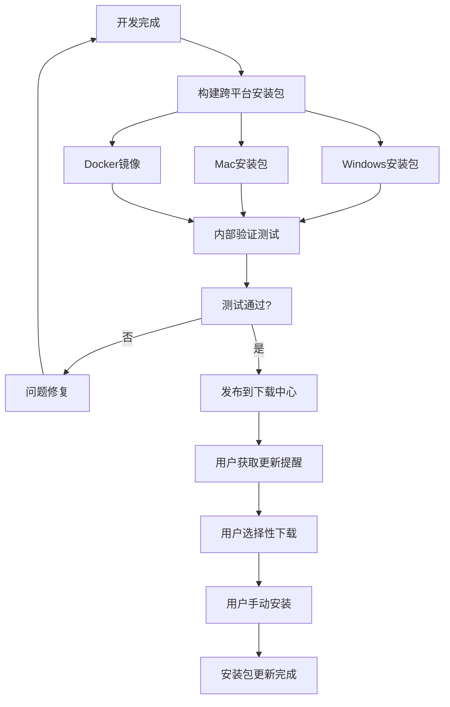
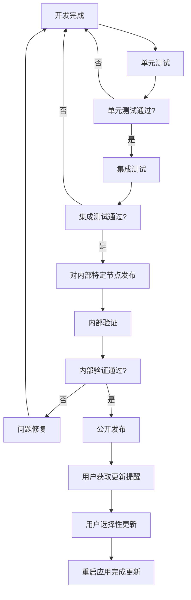

# 应用运行平台层稳定性保障

## 概述

应用运行平台层由跨平台安装包、Docker镜像和运行时依赖项构成。平台层更新分为安装包更新和依赖项更新两种类型，更新过程必须确保完全向前兼容，保障所有应用版本的正常运行。

## 平台组件构成

### 安装包层
- **Windows安装包**：Windows平台部署文件
- **Mac安装包**：macOS平台部署文件  
- **Docker镜像**：容器化部署方案

### 依赖项层
- **JitNode内核**：微内核架构，提供系统API、JAAP解释执行、虚拟化沙箱、应用编译构建
- **程序包**：运行时库和框架组件
- **资源目录**：配置文件和静态资源
- **工具组件**：编译构建工具链

## 更新策略分类

| 更新类型 | 组件范围 | 更新方式 | 影响程度 | 用户操作 |
|---------|---------|---------|---------|---------|
| 安装包更新 | 安装包、基础框架 | 下载新版本 | 较小 | 手动下载安装 |
| 依赖项更新 | 内核、程序包、资源 | 在线更新 | 较大 | 重启应用 |

## 向前兼容性保障

### 完全向前兼容原则
- **API兼容性**：新版本保持所有旧版本API的可用性
- **JAAP协议兼容**：支持多版本JAAP协议同时运行
- **沙箱环境兼容**：确保不同版本应用的运行环境一致性
- **配置文件兼容**：自动处理配置格式升级，保持向下兼容

### 多版本共存机制
- **API版本化**：不同版本API并存，渐进式废弃
- **协议适配器**：自动检测和适配不同版本的JAAP协议
- **运行时隔离**：为不同版本应用提供独立的运行环境

## 安装包更新机制

### 更新发布流程

### 稳定性保障措施
- **用户主动选择**：用户可以选择是否更新，非强制更新
- **独立安装**：新版本安装不影响现有运行的应用
- **向前兼容**：新版本支持所有旧版本应用继续运行

### 更新提醒机制
- **版本检查**：定期检查新版本可用性
- **功能介绍**：展示新版本的主要功能和改进
- **非强制性**：用户可以选择暂时不更新
- **下载指引**：提供官方下载链接和安装说明

## 依赖项更新机制

### 渐进式验证流程

