# JitAi：为企业级AI应用而生

## 行业背景

在企业级AI应用开发中，我们经常遇到两个关键问题：AI需要与人类协作，以及AI需要与用户界面深度结合。

**人机协作问题**：很多业务场景需要人工确认，比如合同审批、支付授权、数据核验等敏感操作。还有一些复杂的业务逻辑，AI无法完全处理，需要人工判断和介入。AI和人类需要在同一个工作流程中实时交互。

**界面融合问题**：AI需要能够获取用户在页面上的操作状态，比如表单输入了什么内容、表格筛选了什么条件，然后根据这些信息做出相应的决策。AI的行为也需要根据用户的操作动态调整。

**现有平台的不足**：目前主流的AI开发平台（如Coze、Dify等）虽然让AI应用开发变得简单，但在实际使用中还有很多限制。比如AI只能在服务器端运行，无法直接操作用户界面，也无法获取用户在页面上实时输入的数据。当需要人工确认某个操作时，这些平台也无法提供相应的机制。

## JitAi：全栈式企业级AI应用开发框架

### 框架定位

JitAi 专为生产级 AI 应用而生，为开发者提供**低门槛、突破性**的企业级 AI 开发体验。

### 核心特性

#### 🚀 零代码可视化编排
- **拖拽式开发**：通过可视化界面零代码编排复杂的多 Agent 协作流程
- **灵活配置**：自由设计 Agent 的提示词、输入输出参数及工具链

#### 🔧 全域工具集成
- **全技术栈覆盖**：一键接入数据模型、服务函数、外部 API、前端页面函数等
- **前后端打通**：突破传统 Agent 的后端限制，实现全栈 AI 能力

#### 📊 深度可观测性
- **全链路监控**：实时监控 Agent 执行状态、工具调用日志、流程节点输出
- **运行透明**：精细配置事件处理逻辑，全程可观测

#### 🤝 人机协作
- **UI-Agent 交互**：独创的界面与 AI 交互设计能力
- **开箱即用**：为需要人类协同的生产场景提供完整解决方案

JitAi 让复杂的 AI 应用开发从实验室走向真实业务场景，为企业级 AI 应用提供完整的技术解决方案。

### 框架组成

JitAi提供了AI大模型元素、AI Agent元素、AI助理元素以及知识库元素。

- **AI大模型元素**：实现了对市面上大模型调用的API封装，开发者通过填写API地址及API_KEY即可完成对一个大模型调用的配置。大模型元素可以作为函数被服务/模型元素调用。
- **AIAgent元素**：是一个原子化的AI应用单元，通过配置大模型元素、输入参数、输出结果、工具及知识库实现一个单一的AI功能。AI Agent可以像函数调用一样被独立调用，也可以被助理元素调用。
- **AI助理元素**：用于实现复杂的任务，通过可视化流程编排，多节点、多Agent的组合实现一个复杂的服务端业务流程。在前端则提供了一个对话框，该对话框可嵌入到页面中并可与页面进行交互。
- **知识库元素**：用于实现对RAG知识库的封装，开发者通过上传文档即可构建自己的知识库，知识库可被Agent调用。

## 案例

下面以一个考试系统中的阅卷功能为例，演示如何通过 JitAi 开发框架开发一个AI阅卷/打分功能。

### 前置准备

该系统包含6个核心数据模型：

1. **题库模型**（QuestionModel）：categoryOfTopics（题目类型）、problem（问题）、standardAnswers（标准答案）
2. **试卷模型**（ExamPaperModel）：paperName（试卷名称）、questions（题目列表）、total（总分）
3. **试卷题目明细模型**（ExamQuestionModel）：examPaper（关联试卷）、question（关联题目）、fractionalValue（分值）
4. **考试计划模型**（ExamPlanModel）：scheduleName（计划名称）、examPaper（关联试卷）、examiners（考核人员）
5. **考生考卷模型**（ExaminerExamPaperModel）：examPlan（关联考试计划）、examiner（考核人）、dateOfExamination（考核日期）、examPaper（关联试卷）、questionAndAnswers（答题明细）、score（得分）、comments（评语）
6. **考生答题明细模型**（ExaminerAnswerModel）：examinerPaper（关联考生考卷）、question（关联题目）、fractionalValue（分值）、answer（考生回答）、score（得分）、rationale（评分理由）

前端实现**阅卷打分**功能页面：左侧展示未打分考卷列表，右侧为评分表单。点击考卷后显示答题明细，可逐题打分并写评分理由。

接下来，我们为**阅卷打分**功能页面添加AI打分/阅卷功能。


### 通过service调用大模型

#### 创建大模型元素

创建一个大模型元素，配置好API URL及API KEY。


#### 创建AI打分服务

创建**AI打分服务**，新增一个**打分**方法，该方法调用大模型元素进行单题打分，配置如下：
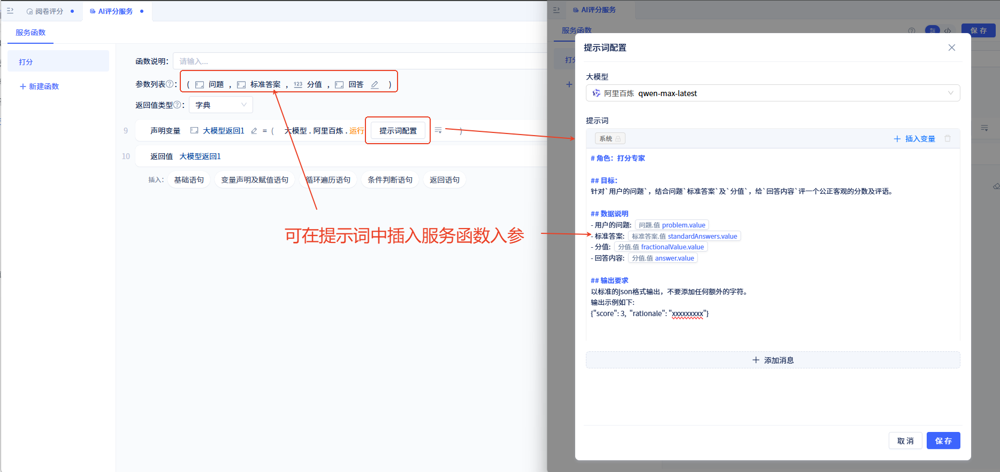

#### 打分页面调用打分服务

在**评分表单**的**题目及结果**列表中添加一个操作列按钮**打分**，事件逻辑如下：
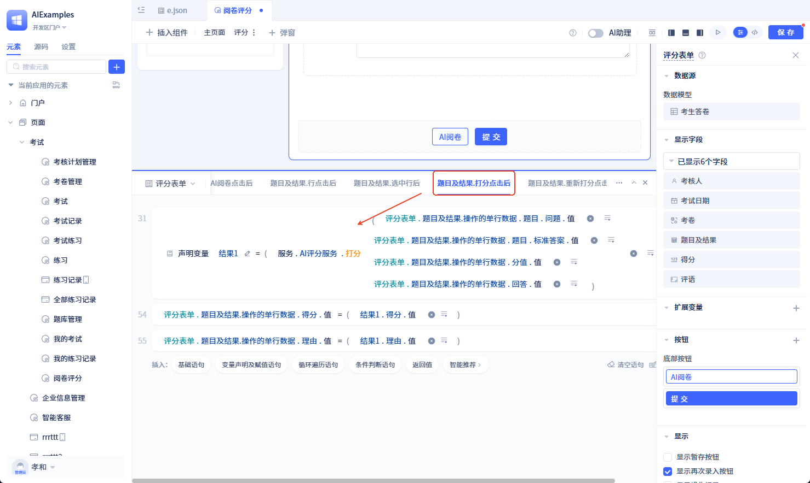

运行效果如下：
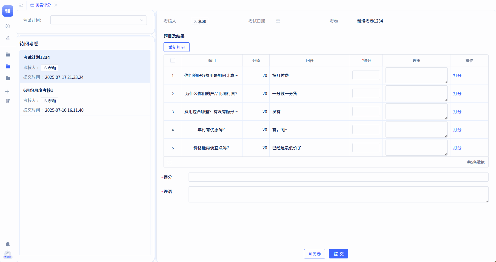


### 直接调用Agent

#### 创建阅卷Agent

创建一个Agent元素，配置大模型、输出结果及工具。

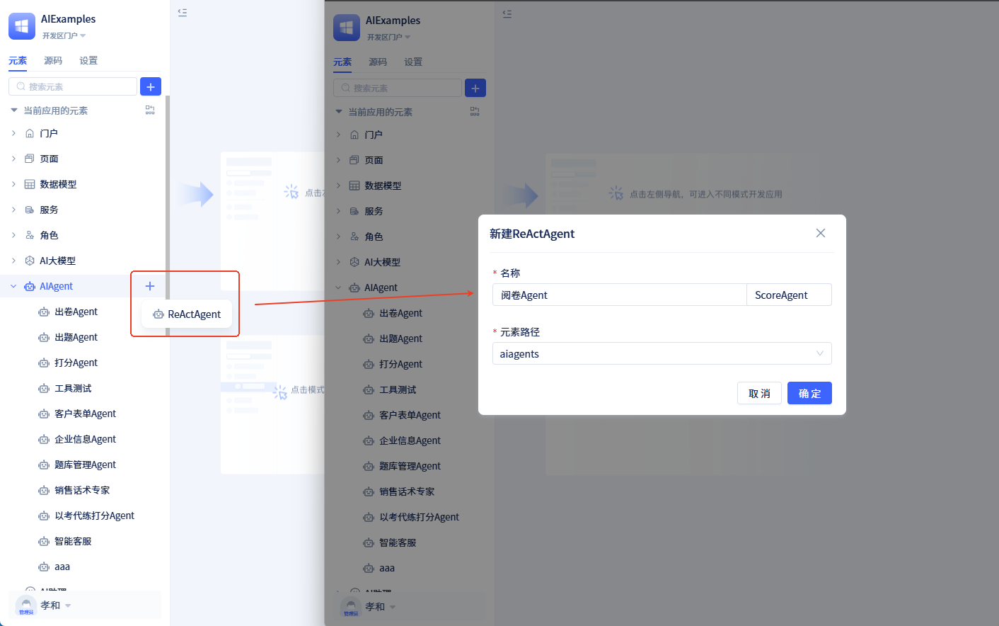

- **大模型配置**


- **提示词设置**

```markdown
# 角色：阅卷专家

# 核心任务
对考生答卷逐题打分，每一题都要打分并给出理由，若未答题，该题得0分。所有题目打分完成后写一个总评语。

# 工作流程
1. 根据用户提供的考卷编号，调用models.ExaminerAnswerModel.query工具获取考卷答题明细
2. 对第1步获取的答题明细逐条打分并给出理由。打分方式：对比 `题目标准答案` 分析 `考生的回答`，结合 `题目分值` 给出一个公正客观的得分，并给出评分理由。
3. 根据所有题目的答题情况给出一个总结评语

# 重要约束
若任意一题的回答违背下列几种情况，所有题目分数一律为0，即使其他题目回答非常准确，得分也是0：
1. 销售话术需要有礼貌，尊重客户，秉承客户至上的原则；严禁出现内涵、辱骂客户的回答
2. 弘扬正确的价值观，回复内容避免出现敏感和违背社会主义核心价值观的内容
3. 态度积极，有耐心，避免情绪化

# 输出结果的特殊要求
- 要求数据在满足要求的情况下尽量简单
- question字段的值只需要id和problem属性
- examinerPaper字段只需要id属性
```

- **工具配置**：
Agent可使用的工具有：服务函数、数据模型函数、MCP服务、外部API以及页面函数等。此示例中，我们选择**考生答题明细模型**函数作为Agent的工具，选择**query-查询数据**方法。


- **输出结果**：
将 Agent 输出结果参数类型修改为 **多行数据**，模型选择 **考生答题明细**，参数标题设置为 **答题情况**；
新增一个输出结果：评语（comments），多行文本类型。

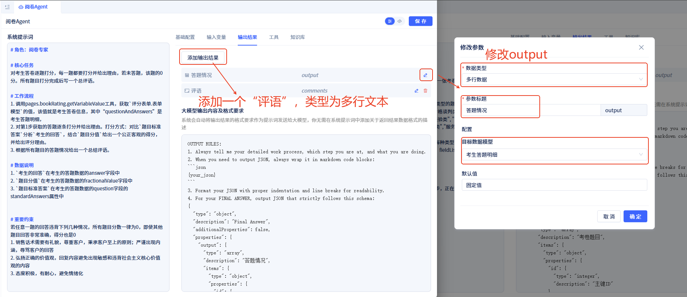

- **页面调用阅卷Agent**
阅卷表单中新增 **AI阅卷** 按钮，并配置按钮事件，调用 **Agent.阅卷Agent.运行**方法，参数设置为公式值：
`CONCAT("给编号为",评分表单.表单模型.主键ID.值,"的考卷打分")`，将agent返回结果填充到表单模型字段中，并更新总分。


至此，我们就完成了AI阅卷功能。看看效果吧！

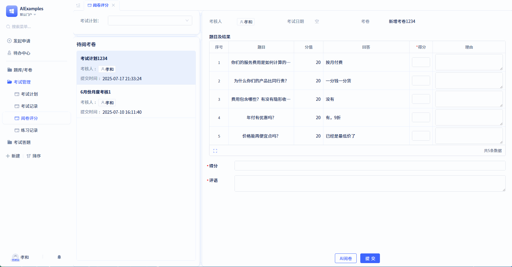


### 过程观测与人机协作

通过service调用大模型或直接调用Agent存在以下两个问题：
- 用户无法了解AI执行进度，长时间等待无反馈
- Agent运行结果直接更新页面，缺乏人工审核环节

下面演示如何在页面中使用AI助理，实现过程观测和人工确认。

#### 创建助理元素

创建一个名为**阅卷助理**的助理元素。


在助理流程中添加两个节点（从顶部拖拽节点到画布中），并依次连接：

- **阅卷Agent**：AI Agent 类型，配置如下：


- **人工确认是否采纳评分结果**：工作区人机交互节点，配置如下：


助理设置需要在对话框中输出的内容，这些内容用于观测AI运行过程。

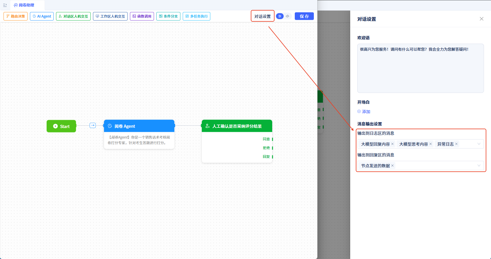

#### 评分页面使用AI助理

- 阅卷评分页面中开启AI助理，并绑定**阅卷助理**

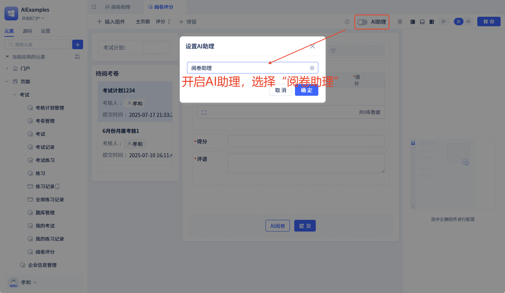

- 页面订阅 **AI助理-人工确认是否采纳评分结果** 的 **同意后** 事件，将评分结果更新到评分表单中。事件处理逻辑如下：

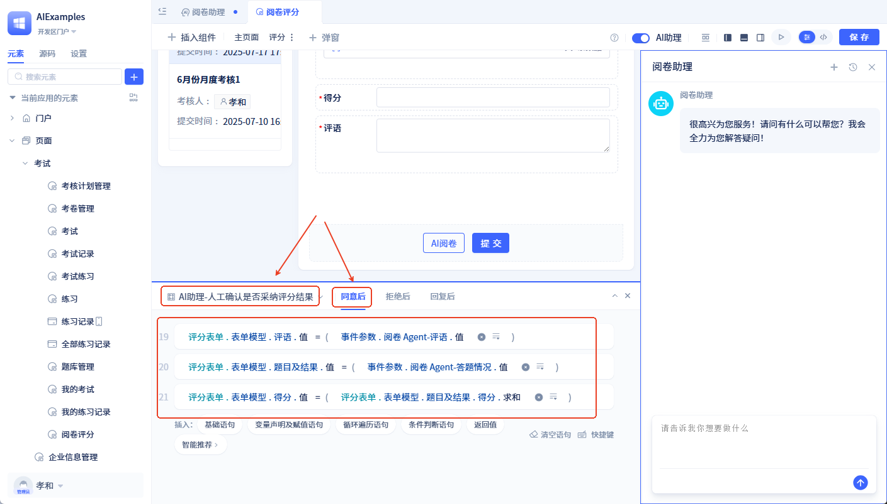

- 修改**AI阅卷** 按钮事件，调用 **发送AI消息**方法，参数设置为公式值：`CONCAT("给编号为",评分表单.表单模型.主键ID.值,"的考卷打分")`


至此，已完成开发，看看效果吧。


### AI与前端深度融合

AI与前端的深度融合体现在：
- 页面函数可作为Agent工具，页面数据可作为Agent上下文
- 用户页面操作可动态调整AI行为

下面展示AI如何与前端深度融合。

#### 调整阅卷Agent

- 修改提示词工作流程第1步，如下：

```markdown
...
# 工作流程
1. 调用 pages.bookRating.getVariableValue 工具，获取 `评分表单.表单模型` 的值，该值就是`考生答卷信息`，其中 `questionAndAnswers` 字段是考生答题明细。<**注意：**pages.bookRating 需要替换成你自己的页面id；`评分表单.表单模型` 需要替换成你实际的表单名称>
...
```

- 调整调用工具，选择页面函数-阅卷评分页面-getVariableValue。该函数用于获取页面数据，Agent调用此工具获取页面数据作为上下文。


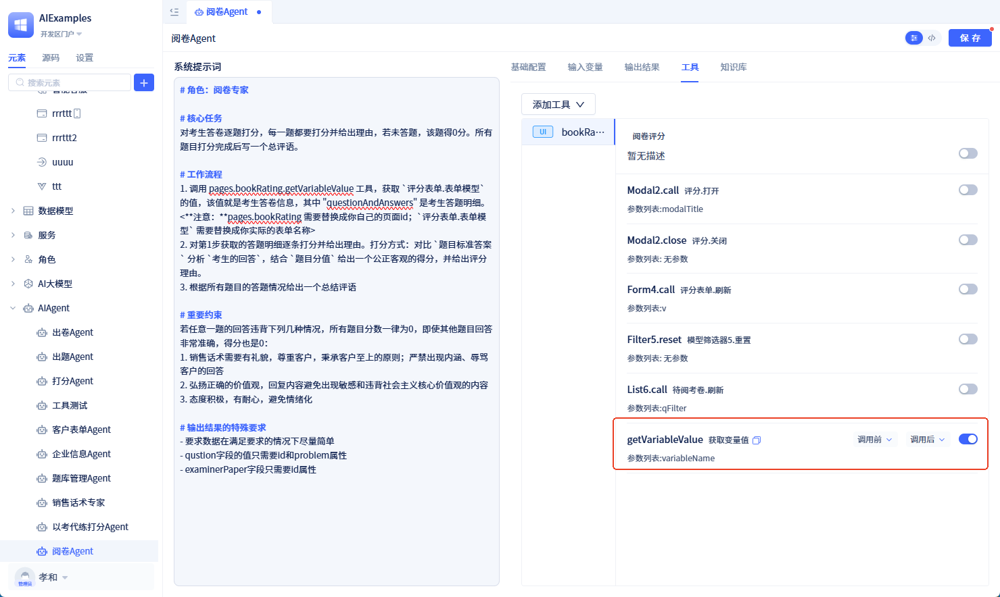

#### 调整阅卷助理

- 移除**人工确认是否采纳评分结果**节点，新增**工作区人机交互**节点到**阅卷Agent**节点后面，配置如下：

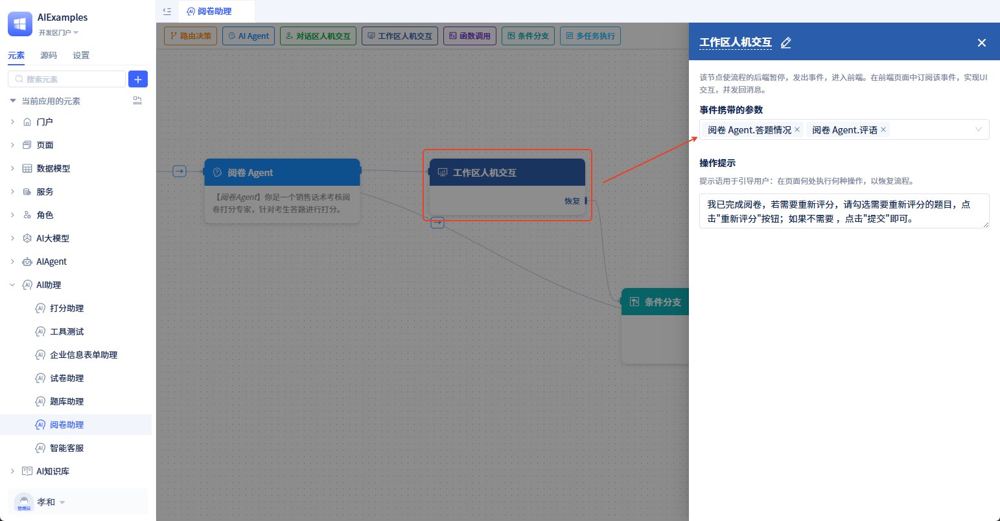

- 在**工作区人机交互**节点之后新增**条件判断**节点，判断工作区人机交互恢复时的回复内容是否为空。

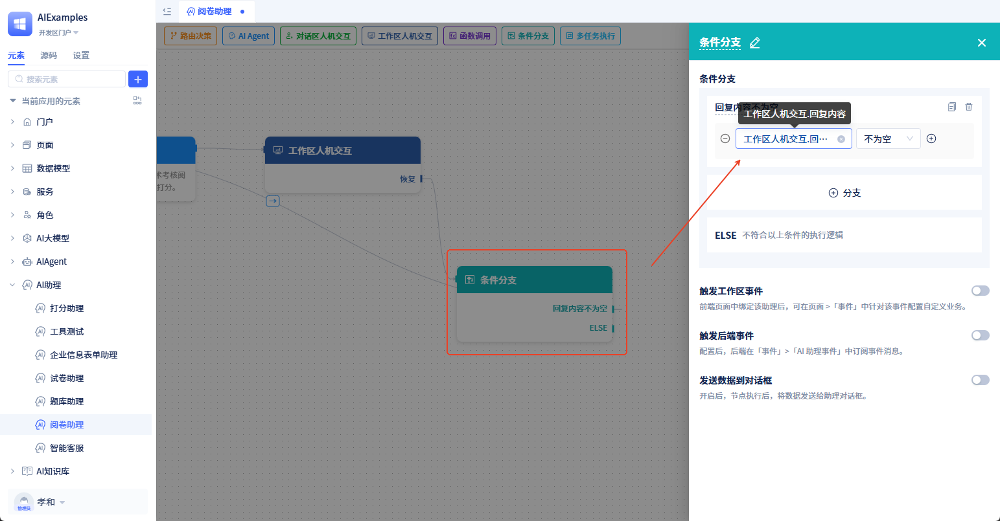

- 若**工作区人机交互**节点回复内容不为空，则继续交由**阅卷Agent**节点处理，并输入回复内容

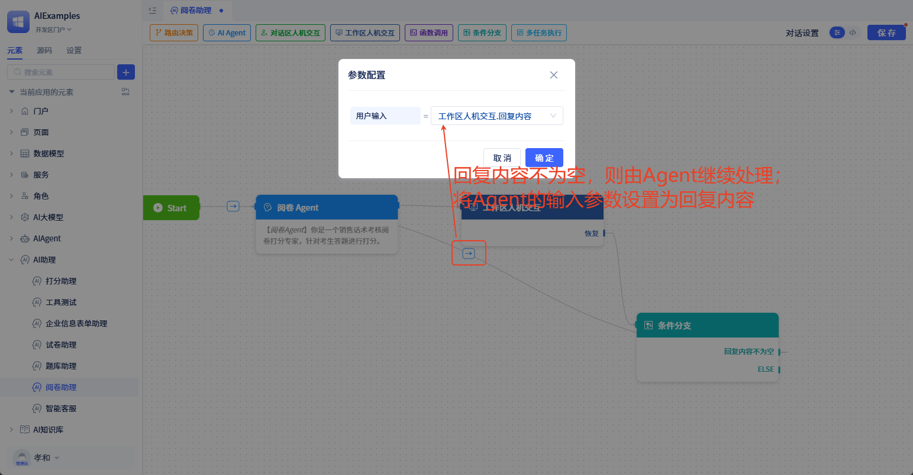

#### 调整评分页面

- **AI阅卷**按钮事件调整，**发送AI消息**参数内容调整为固定值`给当前考卷评分`

- 订阅**工作区人机交互**节点的**AI助理暂停后**事件，事件逻辑如下：

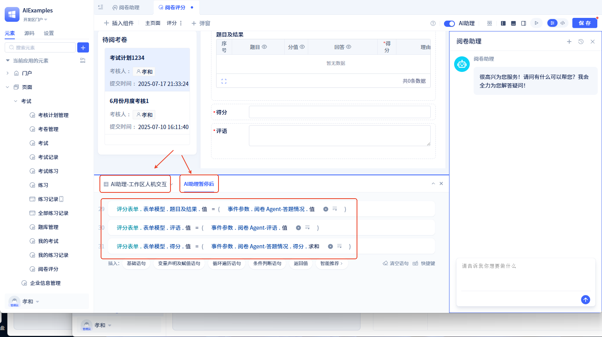

- 为评分表单中的**题目及结果**添加工具栏按钮"重新评分"，事件逻辑设置如下：

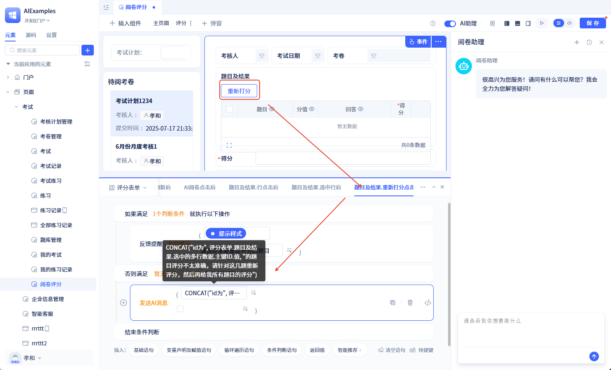

至此，已完成AI与前端的融合。 Agent可调用前端函数，可使用前端数据；前端页面可控制AI行为。


### 多Agent协作

该示例将展示如何在AI助理中使用多个Agent协作完成复杂任务。

工作流程如下：
1. **用户输入需求**：用户发送出题需求到AI助理
2. **出题Agent处理**：出题Agent接收问题并生成问题及答案
3. **人工确认**：通过对话区人机交互节点，将生成的问题及答案交由人工确认
4. **流程暂停**：此时流程会暂停，对话区显示问题及答案，等待人工确认
5. **人工确认后**：人工确认后，流程恢复执行
6. **题库Agent处理**：进入题库Agent，将问题及答案转换为题库模型数据, 去重保存
7. **结果输出**：输出新增的题目，并发送到对话框中显示

#### 设置出题Agent

新增一个名为 **出题Agent** 的Agent元素；配置好大模型及提示词。

提示词内容如下：

```markdown
# 角色：出题专家

## 目标：
结合已有知识，根据用户的描述生成销售话术相关的问题、题目类别及标准答案。
有以下问题类型可供选择：<列出你题库模型中题目类型>

## 输出要求：
- 问题及答案（output）是一个 markdown 格式的字符串
- 问题及答案（output）是所有问题及答案的汇总输出，不是一句总结性的陈述

## output 值的示例：

用户问题：给我10个电商代运营服务常用的销售话术。

正确 output 值示例：
\`\`\`markdown
### 需求挖掘类
#### 问题1
**询问**：xxxxx？
**回答**：xxxxx。

#### 问题2
**询问**：xxxxx？
**回答**：xxxxx。

### 竞品对比类
#### 问题3
**询问**：xxxxx？
**回答**：xxxxx。

#### 问题4
**询问**：xxxxx？
**回答**：xxxxx。
\`\`\`

错误 output 值示例：
"以上内容包含了10个电商代运营服务中常用的销售话术，全面覆盖了客户可能关心的问题及专业解答。"
```


#### 设置题库管理Agent

新增一个名为 **题库管理Agent** 的Agent元素。

- **提示词设置**：

```markdown
# 角色：题库管理专家

## 目标：
分析用户的输入，转换为题库中的题目

## 工作流：
- **第1步：把问题及话术转换为题目**
- **第2步：与题库对比去重**：调用 models.QuestionModel.query 工具根据第1步生成的所有题目及问题查询数据库，检查数据库中是否已存在你生成的问题，若已存在，则需去重处理。注意调用查询工具时一次性查所有的题目，不要一条一条查询。
- **第3步：题目保存到题库**：调用 models.QuestionModel.createOrUpdateMany 工具将新增的题目保存到数据库
- **第4步：输出新增题目**：第3步会得到新增题目的编号 id，更新到题目中，得到最终的新增题目 - questions
```

- **输出结果**：
将 Agent 输出结果参数类型修改为 **多行数据**，模型选择 **题库**，参数标题设置为 **新增题目**


- **工具配置**：
将 **题库模型** 添加为 Agent 的可调用工具，开启 **createOrUpdateMany-新增多行数据** 和 **query-查询** 工具

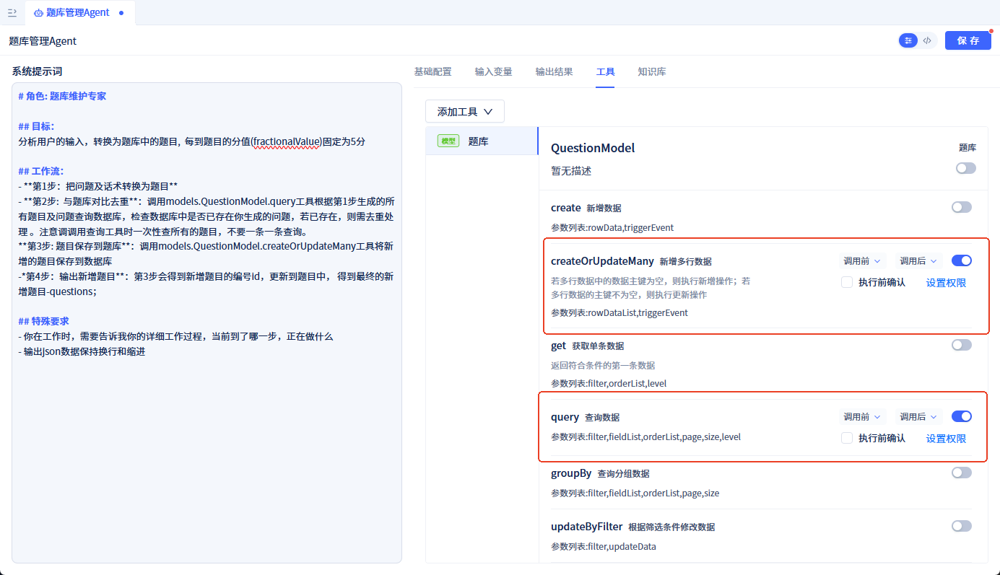

#### 设置题库助理

新增一个名为 **题库助理** 的AI助理元素，依次添加三个节点：

- **出题Agent**：AI Agent 类型，配置如下：

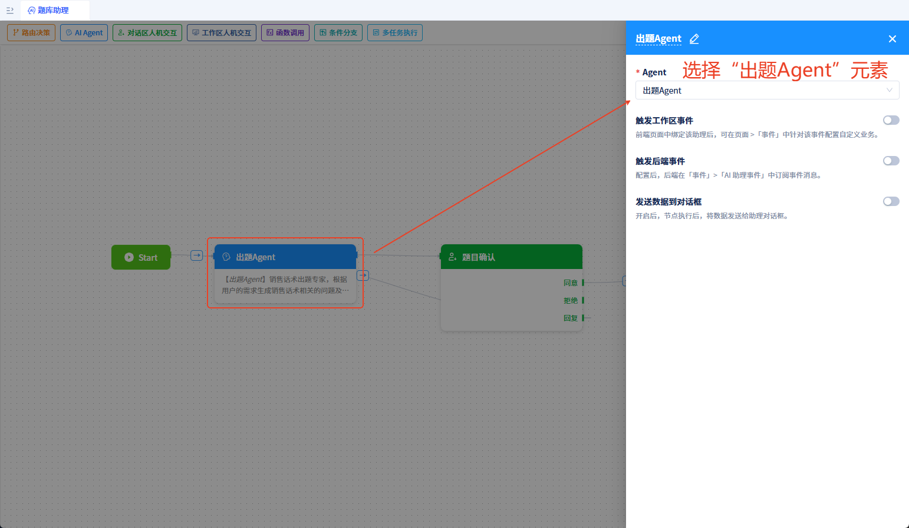

- **题目确认**：对话区人机交互类型，配置如下：

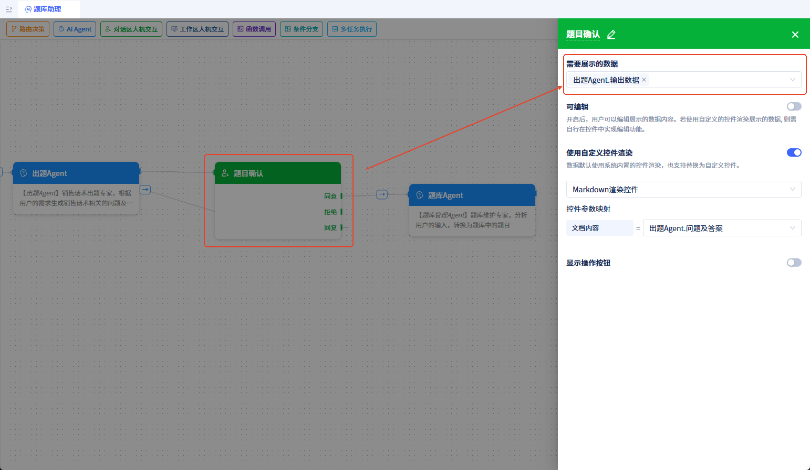

- **题库Agent**：AI Agent 类型，配置如下：

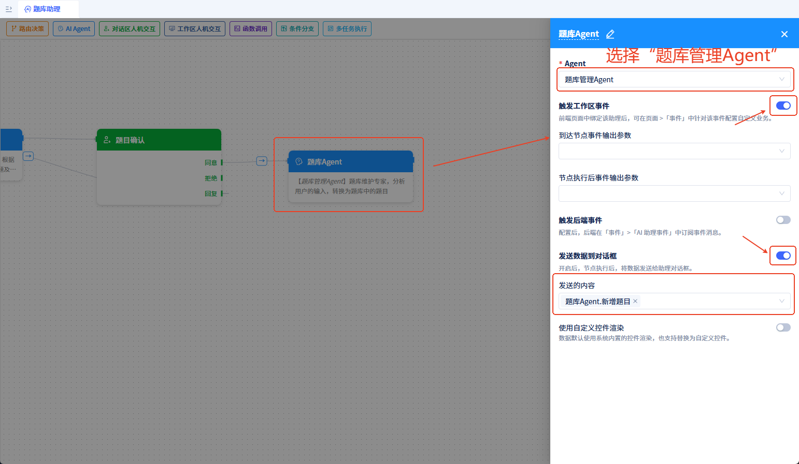

**题目确认**`同意`后连到**题库Agent**，将入参设置为`出题Agent.输出数据`

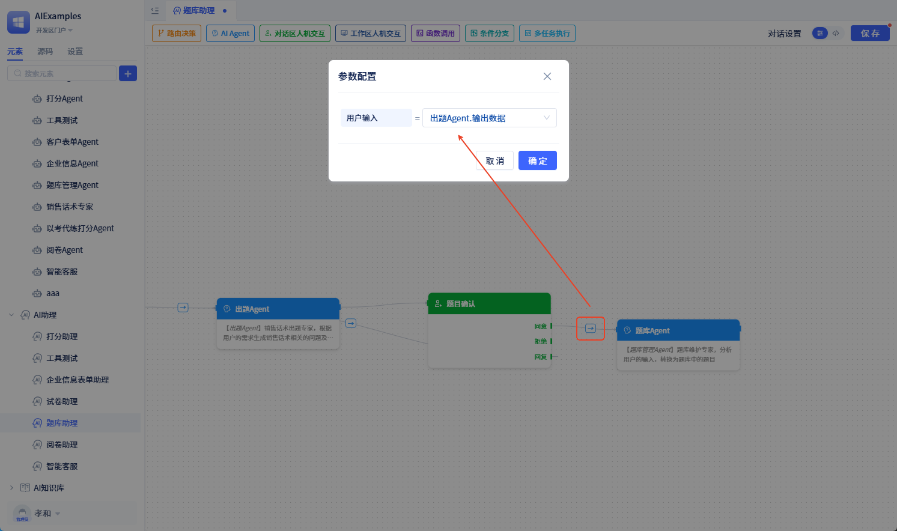

#### 题库管理页面使用题库助理

在 **题库管理页面** 中开启 AI 助理，选择 **题库助理** 元素

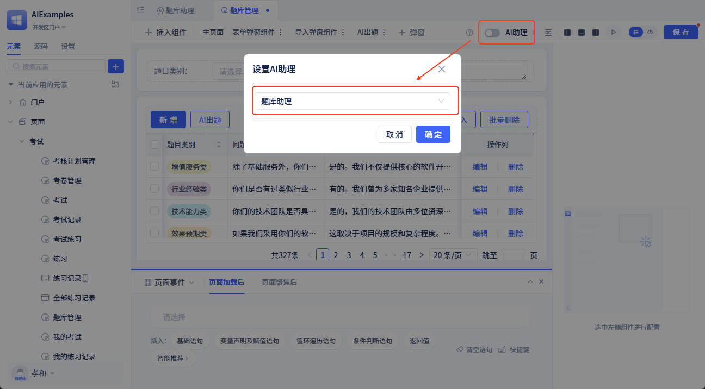

页面订阅 **AI助理-题库Agent** 的 **节点完成后** 事件，捕获到该事件后刷新题库列表


至此，我们就完成了AI出题功能。看看效果吧！

