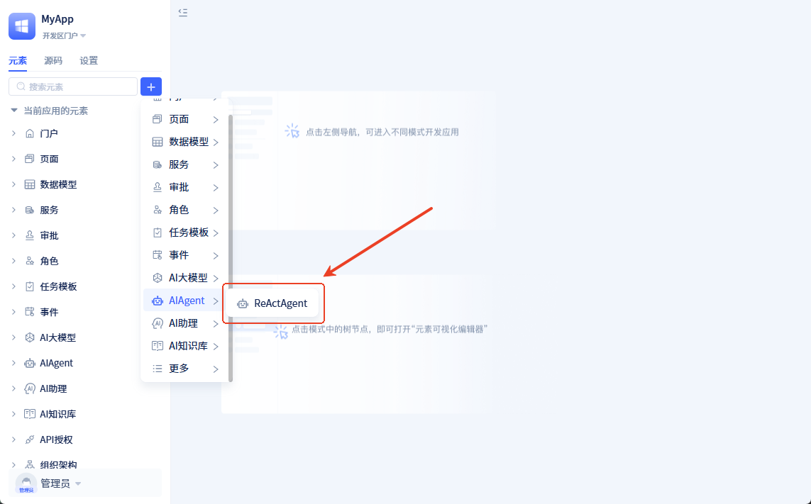
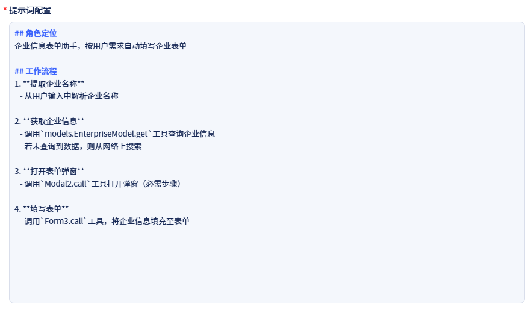
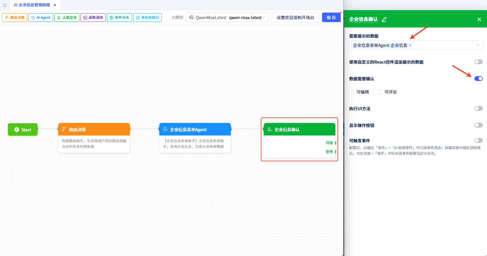
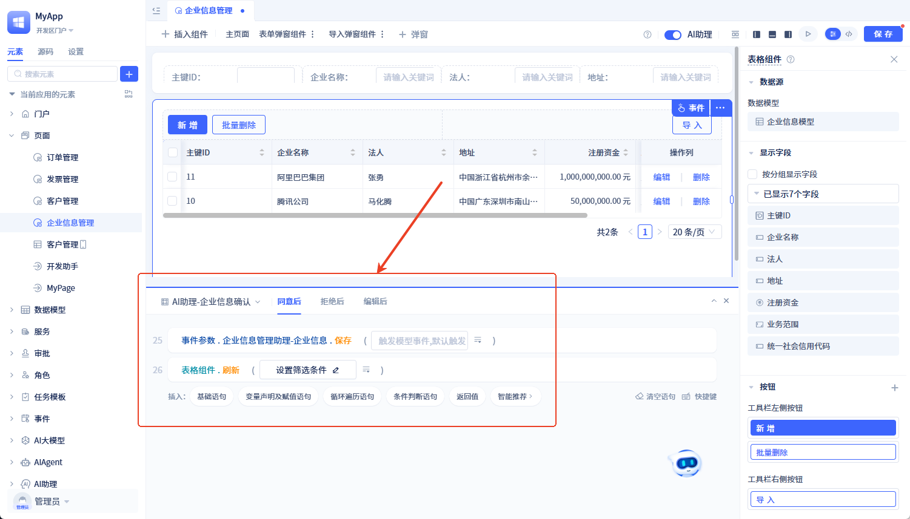

# AI驱动的UI自动化交互

:::info **读者须知**
本文适合熟悉标准页面开发规则，理解页面事件处理逻辑的开发者。通过学习本文，您将掌握通过AI助理操作页面的开发技巧，可用于开发面向企业管理应用的丰富自动化功能。
:::

本文将演示如何构建自动化流程：从互联网查询企业信息，保存到系统中并更新UI界面。

## 前置准备
1. 创建**企业信息模型**，名称为**EnterpriseModel**, 包含以下字段：
   - `enterpriseName`: 企业名称(单行文本)
   - `legalPersons`: 法人代表(单行文本)
   - `address`: 注册地址(单行文本)
   - `registeredFunds`: 注册资金(金额类型)
   - `scopeOfOperations`: 经营范围(多行文本)
   - `creditCode`: 统一社会信用代码(单行文本)

2. 创建**企业信息管理页面**，包含以下组件：
   - 表格组件(绑定企业信息模型，展示数据列表)
   - 表单组件(展示单条企业信息)
   - 弹窗组件(包含表单组件)

3. 创建支持联网搜索的**AI大模型元素**

---

## 方法1: Agent调用页面函数

### 功能效果
用户向AI助理输入"获取[企业名称]信息"后：
1. AI助理自动搜索指定企业信息
2. 打开表单弹窗
3. 自动填写企业信息到表单组件


### 开发步骤

#### 步骤1：创建企业信息表单Agent
##### 创建AIAgent元素：
- 元素类型：ReActAgent
- 名称：企业信息表单助手
- 描述："企业信息助手：查询企业信息并自动填写表单"
- 配置：
1. 绑定前置准备的大模型元素
2. 添加工具：
   - 数据模型工具：绑定"企业信息"模型，启用`get`(获取单条数据)
   - UI工具：绑定"企业信息管理"页面，启用:
     * `Modal2.call`(调用表单弹窗)，注意这里需要填写你实际页面中的组件方法
     * `Form3.call`(表单刷新)，注意这里需要填写你实际页面中的组件方法




3. 配置提示词：
```markdown
## 角色定位
企业信息表单助手，按用户需求自动填写企业表单

## 工作流程
1. **提取企业名称**
   - 从用户输入中解析企业名称

2. **获取企业信息**
   - 调用`models.EnterpriseModel.get`工具查询企业信息
   - 若未查询到数据，则从网络上搜索

3. **打开表单弹窗**
   - 调用`Modal2.call`工具打开弹窗（必需步骤）

4. **填写表单**
   - 调用`Form3.call`工具，将企业信息填充至表单
```




#### 步骤2：创建AI助理元素
- 元素类型：标准AI助理
- 名称：企业信息管理助理
- 配置节点：
1. 添加"AIAgent"节点, 命名为**企业信息表单Agent**
2. 连接"路由决策"节点到Agent节点


#### 步骤3：页面绑定AI助理
1. 在IDE中打开"企业信息管理"页面
2. 启用AI助理功能
3. 绑定"企业信息管理助理"


至此，完成开发！

---

## 方法2: 页面订阅AI助理事件

### 功能效果
1. AI助理查询企业信息后推送至页面
2. 用户确认信息
3. 系统自动保存数据并刷新表格


### 开发步骤

#### 步骤1：改造企业信息表单Agent
配置调整：
1. 设置输出参数：
   - 名称：企业信息
   - 类型：企业信息模型（单条数据）
2. 配置工具，仅需要数据模型工具：绑定"企业信息"模型，启用`get`(获取单条数据)
3. 更新提示词：
```markdown
## 角色定位
企业信息查询助手，返回结构化企业信息数据

## 工作流程
1. **提取企业名称**
   - 从用户输入中解析企业名称

2. **获取企业信息**
   - 调用`models.EnterpriseModel.get`工具查询企业信息
   - 若未查询到数据，则从网络上搜索

3. **返回数据**
   - 严格按JSON格式返回企业信息，不要掺杂其他任何无关内容
   - 结束流程

## 数据格式
```json
{
  "enterpriseName": "示例公司",
  "legalPersons": "法人姓名",
  "address": "公司地址",
  "registeredFunds": 10000000,
  "scopeOfOperations": "经营范围描述",
  "creditCode": "xxxxxxxxxx"
}
```
```
```

4. 配置输出参数为"单行数据"， 模型为"企业信息"


#### 步骤2：配置AI助理交互
1. 在"企业信息管理助理"中：
   - 新增"人机交互"节点
   - 节点标题："企业信息确认"
2. 配置节点：
   - 绑定数据："企业表单Agent.企业信息"
   - 启用"数据确认"功能



#### 步骤3：配置页面事件处理
配置事件"AI助理-企业信息确认-同意后"
处理逻辑：
1. 执行保存操作：
   `事件参数.企业信息表单Agent-企业信息.保存()`
2. 刷新表格：
   `表格组件.刷新()`



至此，完成开发！
---

## 完成效果
通过以上任一方法，均能实现：

✅ 企业信息的自动化查询  
✅ 数据的系统化存储  
✅ 用户界面的实时更新  
