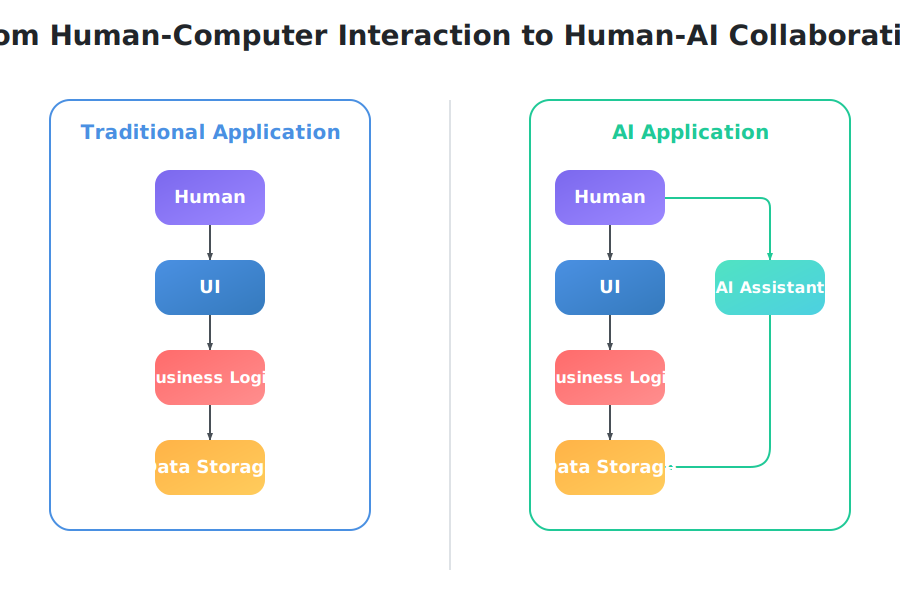
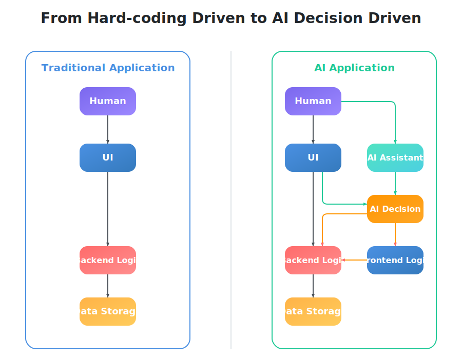
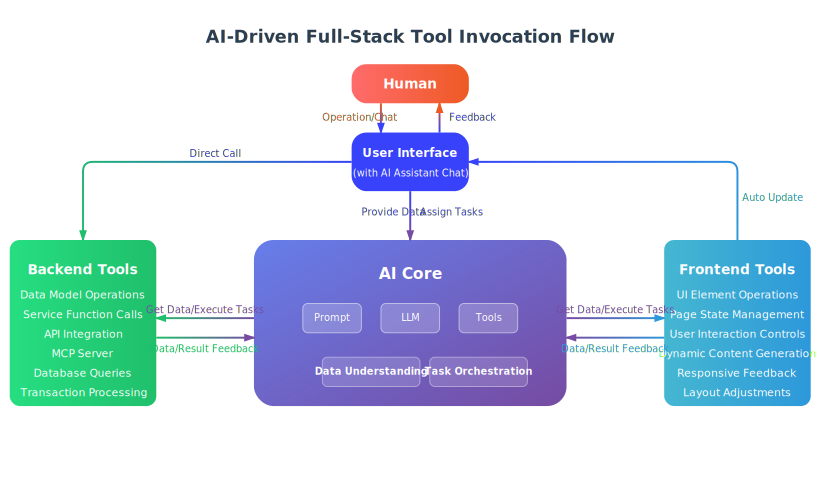
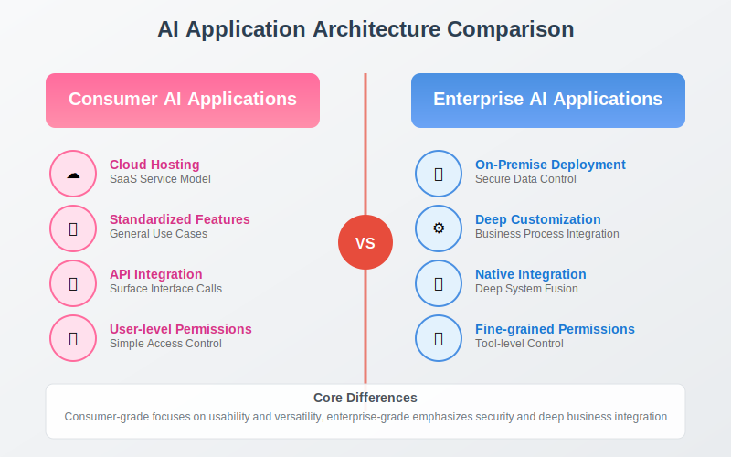

# AI-Native Enterprise Application Development Paradigm

In the assembly language era, developers needed deep hardware knowledge, directly manipulating registers and memory addresses—a paradigm of "humans adapting to machine logic." In the high-level language era, spanning from FORTRAN to C, the paradigm shifted toward "enabling machines to interpret human logic," allowing developers to express algorithms more intuitively. In the object-oriented era, languages like Java and C++ introduced object-oriented paradigms, transforming development from "process-oriented" to "object-oriented," and software architecture evolved from collections of functions to object collaboration. In the Web application era, the shift from desktop software to Web applications changed the development paradigm from "standalone programs" to "distributed systems," giving birth to architectural patterns like MVC and microservices.

Each paradigm shift has brought exponential improvements in efficiency, while simultaneously requiring developers to learn and adapt to new ways of thinking. Today, we are in the midst of another major transformation in development paradigms—**AI application development paradigm**.

## AI application development paradigm

Whether using LangGraph, CrewAI, or other development frameworks to build AI applications, all share one fundamental principle: **AI-human collaboration to achieve goals**.

### From human-computer interaction to human-AI collaboration

Unlike traditional applications, AI applications incorporate AI assistants, transforming the interaction model from human-computer interaction to human-AI collaboration.

### From hard-coded driven to AI decision-driven

In the human-computer interaction model, users trigger predefined program logic through actions such as clicking buttons and selecting menus, while the system passively responds by processing these requests.

In the human-AI collaboration model, humans can also converse with AI assistants, which identify intent and execute corresponding business logic. However, this doesn't mean traditional human-computer interaction should be entirely replaced—for simple scenarios that don't require intelligent decision-making, direct user operations are often faster and more efficient, which exemplifies the balanced approach of human-AI collaboration.

When building systems, developers are no longer simply creating operational interfaces with predefined logic, but rather developing full-stack applications enhanced by AI assistants that understand requirements, make intelligent decisions, and proactively execute business operations.

### AI-driven full-stack tool invocation flow

By treating AI as the intelligent hub of the entire system, it can intelligently select and dynamically combine frontend and backend tools based on user intent, achieving unified full-stack invocation. **Crucially, the tools invoked by AI are essentially the same functional modules that users access through UI interfaces in traditional applications**. Users can operate through UI interfaces or converse with AI, with the system automatically orchestrating tool chains to complete tasks and provide feedback, genuinely enabling the shift from "humans adapting to systems" to "systems adapting to humans."

## Enterprise AI application characteristics

Consumer-grade AI applications prioritize universality and ease of use, while enterprise-grade AI applications demand deep business integration and granular control. We need to build an application development technology system that is fundamentally different from consumer-grade AI applications across multiple dimensions including architectural design, functional customization, permission control, deployment modes, and data security.

To enable AI applications to efficiently handle enterprise-level data and tasks, AI applications must deeply integrate with traditional software system modules. This integration occurs at the tool level, where tools are software modules that must possess the following characteristics:

### Module self-description capability
Software modules must clearly articulate their functionality, parameters, and usage to AI applications:

- **Functional Description**: Modules can articulate their core functionality and business value
- **Data Processing Capability**: Clearly describe what types of data and data structures the module can process
- **Task Execution Scope**: Clearly specify what specific tasks and business scenarios the module can accomplish
- **Parameter Specifications**: Automatically generate detailed descriptions and constraints for input and output parameters
- **Invocation Examples**: Provide standardized invocation interfaces and practical use cases

### Module hot-swappable and replaceable
AI applications use tools in a highly dynamic manner, especially when processing different types of data and tasks, requiring support for flexible runtime adjustments:

- **Dynamic Requirements**: Tool requirements continuously change during AI application capability iteration
- **Data Adaptation**: Dynamically select appropriate processing tools based on different data types and formats
- **Task Matching**: Dynamically load matching execution modules based on task complexity and type
- **Real-time Loading**: Support runtime dynamic loading of new tool modules
- **Seamless Replacement**: Support replacing and upgrading tools without downtime
- **Combination Orchestration**: Support dynamic combination and orchestration of multiple tool modules

### Comprehensive module tooling
Transcending traditional backend service limitations to enable unified frontend and backend tool invocation, allowing AI applications to comprehensively manage data and tasks:

- **Backend Data Processing**: Traditional backend functions such as data services, business logic, and API interfaces
- **Frontend Task Interaction**: Frontend functions such as UI components, page elements, and user interactions
- **Full-Stack Unified Interface**: AI's unified invocation capability for full-stack frontend and backend elements
- **Data Task Collaboration**: Frontend and backend tools collaboratively handle complex data and task scenarios
- **Standard Protocol Support**: Support for standardized tool protocols such as MCP (Model Context Protocol)

**[JAAP (Jit AI Application Protocol)](../reference/runtime-platform/JAAP)** defines AI-native enterprise application architecture through structural definition and process-driven approaches, addressing the requirements of AI application development paradigms.

## AI product components
JitAi has developed four core AI product components that collectively form the technical foundation for enterprise-level AI application development.

### AI large language models
An enterprise-grade large model service gateway that interfaces with various large model service providers, providing a unified model invocation interface.

**Core Capabilities**:
- Shield API differences between different large model vendors
- Provide unified invocation standards and error handling mechanisms
- Support business layer on-demand model and parameter selection
- Load balancing and failover

> 📖 Learn more: [AI Large Language Models](../devguide/ai-llm)

### AI knowledge base
Enterprise knowledge management system based on RAG technology, supporting intelligent retrieval and knowledge enhancement from multiple data sources.

**Core Capabilities**:
- **RAG Technology Support**: Retrieval Augmented Generation to improve AI response accuracy and professionalism
- **Multi-format Compatibility**: Support for various knowledge sources including documents, databases, APIs, etc.
- **Real-time Updates**: Dynamic synchronization of knowledge base content to ensure information timeliness
- **Semantic Retrieval**: Intelligent semantic matching and retrieval based on vector databases

**Application Scenarios**:
- Intelligent Q&A for enterprise internal documents and policies
- Automatic retrieval of product manuals and technical documentation
- Intelligent matching of customer service knowledge bases
- Intelligent recommendation of industry knowledge and best practices

> 📖 Learn more: [AI Knowledge Base](../devguide/knowledge-base)

### AI agent
The core execution engine for AI applications, responsible for tool orchestration, full-chain state tracking, and task execution.

**Core Capabilities**:
- **Tool Orchestration**: Dynamic combination and invocation of various business tools and services
- **Full-chain State Tracking**: Maintaining dialogue context, task execution status, and data flow status
- **Task Execution**: Decomposition and execution of complex business logic
- **Permission Control**: Tool access permission management based on user roles

> 📖 Learn more: [AI Agent](../devguide/ai-agent)

### AI assistant
The unified interface for AI application-user interaction, serving as the interaction interface between AI applications and users.

**Core Capabilities**:
- **Visual Orchestration**: Implementing routing decisions, AI Agent orchestration, and human-computer interaction design through visual interfaces
- **Multi-Agent Collaboration**: Orchestrating multiple Agents within assistants to achieve Multi-Agent cooperation
- **Intelligent Routing**: Automatically selecting appropriate Agents to handle tasks based on user intent
- **Function Invocation and Conditional Branching**: Supporting complex business logic control and multi-task execution
- **One-click Integration**: Integrating into various corners of business systems through different entry forms

> 📖 Learn more: [AI Assistant](../devguide/ai-assistant)
