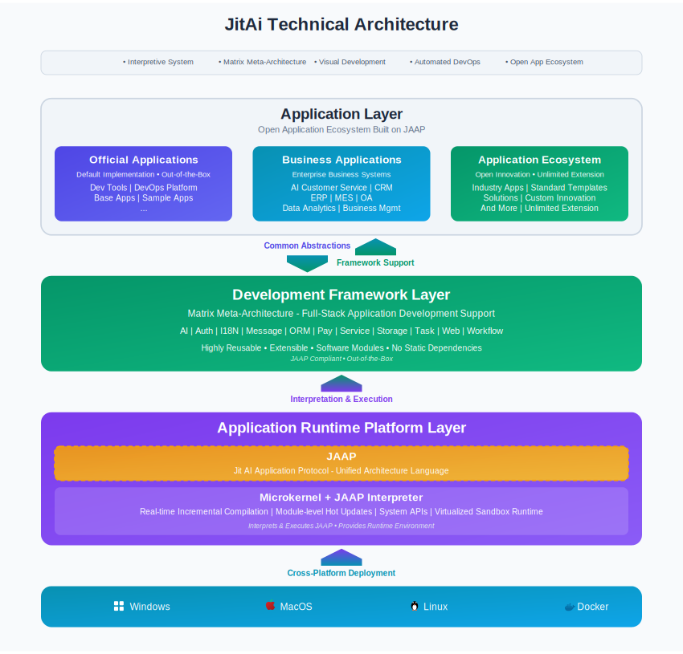
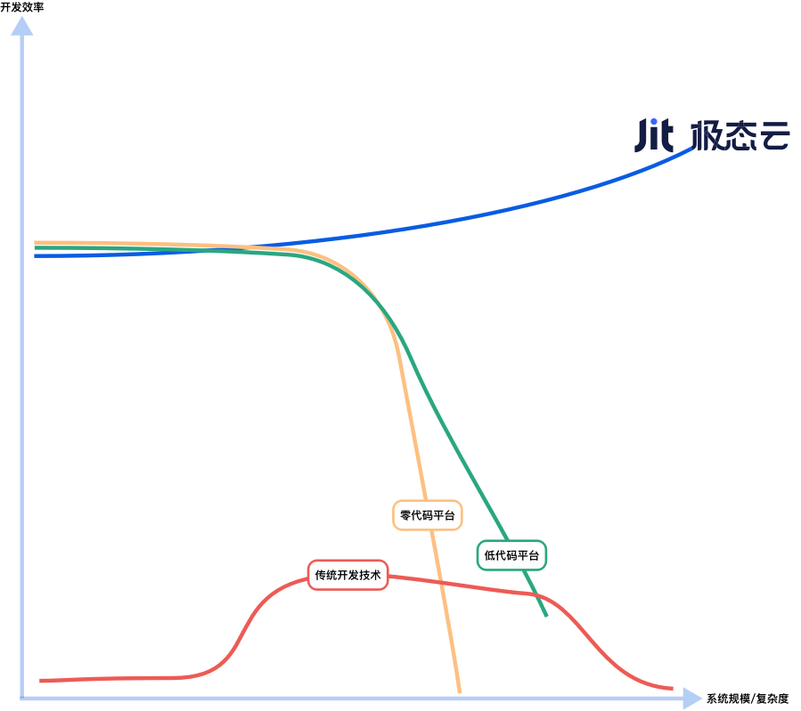

# JitAi简介

太阳底下没有新鲜事。人类科技的发展历史以及产业的发展规律一再证明，划时代的基础科学技术的涌现，一定引发与之配套的应用工程技术的革命，旧的应用工程技术一定会被重构，相应的产品和产业结构会发生根本性替代。

## AI时代的技术变革背景

在动力技术领域，从人力、畜力到蒸汽机动力、内燃机动力，再到有线电力、移动电力的每一次跃进，都引发了应用工具的深刻变革。镰刀、弓箭让位于马车、犁具，进而发展出火车、汽车，直至今天的新能源电动车。

算力技术的演进同样遵循这一规律。从冯诺依曼计算机技术体系、编程语言技术体系，到操作系统技术体系、计算机通信技术体系，再到互联网技术体系，每一层技术突破都催生了应用领域的重大变革。科学计算、生产力工具、游戏娱乐、通信网络、企业管理系统、音视频处理等领域都经历了根本性重构。

每一次划时代的基础科技跨越，都带来应用工具层的技术体系、产品、供应市场的天翻地覆的变化。

从上世纪60年代起，计算机技术就开始大量用于企业生产和管理。随着IT产业基础技术的发展，应用层的企业级应用软件开发技术也经历过几次重大变革。编程语言的出现、操作系统的出现、计算机通信技术的出现、互联网/Web的出现，催生了模块化结构化系统开发、面向对象技术、虚拟机、三层架构、编程框架、服务器/浏览器等工程技术的诞生。

本世纪20年代开始的AI技术涌现，势必带来企业应用的平台、应用架构技术、应用开发框架、开发工具等应用技术的重构。当下，这些重构正在快速发生。JitAi技术，作为企业级应用系统领域的技术体系，是面向AI时代的全新应用工程技术，是全新的系统体系结构、开发范式、技术栈、工具链。

在新旧时代的更替过程中，新的工程技术和产品会在新的需求与旧技术、旧产品、旧秩序的矛盾激化中诞生。

在AI技术应用中，旧技术下的企业AI应用系统开发面临如下问题和挑战：

### AI与传统系统的兼容性问题

AI驱动的助理类和自主决策类应用，需要将应用系统中的各类数据作为知识、各类功能模块作为工具，并能够实时获取、理解知识，实时识别、理解、调用和编排系统模块。

然而，传统软件系统的设计和架构是代码化、编译型的，应用模块往往呈现黑盒、静态、凝固的特征。这些模块缺乏自描述、自加载、原子化无依赖、动态热替换、可扩展、可编排等关键特性。

在这种架构约束下，AI无法理解应用模块的功能特性和使用方法，也无法灵活、动态地单独调用模块。整个系统对于AI而言如同黑盒，AI智能体既无法理解其内部结构，自然也无法调用和控制内部模块和能力。这种状况最终导致"智能孤岛"的形成。

### 定制化开发成本过高

企业本身极为复杂，每个企业都有独特的产品、服务、生态位、业务形态、组织结构和发展历史。正如森林里没有两片完全相同的树叶，地球上没有两个完全一样的人，也没有两个完全一样的企业。这种差异性导致企业业务流程管理类、事务管理类的应用系统存在巨大差异化。

在AI时代，AI助理类应用的差异化更为突出。管理类应用是事务记录系统，而助理类应用是事务执行系统，其复杂度和差异性远超记录系统。差异化意味着定制化，企业传统应用需要定制开发，企业AI应用更需要定制开发。

此外，AI应用类事务执行系统与企业特定业务生产环节的业务性质和内容高度相关，对生产力影响更为显著，导致AI应用范围更广、用户需求变化更频繁，要求AI应用系统能够快速开发和持续迭代。AI应用的开发不仅仅是大模型集成、提示词优化，还包括数据、知识、工具的持续集成和扩展，目标任务的科学拆解、agent智能体的任务编排、AI与UI的协作、输入输出数据的处理等，都需要大量定制化和持续开发。

传统技术体系下，软件开发效率低、门槛高、工程量大、质量难以保障，已成为企业应用系统产业的最大瓶颈。

### 工具集成复用成本过高

AI应用对"工具"的集成需求远超以往，但传统技术体系缺乏简单灵活的统一系统架构和规范，不利于系统灵活扩展和集成各种技术与工具。

企业系统涉及的技术日益丰富，从数据库、Web、安全，到打印、支付、音视频、3D、BIM、APS、IM、文档、存储、物联网、通信、互联网平台、工业设备等，已成为各行业常见需求。然而，这些技术在应用过程中，模块复用度很低，每开发一个新系统都需花费大量精力进行集成。随着AI技术的应用，系统对工具和技术的快速、动态集成需求将越来越多。

软件产业亟需更简单、标准、规范，同时灵活、可无限扩展的系统架构，以降低工具和技术的复用、集成和应用成本。

## 软件工程的根本挑战

当然，上述定制开发效率低、复用和集成成本高的问题，并不仅仅是AI时代的瓶颈。实际上，提高开发效率和复用能力，一直是软件工程持续追求的目标。然而，过去三十年，在基础复用机制、架构模型和开发方式上，并没有取得根本性的突破。

这三十年来，软件工程领域发展最为突出的，是各类编程框架和工具库。但这些编程框架或工具库，往往只解决了某一技术领域的设计模式、框架复用或工具库复用的问题。不同技术领域的开发者发明的框架和工具库各不相同，为了集成各种开发框架和技术工具库，开发者不得不花费大量时间处理技术细节，重复进行基础性工作。同时，由于缺乏大颗粒度的技术封装方法和使用方式，开发者在使用工具库时效率也很低。

近年来，零代码/低代码平台逐渐出现，其本质是一种集成化技术。集成化技术最大的问题在于，集成化往往意味着牺牲"原子化"。原子化能力以及基于原子化能力的编程和编排，是软件开发工程的根本基石。

一旦牺牲了原子化，缺乏编排和编程能力，平台的开发表达能力就会受到限制，稍微复杂的业务就难以实现。开发初期速度或许很快，但后期会越来越慢，甚至比传统开发还慢。因此，这类偏离软件开发基础方法论的零代码/低代码平台，并不是提升开发效率的根本途径。

为从根本上提升软件工程效率，JitAi从封装方法、复用机制、系统架构模型等基础方法入手，探索提升复用度和灵活度的新路径，提出了技术与业务分离、结构与过程分离、声明式与命令式分离等全新方法，有效地将传统编程工作中的编排部分抽离出来，使应用开发逐步转变为以编排为主、编程为辅，极大简化了开发流程。

JitAi从零开始设计应用协议，定义模块化规范，开发相应的应用解释平台。在此基础上，构建了高度集成、规模庞大但使用简单的开发框架，让应用层开箱即用，极大降低了技术复杂度，使应用层代码量减少95%，并以编排为主，显著降低开发难度。同时，JitAi还配套提供图形化编排式开发工具，进一步简化开发过程。

需要特别说明的是，虽然JitAi的开发工具具备强大的"图形化/零代码"快速开发能力，但与传统零代码/低代码平台完全不同。JitAi的图形化开发工具依然基于原子化能力，支持编排和编程，并具备传统开发方法的全部特性。

这一点非常重要，意味着JitAi的开发和表达能力没有上限，开发速度始终不会降低，更不会低于传统开发方式。

## JitAi是什么

JitAi = jit + Ai，意为 just in time for Ai application。

JitAi 是企业级软件和智件（AI智能体）的开发、发布、部署、更新的全栈一体化平台，提供开发企业级软件和AI智能体的完整技术栈。它包含全新的 JitAi 应用平台、JitAi 编程框架、JitAi 开发工具、JitAi 运维工具等产品。通过底层网络环境平台化、系统架构元素化、开发AI化/可视化、部署更新自动化等技术，让企业级系统的开发更简单高效，扩展更灵活自由，功能更强大更智能。

基于 JitAi｜极态，应用开发者可高效开发原生AI化的 aiERP、aiCRM、aiOA、aiBI 等各类系统；工具开发者可以轻松开发特定领域的AI智能体、编程框架、可视化开发工具。

### 开发工具

JitAi 可视化开发工具（又称 Jit IDEApp）用于可视化管理和开发 JitAi 应用的元素，本身也是一个独立的 JitAi 应用。

该工具支持可视化管理，解析应用源代码目录，呈现和管理应用的所有元素及其源码。在可视化开发方面，能够解析元素源代码，可视化展示元素及元素调用关系，支持可视化配置开发元素并自动生成元素代码，极大简化开发门槛、极大提高开发效率和质量。同时支持全代码开发元素的源代码。

工具提供模块化自由组合/搭建、自动生成高质量代码的可视化开发工具和AI开发工具，让应用开发变得极其低门槛、高效率、高质量。支持可视化/AI化搭建各类 AI Agent，让 AI 智能体能够快速在应用系统中调测成型、落地应用。

Jit IDEApp 与应用平台、业务应用、编程框架完全隔离、可独立扩展，且可在业务层应用中直接扩展可视化开发工具，无需依赖官方 IDEApp。基于 IDEApp 进行的开发，即时保存、编译、加载，即时生效。所有元素的呈现和开发都遵从统一的查看、添加、编辑、删除操作模式，简单且可无限扩展。

### 开发框架

JitAi 开发框架是深度覆盖业务系统的、让越来越庞大的系统一直保持优雅健壮的高集成度、高复用度、无限扩展的通用系统模型。这是一个专为 AI 和 GUI 而生的编程框架，简洁、灵活、高集成度，在给业务应用层带来极致简化的同时，仍具备极致的扩展性和自由度。

在系统架构方面，数字化系统由门户、前端页面、前端组件、数据模型、组织架构等元素构成，系统构成简单但灵活，由 JitAi 系统元素可以构建出任意高扩展性、健壮优雅的数字化系统。门户引用页面、页面引用前端组件、前端组件引用数据模型，形成一种链式模型，关系简单，易于裁剪和扩展。开发者可以任意扩展该系统模型。

JitAi 编程框架通过技术层 type 元素，实现了一种通用架构，业务应用无需再进行高门槛的架构设计。框架封装了企业级软件系统开发中常用元素的技术实现层元素，内置多个 meta 族类元素，每个 meta 族类下包含多个 type 种类元素，每个 type 元素封装某一类技术库的实现。基于 type 元素，业务层实例元素只需极简配置或开发，即可表达业务逻辑，进而极简开发出业务系统。开发者可以在自己的业务应用中改写和扩展 meta 元素和 type 元素，实现对编程框架的改写和扩展。

框架支持应用级继承和扩展，实现零依赖、无侵入的复用和扩展，完美解决通用化标品和个性化定制需求的冲突。框架级能力无损复用，业务 App 继承 JitAi 编程框架即自动获得全量技术能力，无需改造代码。元素级动态覆盖，在业务层可任意重写框架中的技术实现元素（如组件/接口/逻辑），天然支持热替换。定义式开发范式下，框架层预置企业级技术元素标准实现（认证/事务/日志等），开箱即用；应用层仅需声明业务定义元素（领域模型/流程规则/UI交互），开发量降低 70%。

### 运维工具

JitAi运维工具（又称 Jit AdminApp），是 JitAi 应用平台内置的一个 JitAi 应用，用于管理 JitNode 上的环境配置和应用，支持分布式集群的管理。

运维工具主要负责开发者组织、运行环境以及应用部署管理。在运行环境管理方面，对一个组织内的集群环境进行管理，创建和删除集群，配置集群中部署的应用、服务器节点、分流权重等。同时提供节点管理功能，对一个组织内部署的所有 JitAi 应用平台服务器节点进行远程管理。此外还负责应用管理和开发者组织管理，接受开发者自主注册、加入组织，对一个组织的开发者成员进行管理。

在部署更新方面，平台支持自动化的部署和更新机制，服务器端也能像浏览器端一样实现"自动按需加载最新应用"，在私有化环境下支持自动部署更新。

### 应用运行平台

JitAi 应用平台（又称 JitNode）是一个本地部署的集成化应用运行环境，运行、支撑和管理应用程序，是企业级应用的"操作系统"。平台通过前后端基础设施平台化、运行环境虚拟化，采用"跨端操作系统 + 跨端应用"的全新架构模式，让应用天然具备分布式、跨端、跨平台、跨语言的特性。

应用平台采用微内核架构，平台和应用都可以无限扩展。应用元素可以是任意形态，可以采用任意编程语言来实现。应用平台涵盖后端、前端、桌面端、移动端，应用元素可以面向任意端来开发，平台处理前后端交互调用关系。

应用平台内置分布式集群能力，并且通过虚拟化运行环境，让应用无需关心物理运行环境。支持应用的继承关系，父应用的元素可以在子应用中直接复用。应用的编译打包、发布、部署、更新升级都实现自动化。

JitNode 有 Windows 桌面版、Mac 桌面版、Docker（Linux）服务器版三个版本。一键安装 JitNode 运行环境，即可拥有所有基础设施，免去各种工具安装的技术复杂度。JitNode 有 GUI 可视化管理界面，可以通过 GUI 管理界面管理本地环境的应用创建、安装。通过 GUI 管理界面，还可以通过操作云端的应用运维平台，管理其上的分布式集群、开发组织及成员。

## JitAi的特点

JitAi 技术体系拥有众多创新特性，令人印象深刻。简单来说，可以从两个方面进行概括：

### 灵动：灵活、动态

在传统技术体系中，应用系统的模块缺乏"自描述"能力，没有"使用说明书"，AI难以准确获取和感知这些模块，也无法动态决策选择和使用模块。传统的工具库、编程框架和业务应用多为"编译型"，模块之间的关联是"硬编码"的，依赖静态且高度耦合，AI无法按需动态加载和调用不同模块，开发者也难以快速为AI编排所需工具。

JitAi设计并制定了JAAP协议，用于规范化构建应用系统和模块，并提供解释型的应用运行平台，实现应用系统及其模块的解释型运行。JitAi平台与JAAP协议的结合，使应用及其模块具备自描述、自加载、高度独立、可替代、可扩展、可编排等特性。

这样，应用及模块能够被AI动态感知、调用和编排，成为解释型系统和模块，让传统应用生态顺利融入AI技术体系，被AI动态感知、使用和驱动。此外，应用及模块的自描述、自加载、可编排和高度独立等特性，使其能够被JitAi开发工具以图形化方式直观、动态地展示、增删、编辑和编排，带来可视化、即时编排的开发体验。

### 轻快：轻量、快速

企业AI应用比传统企业管理软件更复杂、更难规划，往往需要"边用边改"，快速开发、反馈和迭代成为系统成功的关键。

JitAi提供了高集成度的应用运行平台、高复用性和高扩展性的开发框架，以及图形化的编排和编程工具，让业务应用开发变得更简单、轻量、快速和高效。开发者能够轻松应对AI应用的复杂多变和快速迭代，快速构建AI功能与传统功能原生一体化的应用系统。

JitAi设计的跨应用模块继承机制和模块类型化机制，带来了无与伦比的复用与扩展能力，使技术框架类应用和共性业务应用既具备高度复用性，又具备高度扩展性。

基于继承机制和type机制的矩阵型元框架模型，是一种"通用架构语言"，也是高维度的架构模型。它以简洁优雅的方式，实现了技术集成封装与业务表达编排的分离和相互调用，从而让应用系统开发不再需要复杂、高门槛的架构设计。其独特的灵活性和扩展性保证了无论多么复杂的应用场景，系统都能始终保持简洁和灵活。

JitAi基于矩阵型元框架模型开发的JitAi开发框架，是通用、高度复用和高度开放的编排式编程框架，封装了大量应用技术实现，大大简化了业务应用层，使其轻量、简单、高度可扩展和可编排。基于JitAi开发框架的图形化编排和编程工具，通过图形界面构建和编排业务应用，自动生成业务层代码，大幅提升开发效率和质量。

## JitAi体系结构

JitAi构建了一个开放的三层技术架构，实现从基础设施到业务应用的全栈整合。

JitAi 的解释型应用架构协议（JAAP）和解释型应用运行平台，使应用系统具备可被 AI 动态感知、调用和编排的能力，将传统应用生态带入 AI 驱动和 AI 编排时代。

独创的应用继承机制和矩阵型元架构，带来了无与伦比的复用与扩展能力，成为通用统一的架构"语言"。基于矩阵型元架构的高集成度、高开放度的 JitAi 编排式编程框架，使业务层高度可编排，复杂度和工程量大幅降低 90%。

支持图形化编排和编程的开发工具与方式，使开发速度提升 10 倍，帮助开发者从容应对 AI 应用的复杂多变。

自动化的 DevOps 工具链，让 AI 应用的构建、发布、部署和运维变得更加简单和轻量化。

## 对比传统开发技术

相比传统开发技术，JitAi 技术在架构设计上更优雅更健壮。清晰而先进的系统模型和体系结构、简单而精妙的规范，让应用系统从微小到庞大的演进中一直保持优雅和健壮。

在开发效率方面更简单更高效。超大规模、超大颗粒度的封装能力和复用能力，以及丰富的、可无限扩展的、全栈式的编程框架，让系统的开发变得极其简单和高效。零代码可视化的开发工具，极大降低开发门槛，极大提高系统质量，极大提高开发效率。

在扩展性上更灵活更开放。从函数到元素到应用的小、中、大各种级别的颗粒度的扩展改写能力，让系统拥有极致的开放度、扩展性，无限的定制开发自由度。

在运维方面更简单轻松。分布式、全栈式、自主式、微内核的应用容器，让系统的运维（部署、更新、发布、水平伸缩）简单高效。

## 对比零/低代码平台

相比零/低代码平台，JitAi 技术具备显著优势。它可开发高度灵活的自定义页面、组件之间的交互、前后端的交互，支持局部全代码。开发者可自建可复用的类库、使用第三方库。

JitAi 独有的应用继承技术，可创建可复用且同步更新的应用模板。开发者可改写和扩展 JitAi 技术框架中内置的任何特性，包括新页面类型、新组件类型、新模型类型等。支持完全全代码模式，包括全代码页面、全代码组件、全代码样式。

在性能方面，JitAi 直接生成原生代码，不依赖规则引擎，不受规则引擎的制约和性能损耗。支持传统开发工具（如 VSCode）等的全代码开发和调试、代码版本管理和 CI/CD。此外还具备自主分布式集群部署能力。

## 开发效率对比分析

如下图所示，不同开发技术随着系统规模和复杂度的增长，呈现出截然不同的效率变化趋势：

JitAi技术基于AI开发和可视化开发模式，无需处理基础设施和技术细节，从第一天开始就能开发出业务功能，早期效率极高。所见即所得的特性能够及时与需求方沟通确认，大大降低返工风险。

更为重要的是，随着应用系统规模扩大和复杂度增长，基于JitAi技术的开发效率不仅不会降低，反而会持续提高。这种效率递增源于三个核心因素。

首先是通用规范的架构让系统始终保持健壮和优雅，不会因规模增长而增加系统复杂度。其次是可复用能力的不断积累，使业务开发变得越来越简单、快速、高质量。最后是团队规模扩大时能够显著减少沟通成本，系统规模越大，这种效率优势越明显。

零代码平台在开发简单功能时，效率与JitAi相当，甚至会高一些。但是，随着应用系统规模扩大、复杂度增长，基于零代码的开发效率急剧降低。零代码的规则难以表达专业复杂的业务逻辑和需求，只能以各种"别扭"的手法勉强实现，开发效率极低。更严重的是，大部分复杂业务逻辑，零代码技术根本无法表达，只能终止系统的继续演进和增长。

低代码技术为解决零代码的技术局限，在零代码平台基础上的某些局部开发了代码表达能力。但这只能缓解少数场景，相比千行百业纷繁复杂的各种场景需求而言，这种改进作用不大。随着应用系统规模扩大、复杂度增长，其开发效率也急剧下降，无法支撑系统的不断增长和演进。

传统开发技术早期因为有大量基础设施、基础框架、业务架构的准备和设计工作，产出效率极低。中期，业务团队和技术团队逐渐熟悉技术和业务，效率开始提升，但因为业务和技术有太多细节处理，效率仍然处于低位。并且，因为从接收需求到开发出可用功能的时间跨度过长，以及无法所见即所得地确认需求，导致返工成为大概率事件，进一步降低效率。另外，因为团队人数多，人员变动以及人员变动带来的效率降低是大概率事件。后期和长期，随着应用系统规模扩大、复杂度增长，因为系统架构、技术体系的问题，开发效率开始下降，一直降到系统再也难以调整和扩展。

JitAi 技术以其通用规范、极致复用、灵活扩展和高效开发的特性，适用于各类规模和复杂度的应用系统。无论是初创项目还是大型企业级系统，JitAi 都能帮助团队持续保持开发效率和系统质量，简化运维，降低长期演进的难度，为复杂业务场景提供稳健的技术支撑。

