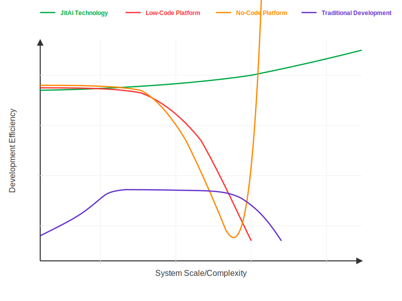

# Introduction

Throughout history, breakthrough foundational technologies have consistently revolutionized their supporting applied engineering systems. Legacy engineering technologies are reconstructed, while corresponding products and industrial structures undergo fundamental transformation.

## Background of Technological Transformation in the AI Era

In power technology, each advancement—from human and animal power to steam engines, internal combustion engines, and eventually electrical power—has triggered profound transformations in application tools. Sickles and bows evolved into horse-drawn carriages and plows, which developed into trains and automobiles, culminating in today's electric vehicles.

Computing technology follows the same evolutionary pattern. From von Neumann architecture and programming languages to operating systems, computer communications, and internet technologies, each technological breakthrough has catalyzed major transformations across application domains. Fields such as scientific computing, productivity tools, gaming and entertainment, communication networks, enterprise management systems, and audio-video processing have all undergone fundamental reconstruction.

Each foundational technological leap brings transformative changes to technology systems, products, and markets at the application layer.

Since the 1960s, computer technology has been extensively adopted in enterprise production and management. As foundational IT technologies evolved, enterprise application software development has undergone several major transformations. The emergence of programming languages, operating systems, computer communication technologies, and the internet/Web has given birth to engineering technologies such as modular structured system development, object-oriented technology, virtual machines, three-tier architecture, programming frameworks, and server/browser architectures.

The emergence of AI technology in the 2020s is driving the reconstruction of enterprise application platforms, architectural frameworks, development tools, and supporting technologies. Currently, these reconstructions are happening rapidly. JitAi represents a completely new application engineering technology for the AI era, featuring novel system architecture, development paradigms, technology stacks, and toolchains specifically designed for enterprise-level applications.

During technological transitions, new engineering solutions emerge to address the growing gap between evolving requirements and legacy technologies, products, and systems.

In AI technology applications, enterprise AI application system development under old technologies faces the following problems and challenges:

### Compatibility Issues Between AI and Traditional Systems

AI-driven assistants and autonomous decision-making applications must treat system data as knowledge and functional modules as tools, requiring real-time knowledge acquisition and understanding, plus the ability to identify, invoke, and orchestrate system modules dynamically.

However, traditional software systems are designed around compiled, code-based architectures where application modules exhibit black-box, static, and rigid characteristics. These modules lack essential features such as self-description, self-loading, atomic independence, dynamic hot-swapping, extensibility, and orchestrability.

Under these architectural constraints, AI cannot understand module functionality or usage patterns, nor can it dynamically invoke individual modules. The entire system appears as a black box to AI agents, which cannot comprehend internal structures or control individual modules and capabilities. This ultimately creates "intelligence silos."

### Excessive Costs of Customized Development

Enterprises are inherently complex, each with unique products, services, market positions, business models, organizational structures, and histories. Like snowflakes or fingerprints, no two enterprises are identical. This differentiation leads to huge variations in enterprise business process management and transaction management application systems.

In the AI era, AI assistant applications exhibit even greater differentiation. While management applications primarily record transactions, assistant applications execute them—a distinction that significantly increases complexity and customization requirements. Differentiation means customization - enterprise traditional applications require custom development, and enterprise AI applications require even more custom development.

Furthermore, AI application execution systems are tightly coupled with specific enterprise business processes, creating a more significant impact on productivity. This leads to broader AI application scope and more frequent user requirement changes, demanding that AI application systems be capable of rapid development and continuous iteration. AI application development involves not only large model integration and prompt optimization, but also continuous integration and expansion of data, knowledge, and tools, scientific decomposition of target tasks, agent task orchestration, AI-UI collaboration, input-output data processing, all requiring extensive customization and continuous development.

Traditional technology systems suffer from low development efficiency, high barriers to entry, extensive engineering requirements, and quality assurance challenges—creating the primary bottleneck in enterprise application development.

### Excessive Costs of Tool Integration and Reuse

AI applications require tool integration capabilities that far exceed traditional requirements, yet legacy systems lack the simple, flexible, unified architectures and specifications needed for seamless technology integration and system expansion.

Modern enterprise systems encompass increasingly diverse technologies—databases, web services, security, printing, payments, multimedia, 3D, BIM, APS, messaging, document management, storage, IoT, communications, internet platforms, and industrial equipment—all of which have become standard cross-industry requirements. However, these technologies suffer from poor module reusability, requiring significant integration effort for each new system development. With the application of AI technology, systems will have increasing demands for rapid, dynamic integration of tools and technologies.

The software industry urgently needs simpler, standardized, yet flexible and infinitely extensible system architectures to reduce the costs of tool reuse, technology integration, and application deployment.

## Fundamental Challenges of Software Engineering

These challenges of low development efficiency and high integration costs are not unique to the AI era. Improving development efficiency and reuse capabilities has been a continuous pursuit in software engineering. However, over the past thirty years, no fundamental breakthroughs have emerged in basic reuse mechanisms, architectural models, and development approaches.

Over the past thirty years, software engineering's most prominent advancement has been the proliferation of programming frameworks and tool libraries. However, these solutions typically address only design patterns, framework reuse, or tool library reuse within specific technical domains. Frameworks and tool libraries developed across different technical fields remain incompatible. Integrating various development frameworks and technical libraries requires developers to spend considerable time managing technical details and repeatedly performing foundational work. Meanwhile, due to the lack of large-granularity technical encapsulation methods and usage approaches, developers are also inefficient when using tool libraries.

No-code/low-code platforms have emerged in recent years as integrated technology solutions. However, integration often comes at the cost of sacrificing "atomization." Atomic capabilities and programming and orchestration based on atomic capabilities are the fundamental cornerstone of software development engineering.

When atomization is sacrificed and orchestration capabilities are limited, platforms become constrained in their development expression capabilities, struggling to implement even moderately complex business logic. Development speed may be fast initially, but will become increasingly slower in later stages, even slower than traditional development. Therefore, no-code/low-code platforms that deviate from fundamental software development principles cannot provide sustainable solutions for improving development efficiency.

To fundamentally improve software engineering efficiency, JitAi addresses foundational elements including encapsulation methods, reuse mechanisms, and system architectural models, exploring new approaches to enhance reuse and flexibility. It introduces novel methodologies including technology-business separation, structure-process separation, and declarative-imperative separation, effectively extracting orchestration from traditional programming tasks. This transforms application development into orchestration-centric workflows with programming as a supporting activity, dramatically simplifying the development process.

JitAi designs application protocols from the ground up, defines modularization specifications, and develops corresponding application interpretation platforms. Built on this foundation, it provides highly integrated, large-scale yet intuitive development frameworks that offer out-of-the-box application layers, dramatically reducing technical complexity and application code by 95% through orchestration-centric approaches that significantly lower development barriers. Meanwhile, JitAi also provides supporting graphical orchestration development tools to further simplify the development process.

Importantly, while JitAi's development tools provide powerful graphical/no-code rapid development capabilities, they differ fundamentally from traditional no-code/low-code platforms. JitAi's graphical tools remain grounded in atomic capabilities, supporting both orchestration and programming while preserving all characteristics of traditional development methodologies.

This distinction is crucial, ensuring that JitAi's development and expression capabilities remain unlimited, with development speed that never decreases and consistently exceeds traditional approaches.

## What is JitAi

JitAi = jit + Ai, meaning "just in time for AI application."

JitAi is a comprehensive full-stack platform for developing, publishing, deploying, and updating enterprise software and intelligent applications (AI agents), providing a complete technology stack for enterprise-grade software and AI agent development. It encompasses the JitAi application platform, programming framework, development tools, and operations tools. Through underlying network environment platformization, system architecture elementization, AI-powered visual development, and automated deployment and updates, it makes enterprise system development simpler and more efficient, extensions more flexible, and functionality more powerful and intelligent.

Using JitAi, application developers can efficiently build natively AI-integrated systems including aiERP, aiCRM, aiOA, aiBI, and other enterprise solutions, while tool developers can easily create domain-specific AI agents, programming frameworks, and visual development tools.

Related Reading: [AI-Native Enterprise Application Development Paradigm](./ai-native-enterprise-app-dev-paradigm)

### Development Tools

JitAi visual development tools (Jit IDEApp) provide visual management and development of JitAi application elements, and are themselves independent JitAi applications.

The tool supports visual management by parsing application source code directories and presenting all elements and their source code within applications. For visual development, it parses element source code, displays elements and their invocation relationships visually, supports visual configuration development, and automatically generates element code, significantly reducing development barriers while dramatically improving efficiency and quality. It also supports full-code development of element source code.

The tool provides modular free combination and construction capabilities, along with visual and AI development tools that automatically generate high-quality code, making application development extremely accessible, efficient, and high-quality. It supports visual and AI-powered construction of various AI agents, enabling rapid testing, formation, and deployment within application systems.

JitAi IDEApp operates independently from the application platform, business applications, and programming frameworks, allowing for independent extension. Visual development tools can be extended directly within business layer applications without depending on the official IDEApp. IDEApp-based development features instant saving, compilation, loading, and immediate effects. All element presentation and development follow unified CRUD (Create, Read, Update, Delete) operation patterns that are simple and infinitely extensible.

Related Reading: [Dual-Mode Visual Development Tool - Programming and Orchestration](./programming-orchestration-dual-mode)

### Development Framework

The JitAi development framework is a universal system model providing deep business system coverage, high integration, high reusability, and infinite extensibility that maintains elegance and robustness as systems scale. This programming framework is specifically designed for AI and GUI development, offering simplicity, flexibility, and high integration that brings ultimate simplification to the business application layer while preserving complete extensibility and freedom.

Architecturally, digital systems comprise elements including portals, frontend pages, frontend components, data models, and organizational structures. This simple yet flexible composition enables JitAi system elements to build highly extensible, robust, and elegant digital systems. Portals reference pages, pages reference frontend components, and frontend components reference data models, forming a chain-like model with simple relationships that are easy to modify and extend. Developers can extend this system model arbitrarily.

The JitAi programming framework implements universal architecture through technical layer type elements, eliminating the need for complex architectural design in business applications. The framework encapsulates technical implementation elements commonly used in enterprise software development, featuring multiple built-in meta-family elements. Each meta-family contains multiple type category elements, with each type element encapsulating specific technical library implementations. Building on type elements, business layer instance elements require only minimal configuration or development to express business logic, enabling dramatically simplified business system development. Developers can rewrite and extend meta elements and type elements in their own business applications, achieving rewriting and extension of the programming framework.

The framework supports application-level inheritance and extension, achieving zero-dependency, non-invasive reuse and extension that perfectly resolves conflicts between standardized products and personalized customization requirements. Framework-level capabilities are reused without loss—business applications inherit the JitAi programming framework and automatically obtain full technical capabilities without code modification. Element-level dynamic overriding enables arbitrary rewriting of technical implementation elements (components, interfaces, logic) within the framework at the business layer, naturally supporting hot swapping. Under the definition-based development paradigm, the framework layer pre-configures standard implementations of enterprise technical elements (authentication, transactions, logging, etc.) for out-of-the-box use, while the application layer only needs to declare business definition elements (domain models, process rules, UI interactions), reducing development volume by 70%.

### Operations Tools

JitAi operations tools (Jit AdminApp) are built-in JitAi applications within the JitAi application platform, used for managing environment configurations and applications on JitNode while supporting distributed cluster management.

The operations tools are primarily responsible for developer organization, runtime environment, and application deployment management. For runtime environment management, they manage organizational cluster environments, create and delete clusters, and configure deployed applications, server nodes, traffic distribution weights, and related settings. They also provide node management functionality for remotely managing all JitAi application platform server nodes deployed within an organization. Additionally, they handle application management and developer organization management, supporting developer self-registration, organization joining, and member management within organizations.

For deployment and updates, the platform supports automated deployment and update mechanisms. The server side achieves "automatic on-demand loading of the latest applications" similar to browser-side behavior, supporting automatic deployment and updates in private environments.

### Application Runtime Platform

The JitAi application platform (JitNode) is a locally deployed integrated application runtime environment that runs, supports, and manages applications, serving as an "operating system" for enterprise applications. The platform adopts a novel architectural model of "cross-platform operating system + cross-platform applications" through frontend and backend infrastructure platformization and runtime environment virtualization, providing applications with inherent distributed, cross-platform, cross-device, and cross-language characteristics.

The application platform uses a microkernel architecture, enabling infinite extensibility for both platform and applications. Application elements can take any form and be implemented in any programming language. The application platform spans backend, frontend, desktop, and mobile platforms, with application elements developable for any platform while the platform manages frontend-backend interactions and invocation relationships.

The application platform features built-in distributed cluster capabilities and, through virtualized runtime environments, abstracts applications from physical runtime environments. It supports application inheritance relationships, enabling direct reuse of parent application elements in child applications. Application compilation, packaging, publishing, deployment, and updates are fully automated.

JitNode is available in three versions: Windows desktop, Mac desktop, and Docker (Linux) server versions. One-click JitNode runtime environment installation provides complete infrastructure, eliminating the technical complexity of multiple tool installations. JitNode features a GUI visual management interface for managing application creation and installation in local environments. Through the GUI management interface, you can also operate cloud-based application operations platforms to manage distributed clusters, developer organizations, and members.

## JitAi Features

The JitAi technology system possesses numerous impressive innovative characteristics. Simply put, they can be summarized from two aspects:

### Dynamic: Flexible and Dynamic

In traditional technology systems, application system modules lack "self-description" capabilities and have no "user manuals," making it difficult for AI to accurately discover and understand these modules, and impossible to dynamically select and utilize modules. Traditional tool libraries, programming frameworks, and business applications are predominantly "compiled" with "hard-coded" inter-module relationships, creating static and highly coupled dependencies. AI cannot dynamically load and invoke different modules on demand, while developers struggle to quickly orchestrate required tools for AI.

JitAi designed and established the JAAP protocol for standardized construction of application systems and modules, providing an interpretive application runtime platform that enables interpretive operation of application systems and their modules. The combination of the JitAi platform and JAAP protocol endows applications and their modules with characteristics including self-description, self-loading, high independence, replaceability, extensibility, and orchestrability.

This enables applications and modules to be dynamically perceived, invoked, and orchestrated by AI, transforming them into interpretive systems and modules that allow traditional application ecosystems to seamlessly integrate into AI technology systems for dynamic perception, utilization, and AI-driven operation. Furthermore, the self-description, self-loading, orchestrability, and high independence characteristics enable applications and modules to be intuitively and dynamically displayed, added, deleted, edited, and orchestrated graphically by JitAi development tools, delivering a visual, real-time orchestration development experience.

### Agile: Lightweight and Fast

Enterprise AI applications are more complex and challenging to plan than traditional enterprise management software, often requiring "iterative development during usage." Rapid development, feedback, and iteration become critical to system success.

JitAi provides highly integrated application runtime platforms, highly reusable and extensible development frameworks, and graphical orchestration and programming tools, making business application development simpler, lighter, faster, and more efficient. Developers can easily manage the complex variability and rapid iteration requirements of AI applications, quickly building application systems with natively integrated AI and traditional functionality.

JitAi's cross-application module inheritance mechanism and module typification system deliver unparalleled reuse and extension capabilities, making both technical framework applications and common business applications highly reusable and extensible.

The matrix-type meta-framework model, based on inheritance and type mechanisms, serves as a "universal architectural language" and high-dimensional architectural model. It achieves separation and mutual invocation of technical integration encapsulation and business expression orchestration elegantly and simply, eliminating the need for complex, high-barrier architectural design in application system development. Its unique flexibility and extensibility ensure that regardless of application scenario complexity, the system maintains simplicity and flexibility.

The JitAi development framework, built on the matrix-type meta-framework model, is a universal, highly reusable, and open orchestration-based programming framework that encapsulates numerous application technology implementations, dramatically simplifying the business application layer to make it lightweight, simple, highly extensible, and orchestrable. Graphical orchestration and programming tools built on the JitAi development framework construct and orchestrate business applications through graphical interfaces, automatically generating business layer code while dramatically improving development efficiency and quality.

## JitAi Architecture

JitAi implements an open three-layer technical architecture, achieving full-stack integration from infrastructure to business applications.

JitAi's interpretive application architecture protocol (JAAP) and interpretive application runtime platform enable AI to dynamically perceive, invoke, and orchestrate application systems, transitioning traditional application ecosystems into the era of AI-driven and AI-orchestrated systems.

The unique application inheritance mechanism and matrix-type meta-architecture deliver unparalleled reuse and extension capabilities, establishing a universal unified architectural "language." The highly integrated and open JitAi orchestration-based programming framework, built on matrix-type meta-architecture, makes the business layer highly orchestrable, dramatically reducing complexity and engineering volume by 90%.

Development tools and methods supporting graphical orchestration and programming increase development speed by 10x, helping developers easily manage the complex variability of AI applications.

Automated DevOps toolchains simplify the construction, publishing, deployment, and operations of AI applications, making them more lightweight.

## Comparison with Traditional Development Technologies

Compared to traditional development technologies, JitAi offers more elegant and robust architectural design. Clear, advanced system models and architectures, combined with simple yet sophisticated specifications, enable application systems to maintain elegance and robustness as they scale from small to large.

In terms of development efficiency, it offers greater simplicity and efficiency. Ultra-large-scale, high-granularity encapsulation and reuse capabilities, combined with rich, infinitely extensible full-stack programming frameworks, make system development extremely simple and efficient. No-code visual development tools dramatically lower development barriers while significantly improving system quality and development efficiency.

In terms of extensibility, it provides greater flexibility and openness. Extension and rewriting capabilities across various granularity levels—from functions to elements to applications (small, medium, large)—provide ultimate openness, extensibility, and unlimited customization freedom.

In terms of operations, it offers greater simplicity and ease. Distributed, full-stack, autonomous microkernel application containers make system operations—deployment, updates, publishing, and horizontal scaling—simple and efficient.

## Comparison with No-Code/Low-Code Platforms

Compared to no-code/low-code platforms, JitAi offers significant advantages. It enables development of highly flexible custom pages, component interactions, and frontend-backend interactions, with support for partial full-code development. Developers can build reusable libraries and integrate third-party libraries.

JitAi's unique application inheritance technology enables creation of reusable application templates with synchronized updates. Developers can rewrite and extend any built-in features within the JitAi framework, including new page types, component types, model types, and more. It supports comprehensive full-code mode, including full-code pages, components, and styling.

Performance-wise, JitAi directly generates native code without rule engine dependencies, eliminating rule engine constraints and performance overhead. It supports full-code development and debugging with traditional development tools (such as VSCode), code version management, and CI/CD, while providing autonomous distributed cluster deployment capabilities.

## Development Efficiency Comparison and Analysis

As illustrated below, different development technologies exhibit distinctly different efficiency trends as system scale and complexity increase:

JitAi technology, leveraging AI-powered and visual development modes, eliminates infrastructure and technical detail management, enabling business functionality development from day one with exceptionally high early-stage efficiency. WYSIWYG (What You See Is What You Get) characteristics enable real-time communication and confirmation with requirement stakeholders, significantly reducing rework risks.

More importantly, as application systems scale and complexity increases, JitAi-based development efficiency not only maintains pace but continues to improve. This efficiency gain stems from three core factors.

First, universal standardized architecture maintains system robustness and elegance consistently, preventing complexity increases due to scale growth. Second, continuous accumulation of reusable capabilities makes business development progressively simpler, faster, and higher-quality. Finally, as team size expands, communication costs are significantly reduced, with this efficiency advantage becoming more pronounced at larger system scales.

No-code platforms achieve efficiency comparable to JitAi, or even slightly higher, when developing simple functionality. However, as application systems scale and complexity increases, no-code-based development efficiency drops dramatically. No-code rules struggle to express complex professional business logic and requirements, implementing them only through various "workaround" methods with extremely low development efficiency. More critically, most complex business logic cannot be expressed through no-code technology at all, forcing termination of continued system evolution and growth.

Low-code technology addresses no-code's technical limitations by developing code expression capabilities in specific areas on top of no-code platforms. However, this addresses only limited scenarios, and compared to the diverse, complex requirements across industries, this improvement has minimal impact. As application systems scale and complexity increases, development efficiency drops sharply, unable to support continuous system growth and evolution.

Traditional development technology exhibits extremely low output efficiency in early stages due to extensive preparation and design work for infrastructure, foundational frameworks, and business architecture. In the middle stage, business and technical teams gradually become familiar with technology and business domains, improving efficiency, but due to numerous business and technical details requiring attention, efficiency remains low. Moreover, due to the extended timespan from requirement receipt to usable functionality delivery, and the inability to confirm requirements through WYSIWYG methods, rework becomes highly probable, further reducing efficiency. Additionally, large team sizes make personnel changes and associated efficiency reductions highly probable events. In later and long-term stages, as application systems scale and complexity increases, development efficiency begins declining due to system architecture and technical system issues, continuing to decline until systems become difficult to modify and extend.

JitAi technology, featuring universal standards, ultimate reuse, flexible extension, and efficient development, suits application systems across all scales and complexity levels. Whether for startup projects or large enterprise systems, JitAi helps teams continuously maintain development efficiency and system quality, simplify operations, reduce long-term evolution complexity, and provide robust technical support for complex business scenarios.

Related Reading: [JitAi vs. Mainstream AI Application Platforms](./jitai-comparison)
