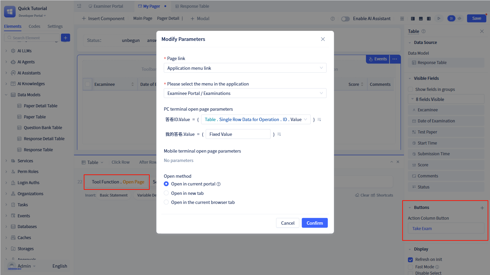
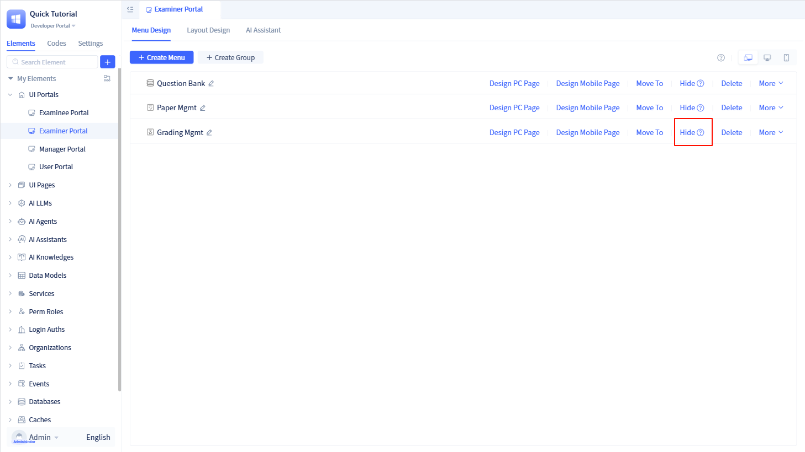

# Implementing Answer Sheet Page with Full Code

## Case Effect

<VideoPlayer relatePath="/docs/tutorial/code_effect.mp4" />

## Implementation Process

### Create Portal

The previous question bank, test creation, and grading functions are all designed for teachers. We will rename the "User Portal" to "Teacher Portal".

At the same time, create a new portal "Student Portal" for students to answer questions and view test scores. The operation is as follows:

import VideoPlayer from '@site/src/components/VideoPlayer';

<VideoPlayer relatePath="/docs/tutorial/code_create_shell.mp4" />

Read [Portal Navigation Design](../../devguide/shell-and-page/portal-navigation-design) for more details.

### Implementing "Answer Sheet Page"

Create page variable "Test Paper ID" and allow passing values through URL;

Create page variable "Test Paper". After the page loads, get test paper details through the test paper ID and store them in the test paper variable.

<VideoPlayer relatePath="/docs/tutorial/code_page_var.mp4" />

Then drag in full-code components to implement the exam page with full code.

<VideoPlayer relatePath="/docs/tutorial/code_component.mp4" />

Read [Full Code Components](../../devguide/fullcode-ui-components-in-pages/ui-component-interface-specifications) for more details.

You can also implement the entire page using full code. Read [Full Code Page Development](../../devguide/shell-and-page/full-code-page-development) for more details.

### Implementing "My Test Papers" Page

Display all my test papers. If not started, click "Take Exam Now" to open the exam page.

Note: Hide the "Answer Sheet" page in the portal, only allow navigation through clicking in "My Test Papers".

