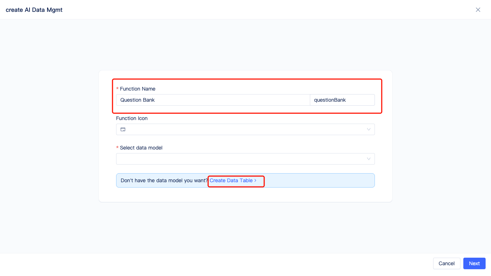
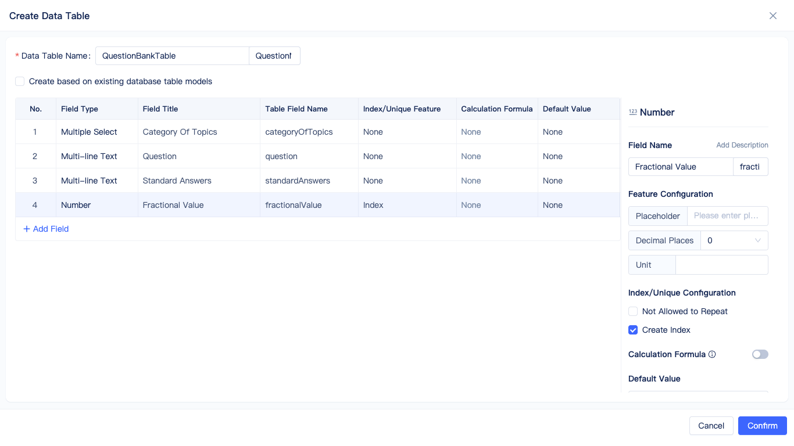
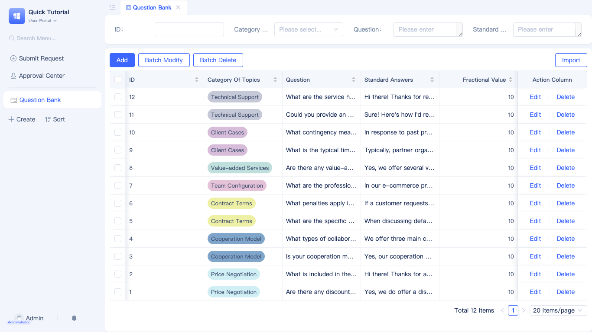
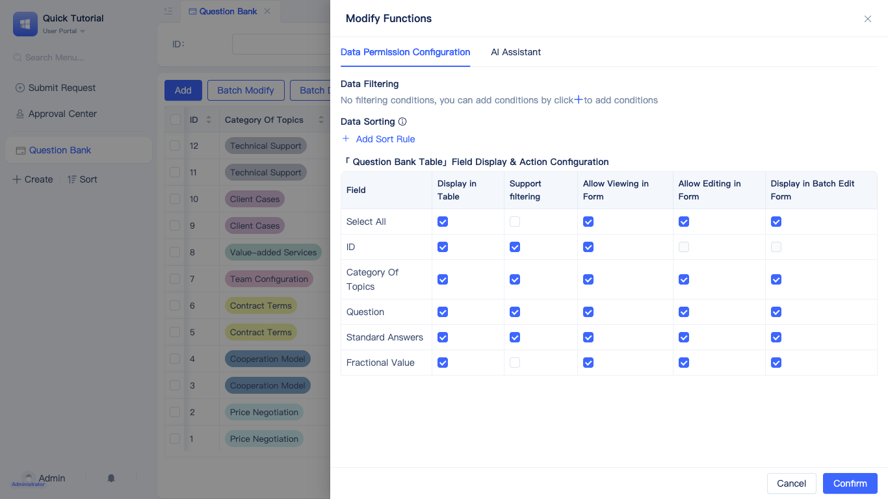
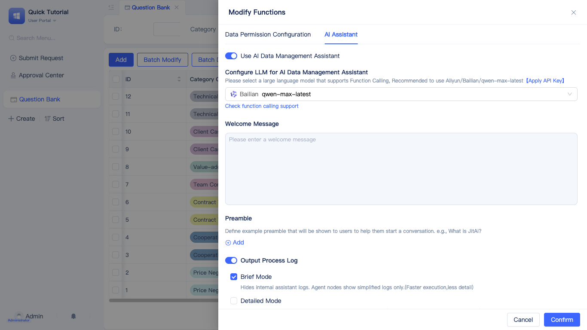
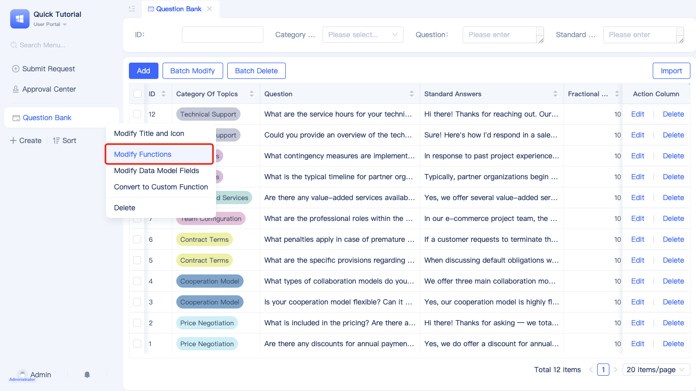

# Building Question Bank Management with Easy Mode

Easy mode is ideal for beginners or rapid development of common business scenarios.

The following demonstrates creating an AI-powered data management system with CRUD operations in 3 simple steps.

import VideoPlayer from '@site/src/components/VideoPlayer';

<VideoPlayer relatePath="/docs/tutorial/en/easy_questions.mp4" />

The data table model can be conceptualized as an Excel spreadsheet, where you configure the title, data type, and settings for each column.

For detailed information, see [AI Data Management Page](../../devguide/shell-and-page/ai-data-management-page).

For more complex business logic and page interactions, proceed to the next article.
