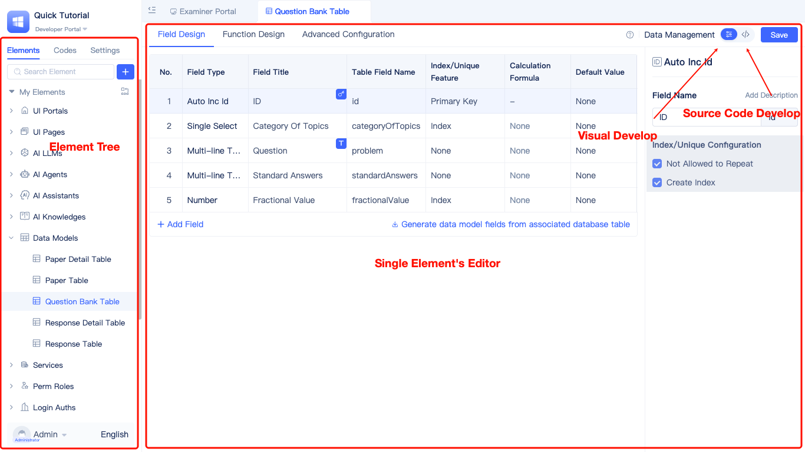
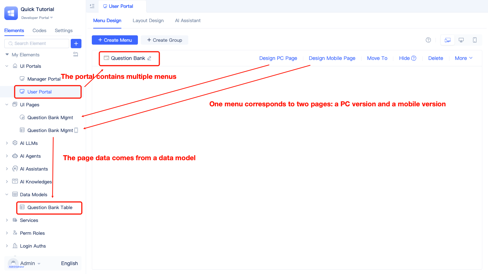
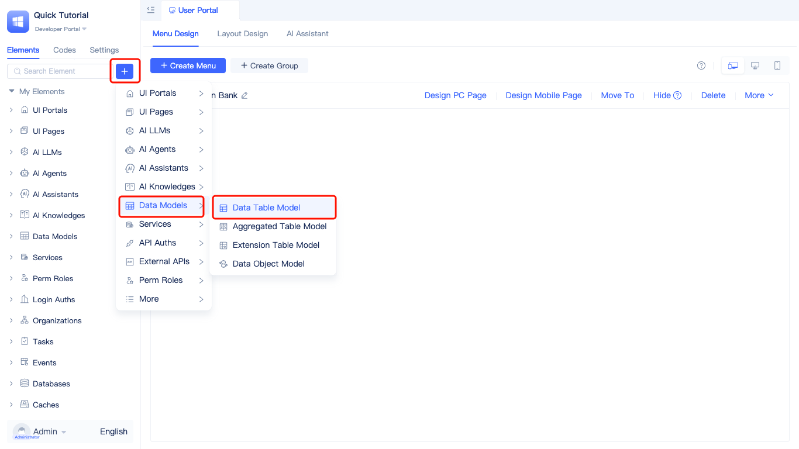
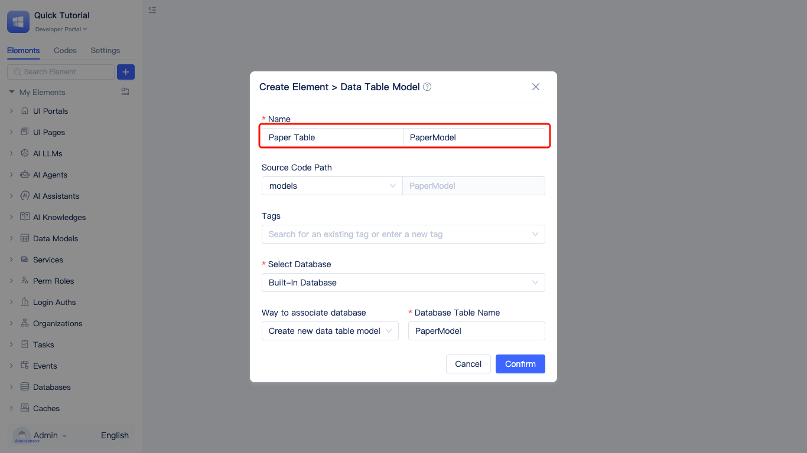
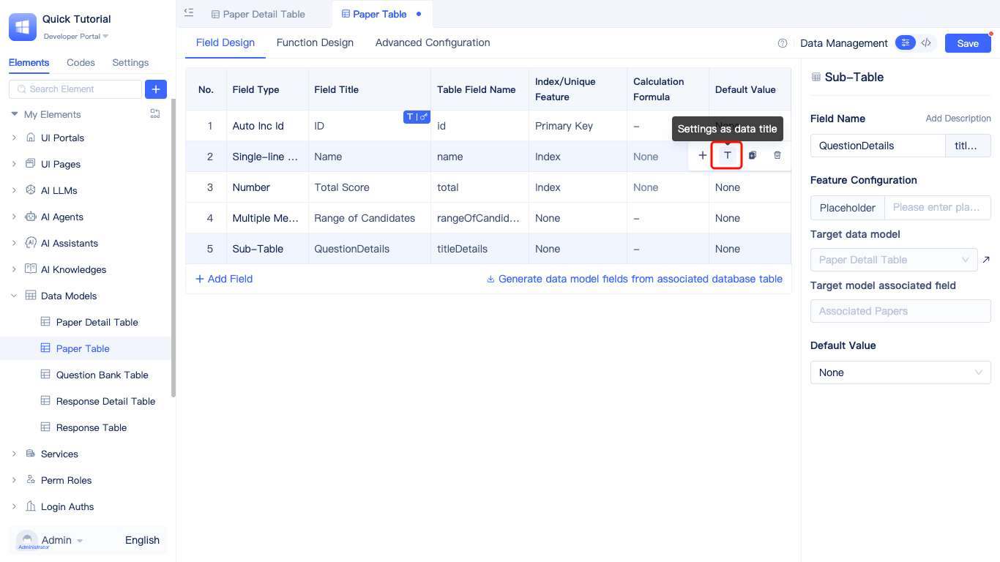
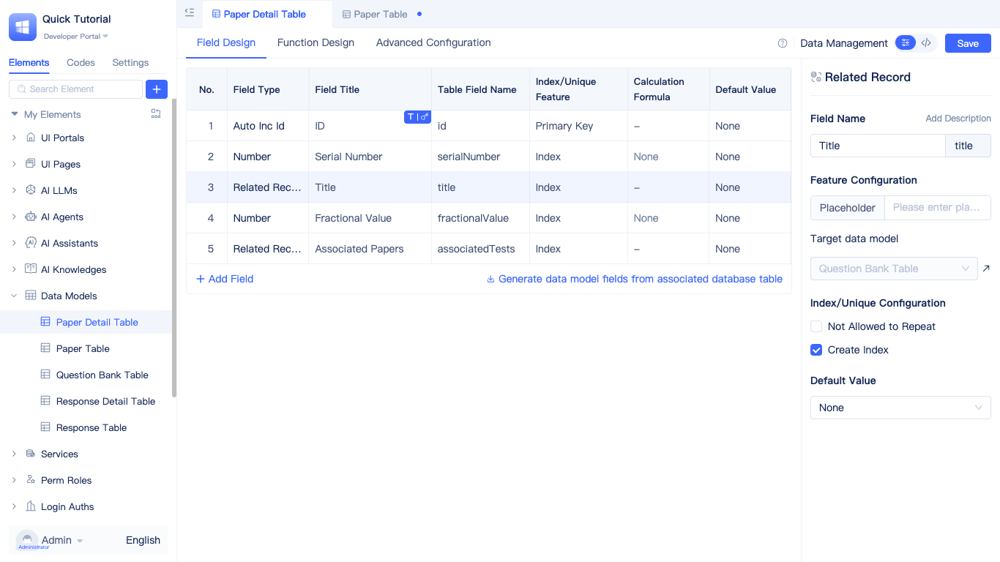

# Building Test Paper Management with Professional Mode

## Professional mode introduction

Professional mode utilizes the "Developer Portal" interface.

JitAi applications comprise elements, with development achieved through adding, deleting, and modifying these elements. Each element represents a module, and element modification constitutes development of that specific module.

Element modules within the JitAi application layer:

* Most consist of orchestration-based structures or parameter definitions configurable through visual interfaces (element editors)
* A smaller portion involves programming-based processing logic that can be coded directly or developed visually using JitAi's programming-based element editors

The developer portal displays the element tree and corresponding editors for each element, including both visual development editors and source code development editors.

For detailed information, see [JitAi Visual Development Tools](../../devguide/development-tool-and-publish-service/visual-development-tool).

Reviewing the previous [Building Question Bank Management with Easy Mode](./easy_mode) step, switching to professional mode reveals the following elements in the "Developer Portal":

* Menu "Question Bank Management" in User Portal
* "Question Bank Table" data model
* "Question Bank Management" PC page and mobile page

Here's an overview of the most essential and fundamental elements:

* **Portal**: A collection of pages oriented toward specific scenarios. For example, you can create a "Examinee Portal" for examinees and a "Examiner Portal" for examiners. Clicking portal menus opens their configured pages. See [Portal Navigation Design](../../devguide/shell-and-page/portal-navigation-design) for details.
* **Page**: The frontend interface that users see and interact with.
* **Data Model**: Similar to Excel tables with built-in CRUD interfaces, enabling pages to directly read and write data. See [Data Modeling](../../devguide/data-modeling/data-table-model) for details.
* **Service**: A collection of interfaces oriented toward specific business scenarios. When built-in CRUD interfaces of data models are insufficient, services extend additional interface capabilities. See [Creating Service Elements](../../devguide/business-logic-development/creating-service-elements) for details.
* **Backend Event**: Triggered to facilitate data flow between multiple business models. For example, after creating a test paper, automatically generating answer sheets for each examinee. See [Event Handling](../../devguide/business-logic-development/event-handling) for details.

## Case effect

import VideoPlayer from '@site/src/components/VideoPlayer';

<VideoPlayer relatePath="/docs/tutorial/en/ide_mode_effect.mp4" />

## Implementation process

### Creating data models

Begin by analyzing the business scenario, considering data structure requirements, and determining necessary data models. For example, "Test Paper Management" requires two data models: Test Paper Table and Test Paper Question Detail Table.

The specific implementation steps are:

Create Entry:

Pager Table Config：

**Note**: Setting descriptive data titles helps locate specific data rows through "Data Title" functionality. Data titles can be updated at any time.

Pager SubTable：

### Creating menus and pages

Now we'll use a more flexible page type (Generic Page) to create the "Test Paper Management" page.

#### Regular page introduction

Pages comprise components that allow flexible layout adjustments for complete interface design freedom. Components connected to data models include built-in data read/write capabilities, enabling local customization through detailed component configuration. Components can configure events and invoke functions from other components, achieving interactive linkage between components. See [Component-based Page Development](../../devguide/shell-and-page/generic-page) for details.

#### Implementing component linkage

<VideoPlayer relatePath="/docs/tutorial/en/ide_mode_page_design.mp4" />

#### Implementing calculation logic within forms

<VideoPlayer relatePath="/docs/tutorial/en/ide_mode_page_form.mp4" />

You can also switch to source code mode for direct code development.

<VideoPlayer relatePath="/docs/tutorial/en/ide_mode_code.mp4" />

### Implementing algorithm-based question generation through service functions

This demonstrates the simplest implementation scenario. Source code mode similarly supports full-code implementation of more complex logic.

<VideoPlayer relatePath="/docs/tutorial/en/ide_mode_func.mp4" />

### Implementing automatic answer sheet creation through backend events

The event configuration is shown below:
