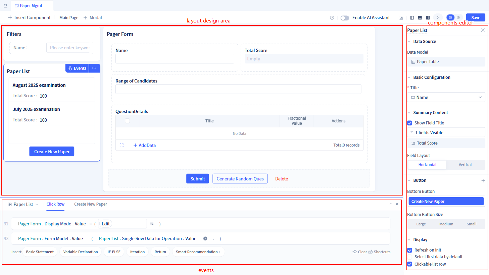

# Building Test Paper Management with Professional Mode

## Professional Mode Introduction

Professional mode refers to the "Developer Portal".

Jit applications are composed of elements, and application development is achieved through adding, deleting, and modifying elements. An element is a module. Element modification is development of that element module.

Element modules at the Jit application layer:

* Most are orchestration-based structures or parameter definitions, which can be configured through visual interfaces (element editors),
* A small portion involves programming-based processing logic that can be written with code, or visual programming can be done using programming-based element editors provided by Jit.

So the developer portal displays the element tree and editors for each element (including visual development editors and source code development editors)

Read [JitAi Visual Development Tools](../../devguide/jitai-visual-development-tools) for more details.

Reviewing the previous step [Building Question Bank Management with Easy Mode](./easy_mode), after switching to professional mode, the following can be found in the "Developer Portal":

* Menu "Question Bank Management" in User Portal
* "Question Bank Table" data model
* "Question Bank Management" PC page and mobile page

Here's a brief introduction to the most core and fundamental elements:

* Portal is a collection of pages oriented towards a specific scenario. For example: we can create a "Student Portal" for students and a "Teacher Portal" for teachers. Clicking menus in the portal will open their configured pages. Read [Portal Navigation Design](../../devguide/shell-and-page/portal-navigation-design) for more details.
* Page is the interface that the frontend sees and operates.
* Data Model is similar to Excel tables and has built-in CRUD interfaces, making it convenient for pages to directly read and write data. Read [Data Modeling](../../devguide/data-modeling/data-table-model) for more details.
* Service is a set of interfaces oriented towards a specific business scenario. When the built-in CRUD interfaces of data models cannot meet requirements, services can be used to extend other interfaces. Read [Encapsulating Business Service Functions](../../devguide/business-logic-development/encapsulating-business-service-functions) for more details.
* Backend Event is triggered through backend events to achieve data flow between multiple model businesses. For example: after creating a test paper, automatically create an answer sheet for each student. Read [Event Handling](../../devguide/business-logic-development/event-handling) for more details.

## Case Effect

import VideoPlayer from '@site/src/components/VideoPlayer';

<VideoPlayer relatePath="/docs/tutorial/ide_mode_effect.mp4" />

## Implementation Process

### Creating Data Models

First analyze the business scenario, consider the data structure, and determine the data models. For example, "Test Paper Management" requires 2 data models for storage: Test Paper Table and Test Paper Question Detail Table.

Specific operation steps are as follows:

<VideoPlayer relatePath="/docs/tutorial/ide_mode_create_table.mp4" />

Note: Setting reasonable data titles helps locate specific rows of data through "Data Title". You can reset data titles at any time.

### Creating Menus and Pages

Now use a more flexible page type (Regular Page) to create the "Test Paper Management" page

#### Regular Page Introduction

Pages are composed of components, allowing flexible adjustment of component layouts for overall interface layout freedom.
Components connecting to data models already have built-in data read/write capabilities for models, achieving local customization freedom through component detail configuration.
Components can configure component events and call functions of other components, thus achieving interactive linkage freedom between components.
Read [Component-based Page Development](../../devguide/shell-and-page/component-based-page-development) for more details.

#### Implementing Component Linkage

<VideoPlayer relatePath="/docs/tutorial/ide_mode_page_design.mp4" />

#### Implementing Calculation Logic within Forms

<VideoPlayer relatePath="/docs/tutorial/ide_mode_page_form.mp4" />

You can also switch to source code mode to write code directly

<VideoPlayer relatePath="/docs/tutorial/ide_mode_code.mp4" />

### Implementing Algorithm-based Question Generation through Service Functions

This demonstrates the simplest scenario. Similarly, source code mode also supports full-code implementation of more complex logic.

<VideoPlayer relatePath="/docs/tutorial/ide_mode_func.mp4" />

### Implementing Automatic Answer Sheet Creation through Backend Events

Event configuration is shown as follows
