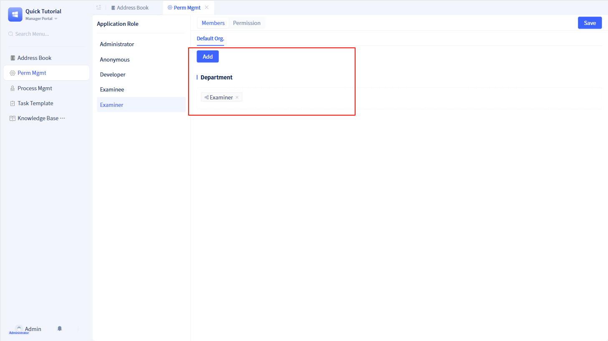

# Implementing Permission Control with Application Roles

## Demo effect

import VideoPlayer from '@site/src/components/VideoPlayer';

<VideoPlayer relatePath="/docs/tutorial/role_effect.mp4" />

## Implementation process

The JitAi application framework includes built-in "Developer" and "Administrator" roles, corresponding to the "Developer Portal" and "Manager Portal" respectively.

This project requires two role types: Examiner and Examinee. Since we've already created "Examiner Portal" and "Examinee Portal" for these roles, permission configuration becomes straightforward.

### Creating application roles and managing permission scope in the "Developer Portal"

You can also click "Configure" for each menu to further configure component-level permissions, enabling precise control over individual buttons, fields, read/write permissions, and more.

### Managing Organizations and Configuring Personnel in the "Manager Portal"

In this application, we'll create "Examiner" and "Examinee" departments.

For detailed information, see [Organizational Structure](../../devguide/user-and-permission/organization).

### Configuring Role Membership in the "Manager Portal"

Add the "Examiner" department to the "Examiner" role's member configuration, and add the "Examinee" department to the "Examinee" role's member configuration.

For detailed information, see [Role and Portal Menu Permissions](../../devguide/user-and-permission/role-portal-menu-permissions).