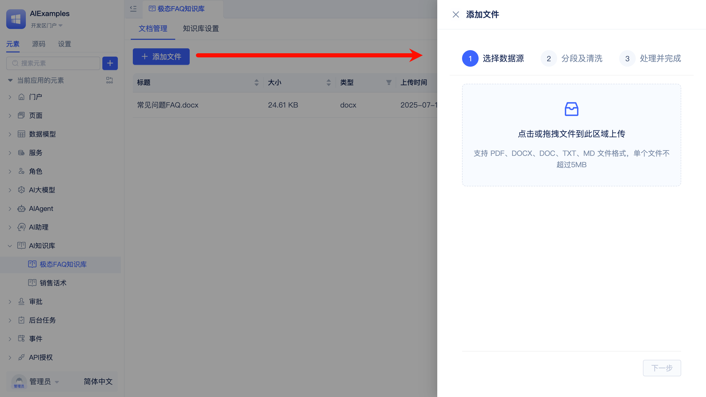
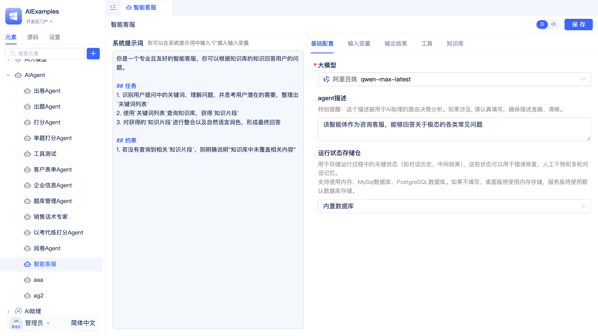
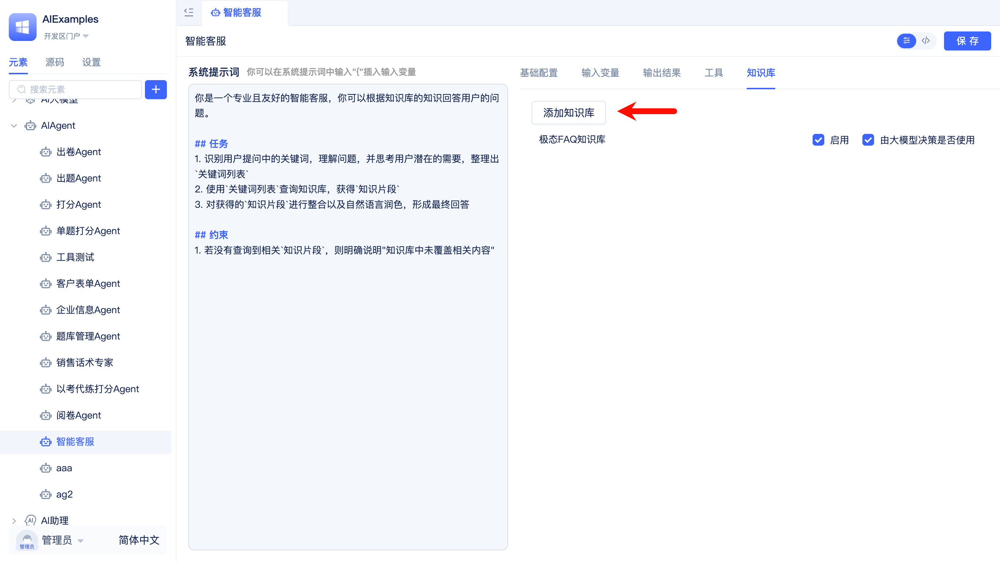
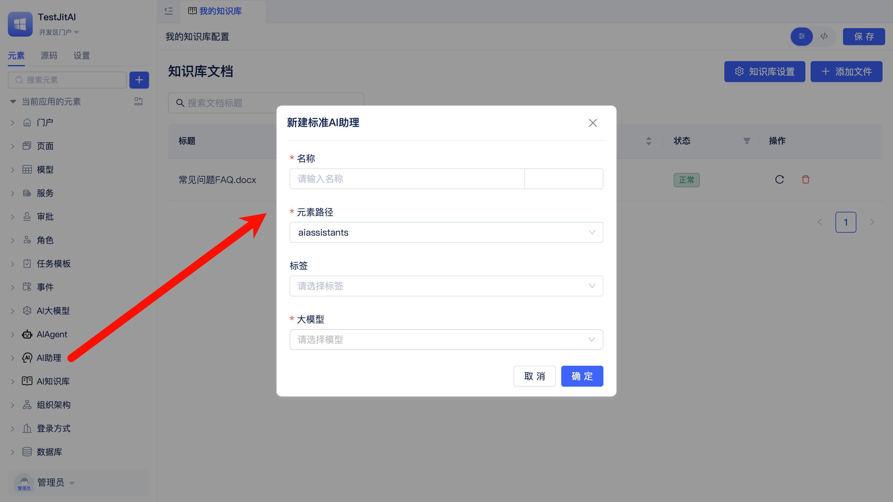

# 开发第一个AI应用（智能客服）
:::info
本文适合新手快速上手。通过对本文的学习，你将有以下收获：
1. 了解极态开发平台的入门使用方式。
2. 独立开发一个智能客服智能体，并集成到业务系统页面中使用。
3. 不支持使用SQLite数据库，请将默认数据库调整为MySQL数据库，关于数据库请参考[JitORM](../../reference/开发框架/JitORM/)。
:::

## 效果预览


---

## 让我们开始吧！
### 准备工作
1. [下载桌面版安装包](./download-installation)（如已安装可跳过）
2. 准备大模型服务 API Key，需开发者自行注册申请（本案例使用[阿里云百炼平台](https://bailian.console.aliyun.com/?tab=model#/api-key)）
3. 准备一份文档，作为知识库内容来源（支持 Word、PDF、TXT、Markdown 格式）

---

### 创建应用
1. 启动桌面版 JitNode，完成激活流程
2. 进入应用管理页面，命名为"TestJitAI"
3. 点击应用列表中的`开发`，进入应用开发区

    

---

### 创建AI大模型实例元素
1. AI大模型->选择一家大模型厂商（本案例中使用阿里云百炼）
2. 配置 API Key，配置备用 API Key（可选）
3. 确定

    

---

### 创建AI知识库实例元素
1. 新建知识库实例元素
   
   

2. 选择向量模型：大模型厂商选择之前创建的AI大模型实例，模型选择text-embedding-v3
3. 选择重排模型：大模型厂商选择之前创建的AI大模型实例元素，模型选择gte-rerank-v2
4. 确定
5. 添加文件
   
   

6. 触发文档向量化任务（服务器版无需手动触发）

    打开一个新的浏览器页签，访问以下地址，触发向量化任务：
    ```shell
    http://127.0.0.1:8080/onTimer
    ```
    
    稍等片刻，向量化任务完成，知识库中文档状态变为`正常`。

    

---

### 创建AIAgent实例元素
1. 新建AIAgent实例元素，命名为`智能客服`
   
   

   ```text title="Agent描述"
   该智能体作为咨询客服，能够回答关于极态的各类常见问题
   ```

   

2. 选择之前创建的AI大模型实例元素
3. 选择模型：qwen-max-latest
   
   

4. 添加知识库：选择之前创建的AI知识库实例元素
5. 编写提示词
    ```markdown title="参考提示词"
    你是一个专业且友好的智能客服，你可以根据知识库的知识回答用户的问题。

    ## 任务
    1. 识别用户提问中的关键词，理解问题，并思考用户潜在的需要，整理出`关键词列表`
    2. 使用`关键词列表`查询知识库，获得`知识片段`
    3. 对获得的`知识片段`进行整合以及自然语言润色，形成最终回答

    ## 约束
    4. 若没有查询到相关`知识片段`，则明确说明"知识库中未覆盖相关内容"
    ```

6. 保存


---

### 创建AI助理实例元素
1. 新建AI助理实例元素，命名为`智能客服`
   
   

2. 添加一个`AI Agent`节点，并选择之前创建的AIAgent实例元素
3. 将`Start`节点连线到名称为`智能客服`的AI Agent节点
4. 设置欢迎语和开场白（可选）
5. 保存


---

### 创建页面并启用AI助理
1. 新建一个`常规页面`实例元素

   

2. 启用AI助理：选择刚才创建的名为`智能客服`的AI助理实例元素，即可在开发区可以直接使用AI助理
   
   

   

3. 在门户->使用者门户->新建菜单->绑定已有页面，用户即可在使用者门户中使用AI助理
    

    


---

## 恭喜你！
你已经学会了极态开发平台的基本使用方式，并开发了一个智能客服智能体。

## 相关文档
- **[新增后端Type元素](../../extguide/后端/新增后端Type元素)** - 学习Type元素扩展开发，包含钉钉机器人集成实战案例


