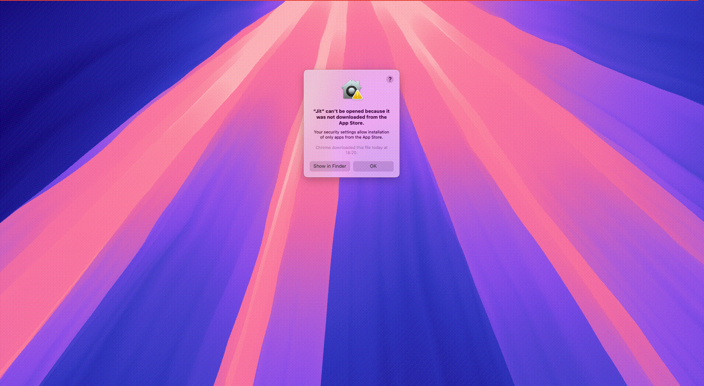

# Download and Installation

JitAi offers two installation options: the Desktop Version (available for Windows and macOS) and the Server Version (distributed as Docker images).

## Desktop Version

Designed for developers to develop, run, debug, and publish applications on personal computers.

The Desktop Version provides separate installers for Windows and macOS platforms.

### Windows

Supports Windows 10 and Windows 11 (64-bit).

Installation steps:

1. [Download the installer](https://apk.jit.pro/latest/windows/jit.exe).
2. Run the .exe file and follow the installation wizard.
3. Complete the activation process as prompted. See [Developer Organization Management](../devguide/installation-activation/developer-organization-management) for detailed instructions.

### macOS

Requires macOS 12.6.0 (Monterey) or later.

Installation steps:

1. Download the appropriate installer: [Intel-based Macs](https://apk.jit.pro/latest/darwin/x64/jit.dmg) or [Apple Silicon Macs](https://apk.jit.pro/latest/darwin/arm/jit.dmg).
2. Open the .dmg file and follow the installation instructions.
3. Complete the activation process as prompted. See [Developer Organization Management](../devguide/installation-activation/developer-organization-management) for detailed instructions.

:::warning
If macOS displays a security warning, click "Done", then navigate to System Settings → Privacy & Security → Security, set "Allow apps downloaded from" to "App Store and identified developers", and click "Open Anyway".


:::

## Server Version

Designed for deploying applications in server environments with multi-threaded processing, clustering capabilities, and high-performance architecture. Suitable for testing and production environments. Supports online development but does not support server-side code debugging. Currently available only as Docker images.

### Installation Steps

1. Install Docker following the [official Docker documentation](https://docs.docker.com/manuals/).

2. Start the JitNode container using the following command:

   ```bash
   docker run -itd --name jit \
     -p 80:80 \
     -p 3306:3306 \
     --init --privileged \
     -v /your/local/path:/data/JitNode \
     jitaiplatform/jit
   ```
   Replace `/your/local/path` with your actual host directory path (e.g., `/Users/username/JitNode` or `/opt/jitnode`).

   :::tip For Chinese Users
   Users in China can use the Alibaba Cloud mirror for faster downloads:
   ```bash
   docker run -itd --name jit \
     -p 80:80 \
     -p 3306:3306 \
     --init --privileged \
     -v /your/local/path:/data/JitNode \
     registry.cn-hangzhou.aliyuncs.com/jitpro/jit
   ```
   :::

3. Open your browser and navigate to `http://{server-IP-address}:80`, then complete the activation process. See [Developer Organization Management](../devguide/installation-activation/developer-organization-management) for detailed instructions.


### Container Parameters

| Required | Parameter | Description |
|---------|------|------|
| **Required** | `--name {ContainerName}` | Container name |
| **Required** | `-p {WebPort}:80` | External port for the web service |
| **Required** | `-p {MySQLPort}:3306` | External port for JitNode's built-in MySQL database (default data storage for new applications) |
| **Optional** | `-p {RedisPort}:6379` | External port for JitNode's built-in Redis cache |
| **Optional** | `-e NODE_ADDRESS={URL}` | Node address for cluster deployments. Cluster nodes use this address to forward requests. Can be configured later via the admin interface |
| **Optional** | `-v {LocalDir}:/data/JitNode` | Volume mount for persistent data including license information, MySQL data, Redis data, node.json, and runtime configurations. Essential for data backup and migration |

```bash title="Example with all parameters"
docker run -itd --name jitnode \
  -p 80:80 \
  -p 3306:3306 \
  -p 6379:6379 \
  -e NODE_ADDRESS=http://your-server-ip:80 \
  --init --privileged \
  -v /your/local/path:/data/JitNode \
  jitaiplatform/jit
```

## Frequently Asked Questions

After installation, we recommend familiarizing yourself with JitAi's directory structure for more effective development and management. See [JitNode Directory](../reference/runtime-platform/jitnode-directory) for details.

<details>
<summary>Desktop Version won't start?</summary>

First, verify that no other process is using port 8080.

</details>

<details>
<summary>How do I change the port number?</summary>

Modify the PORT value in `JitProjects/node.json` (default: 8080).

</details>

<details>
<summary>Where are application source files stored?</summary>

- **Desktop Version**: `JitProjects/environs` folder
- **Server Version**: `/data/JitNode/home/environs` directory

</details>

<details>
<summary>How do I update to a new version?</summary>

**Server Version**: AdminApp displays update notifications at the top of the page. Click to automatically restart and update. For Docker image updates, manually pull the latest image and restart the container, ensuring the volume mapping remains consistent.

**Desktop Version**: Manually close and restart the Jit application.

</details>