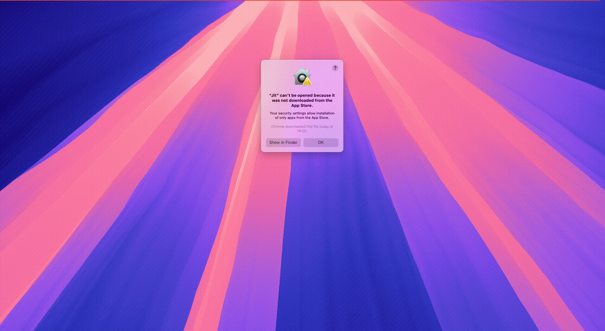

# Download and Installation

JitAI offers two installation options: the Desktop Version (available for Windows and macOS) and the Server Version (deployed with Docker).

## Desktop Version

Designed for developers to develop, run, debug, and publish applications on personal computers.

The Desktop Version provides separate installers for Windows and macOS platforms.

### Windows

Supports Windows 10 and Windows 11 (64-bit).

Installation steps:

1. <a href="https://apk.jit.pro/latest/windows/JitAI-installer.exe" className="analytics-downloadWindows">Download the installer</a>
2. Run the .exe file and follow the installation wizard.
3. Complete the activation process as prompted. See [Developer Team Management](../devguide/installation-activation/developer-team-management) for detailed instructions.

### macOS

Requires macOS 12.6.0 (Monterey) or later.

Installation steps:

1. Download the appropriate installer: <a href="https://apk.jit.pro/latest/darwin/arm/JitAI-installer-apple.dmg" className="analytics-downloadMac analytics-downloadMacApple">Apple Silicon Macs</a> or <a href="https://apk.jit.pro/latest/darwin/x64/JitAI-installer-intel.dmg" className="analytics-downloadMac analytics-downloadMacIntel">Intel-based Macs</a> 
2. Open the .dmg file and follow the installation instructions.
3. Complete the activation process as prompted. See [Developer Team Management](../devguide/installation-activation/developer-team-management) for detailed instructions.

:::warning
If macOS displays a security warning, click "Done", then navigate to System Settings → Privacy & Security → Security, set "Allow apps downloaded from" to "App Store and identified developers", and click "Open Anyway".


:::

## Server Version

Designed for running applications in server environments with multi-process execution, clustering support, and high-performance architecture. Suitable for testing and production environments. It also supports online development, but does not support server-side code debugging.

### Quick Installation

1. Install Docker following the [official Docker documentation](https://docs.docker.com/manuals/).
2. Make sure Docker Compose is available. JitAI prefers the `docker compose` v2 plugin and is also compatible with legacy `docker-compose`.
3. Run the one-click installation script:

   ```bash
   curl -fsSL https://setup.jit.pro/install-jitai.sh | sudo sh
   ```

   The script downloads the deployment package, checks Docker and Docker Compose, and then starts MySQL, Redis, the configuration initialization service, and the JitAI platform services.

4. Open your browser and navigate to `http://{server-IP-address}:80`, then complete the activation process. See [Developer Team Management](../devguide/installation-activation/developer-team-management) for detailed instructions.

### Default Directories

These directories are useful when you need to back up data, inspect runtime files, or customize the server deployment.

| Purpose | Path |
| --- | --- |
| Deployment package directory | `/opt/jitai` |
| Platform configuration directory | `/data/JitNode/home` |
| Platform runtime environments and application source | `/data/JitNode/home/environs` |
| MySQL data directory | `/data/JitNode/databases/mysql/db` |
| Redis data directory | `/data/JitNode/databases/redis/db` |

### Advanced Server Configuration

If you need custom ports, passwords, data directories, or Compose files, use the deployment package and adjust the configuration files directly.

JitAI server deployment usually has two modes:

- **Full-stack mode**: includes MySQL, Redis, the configuration initialization service, and the JitAI platform services
- **Production mode**: deploys only the JitAI platform services and requires external MySQL, Redis, and an existing `node.json`

In these scenarios, the main files to adjust are:

- `deploy/.env`
- `deploy/docker-compose.yml`
- `deploy/docker-compose.prod.yml`
- `/data/JitNode/home/node.json`

### Environment Variables

Docker Compose automatically reads `deploy/.env`.

- **Full-stack mode** uses MySQL, Redis, and app-level variables.
- **Production mode** uses app-level variables only. MySQL and Redis connection information is maintained in `/data/JitNode/home/node.json`.

| Variable | Used In | Description |
| --- | --- | --- |
| `MYSQL_ROOT_PASSWORD` | Full-stack mode | Root password for the built-in MySQL service |
| `MYSQL_USER` | Full-stack mode | MySQL username |
| `MYSQL_PORT` | Full-stack mode | Exposed host port for MySQL |
| `MYSQL_DATA_DIR` | Full-stack mode | Host directory for MySQL data |
| `REDIS_PASSWORD` | Full-stack mode | Password for the built-in Redis service |
| `REDIS_PORT` | Full-stack mode | Exposed host port for Redis |
| `REDIS_DATA_DIR` | Full-stack mode | Host directory for Redis data |
| `CONFIG_DIR` | Both modes | Directory that stores `node.json`, logs, runtime environments, and other application data |
| `TIME_ZONE` | Both modes | Time zone used by the server deployment |

```bash title="Example deploy/.env"
# MySQL
MYSQL_ROOT_PASSWORD=your_password
MYSQL_USER=root
MYSQL_PORT=3307
MYSQL_DATA_DIR=/data/JitNode/databases/mysql/db

# Redis
REDIS_PASSWORD=your_redis_password
REDIS_PORT=6389
REDIS_DATA_DIR=/data/JitNode/databases/redis/db

# App
CONFIG_DIR=/data/JitNode/home
TIME_ZONE=Asia/Shanghai
```

### node.json

The core application runtime configuration file is located at:

```text
/data/JitNode/home/node.json
```

It maintains MySQL and Redis connection information for the JitAI platform.

```json
{
  "MYSQL": {
    "HOST": "mysql",
    "PORT": 3306,
    "USER": "root",
    "PASSWORD": "your_password"
  },
  "REDIS": {
    "HOST": "redis",
    "PORT": 6379,
    "PASSWORD": "your_redis_password",
    "DB": 0
  }
}
```

- In **full-stack mode**, `config-init` generates this file automatically.
- In **production mode**, create it manually from `node.json.template`.
- The container validates this file on startup.

## Frequently Asked Questions

After installation, we recommend familiarizing yourself with JitAI's directory structure for more effective development and management. See [JitNode Directory](../reference/runtime-platform/jitnode-directory) for details.

<details>
<summary>Desktop Version won't start?</summary>

First, verify that no other process is using port 8080.

</details>

<details>
<summary>How do I change the port number?</summary>

- **Desktop Version**: modify the `PORT` value in `JitProjects/node.json` (default: `8080`).
- **Server Version**: modify the port mappings in `deploy/docker-compose.yml` or `deploy/docker-compose.prod.yml`, then restart the services.

</details>

<details>
<summary>Where are application source files stored?</summary>

- **Desktop Version**: `JitProjects/environs` folder
- **Server Version**: `/data/JitNode/home/environs` directory

</details>

<details>
<summary>How do I update to a new version?</summary>

**Server Version**: AdminApp displays update notifications at the top of the page. Click to automatically restart and update. If you manage the Docker deployment package yourself, update the images and restart the services while keeping the same data directories and configuration files.

**Desktop Version**: Manually close and restart the Jit application.

</details>
