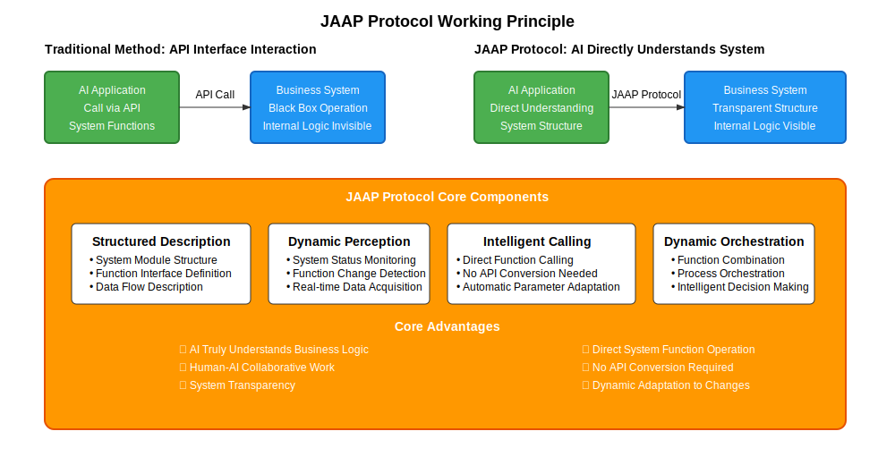
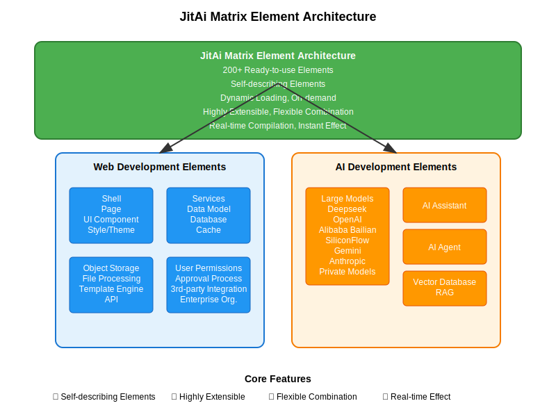
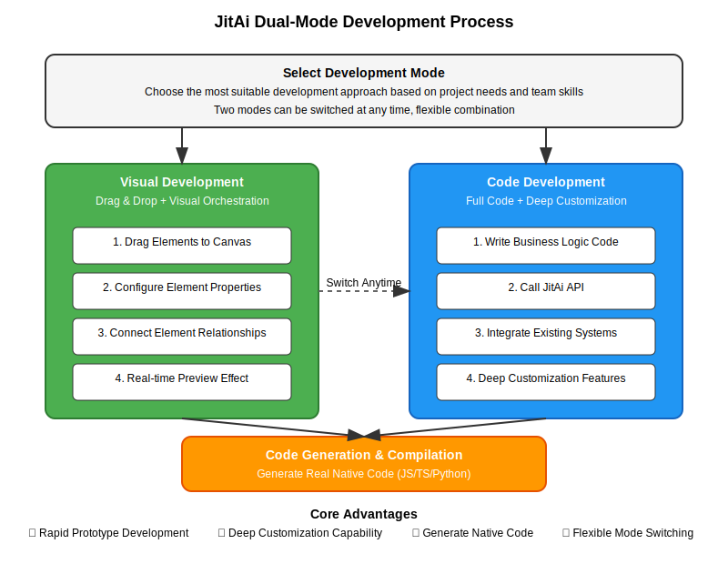
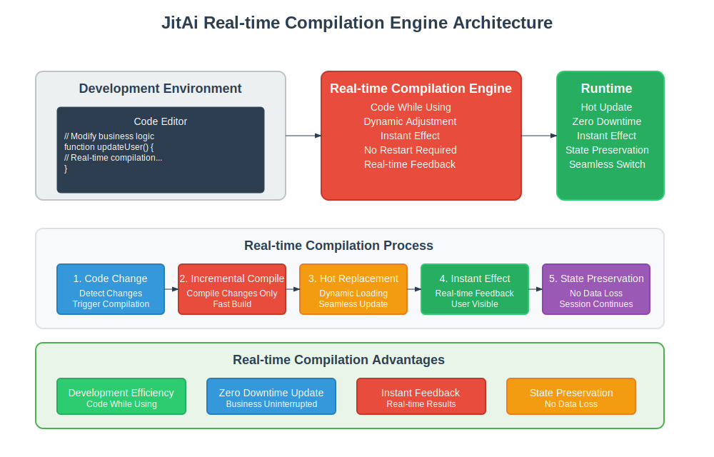
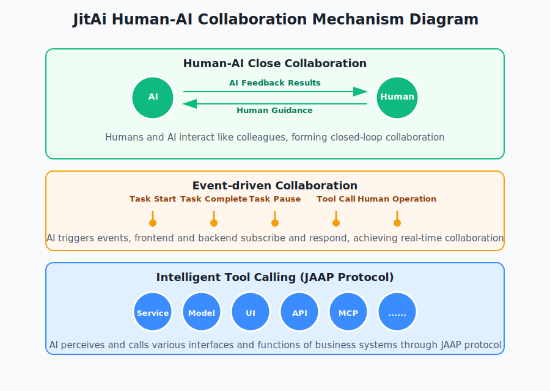

# JitAi vs. Mainstream AI Application Platforms

## Why Choose JitAi?

> Imagine AI that not only answers questions but also operates business systems directly, adjusts workflows, and collaborates with you on frontend interfaces like a knowledgeable colleague. JitAi transforms AI from a mere "tool" into a true "intelligent work partner."

Numerous AI development platforms exist in the market, including Coze, Dify, and n8n. While these platforms have lowered the barrier to AI application development, they face a critical limitation: AI applications built on these platforms are typically confined to specific scenarios and lack deep integration capabilities with existing business systems.

Traditional AI applications, despite having powerful analytical capabilities, are constrained by interface interaction patterns and cannot directly access internal business system data. They can only respond based on limited user-provided information, severely constraining their practical value.

JitAi adopts a fundamentally different technical approach. Through interpretive system architecture, AI gains deep understanding of internal business system structures and operational logic. Beyond business logic comprehension, AI can directly operate system functions and achieve human-machine collaboration on frontend interfaces, truly becoming an intelligent business partner.

The following analysis explores JitAi's technical implementation principles and core differences from traditional AI development platforms.

## JitAi's Unique Technical Advantages

### Six Unique Technical Breakthroughs

**1. Enabling True Business Understanding - Interpretive System**

JitAi's **Interpretive System** represents an **industry-first** technical breakthrough in application engineering technology designed for the AI era. Through the innovative JAAP protocol, AI can "see through" entire business systems, directly understanding module structures, functions, and interrelationships to achieve deep business system integration.

The JAAP protocol transforms application systems into intelligent environments that can be dynamically perceived, loaded, orchestrated, and scheduled by AI, bringing traditional application ecosystems into the AI-driven real-time orchestration era. AI assistants not only answer business questions but also intelligently adjust business processes based on real-time conditions, functioning like professional business experts. Moreover, JitAi's AI directly operates frontend interfaces beyond simple backend API calls, enabling close human-machine collaboration on frontend pages—a unique capability among platforms.

**2. Application Inheritance Mechanism - Enterprise-Grade Reusability**

JitAi's application inheritance mechanism enables module function reuse, achieving "develop once, use everywhere" while eliminating duplicate development. We provide 200+ ready-made elements covering Web development (portals, pages, frontend components, I18N, backend services, data models, databases, approvals, events, tasks, caching, object storage) and AI development (large models, vector databases, RAG knowledge bases, AI Agents, AI assistants), all packaged for out-of-the-box use. You can override and replace inherited elements with real-time compilation taking effect immediately.

**3. Matrix Element Architecture - Orchestration-Centric Development Framework**

JitAi's matrix element architecture is built on a highly integrated orchestration programming framework, making business layer applications primarily entity-orchestrated while reducing complexity and engineering effort by 90%. Through the element self-description protocol (JAAP), each element automatically describes its functions and interfaces, enabling AI understanding and utilization. Components operate independently and combine freely, supporting flexible composition with high configurability. Developers can customize new element families, enabling complete custom extensions. This orchestration-centric approach significantly improves development flexibility while dramatically reducing complexity.

**4. Dual-Mode Development - Graphical Orchestration + Code Development**

JitAi supports both graphical orchestration and programming development methods, increasing development iteration speed by 10x while enabling developers to confidently handle the complexity and variability of production-grade AI applications. Drag-and-drop development requires no coding—you can build applications through drag-and-drop, generating real code (JS/TS/Python) rather than DSL requiring black-box engine interpretation.

When visual development cannot meet requirements, you can transition directly to code development. Generated code runs directly without special interpreters, enabling both rapid prototyping and deep customization.

**5. Real-Time Compilation Engine - Edit and See, Immediate Effect**

JitAi's real-time compilation engine supports real-time editing and preview, with changes taking effect immediately without compilation delays, dramatically improving development efficiency. This mirrors the instant save and preview functionality of document editing.

**6. Automated Operations - Simplified Deployment and Updates**

JitAi provides comprehensive automated operations tools, dramatically simplifying publishing, deployment, and update processes. Eliminate concerns about complex server configurations—focus solely on business logic development while significantly reducing operational costs and technical barriers.

### JitAi's Core Technical Advantages

Traditional AI application development faces a fundamental limitation: AI can only "communicate" with business systems through interfaces, like feeling an elephant while blindfolded, obtaining only limited exposed information without understanding internal business logic.

JitAi enables AI to "see through" entire business systems and truly understand business logic. This provides AI with deep insight capabilities, revealing all internal system details and transforming interactions from "tool usage" to "intelligent collaboration."

**Core Difference**: Traditional AI platforms primarily provide specialized tool functions for specific scenario problems; JitAi is a comprehensive development platform supporting full-stack business system development from frontend to backend.

### How Does AI Achieve Deep Business Understanding and Close Human Collaboration?

JitAi enables AI to achieve deep business system understanding and close human collaboration through:

1. **Close Human-Machine Collaboration**: AI assistants support genuine human-machine interaction, with AI providing processing results to users while users guide AI's subsequent operations based on these results, achieving true human-machine synergy.

2. **Event-Driven Collaboration**: AI triggers events at critical operational points (task start/completion, tool calls, task pauses, personnel operations). Both frontend and backend components can subscribe to these events and respond accordingly, enabling real-time synchronization and collaborative work between AI and the system.

3. **Intelligent Tool Invocation**: Each functional module exposes interfaces through the JAAP protocol, which AI can perceive and invoke as tools, including various frontend page operations. AI can flexibly invoke functional modules for on-demand use.

These methods work synergistically to achieve AI's deep business system understanding and close human collaboration.

## Technical Capability Comparison

### Core Problem Solution Comparison

#### Problem 1: How Can AI Understand Your Business System?

| Platform | Solution | Technical Implementation | Effect |
|:---|:---:|:---:|:---|
| **JitAi** | Interpretive System | JAAP protocol enables AI to see through business internals | AI achieves deep business logic understanding |
| **Coze** | API Call Mode | Retrieves business data through interfaces | Basic business data interaction |
| **Dify** | Workflow Orchestration | Canvas-style process design | Business process automation |
| **n8n** | Node Connection | Data flow between systems | Cross-system data integration |

*Core Difference: JitAi is a comprehensive development platform; other platforms primarily provide specialized tool functions*

#### Problem 2: How Can AI Collaborate with Humans?

| Platform | Solution | Technical Implementation | Effect |
|:---|:---:|:---:|:---|
| **JitAi** | Deep Collaboration Mode | AI directly operates business functions | Genuine intelligent partner collaboration |
| **Coze** | Dialogue Interaction Mode | Chatbot-style interaction | Basic Q&A interaction |
| **Dify** | Agent Work Mode | AI agent executes tasks | Task automation execution |
| **n8n** | Process Trigger Mode | Event-driven workflow | Automated process execution |

#### Problem 3: How Can Development Efficiency Be Improved?

| Platform | Solution | Technical Implementation | Effect |
|:---|:---:|:---:|:---|
| **JitAi** | Drag + Code Development | Graphical orchestration + coding, real-time preview, one-click deployment | 10x development efficiency improvement |
| **Coze** | Visual Development | Drag-and-drop interface design | Rapid prototyping |
| **Dify** | Canvas Orchestration | Visual workflow design | Complex process orchestration |
| **n8n** | Node Connection | Drag-and-drop node connection | Rapid process building |

### Technical Capability Comparison

| Capability | JitAi | Coze | Dify | n8n | Description |
|:---|:---:|:---:|:---:|:---:|:---|
| **Business Understanding** | ✅ Deep Understanding | ⚠️ Interface Interaction | ⚠️ Interface Interaction | ❌ None | AI's understanding level of business systems |
| **Human-Machine Collaboration** | ✅ Deep Collaboration | ⚠️ Basic Dialogue | ⚠️ Basic Dialogue | ❌ None | AI's capability as a work partner |
| **Frontend Operation** | ✅ Direct Operation | ❌ Not Supported | ❌ Not Supported | ❌ Not Supported | AI's capability to operate user interfaces |
| **Development Method** | ✅ Drag + Code | ❌ Not Supported | ⚠️ Canvas Only | ⚠️ Node Only | Business layer development capability |
| **Development Efficiency** | ✅ 10x Improvement | ✅ Rapid Prototyping | ⚠️ Requires Technical Skills | ⚠️ Requires Technical Skills | Development efficiency comparison |
| **Code Quality** | ✅ Native Code | ⚠️ Encapsulated Code | ⚠️ Encapsulated Code | ⚠️ Encapsulated Code | Maintainability of generated code |
| **Real-Time Preview** | ✅ Immediate Effect | ❌ Not Supported | ❌ Not Supported | ❌ Not Supported | Dynamic adjustment capability |
| **One-Click Deployment** | ✅ Fully Automated | ⚠️ Basic Deployment | ⚠️ Requires Configuration | ⚠️ Requires Configuration | Operations automation level |
| **Extension Capability** | ✅ Enterprise Grade | ⚠️ Modular | ⚠️ Component-based | ⚠️ Node-based | System extension capability |

## Summary

### Other Platforms: "Specialized Experts" with Distinct Strengths

Consider a house renovation scenario:
- **Coze** is like a "quick renovation specialist" who can rapidly set up a model room, but you must handle the details yourself
- **Dify** is like a "premium renovation expert" who assists with complex custom renovations but requires professional guidance for maximum effectiveness
- **n8n** is like a "systems integrator" who specializes in connecting various pipes and circuits but doesn't design overall layouts

Each excels in their specialty but addresses only part of the challenge. You need multiple specialists and must act as a "contractor" to coordinate them.

### JitAi: A Comprehensive "Intelligent Construction Company"

JitAi functions as a fully qualified intelligent construction company:

**Collaboration Mode**: Beyond a development tool, JitAi serves as an intelligent partner that understands business logic, enabling real-time user-AI collaboration within the same working environment.

**Business Understanding Capability**: Traditional platform AI lacks business context understanding and merely executes instructions. JitAi's AI possesses deep business understanding capabilities, proactively identifying business scenarios, intelligently invoking appropriate interfaces, and providing business recommendations.

**From Design to Delivery**: Frontend interfaces, backend logic, database design, API interfaces, deployment operations—comprehensive one-stop service. Eliminate frequent tool switching and data format compatibility issues.

### Core Difference: From "Using AI" to "Collaborating with AI"

**Traditional Way**: You → Tell AI what to do → AI executes → You check results

**JitAi Way**: You ↔ AI ↔ Business System, three-way real-time collaboration

This transforms interactions from "tool usage" to "intelligent collaboration." AI evolves from a cold tool into a true intelligent partner that understands your business and collaborates deeply.

This is why JitAi redefines AI application development—transforming AI from a "useful tool" into a true "work partner who understands you."
