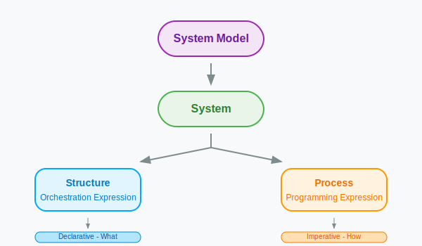

# Dual-Mode Visual Development Tool - Programming and Orchestration
传统开发工具本质上都是面向编程的——开发者需要在编程过程中集成各类技术框架，编写业务逻辑代码。[JitAi开发框架](../reference/framework)通过封装技术基础设施和通用业务组件，提供了开箱即用的元素族类。但如何让开发者更轻松、更直观地使用这些能力，则需要原生适配的开发工具来解决。

**IDEApp** 是JitAi打造的编程与编排双模式的企业级应用开发工具，是一个独立的JitAi应用，每个应用都默认继承IDEApp的能力，**进入应用开发区即可直接使用**。IDEApp自适应开发框架的扩展变更以及开发者自定义的元素族类，支持可视化开发与全代码开发模式的无缝切换。

## 编程与编排
任何复杂系统都由**结构**和**过程**两个基本要素构成，而开发工具的使命就是让开发者能更轻松地进行结构和过程的构建，这是JitAi开发工具的设计哲学。

- **结构（Structure）**：系统的组成模块及其相互关系，通过**编排**来表达
- **过程（Process）**：系统运行时的行为序列和逻辑流程，通过**编程**来表达

**编排的本质**是对结构对象的配置和组合，可以通过GUI可视化、代码编写等多种方式实现。

**编排依赖编程**：编程产生函数，将"函数嵌入对象中"形成新的结构，这就是编排。

**编程依赖编排**：编排产生对象，"在函数中使用对象"实现过程序列，这就是编程。

## 双模统一
双模即可视化开发和全代码开发两种模式。**"双模统一"不是简单的两种开发模式并列，而是深层次的架构统一理念**。两种模式都可以进行编排工作，区别在于编排的表现形式和操作方式不同，且两者可以无缝切换。

### 可视化开发模式
- **可视化设计**：基于拖拽式图形界面构建应用，自动分析应用源代码目录结构和依赖关系
- **高质量代码生成**：通过图形化操作自动生成结构描述代码和过程描述代码，确保代码质量
- **开发即生产**：开发环境中的配置和效果与生产环境完全一致，确保开发阶段的预览效果即为最终上线效果
- **统一管理界面**：在统一界面中展示和管理所有元素，通过可视化界面进行元素配置编辑

### 全代码开发模式
为专业开发者提供完整的编程控制能力，不受限制的自由扩展与改写。

- **完全编程控制**：提供完整的代码编写和控制能力，满足复杂业务逻辑和高度定制化需求
- **混合开发模式**：与GUI编排模式无缝切换和实时同步，在同一项目中灵活组合使用
- **企业级定制**：深度系统集成、性能精细化调优等企业级特性实现

### 两种模式统一于四个维度
#### 1. 技术架构统一
- 两种模式都基于**JAAP架构**
- 产生相同的**元素结构**和**代码产物**
- 遵循统一的**系统模型**抽象

#### 2. 开发体验统一
- **即时响应机制**：自动即时保存、增量编译机制、按需加载、实时预览反馈
- **统一操作范式**：对所有应用元素均遵循统一的CRUD操作模式（查看、添加、编辑、删除）
- **无缝模式切换**：两种开发模式可在同一项目中灵活切换和混合使用
- **场景化适配**：针对不同开发场景和复杂度需求选择最优开发模式

#### 3. 结果等价统一
- 两种方式可以产生**功能完全相同**的应用
- **开发即生产**：开发环境效果等同生产环境
- **质量标准一致**：无论用哪种方式都能保证可控的代码质量

#### 4. 理论基础统一
- 都基于**系统=结构+过程**的理论模型
- **编排表达结构，编程表达过程**

