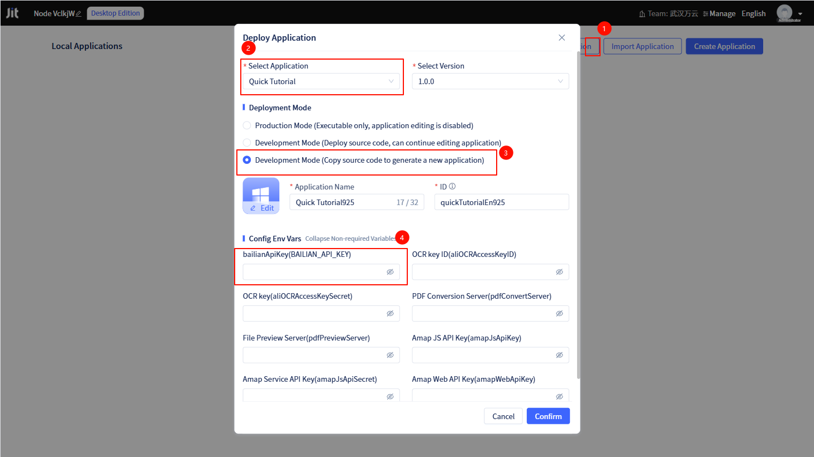
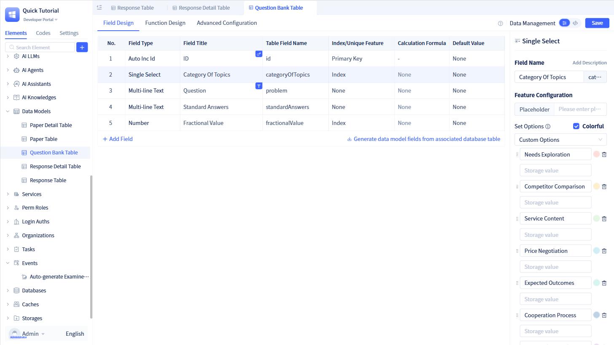
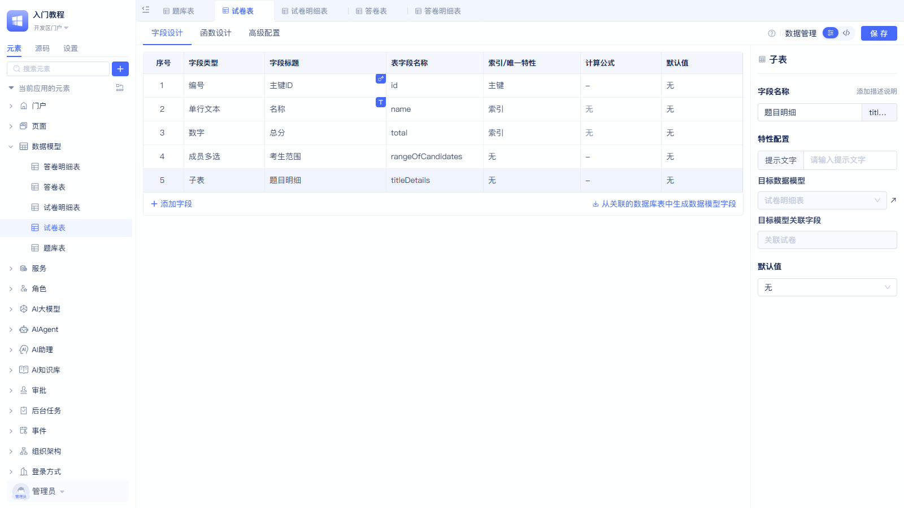
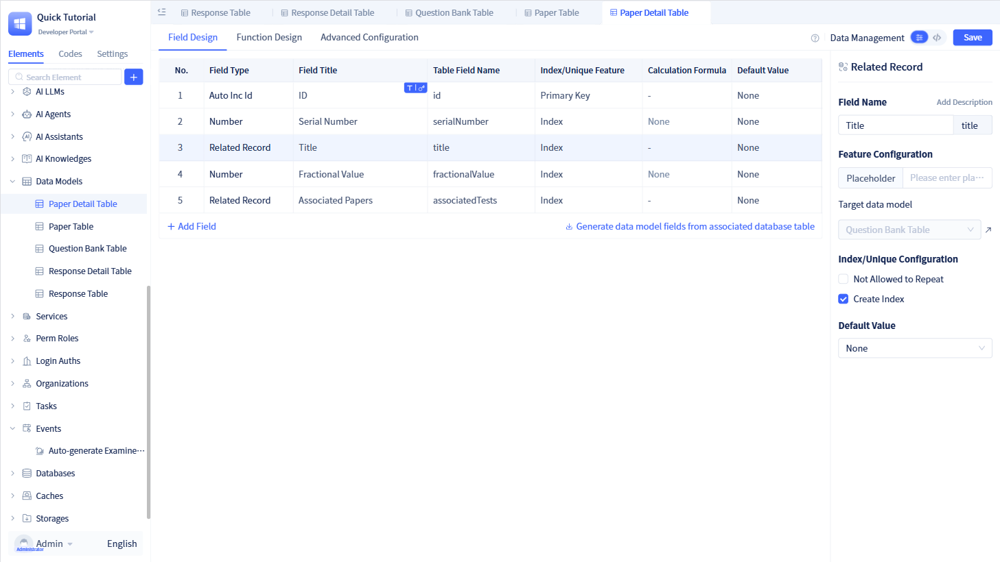
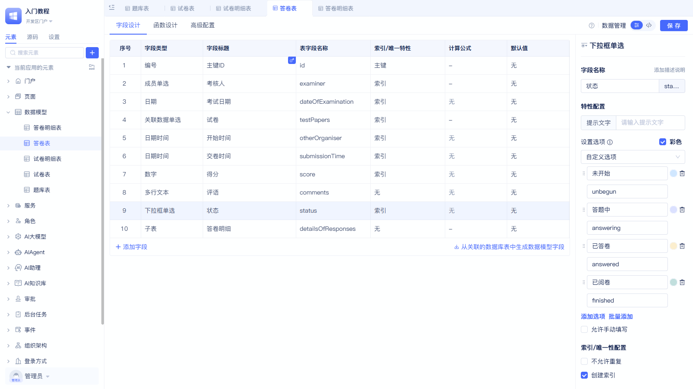
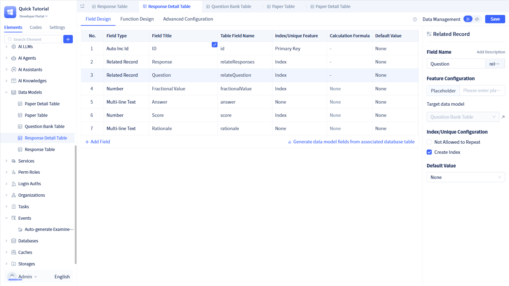

# 案例项目介绍

本案例项目业务为：老师出试卷、考生考试、老师阅卷。

## 怎样体验该项目和查看源码？

安装后环境后，直接部署该应用

| 名称 | 账号 | 密码 | 角色 | 说明 |
|------|------|------|------|------|
| 管理员| admin123 | admin123 | 管理员 | 系统管理员，拥有所有权限 |
|甲老师| jialaoshi | ls123456 | 老师 | 可以出试卷、阅卷 |
|乙老师| yilaoshi| ls123456 | 老师 |可以出试卷、阅卷 |
|考生A| kaoshenga | ks123456 | 考生 | 可以参加考试 |
|考生B| kaoshengb| ks123456 | 考生 | 可以参加考试 |

## 展示效果如下
### 老师账号登录后
import VideoPlayer from '@site/src/components/VideoPlayer';

<VideoPlayer relatePath="/docs/tutorial/project_teacher.mp4" />

### 考生账号登录后

<VideoPlayer relatePath="/docs/tutorial/project_student.mp4" />

### 管理账号登录后

<VideoPlayer relatePath="/docs/tutorial/project_admin.mp4" />

## 数据模型介绍
* 题库表：存储所有题目信息，包括题目内容、类型、难度等
* 试卷表、试卷明细表：存储试卷基本信息和每道题目的配置
* 答卷表、答卷明细表：存储考生的答题记录和成绩信息

模型中具体的字段如下

