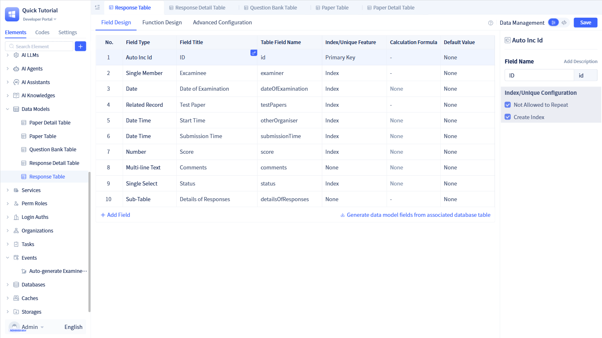

# Case Study

The business scenario of this case project is: teachers create test papers, students take exams, teachers grade papers.

## How to experience this project and view the source code?

After installing the environment, deploy this application directly

| Name | Account | Password | Role | Description |
|------|------|------|------|------|
| Admin | admin123 | admin123 | Administrator | System administrator with all permissions |
| Teacher A | jialaoshi | ls123456 | Teacher | Can create test papers and grade |
| Teacher B | yilaoshi | ls123456 | Teacher | Can create test papers and grade |
| Student A | kaoshenga | ks123456 | Student | Can take exams |
| Student B | kaoshengb | ks123456 | Student | Can take exams |

## Demo Effects
### After teacher account login
import VideoPlayer from '@site/src/components/VideoPlayer';

<VideoPlayer relatePath="/docs/tutorial/project_teacher.mp4" />

### After student account login

<VideoPlayer relatePath="/docs/tutorial/project_student.mp4" />

### After admin account login

<VideoPlayer relatePath="/docs/tutorial/project_admin.mp4" />

## Data Model Introduction
* Question Bank Table: Stores all question information, including question content, type, difficulty, etc.
* Test Paper Table, Test Paper Detail Table: Store basic test paper information and configuration for each question
* Answer Sheet Table, Answer Sheet Detail Table: Store students' answer records and score information

The specific fields in the model are as follows

