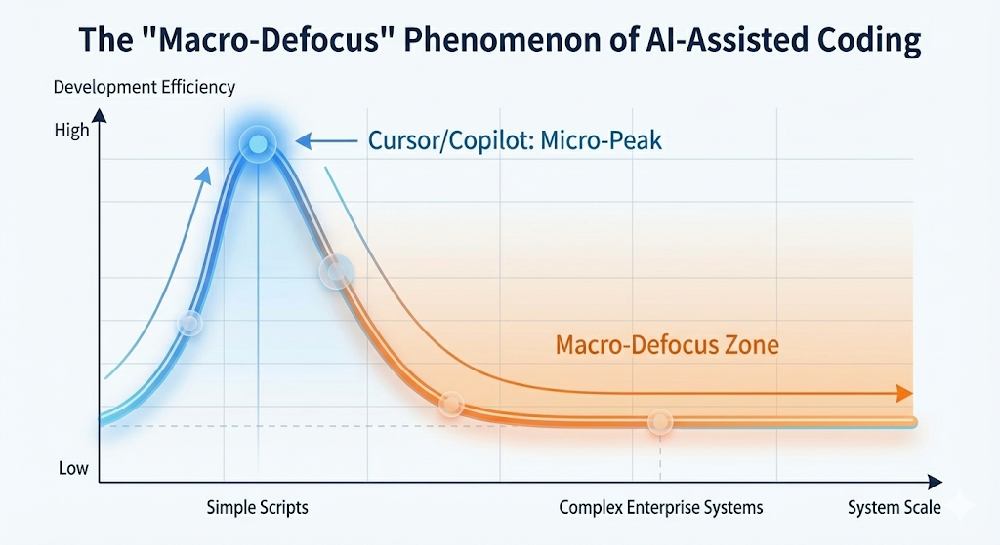

## Cursor 带来的“快感”与集成时的“宿醉”

对于许多开发者而言，第一次使用 Cursor 或 GitHub Copilot 等 AI 编码工具的体验是令人兴奋的。你提示一个函数，它就出现了；你高亮一段代码要求重构，几秒钟就搞定。在单个文件或小模块的“微观”语境下，AI 无疑彻底改变了编码速度。

但当项目从原型扩展为企业级系统时，一种我们称之为\*\*“宏观失焦”（Macro-Defocus）\*\*的现象便开始显现。那个能写出完美 React 组件的 AI，突然在理解该组件如何融入更广泛的微服务架构时变得步履维艰。它开始臆造导入路径，破坏模块间隐含的契约，并生成出在语法上正确但架构上支离破碎的代码。

为什么 AI 写代码快，并不等同于构建系统快？答案不在于 AI 的智能程度，而在于你系统的结构可见性。

<!--truncate-->

## 什么是“宏观失焦”？

“宏观失焦”之所以发生，是因为主流 AI 编码工具主要将软件视为字符序列（Tokens）的组合。虽然它们可以摄入巨大的上下文窗口，但应用的结构——实体间的关系、数据流向、权限模型——是隐含的，被深埋在成千上万行代码之中。

随着系统规模增长，这种隐含结构变得过于庞大和纠缠，导致 AI 无法清晰地“看见”。AI 实际上是通过一根吸管（上下文窗口）在观察系统，只能看到局部的细节，而宏观架构则在视野中变得模糊不清。

### AI 编码的“死亡之谷”

基于文本的 AI 编码工具的效率通常遵循一条可预测的曲线：早期飙升，但随着复杂度增加而骤降。

在“宏观失焦”区域，开发者花费在调试 AI 结构性误解上的时间，往往超过了生成代码所节省的时间。

## 根本原因：隐含结构 vs 显式结构

根本的限制不在于模型的推理能力，而在于工程范式。

- **传统开发（以代码为中心）**：系统的“真理”是代码本身。为了理解系统，AI 必须解析并从数百万行文本中“重构”架构。这是有损且容易出错的。
- **AI 原生开发（以结构为中心）**：系统的“真理”是独立于实现代码之外的结构化定义（元数据）。AI 首先与这个显式结构交互，仅将代码生成作为受严格治理的实现细节。

### 对比：以代码为中心 vs 以结构为中心

| **特性**       | **以代码为中心的 AI (如 Cursor, Copilot)** | **以结构为中心的 AI (如 JitAI)** |
| -------------- | ------------------------------------------ | -------------------------------- |
| **操作单元**   | 文件、函数、代码 Token                     | 元素、元模型、实体               |
| **上下文范围** | 受限于 Token 窗口 (如 32k-100k)            | 无限 (访问结构化元数据)          |
| **系统感知**   | 隐含 (从文本模式猜测)                      | 显式 (读取定义好的关系)          |
| **重构**       | 高风险 (正则/文本替换)                     | 安全 (结构图修改)                |
| **AI 角色**    | "Copilot" (建议引擎)                       | "Architect" (系统参与者)         |

## JitAI 如何解决“宏观失焦”

JitAI 通过引入 **JAAP (JitAi Ai Application Protocol)** 解决了宏观失焦问题。JAAP 不再将应用视为一袋子文件，而是定义了一套严格的分层协议：

- **Meta (元)**：能力的抽象定义（例如：“数据持久化”）。
- **Type (类型)**：具体的实现模板（例如：“MySQL 表”）。
- **Instance (实例)**：业务中的实际用法（例如：“客户订单表”）。

通过标准化这些层级，JitAI 确保**结构成为一等公民**。当 AI Agent 在 JitAI 中工作时，它不仅仅是在“读代码”；它是在直接查询系统结构。它知道“订单”只允许“销售”角色进行“创建”操作，不是因为它读到了配置文件里的注释，而是因为这种关系在应用图谱中被显式定义了。

### 1. 实时解释型应用架构

JitAI 采用**实时解释型应用架构**，AI 可以理解“元素树”——这是一张实时的、自描述的整个软件地图。这使得 AI 能够从前端页面元素直接导航到其绑定的后端服务函数，而无需解析支离破碎的文本文件。

### 2. AI Agent 作为系统内部参与者

在 JitAI 中，AI Agent 不是向你的 IDE 粘贴代码的外部工具。它们是运行时元素（例如 `aiagents.ReActType`）。它们拥有直接的、受控的权限来调用系统工具、查询数据库和触发工作流，因为它们与应用的其他部分属于同一套结构协议。

### 3. 可视化编排与全代码双模式

JitAI 允许开发者（和 AI）在**可视化编排**（结构）和**全代码**（实现）之间切换。你可以让 AI 在视觉上规划流程以确保宏观一致性，然后深入编写 Python 或 React 代码来处理特定逻辑，从而消除失焦问题。

## 实施手册：避免架构漂移

无论你是否使用 JitAI，你都可以在 AI 工作流中缓解宏观失焦：

1.  **显式定义边界**：不要让 AI 盲目生成跨模块调用。强制执行适合 AI 上下文窗口的接口契约（如 TypeScript 接口或 Protocol Buffers）。
2.  **模块化上下文加载**：在向 Cursor 提问时，不要丢入整个仓库。手动筛选与任务相关的特定“上下文文件”，以模拟“结构聚焦”。
3.  **结构优先审查**：在检查逻辑正确性之前，先审查 AI 生成代码的架构合规性（例如：“它是否创建了新的循环依赖？”）。

## 如何用 AI 验证系统结构

要测试你的 AI 工具是否患有宏观失焦症，请在一个大型代码库中尝试此提示词：

> “重构用户认证流程以支持多租户。更新所有依赖于用户对象的数据库 Schema、API 端点和前端状态管理存储。”

- **结果 A (宏观失焦)**：AI 更新了用户表，但遗漏了审计日志的外键，破坏了个人资料组件，并在中间件中引入了安全回退。
- **结果 B (结构感知)**：系统识别出元数据图谱中与用户实体链接的所有 15 个依赖项，并提出一个原子更新计划。

## 常见问题 (FAQ)

Q: JitAI 会取代像 Cursor 这样的工具吗？

A: 不，它们是互补的。你可以在 JitAI 的“全代码”元素中使用类 Cursor 的能力来编写特定函数逻辑。JitAI 提供结构护栏，确保这些代码保持集成和可扩展。

Q: “结构优先”就是低代码吗？

A: 不。低代码通常将代码隐藏在僵化的可视化器后面。JitAI 的“结构优先”方法（通过 JAAP）保持代码的可访问性和可编辑性，但将其包裹在一个显式的结构容器（元素）中，以便 AI 进行推理。

Q: 我可以将现有的遗留代码导入 JitAI 吗？

A: 你可以将现有的业务逻辑封装到 JitAI 的“服务元素”或“外部 API”元素中，将它们暴露给 JitAI 结构图谱，实际上是为 AI “索引”了你的遗留代码。

## 结语

加快打字速度并不等同于加快交付速度。虽然像 Cursor 这样的工具已经掌握了生成文本的艺术，但在涉及工程系统时，它们仍存在“宏观失焦”。要构建大规模、可维护的 AI 应用，我们必须从提示代码转向提示结构。

通过采用像 JAAP 这样的协议和[JitAI](https://jit.pro/download)这样的平台，工程团队可以将 AI 从一个需要持续监督的初级程序员，提升为理解整个企业蓝图的系统架构师。
