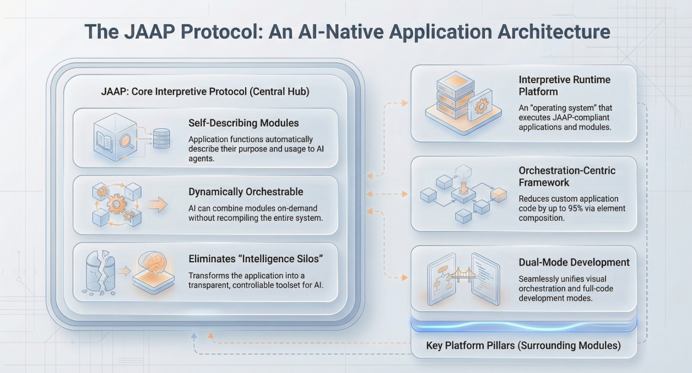

## 引言

我们正目睹着一场从实验性 AI Demo 向生产级系统迁移的浪潮，但许多工程团队却撞上了南墙。核心问题不在于 AI 智能体（Agent）或大模型本身的能力，而在于承载它们的**系统架构**。为了使遗留系统现代化，开发者通常采用“外挂”式的方法，通过大量的脚本、中间件和数据转换层来拼接 AI 能力——这些统称为“胶水代码”（Glue Code）。

虽然这种方法在原型阶段行之有效，但它为企业级应用构建了一个脆弱的基础。对于高级开发者和架构师而言，挑战不再仅仅是提示词工程（Prompt Engineering），而是设计一个**AI 原生（AI Native）**的环境。在这个环境中，开发平台应当从底层支持大语言模型（LLM）的概率特性，而不是让系统在维护的重压下崩溃。

<!--truncate-->

## “胶水代码”陷阱的解构

在传统软件工程中，模块化是王道。我们构建了数据库、业务逻辑和表现层等截然分明的层级。然而，当我们通过标准 REST API 将 LLM 引入这种组合时，我们引入了一个不遵守这些边界的、对上下文极度饥渴的消费者。

为了让 LLM 发挥作用，开发者编写了大量的“胶水代码”来：

1.  从数据库中获取数据。
2.  将其序列化为文本提示词（上下文填充）。
3.  将 LLM 非结构化的字符串输出解析回结构化的 JSON。
4.  根据业务规则验证输出。
5.  执行实际的事务。

这种胶水代码极其脆弱。Google 研究人员早在 2015 年发表的论文《机器学习系统中隐藏的技术债务》中就指出，“胶水代码”往往占据了系统代码的绝大部分，远远超过了实际的 ML 内核代码。在生成式 AI 时代，由于“接口”变成了本质上不稳定的自然语言，这种债务更是成倍增加。

### 三种具体的故障模式

- **语义漂移（Semantic Drift）：** 你将数据库字段名从 `cost` 更新为 `total_amount`。在强类型语言中，编译器会捕获此变更。但在 AI 集成中，你的胶水代码（提示词模板）继续向 LLM 索要 `cost`。LLM 可能会产生幻觉编造一个值或返回 null，导致解析逻辑深处发生运行时错误。
- **权限绕过/重复（Auth Bypass / Duplication）：** 传统应用在 API 控制器层级强制执行权限。然而，AI 智能体通常需要“读取全部”访问权限来检索向量库以回答问题。开发者最终不得不在提示词过滤层内重新实现复杂的 RBAC（基于角色的访问控制）逻辑，导致安全不一致。
- **上下文颠簸（Context Thrashing）：** 为了给 AI 提供足够的信息，开发者编写了大量的检索查询。随着应用增长，维护“将什么放入上下文窗口”的逻辑变成了一项全职工作，导致提示词臃肿和响应缓慢。

## 架构转型：从“集成”到“AI 原生”

要逃离胶水代码陷阱，我们必须停止将 AI 视为 API 的外部消费者，开始将其视为运行时环境的**内部组件**。

AI 原生架构要求系统具备**自描述（Self-Describing）**能力。应用结构——数据模型、业务函数和 UI 状态——必须以 AI 能够直接理解和操作的格式暴露出来，无需人工翻译层。

**关键架构要求：** AI 必须与应用运行时本身在同一套“抽象语法树”（AST）或元数据定义上运行。当结构发生变化时，AI 的理解应自动更新。

## JitAI 的解决方案：结构解释 vs 代码生成

JitAI 与传统低代码或纯代码平台的根本区别在于，它将应用结构变成了人类开发者和 AI 智能体共同分享的“一等公民”。

### 1. JAAP 协议：让结构可见

JitAI 使用 **JAAP (JitAi Ai Application Protocol)**。与业务逻辑隐藏在编译代码中的传统框架不同，JAAP 将应用抽象为结构化定义（Meta/Type/Instance）。

- **重要性：** 当你在 JitAI 中定义一个数据模型时，你不仅仅是在创建一个数据库表，你还在创建一个 AI 智能体天生就能理解的语义定义。AI 不需要手动编写的“胶水”提示词就能知道 `Customer` 实体有一个 `phone_number` 字段；它直接读取元素定义。

### 2. 无中间件的直接工具调用

在标准架构中，让 AI 访问“删除用户”函数涉及编写 API 包装器、OpenAPI 规范以及描述该规范的提示词。

在 JitAI 中，**服务函数（Service Functions）和模型函数（Model Functions）**会自动作为工具暴露给 Agent。

- **机制：** 开发者只需在 Agent 的可视化编辑器中选择目标函数。平台负责将函数签名注入到 Agent 的上下文中。如果你将函数参数从 `int` 更改为 `string`，Agent 的工具定义会自动更新，无需重写提示词代码。

### 3. 统一的状态管理

“胶水代码”最困难的部分之一是同步 UI 状态与 AI 的记忆。JitAI 的 **AI 助理（AI Assistant）**与页面共享运行时状态。

- **优势：** AI 可以通过事件订阅直接读取前端变量或触发 UI 组件（如打开模态框或刷新网格），而不是要求用户“请刷新页面”。

## 对比分析：传统架构 vs AI 原生架构

下表对比了在传统架构与 AI 原生平台（如 JitAI）中，为 AI 智能体添加一个简单的“更新订单”能力所需的维护开销。

| **特性维度**   | **传统架构 (胶水代码)**                                     | **AI 原生平台 (JitAI)**                                         |
| -------------- | ----------------------------------------------------------- | --------------------------------------------------------------- |
| **架构变更**   | **高影响：** 必须手动更新数据库迁移、API DTO 和提示词模板。 | **零影响：** Agent 通过元数据自动感知模型字段变更。             |
| **工具定义**   | **手动：** 编写 OpenAPI/Swagger 规范 + LLM 描述。           | **自动：** 现有的服务函数可作为工具被原生选择。                 |
| **权限控制**   | **重复：** 重新实现逻辑以过滤 AI 可见内容。                 | **继承：** Agent 继承系统中定义的标准 RBAC 角色权限。           |
| **上下文限制** | **手动优化：** 硬编码需要获取/摘要的数据。                  | **集成 RAG：** 知识库元素自动处理向量化和分块。                 |
| **UI 交互**    | **断裂：** AI 返回文本；UI 必须解析文本以触发动作。         | **原生：** AI 直接触发标准化的 UI 事件（如 `afterRowChange`）。 |

## 实施指南：重构为 AI 原生应用

对于希望摆脱胶水代码的团队，以下是基于 AI 原生原则的实用实施手册。

### 第 1 步：实体建模作为单一事实来源

不要在 SQL 中定义数据模式然后单独向 AI 描述，而是将其定义为数据对象模型。确保每个字段都有描述性的标题和类型。

- **行动：** 在 JitAI 中创建**数据表模型（Data Table Model）**。使用内置类型（如手机号、金额）而不是通用的字符串。类型越具体，AI 对约束的理解就越好。

### 第 2 步：通过服务函数封装逻辑

不要在提示词中编写逻辑。将业务规则（例如“计算折扣”）封装到服务函数中。

- **行动：** 创建**服务元素（Service Element）**。定义具有清晰输入参数和返回类型的函数。这些将成为 Agent 的“手”。启用函数以允许被 Agent 调用。

### 第 3 步：编排 ReAct Agent

配置 Agent 使用“推理与行动”（ReAct）模式。不要硬编码工作流，而是给 Agent 提供第 2 步中的工具和一个目标。

- **行动：** 在 Agent 可视化编辑器中，添加服务函数和数据模型作为**工具（Tools）**。设置“系统提示词”以定义 Agent 的角色和边界，但将执行步骤留给 ReAct 引擎。

## 如何验证与复现

要验证你的架构是真正的 AI 原生还是仅仅陷入了胶水代码，请进行以下测试：

1.  **“字段重命名”测试：** 重命名数据模型中的关键业务字段（例如将 `status` 改为 `order_state`）。
    - *胶水代码结果：* Agent 无法查询数据或幻觉旧字段名，直到你手动更新提示词。
    - *AI 原生结果：* Agent 立即开始使用 `order_state`，因为它读取的是实时的元数据定义。

2.  **“新工具”测试：** 向后端添加一个新函数（例如“退款订单”）。
    - *胶水代码结果：* 你必须编写新的插件定义，用 JSON Schema 描述输入/输出，并将其粘贴到 Agent 的配置中。
    - *AI 原生结果：* 你只需勾选一个框，即可将现有函数暴露给 Agent 的工具集。

## 常见问题 (FAQ)

Q: 我可以在此架构中使用私有 LLM 吗？

A: 可以。AI 原生平台应该抽象模型提供商。JitAI 支持连接私有模型（如 Ollama 或通用的 OpenAI 兼容端点），同时保持相同的结构优势。

Q: 这如何处理不仅仅是单步操作的复杂工作流？

A: 你应该使用 AI 助理（AI Assistant），它使用基于图的流（类似 LangGraph）来编排多个 Agent。这允许在节点之间进行条件分支和状态持久化。

Q: 平台生成的代码可以导出吗？

A: 可以。为了避免供应商锁定，请确保平台允许导出源代码。JitAI 应用程序是标准的程序包，可以作为源代码 zip 文件导出，用于离线分发或进一步开发。

## 结语

AI 集成的“胶水代码”方法是一座临时的桥梁，正在迅速成为维护负担。随着 AI 智能体变得越来越复杂，提示词、API 和数据模式的手动同步将变得难以为继。

要构建可维护的企业级 AI 应用，架构师必须采用 **AI 原生开发平台**，在这样的平台中，系统结构是自描述的，工具是一等公民。通过利用 JAAP 等协议和 JitAI 等平台，你可以停止编写胶水代码，开始构建随业务演进的自主系统。

准备好拆除你的胶水代码了吗？

下载 [JitAI](https://jit.pro/download)  体验 AI 原生开发，或探索教程在几分钟内构建你的第一个 Agent。
