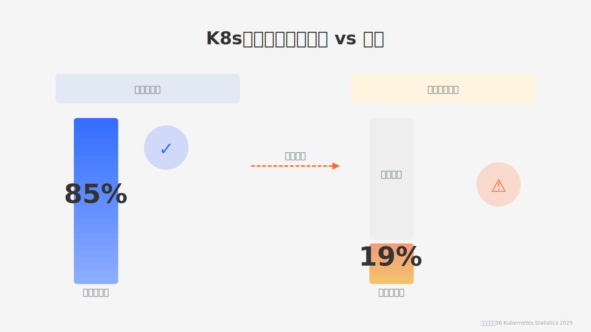
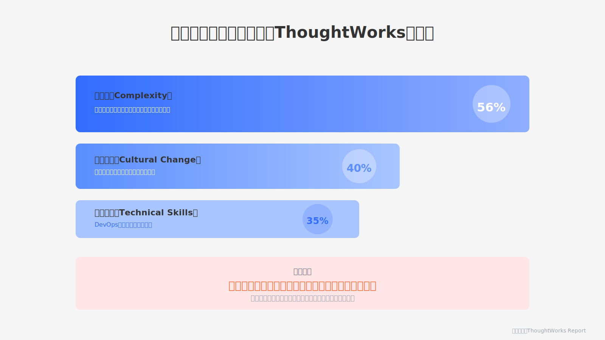
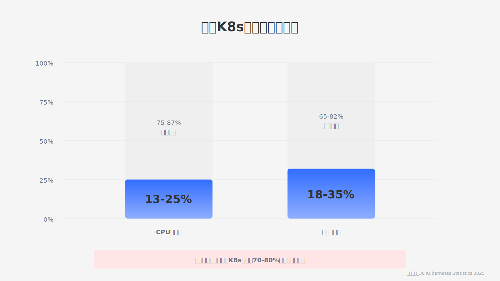
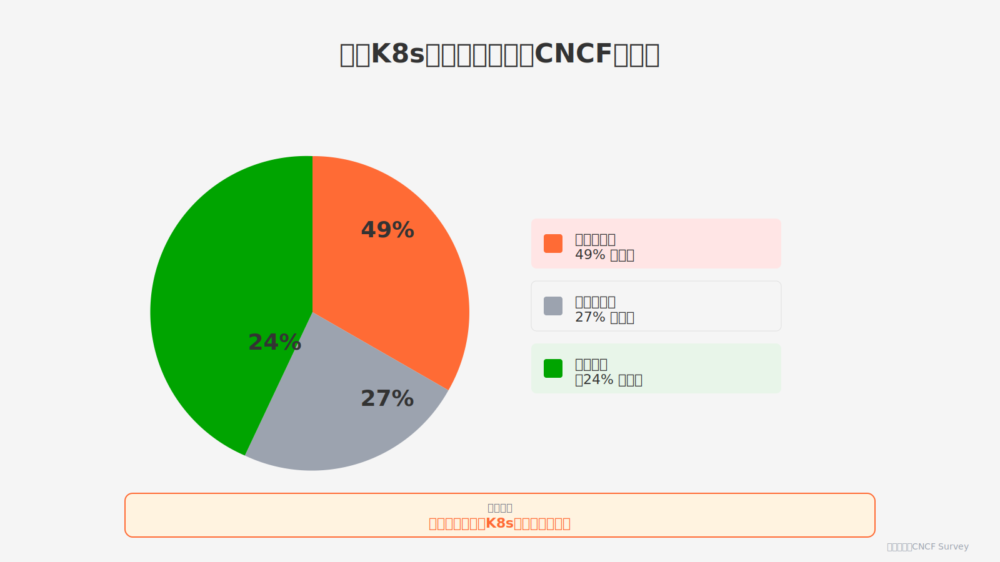

过去几年，云原生成了IT圈最焦虑的话题。不上K8s就会被淘汰，不搞微服务就是落后——这种焦虑被云厂商和技术大会不断强化。

但数据揭示了残酷真相：典型K8s集群的CPU利用率仅13-25%，内存利用率18-35%。CNCF调查显示，49%的组织表示采用K8s后云支出上升。

**是时候戳破云原生这个技术泡沫了**。企业系统根本不需要这套复杂的架构。
<!--truncate-->

## 微服务：拆分服务换来调试噩梦

微服务架构的核心理念是将单体应用拆分成独立服务，每个服务可以独立开发和部署。这听起来很理想，但实际操作中问题层出不穷。

**ThoughtWorks报告显示，56%的受访者认为"复杂性"是微服务采用的最大挑战**。一个完整的业务流程被切分到十几个微服务中，调试一个功能需要在多个服务之间跳转，定位问题变得极其困难。服务之间的网络调用增加了延迟和失败点，原本简单的函数调用变成了复杂的RPC通信。

更严重的是服务治理的复杂度。服务注册发现、负载均衡、熔断降级、分布式追踪——这些配套设施缺一不可，每一项都需要专业团队维护。

**对于只有几百用户的企业系统，这种架构带来的运维成本远超收益**。单体应用部署在一台服务器上运行稳定，微服务架构却需要维护几十个服务实例，故障排查难度成倍增加。

## K8s：70%资源浪费的"伪需求"

容器化和K8s编排是云原生的另一大支柱。云厂商宣称容器提供环境一致性，K8s提供自动化编排能力。但企业内部系统真的需要这些吗？

一个ERP系统、一个OA系统，用户量稳定在几百人，部署在几台虚拟机上就能满足需求。引入K8s集群意味着要维护Master节点、Worker节点、etcd存储、网络插件、存储插件——整套复杂的基础设施。

**K8s是为应对大规模容器编排设计的，它的能力是为百万级并发、数千个容器实例准备的**。企业内部系统几个应用实例，用传统虚拟机部署就足够了。

数据更能说明问题：根据行业统计，典型K8s集群的CPU利用率仅为13-25%，内存利用率也只有18-35%。这意味着企业花大价钱搭建的K8s集群，70-80%的资源都在浪费。

维护K8s集群需要专业DevOps工程师，学习成本和运维成本都很高。CNCF调查显示，49%的组织表示采用K8s后云支出上升，只有24%实现了成本节省。对大多数企业来说，K8s带来的复杂度远超其收益。

## 弹性伸缩：解决一个不存在的问题

弹性伸缩是云原生宣传的核心卖点——根据流量自动增减服务实例，应对突发访问。

这个特性对电商大促、社交媒体热点、游戏新区开服确实有价值，因为ToC应用可能短时间内流量暴增数倍。

但ToB企业系统完全不同。一家企业的员工数相对固定，不会一天之内暴增十倍。企业应用的访问模式有明显规律：工作日高峰、夜间低谷、周末低谷，完全可以提前规划容量。

为了实现弹性伸缩，企业需要维护复杂的监控告警体系、自动扩容缩容策略、资源调度机制。这些系统本身需要持续投入，而它们要解决的问题在企业场景中根本不存在。

更现实的情况是，企业系统的性能瓶颈往往在数据库和业务逻辑，不是服务器数量。增加应用服务器实例并不能解决根本问题。**盲目追求弹性伸缩，是在解决一个本不存在的问题**。

## 云原生的真相：云厂商的营销话术

云原生技术栈为什么会流行？因为云厂商需要它。对云厂商来说，客户使用的服务越复杂，消耗的云资源越多，产生的收入就越高。

推广微服务架构意味着客户要购买更多虚拟机实例，推广K8s集群意味着客户要购买容器服务和负载均衡，推广弹性伸缩意味着客户要为峰值容量付费。前面提到的CNCF数据已经证明：49%的组织采用K8s后云支出上升。**云原生不是技术进步的必然结果，而是云厂商精心包装的商业策略**。

更有说服力的是反向案例：Amazon Prime Video团队在2023年公开分享，他们将视频质量监控服务从基于Step Functions和Lambda的分布式架构，重构为运行在单个进程中的服务后，基础设施成本减少了90%以上。**连Amazon这样的云巨头内部都在放弃过度复杂的分布式架构，企业系统还有什么理由All in云原生？**

云原生架构确实适合需要应对海量不确定用户访问的ToC应用。但问题是，云厂商把这套技术话术推广到所有场景，制造出"不用云原生就落后"的焦虑。**企业被这种营销话术绑架，投入大量资源改造系统，最终发现架构复杂度暴增、成本失控、业务敏捷性反而下降**。

对于用户量相对固定、访问模式有规律的企业系统来说，云原生就是一个精心包装的陷阱。真正符合企业利益的技术选型，应该基于实际业务需求，而不是盲目跟风云厂商的营销。

## 简单可靠才是正道

企业应用的核心诉求是什么？稳定可靠、易于维护、快速响应业务需求。

云原生架构在这些方面表现糟糕——复杂的技术栈导致稳定性下降，分布式系统增加故障点，过度抽象让业务调整变得困难。

**企业真正需要的是简单直接的技术方案，而不是为了技术而技术的过度设计**。

不要被云厂商的营销话术吓唬，也不要被技术大会上的概念轰炸迷惑。几百用户的企业系统，用不着K8s集群的复杂度，也不需要微服务的分布式陷阱。

现代应用平台已经提供了更适合企业场景的解决方案。JitAi内置完整DevOps工具链，一键部署、一键更新，无需维护复杂容器集群。系统提供无限水平扩展能力，当业务真正需要扩展时，添加服务器节点即可。

**这种架构既保证扩展性，又避免过度复杂性，才是企业系统应该走的路**。
