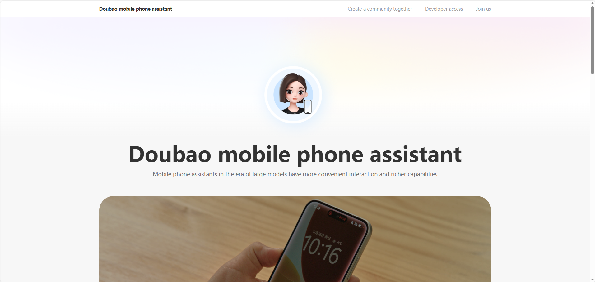

当豆包 AI 手机出现时，很多人第一反应是：  
这不就是科幻电影里的场景落地了吗？一个 AI 能看屏幕、点应用、下单、帮你操作整台手机。

但上线没多久，各大应用开始拒绝登录、提示“环境异常”，甚至限制访问权限。  
字节跳动也被迫收紧豆包在手机上的关键能力，尤其是和支付、游戏、激励活动相关的部分。

在热闹的背后，其实有一个更深层的问题：

> **“智能体手机” 正在正面撞上一个从来没为「操作系统级 AI」设计过的应用生态和系统架构。**

而同样的张力，很快就会出现在 **企业后台系统、低代码平台和开发平台** 上。  
决定未来 AI 落地成败的，已经不只是模型，而是 **整个系统的「AI 原生」架构是不是准备好了。**

<!-- truncate -->

---

## 1. 豆包智能体手机，到底发生了什么？

豆包手机助手 并不只是一个“更聪明的语音助手”，它本质上是一个运行在手机系统里的 **系统级 AI 智能体**。

在 ZTE 努比亚 M153 这类 Demo 机型上（大约 3,499 元人民币），豆包能做到的事情包括：

*   **看到屏幕内容**：实时读取界面上的文字、按钮、图片
    
*   **理解 UI 和场景**：知道这是列表、按钮、弹窗还是输入框
    
*   **主动点击和滑动**：自己点按钮、往下翻、填写表单、跳转页面
    
*   **执行多步任务**：你只说一句话，它就能跨应用完成一整套流程，比如订票、整理文件、发消息
    

和传统“唤醒一下说一句”的助手完全不同，它更像是一个“住在手机里的代理人”，可以连贯地完成一件件事。

首批主要面向开发者的小批量机型上线后，很快售罄，加价转卖，说明市场好奇心非常强。

然后，问题来了。

大概在上线 48 小时内：

*   部分社交、支付、电商应用开始触发**风控机制**：
    
    *   登录失败
        
    *   提示“异常环境”
        
    *   甚至出现短期封禁账户的情况
        
*   特别是在豆包帮用户自动刷激励、玩游戏、执行奖励任务时，问题更为集中
    
*   随后，字节跳动开始 **主动关闭或限制**豆包在金融类 App、游戏、激励类应用中的自动化能力，禁止其自动领取奖励、自动操作相关流程
    

从工程视角看，这不是一个简单的“bug”，而是整个生态在用行动表达：

> “现在的权限模型和风控模型，从来不是为一个 OS 级智能体设计的。”

---

## 2. 为什么应用会拒绝豆包？——生态 vs 智能体

绝大多数移动应用，默认假设的是非常简单的一件事：

> **「一个人 → 一个前台会话 → 一套条款和激励机制。」**

豆包把这个假设直接打破了。

在豆包AI 手机上，智能体可以：

*   像人一样看界面、模拟点击（本质上是 LLM + RPA 的 OS 级组合）
    
*   持续驱动应用去：
    
    *   刷奖励视频
        
    *   自动进行游戏操作
        
    *   自动填写支付信息、完成下单
        

从大型互联网应用的视角看，这至少触动了三个红线：

1.  **安全与合规**
    
    支付、银行登录、账号找回等高敏感操作  
    现在突然多了一层“夹在用户和 App 之间”的 AI。  
    对风控系统来说，这很可能意味着：
    
    *   人机边界模糊
        
    *   传统反欺诈策略失效
        
    *   风险责任难以界定
        
2.  **公平与反作弊**
    
    游戏、激励平台必须防止脚本刷量、外挂刷任务。  
    一个能“把手机当外挂”用的 OS 级智能体，本质上就是一套高度复杂的自动化脚本，对业务公平性构成直接威胁。
    
3.  **商业模型的威胁**
    
    很多 App 的商业逻辑依赖于：
    
    *   用户在页面上停留更久
        
    *   看更多广告
        
    *   被引导做更多高价值操作
        
        而智能体如果真正站在 **用户利益** 这一边，它可能会：
        
    *   自动跳过广告
        
    *   批量比价
        
    *   优先选择对用户最划算、而非对平台收益最高的操作
        

对平台来说，这会直接冲击现有收益模型。

所以，当豆包想要作为一个「系统级万能智能体」去驾驭整个移动生态时，各大应用的自然反应就是——  
**加强风控、阻断自动化行为，拒绝某些权限和登录。**

这不仅是一个中国市场的独特现象，而是向全行业发出一个预告：

> 只要智能体真正“有了手脚”，现有系统就会开始反抗。

---

## 3. 什么是「智能体手机」（Agentic Smartphones）？

“智能体手机” 这个概念，和传统“智能手机 + 语音助手”很不一样。

传统的语音助手，更像是：

> “在某个 App 里帮你点几下、查点信息。”

而“智能体手机”则意味着：

> **“在操作系统层面，存在一个可以感知、规划、行动的 AI 层。”**

一个典型的智能体手机，通常具备几类能力：

*   **操作系统级的可见性**  
    智能体可以看到当前屏幕上的所有元素，理解每一块 UI 是什么、代表什么含义。
    
*   **跨应用的连续动作**  
    智能体不是“帮你点一下按钮”，而是：
    
    *   先帮你比价
        
    *   再帮你下单
        
    *   再把行程写入日历
        
    *   最后发一条消息给你的同事
        
*   **长期记忆与个性化**  
    它会记住你之前出过哪些差、常用哪家航空、一般预算是多少，以便下次自动替你做更符合习惯的选择。
    
*   **实时的语音对话**  
    类似豆包这样的助手，支持实时、可打断的语音交互，更接近真实对话体验。
    

换句话说，智能体不再是一个“应用内的功能”，  
而是变成了系统架构里的 **新一层**：

*   在应用之上
    
*   在操作系统之内
    
*   负责处理 **从目标到执行的全过程**
    

正因为它这么强大，也正因为它跨界太多，才会直面现有权限体系与风控体系的反冲。

---

## 4. 企业很快会遇到一模一样的问题

如果我们把“手机 App” 换成“企业系统”，这画面会变得非常眼熟：

越来越多的企业正在试验各种 **智能体（agentic）AI 系统**，让它们去：

*   登录 CRM、ERP、工单系统
    
*   读取报表和数据记录
    
*   代写邮件、开工单、更新状态
    
*   编排跨系统的完整流程
    

从最近的一些市场调研与分析汇总来看：

*   大约 **20%–25% 的组织已经在至少一个业务场景中扩展使用智能体 AI 系统**
    
*   另有约 **40% 左右的组织处于试验或小规模试点阶段**
    

与此同时，CIO、CISO 和架构师们几乎异口同声地强调几个前提条件：

*   完整的 AI 治理框架
    
*   基于角色和范围的权限模型
    
*   可追溯的审计与日志
    
*   合规与数据驻留（Data Residency）保证
    

豆包手机这次“权限风波”，其实就在展示一件事：

> **当「智能体」的能力先到位，而架构和治理没有准备好时，系统的自然反应就是——各种限流、拒绝、回退。**

放在企业环境中，类似现象可能表现为：

*   SaaS 平台把智能体行为当成“可疑流量”，触发限速或封禁
    
*   财务系统拒绝由“脚本/应用”发起的某些操作
    
*   安全部门认为这类自动化行为违反了现有安全策略，要求全面阻断
    
*   内部用户因为一次 AI 误操作，对整条智能体路线失去信任
    

这就是为什么，**“AI 原生的系统架构”不是一个好听的名词，而是不得不面对的技术现实。**

---

## 5. 为什么「AI 原生系统架构」会变成必然趋势

今天很多平台都是 **“AI 增强型”**：

*   一开始是传统系统，
    
*   后来再加上若干 AI 功能：推荐、问答、自动补全等。
    

在这样的架构下，常见的情况是：

*   AI 为了操作系统，只能**扒 UI（屏幕识别+点击）**，而不是通过正式的结构化接口
    
*   权限是围绕“应用”和“用户”设计的，而不是围绕 **智能体**
    
*   系统中根本没有一个统一的地方来表达：  
    “这个智能体在整个系统里，究竟被允许做什么？”
    

而 **AI 原生**的系统架构，则从一开始就假设：

> “智能体本身就是系统公民之一，  
> 我们的权限、工具、数据流和治理，都要围绕智能体来设计。”

无论是智能体手机还是企业开发平台，这都意味着几件具体的原则：

1.  **通过有类型的工具行动，而不是随便发命令**
    
    *   工具（Tool）以结构化方式暴露能力，比如：
        
        *   `createOrder`（创建订单）
            
        *   `transferFunds`（转账）
            
        *   `updateRecord`（更新记录）
            
    *   每个工具都带有明确约束：
        
        *   可用参数
            
        *   风险等级
            
        *   允许在哪些环境被调用
            
2.  **权限围绕智能体建模，而不是隐式继承用户权限**
    
    *   每个智能体有自己的 **身份、角色、范围和环境（开发/测试/生产）**
        
    *   它不再默认拥有“用户能做的一切”，而是一个单独可控的主体
        
3.  **专门的控制平面（Control Plane）来治理 AI 行为**
    
    *   通过策略控制智能体：
        
        *   哪些工具可以在哪些环境中被调用
            
        *   什么条件下需要额外验证或人工审批
            
    *   所有行为都被记录和可审计
        
4.  **模拟和预演成为高风险操作的默认步骤**
    
    *   在执行真正的批量、破坏性、高价值操作前，智能体先跑一遍“计划”：
        
        *   会影响哪些数据
            
        *   会改动多少记录
            
        *   会触发哪些下游流程
            
    *   人可以在“执行之前”就看得见，将风险控制在可接受范围内。
        

换句话说，如果只有“智能体”，而没有“AI 原生架构”，那就很容易重演豆包遭遇的各种系统反弹。

---

## 6. 低代码 + 智能体 AI：两条增长曲线正在汇合

当豆包在消费端引发争议时，另一条趋势正在企业端快速上升——**低代码与开发平台市场本身的爆发**。

根据多份市场研究报告：

*   有的预测全球 **低代码开发平台市场规模在 2025 年约为 417 亿美元左右**，  
    并有望在 2035 年接近 **3,880 亿美元级别**，复合增长率约在 **25% 左右**。
    
*   另一份针对“低代码应用开发平台”的分析认为，  
    2023 年市场约为 **248 亿美元**，到 2030 年有望增长到 **约 1,017 亿美元**，年复合增长率约 **22.5%**。
    

与此同时：

*   智能体 AI 的采用正在从“概念”迈向“少部分企业的现实生产力”，如前面提到已有约 **20%–25%** 的组织在至少一个业务领域扩展使用智能体。
    

两条曲线叠加起来，其实暗示着一个非常清晰的方向：

> **未来大量业务应用会通过低代码开发平台来搭建，**  
> **而其中越来越多的流程会被智能体 AI 接管和编排。**

这就是为什么，**“AI 原生的低代码开发平台”** 会从一个概念，变成行业里的自然演进方向：

*   低代码提供的是 **应用模型、集成能力和可视化编排**
    
*   智能体 AI 提供的是 **跨系统、跨步骤的目标驱动自动化和推理**
    
*   系统架构则必须是 **AI 原生** 的，才能让这些能力在安全范围内落地
    

豆包手机在消费端遇到的冲突，其实是企业世界未来数年的一个缩影。

---

## 7. 一个 AI 原生的低代码 / 开发平台应该长什么样？

如果我们把豆包的这次经历当成一个“反例教案”，那一个真正 AI 原生的低代码或开发平台，应该在豆包出问题的地方，提前做好防护。

### 7.1 系统架构层面的原则

**1. 显式的智能体层**

*   智能体（Agent）是平台中的**一等公民**，有自己的身份、角色和权限范围。
    
*   平台清楚知道：
    
    *   哪个操作是用户做的
        
    *   哪个是智能体做的
        

而不是让智能体伪装成“用户本人”。

**2. 通过工具和契约，而不是 UI 操作**

*   智能体通过结构化工具与系统交互，工具以：
    
    *   API
        
    *   动作
        
    *   工作流  
        的形式暴露能力。
        
*   工具本身声明：
    
    *   输入/输出结构
        
    *   校验规则
        
    *   风险等级
        

而不是依赖不稳定的 UI 识别和点击序列，去操作关键业务。

**3. 最小权限（Least Privilege）**

*   每个智能体只拿到完成任务必需的那部分工具和数据。
    
*   在权限上区分：
    
    *   只读 vs 可写
        
    *   内部 vs 外部系统
        
    *   开发/测试 vs 生产环境
        

**4. 数据平面一开始就被治理**

*   为不同数据类型（个人信息、财务数据、运营数据、日志等）做分类。
    
*   清晰界定智能体可以：
    
    *   **读取**哪些数据
        
    *   **记住**哪些数据
        
    *   **发送**哪些数据到外部系统。
        
*   针对 AI 相关的数据（prompt、调用记录、输出）配置可控的保留周期和删除策略。
    

**5. 统一的控制平面（Control Plane）**

*   在一个地方就能看到：
    
    *   有多少智能体
        
    *   各自能调用哪些工具
        
    *   部署在哪些环境
        
    *   最近执行过哪些操作
        
*   通过策略统一约束，例如：
    
    *   “单笔资金操作超过 X 的必须人工确认”
        
    *   “禁止跨租户的数据聚合”
        
    *   “某些系统或数据域禁止智能体访问”
        

**6. 内建模拟与审批**

*   智能体在执行高风险动作前，先生成一个“计划预览”：
    
    *   将更新多少条记录
        
    *   会对哪些系统产生影响
        
*   对某些风险级别以上的动作，必须有人类进行确认或审批。
    

### 7.2 面向开发者和运维的体验

对开发者和架构师来说，一个 AI 原生的低代码 / 开发平台应该让你能够：

*   用可视化方式建模你的领域（实体、关系、流程）
    
*   在特定上下文里挂载 **AI 能力**（聊天机器人、智能体、Copilot 等）
    
*   用声明式的方式配置策略，而不是在各个项目里零散地加判断
    
*   和现有 CI/CD 与可观测性系统打通，让 AI 变成软件生命周期的一部分，而不是外头的一段脚本
    

这就是“AI 增强平台”和“可以放心搭建智能体系统的平台”之间的本质差异。

---

## 8. JitAI 是如何做 AI 原生架构的？

[JitAI](https://jit.pro/) 从一开始就被设计成一个 **AI 原生的开发平台**，而不是一个“传统平台 + 聊天功能”的组合。

不做产品堆砌，只挑和豆包事件高度相关的几件事说：

1.  **智能体是一等公民**
    
    在 JitAI 中，AI 智能体和自动化被明确建模：
    
    *   它们有清晰的工具集
        
    *   有受限的权限范围
        
    *   有对应的环境（开发、测试、生产）
    
    而不是“能看见什么就能改什么”。
    
2.  **可视化低代码 + 全代码的双通道**
    
    *   你可以像在现代低代码开发平台里那样，用可视化方式搭建业务流程和应用。
        
    *   在复杂场景中，也可以下沉到全代码层面，保证性能和灵活度。
        
    *   AI 会参与到这些过程里帮你生成逻辑和配置，但始终在一个被治理的架构之内。
        
3.  **鼓励通过结构化连接，而不是 UI Hack**
    
    *   JitAI 倾向用 API、数据结构和经过验证的连接器去集成各类系统。
        
    *   智能体在 JitAI 中操作的是“有名称、有类型、有约束的操作”，而不是易碎的 UI 自动化。
        
4.  **治理和可观测性是内建的**
    
    *   每一个由 AI 驱动的动作都可以被日志和追踪捕捉。
        
    *   不同环境、不同数据域、不同工具，都可以在控制平面中配置策略。
        

目标很简单：

> 把豆包展示出来的“智能体能力”引入企业系统的同时，  
> 尽量不把那种“生态冲突”一起带进来。

如果你的团队已经在思考智能体工作流，这类平台环境特别适合作为“安全沙箱”：  
可以先在受控条件下试验，然后再循序渐进地推进到生产环境。你可以从一个简单的环境开始 [try JitAI](https://jit.pro/download)，感受一下 AI 原生平台在实践中的形态。

---

## 9. 架构师可以从豆包身上得到的检查清单

如果你负责的是企业架构、安全或平台策略，豆包智能体手机这件事，是一个很好的“复盘触发器”。

下面这份清单，可以用来对照你们自己的系统现状：

1.  **先盘点：现在有哪些「正在行动」的 AI？**
    
    *   哪些地方 AI 已经在“做事”，而不仅仅是“聊天”？
        
    *   有没有团队在偷偷写脚本、通过 UI 或 API 做自动化？
        
2.  **对关键系统禁用 UI 级自动化**
    
    *   对财务、HR、客户数据等关键系统，  
        尽量用结构化工具和接口替代“扒 UI + 自动点击”。
        
3.  **显式定义智能体角色和权限范围**
    
    *   像管理用户、服务账号那样管理智能体：
        
        *   明确它属于哪一组
            
        *   拥有什么权限
            
        *   在哪些环境中可用
            
4.  **即使从一个简化版开始，也要有 AI 控制平面**
    
    *   至少要能在一个地方看到：
        
        *   有哪些 AI 自动化
            
        *   在操作哪些系统
            
        *   谁对它负责
            
5.  **引入“预演 / Dry Run” 模式**
    
    *   尤其是对大规模修改、删除或高价值操作，先做一次模拟。
        
6.  **建立基础的可审计性**
    
    *   能回答清楚：
        
        *   “这个智能体最近一周做了哪些事？”
            
        *   “是哪一条输入导致了这次高风险操作？”
            
7.  **有意识地选择真正 AI 原生的平台**
    
    *   在考虑用哪个低代码开发平台或开发平台支撑 AI 项目时，重点问清楚：
        
        *   它如何建模智能体和工具？
            
        *   它如何处理数据分类和保留/删除策略？
            
        *   它默认提供哪些治理能力？
            

像 [JitAI](https://jit.pro/) 这样 AI 原生的开发平台，并不会替你做完所有架构决策，但它会提供一个 **更安全的基线**，让你在其上构建智能体系统。

---

## 10. FAQ：豆包、智能体手机与 AI 原生平台

### Q1. 为什么有些应用会限制豆包智能体手机的登录和权限？

从这些应用的视角看，豆包把原本“一个用户”的行为，变成了一个 **高度自动化的智能体**：

*   可以跨应用操作 UI
    
*   有能力刷激励、自动进行游戏操作、执行支付流程
    

这些行为和“脚本刷量”“外挂自动化”非常相似。  
因此，应用的风控系统会把它视为异常或高风险行为，进而限制登录或操作。  
随后，字节跳动也主动下线或限制了豆包在部分金融类 App 和游戏中的某些能力，尤其是代用户领取奖励、自动化执行激励任务等场景。

---

### Q2. 智能体手机和传统 AI 助手，本质区别在哪里？

传统的 AI 助手，大多数是：

*   **无状态**或状态很弱
    
*   **局限在单个 App 或几个简单命令里**
    

而像豆包这样的智能体手机，则是在 **操作系统层面** 运行一个智能体：

*   能看全屏 UI，而不只是听你说了什么
    
*   能在多个 App 之间连续执行任务
    
*   能记住你的偏好、习惯和上下文，并据此优化下一次操作
    

这不是简单的“语音接口升级”，而是整个 **系统架构层级的变化**。

---

### Q3. 这和低代码开发平台、企业开发平台有什么关系？

在企业里，当你：

*   用低代码开发平台快速构建应用
    
*   同时试图用智能体 AI 去自动化跨系统工作流
    

就会遇到和豆包类似的矛盾：

*   权限模型原本是为“人类用户”设计的，而不是为“智能体”设计的
    
*   系统缺乏统一的、结构化的工具契约供智能体使用
    
*   对 AI 驱动的动作，缺乏治理、审计和回滚机制
    

一个 **AI 原生的低代码 / 开发平台**，就是要正面解决这些问题：

*   把智能体视作一等公民
    
*   在架构里内建治理能力
    
*   通过有类型的工具和清晰的权限模型，来限制和保护智能体的行为
    

这正是 [JitAI](https://jit.pro/) 专注的方向，也解释了为什么“AI 原生系统架构”很快会从一个流行词，变成行业的基础能力。
