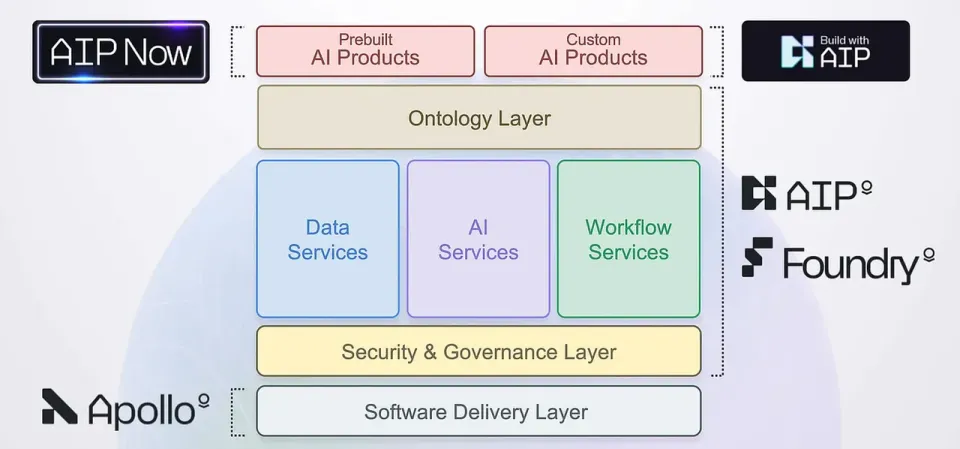
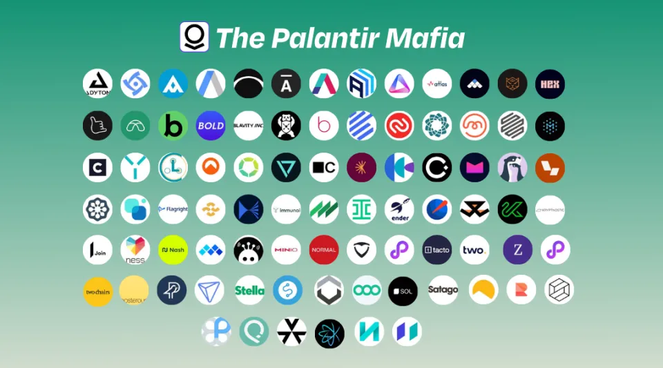

在当今技术快速演进的时代，企业对能将前沿AI技术转化为可落地、可扩展业务系统的工程师需求急剧上升。这个角色有一个特定的名字——**Forward Deployed Engineer（前沿部署工程师，简称FDE）**。他们是连接AI创新与现实应用的桥梁，既懂技术又懂业务，是推动AI从实验室走向企业生产的关键力量。

<!--truncate-->

## 什么是 Forward Deployed Engineer（FDE）？

**Forward Deployed Engineer（FDE）** 是一种兼具工程能力与业务理解的技术角色，他们的职责是 **为企业客户定制、部署并扩展复杂的AI或数据驱动系统**。  
与传统的软件开发工程师不同，FDE常常深入客户现场，与业务团队直接协作，将强大的平台（如AI开发系统或低代码平台）定制为贴合特定业务场景的解决方案。

这一职位最早由 **Palantir** 提出，用于描述那些“深入客户现场，与客户一起解决问题”的工程师。如今，这一理念已广泛应用于AI、企业软件和自动化行业，尤其是在推动 **AI-powered automation（AI驱动自动化）** 与 **low-code development（低代码开发）** 的企业中。

> 简而言之，FDE不仅仅写代码，他们在工程中创造“影响力（impact）”。

## FDE角色的崛起：AI落地的关键节点

FDE的兴起源于一个现实难题：越来越多企业引入AI技术，却缺乏将其真正落地的能力。  
根据Gartner 2024年报告，**72%的企业在AI项目试点阶段后陷入“无法规模化”的困境**，主要原因是部署与集成复杂度过高。

这正是FDE发挥作用的地方。通过结合软件开发能力与领域理解，FDE帮助企业快速部署 **AI驱动的业务解决方案**，无论是物流预测、质量检测，还是生产自动化，都能在较短周期内实现可见成效。

同时，全球AI软件市场预计将在**2030年突破9000亿美元规模**（Statista, 2024），这也意味着能“打通AI最后一公里”的FDE将成为各行业的核心稀缺人才。

## FDE的核心技能与职责

一个合格的Forward Deployed Engineer通常兼具开发者、顾问与战略思维三重身份。  
他们的典型工作包括：

### 1. 解决方案部署（Solution Deployment）

基于企业实际需求，定制并部署AI模型或数据流程。借助如 **JitAI** 这样的 **低代码AI开发平台（AI development platform）**，FDE能在更短时间内实现快速集成与验证。

### 2. 客户协作（Client Collaboration）

FDE直接与客户团队合作，定义业务需求、优化流程并验证结果，将技术能力转化为具体业务逻辑。

### 3. 全栈能力（Full-Stack Proficiency）

多数FDE具备全栈开发背景，能胜任API集成、前端原型开发、DevOps自动化部署等多环节工作。

### 4. 持续学习（Continuous Learning）

FDE需保持对AI技术栈的敏锐度，熟悉如 **LangChain**、**OpenAI API**、**向量数据库（Vector Database）** 等新技术，并能在生产环境中灵活应用。

> FDE不仅是工程师，更是推动AI商业化落地的技术布道者。

## 为什么越来越多企业采用FDE模式

FDE不仅是一种岗位，更是一种 **工程文化的变革**。  
传统软件交付模式往往脱离业务语境，而FDE的现场部署模式则确保AI系统真正“为业务服务”。

### 加速价值实现（Faster Value Realization）

FDE与客户团队协同开发，使得AI系统从方案到上线的周期可缩短数倍，从几个月压缩至数周。

### 提升系统采用率（Higher Adoption Rate）

FDE主导的方案更贴合实际工作流，据McKinsey 2024年数据显示，这种模式的系统采用率平均提升 **60%以上**。

### AI驱动的自动化规模化（AI-Powered Automation at Scale）

依托像 [**JitAI**](https://jit.pro) 这样的低代码平台，FDE能够将AI自动化无缝嵌入企业既有系统中，实现降本提效与智能决策的结合。

这种“共创式”的工程协作方式，让企业不只是“用AI”，而是 **真正掌握AI能力**。

## 低代码AI平台如何赋能FDE

现代的 **低代码AI开发平台** 正在成为FDE的生产力放大器。  
它们让FDE从重复性配置中解放出来，专注于业务逻辑和成果交付。

### 1. 快速原型验证（Rapid Prototyping）

借助JitAI，FDE可以在数天内搭建出可用原型，快速测试业务假设并与利益相关方迭代优化。

### 2. 无缝系统集成（Seamless Integration）

JitAI通过统一的API和AI智能代理，帮助FDE将企业的CRM、ERP、数据库系统与智能自动化流程整合起来。

> 低代码不是取代工程师，而是让工程师的影响力成倍扩大。

想要体验这种高效开发方式，可以立即访问 [**JitAI下载页面**](https://jit.pro/download)，了解它如何帮助企业快速部署AI解决方案。

## FDE的未来：AI企业时代的新核心岗位

随着AI从模型研究转向企业落地，**Forward Deployed Engineer** 将成为推动组织智能化转型的中坚力量。

未来5年，FDE将在以下领域发挥关键作用：

*   构建真正 可生产级部署（Production-Grade） 的AI应用；
    
*   促进数据科学、工程与业务的深度协作；
    
*   推动 AI的伦理性、可靠性与可扩展性标准化。
    

可以预见，FDE将成为企业AI战略的“新一代DevOps”，定义下一阶段的智能开发范式。

## 结语

**Forward Deployed Engineer（前沿部署工程师）** 代表着AI时代的工程新形态。  
他们让AI能力不再停留在模型和理论层面，而是融入企业的真实运作。  
通过FDE与 [**JitAI**](https://jit.pro) 等低代码AI平台的结合，企业可以构建更智能、更灵活、更具适应力的数字基础设施。