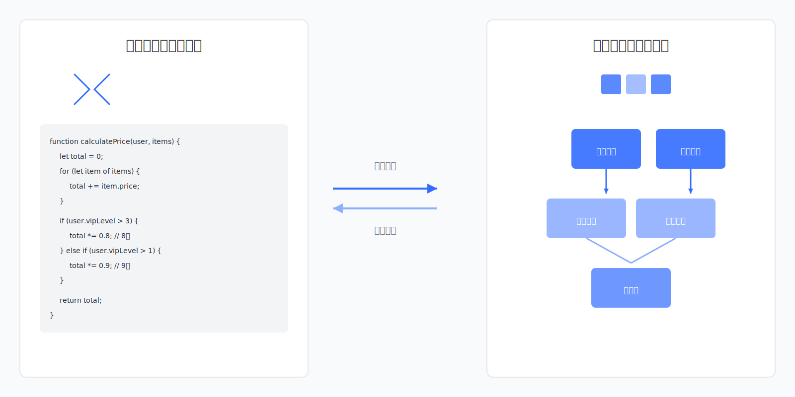

# 软件开发技术重大突破：从编程走向编排

新来的技术负责人盯着代码仓库，一脸茫然。200多个模块，依赖关系藏在500多个文件的import语句里。团队告诉他："想理解架构？慢慢看代码吧，上一任花了三周。"他打开架构文档，发现半年没更新，和实际代码已经对不上了。

这不是个例。这是整个行业的常态。

我们有世界上最先进的IDE，最智能的代码补全，最强大的调试器。我们能一键重构函数名，能实时检测语法错误，能追踪每一行代码的执行路径。但面对最基本的问题——**这个系统到底由哪些模块组成，它们之间是什么关系**——我们却只能像50年前一样，在代码里一行行翻找，靠脑子记，靠经验猜。

**系统结构隐藏在代码中，架构腐化不可见，重构成本高到令人绝望**。这不是某个工具的缺陷，而是整个开发范式的根本性缺失：我们只有编程，没有编排。

<!--truncate-->

## 系统的本质：结构与过程

**任何系统都由结构和过程共同构成**。编排形成结构，定义系统由哪些模块组成、模块之间如何关联；编程实现过程，描述系统如何运行、业务逻辑如何执行。

二者互补不可偏废。编程产生函数，将函数嵌入对象形成新的结构，这是编排；编排产生对象，在函数中使用对象实现业务流程，这是编程。

编程擅长表达过程逻辑，编排擅长表达结构关系，二者相互转化、互为补充。

## 编程与编排的发展失衡

在过去五十年中，编程工具经历了飞速发展：从汇编语言到高级语言，从面向过程到面向对象，从静态编译到动态解释，从单机开发到云端协作。IDE、编译器、调试器、版本控制系统等工具不断演进，极大提升了编程效率。

**然而编排能力始终处于缺失状态**。开发工具和框架在编程能力上不断演进，但对于系统结构的管理始终没有突破性进展。

大量对业务系统结构的管理工作依然是开发者个人能力的体现，而非工具和框架提供的系统性支持。

## 结构隐藏在代码中的困境

现有开发工具普遍缺乏模块编排能力。系统架构如何设计、模块如何组织、关系如何理清，完全依赖开发者自身经验。**结构关系隐藏在代码细节里**，分散在各个文件的import语句、配置文件、依赖声明中。

这导致两个严重问题：

其一，**系统结构难以理解和维护**。一个中型系统有200+模块，依赖关系散落在500+个文件中，开发者需要花2-3周时间在代码中反复查找依赖关系，才能理解系统的整体架构。而使用可视化编排工具，同样的理解过程只需要2-3小时。

其二，**架构容易腐化**。当结构问题不可见时，开发者往往会选择就近修改，逐渐偏离原有的架构设计。等到问题被发现时，已经难以修复。

## 低代码的错位：用拖拽替代一切

很多人以为可视化开发就是答案。市面上的低代码、零代码平台也是这么宣传的："不写代码，拖拖拽拽就能开发应用。"

听起来很美好。但用过的人都知道，这是个谎言。

简单场景确实能快速实现——拖几个表单组件，连几条业务规则，一个CRUD应用就出来了。但等业务稍微复杂一点，你就会发现：**配置项越来越多，规则越来越复杂，最后配置的复杂度不亚于写代码**。更糟的是，配置比代码更难调试、更难版本管理、更难团队协作。

为什么会这样？因为这些平台犯了一个根本性错误：**用可视化去做它不擅长的事情**。

业务逻辑的复杂性、算法的精妙性、性能的优化空间，这些本该用代码表达的东西，硬要塞进拖拽界面和配置表单里。结果是两头不讨好：表达能力不如代码，效率也没提升多少。

**可视化真正该做的，是编排——让系统结构可见、可管理**。而不是替代编程。

## 编排+编程才是正确方向

问题的症结找到了，解决方向也就清晰了：**编排用可视化，编程用代码，二者结合而非替代**。

想象一下这样的开发方式：

你在可视化界面上看到整个系统的架构图——门户、页面、组件、模型、服务、权限，所有模块一目了然。你要创建一个新页面，直接拖拽需要的组件，定义页面跳转关系，配置权限规则。这些**结构性的工作通过可视化完成，直观、高效、不容易出错**。

但当你要实现一个复杂的业务逻辑——比如订单折扣计算，涉及会员等级、促销规则、库存状态的综合判断——你不用在配置界面里搞几十条规则，而是直接切换到代码模式，用几十行代码清晰表达。**代码修改实时反映到可视化界面，可视化操作也同步更新代码**。两种模式无缝协同。

这才是正确的开发范式。可视化让结构可见，代码让逻辑精确。相比传统开发在多个文件中编写import语句和配置代码，可视化编排让开发速度提升3-5倍；相比在代码中追踪依赖关系，可视化架构图让理解成本从2-3周降到2-3小时，架构清晰度提升10倍。

这不是理论构想。基于这个理念构建的开发工具已经出现，并在企业级应用中验证了可行性。

## 永远不腐化的系统结构

要实现可视化编排，需要解决一个核心问题：**如何让系统结构成为一等公民**。

传统开发中，结构信息散落在代码里：类的继承关系、模块的依赖关系、组件的嵌套关系。编译器能理解这些关系，但开发者看不到。我们需要一种新的架构模式，让结构信息独立出来、可视化、可管理。

JitAi采用了一个有效的做法：**分层建模**：

最上层定义元素类别——门户、页面、组件、模型、服务、权限等。这是系统的骨架，是最普适的最佳实践。有了这个标准化的骨架，不同的开发者在同一个认知框架下工作。

中间层封装技术细节——同样是"页面"，可以是React实现、Vue实现、纯HTML实现；同样是"服务"，可以是本地函数、REST接口、GraphQL端点。技术栈的差异被封装起来，只看到"页面A调用服务B"，而不用关心React还是Vue、REST还是GraphQL。

最底层是具体实例——每个页面、每个服务、每个组件都是一个独立实例。开发者在可视化界面上操作的就是这些实例：创建、配置、连接。

这种分层既保持了最佳实践的标准化，又允许开发者扩展——当内置的元素类别不够用，可以定义新类别；当内置的技术栈不支持，可以添加新实现。**既有约束，又有自由**。

这就是Meta/Type/Instance三层结构，在JitAi编程框架中已经实现了大量常用的Meta和Type，足以满足绝大多数企业应用的开发需要。在JitAi可视化开发工具中可以快速创建元素实例。开发者扩展的Meta和Type可以被开发工具识别，并可以在可视化界面中进行编排。

## 打破依赖地狱的零耦合编排

可视化只是表象，更深层的突破在于依赖关系的重新设计。

传统开发中，模块之间通过import、require建立静态依赖。你的组件引用了A、B、C三个库，这些库又各自依赖其他库，形成一张复杂的依赖网。**想把组件复用到另一个项目？先解决依赖冲突吧**。A项目用React 17，B项目用React 18；A项目用Webpack 4，B项目用Vite。光处理这些兼容性问题就要花半天。

面向编排的架构采用了完全不同的思路：**模块之间不直接依赖，而是通过标识符引用**。

一个页面要使用某个组件，不是import组件的代码，而是声明"我要用ID为button-primary的组件"。运行时，系统根据ID找到对应的组件实例，动态加载。组件自己是React还是Vue实现的，依赖哪些库，页面完全不需要知道。

这带来了革命性的复用能力。想把一个组件从A项目迁移到B项目？复制过去就能用，不用处理任何依赖。想把一个完整的业务模块（包含页面、组件、服务、权限）复用到另一个系统？复制目录就行，代码一行不用改。

更进一步，元素可以动态加载、热插拔。这些在传统架构下需要精心设计的能力，在零耦合编排下变成了默认特性。

## 范式转变正在发生

50年来，我们专注于编程能力的提升，却忽略了编排能力的建设。我们有最先进的IDE，却没有让架构可见的工具。我们能追踪每一行代码的执行，却看不清系统的模块结构。

这种失衡正在被打破。

看看一个系统在36个月生命周期中的成本变化：

**前6个月**：传统开发稳扎稳打，编排开发快速搭建，效率差距3-5倍。初期你可能感觉不到问题。

**第12个月**：传统系统架构开始模糊，新人需要2-3周才能理解架构；编排系统结构可视化，新人2-3小时就能上手。团队扩张的成本开始显现。

**第24个月**：传统系统依赖关系复杂化，重构成本变得高昂；编排系统架构清晰度保持10倍优势，持续迭代无压力。技术债的差距开始拉开。

**第36个月**：传统系统技术债累积到无法承受，面临推倒重来的艰难抉择；编排系统依然保持架构优雅，长期维护成本降低60%。胜负已分。

---

**这不是工具的选择，而是认知升级**。当你理解了系统本质上由结构和过程构成，编排和编程各有适用场景，那你就该意识到：不用代码去表达所有东西，也不用可视化去替代所有编程。

JitAi已经在多个企业级应用中验证了这个方向的可行性。
