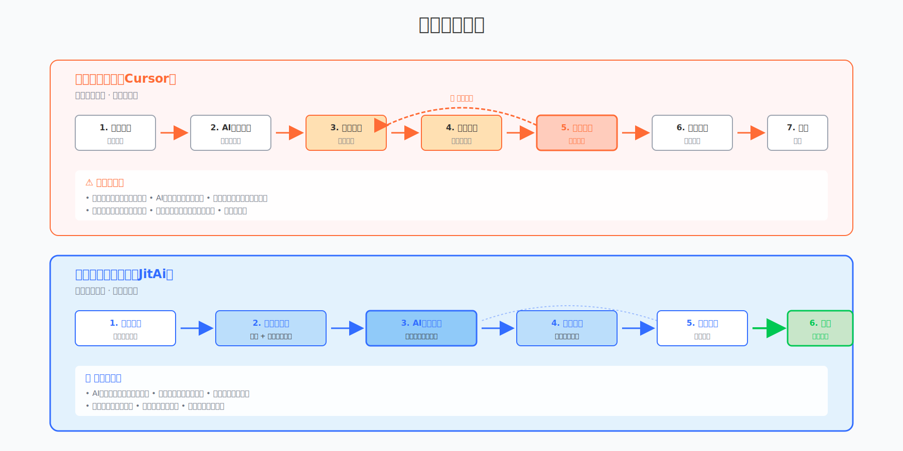

# JitAi vs Cursor：业务系统需要不同的AI编程范式

你有没有对Cursor、Claude Code或者其它AI编程工具说过这些话？

> "你要生成完整代码"  
> "还是无法运行"  
> "你的代码还是有问题"  
> "不要添加不必要的注释"  
> "只生成我让你生成的部分"  
> "都说了参考我之前的代码"  
> "不要改已经没问题的代码"

这些无奈的对话背后，指向同一个核心问题：**AI在细颗粒度层面难以保持稳定的准确度**。

有人会说，Cursor们确实把我的开发效率提升了很多，已经很牛了。

但我要告诉你，**你还没有获得对AI辅助开发这件事的完整认知**。

<!--truncate-->

原生编程语言是细粒度的，Cursor在原生编程语言层面证明了AI和人基于UI协作的可行性。

而业务系统开发需要在更大的粒度上操作——不是代码行，而是业务模块；不是函数，而是功能组件。**在业务开发层面提供AI协作能力，才能做到高准确度、低门槛、低成本**。

## 高准确度

AI幻觉是客观存在的。让AI理解的内容越多，出错的可能性就越大。

这里有一个关键规律：**规范化的大颗粒度内容更易理解，微观的细颗粒度内容则更难把握**。

原生编程语言虽然规范，但颗粒度很细——变量、函数、类、模块，每一行代码都需要精确无误。当你让AI生成几百行代码时，准确率会随着代码量的增长而下降。

业务应用系统的开发本质上是大颗粒度的工作。

想想企业Web应用的构成：门户、页面、组件、数据模型、服务接口、审批流程、权限控制、组织架构。这些模块的功能模式，在过去30年的发展中已经高度规范化。

一个"审批流程"，无外乎节点配置、条件分支、通知设置等。一个"数据报表"，无外乎数据源、字段映射、图表类型。

**这些业务层的配置项，远比底层的技术实现简单。**

相比于让AI理解复杂的微观技术细节（如何用React实现拖拽、如何优化数据库查询），让它理解业务层的接口和配置逻辑要容易得多。这就是颗粒度带来的差异。

JitAi的做法是从架构层面解决这个问题。

我们设计并实现了**Meta/Type/Instance三层模块结构**：

- **Meta层**定义领域和类别（如"审批流程"这个概念属于什么领域）
- **Type层**封装技术实现，开放数量可控的配置项（审批流程的通用实现逻辑）
- **Instance层**承载应用层的个性化业务配置（具体某个项目的报销审批流程）

一个业务系统由许多不同分类的这种分层模块构成。

这种架构的关键价值是：**将技术复杂度控制在Type层，让Instance层保持极低的复杂度**。AI只需要在Instance层工作，理解和生成业务配置，而不需要处理底层技术细节。

举个例子：当你需要一个"多级审批流"时，只用Cursor你需要生成状态机逻辑、数据库事务处理、消息通知代码。用JitAi，你只需要配置"谁审批、审批顺序、通过条件"。

**颗粒度降低一个数量级，准确度提升也是数量级的**。

## 低门槛

并非每个开发者都是高级工程师。

三个现实问题：能不能让初级工程师开发出高质量应用？能不能让懂业务但编码能力很弱的业务专家独立交付项目？能不能让一个人同时搞定多个客户？

在传统开发模式下，这几乎不可能。

用Cursor写代码，你仍然需要：判断生成的代码是否正确、理解代码的架构设计、评估是否会引入技术债、手动修正AI的错误。**这些能力，恰恰是初级工程师和业务专家最缺乏的**。

更关键的是，经验不足的开发者难以掌控Cursor的输出，缺少作为代码主人应有的掌控感，最终可能创造出混乱的工程，俗称“屎山”。

**业务系统开发一定要全程依赖专业程序员吗？** 不一定。

在JitAi的可视化开发平台中，业务专家只需理解业务逻辑，就能像搭积木一样交付项目。

想要一个审批流程？拖拽节点，配置条件。需要数据报表？选择数据源，配置图表。要实现权限控制？设置角色和权限规则。

这不是传统意义上的"低代码平台"那种受限的拖拽。

JitAi生成的是完整的、高质量的原生代码。随时可以切换到全代码模式，查看和修改底层实现。专业程序员可以无缝介入，使用他们熟悉的开发工具。这时借助Cursor这样的工具进行局部优化，完全没有问题。

再加上AI助理的加持，效率会迎来革命性提升。

你可以用自然语言对AI说："我需要一个三级审批的报销流程，财务经理审批金额超过5000元的单据。"AI会直接生成对应的配置。你可以实时预览，调整细节，立即部署。

**AI+GUI的开发模式，会带来充分的Vibe Coding体验。你应该感受到的是流畅的创造过程，而不是与代码细节的反复纠缠**。

## 低成本

成本问题不只是token消耗那么简单。

**模板化、大颗粒度的模块规范，确实会降低token消耗**。当AI只需要理解业务配置层的逻辑，而不是几百行代码的技术细节时，每次交互的token量会大幅降低。

但更重要的是整体交付成本的降低。

用Cursor写代码很快，但返工成本很高，尤其是使用者自身水平不高时：代码有bug需要修正，修正时可能破坏其他模块，架构不合理需要重构，团队沟通成本增加。**这些隐性成本，往往是token成本的几十倍甚至上百倍。**

JitAi的架构设计天然避免了这些问题。

准确度高意味着更少的返工。大颗粒度模块意味着更清晰的边界。规范化的结构意味着更低的维护成本。可视化开发意味着更少的沟通成本。

这形成了一个正向循环：

**架构合理 → 准确度高 → 返工少 → 交付快 → 成本低**

而且这种成本优势是复利的。当你的团队积累了一套业务组件库，当你的客户项目可以快速复用已有模块，当你的开发人员不再陷入技术细节的泥潭——整体效率提升不是线性的，而是指数级的。

## Cursor和JitAi的互补关系

Cursor聚焦于**原生编程语言层面**，擅长处理代码行、函数和文件级别的开发任务，适合算法开发、底层库和技术组件的构建。JitAi则定位于**业务应用工程层面**，在业务模块、配置项和组件级别工作，更适合企业系统和定制化项目的快速交付。

两者定位不同，各有所长。在实际项目中，可以将两者结合使用：**JitAi处理业务系统主体（80%），Cursor优化技术细节（20%）。**

## JitAi应作为FDE的主力工具

Forward Deployed Engineers（FDE），一个正在快速获得关注的新兴岗位。

OpenAI、Anthropic、Palantir等顶尖AI公司都在大量招聘FDE，因为他们的职责是**将AI和数据驱动系统在客户的真实生产环境中快速落地**——这不是普通的现场工程师，而是需要同时具备工程能力和业务理解的复合型角色。

核心挑战是：**技术实现 + 业务理解 + 快速交付，三重压力同时存在。**

什么样的工具能让FDE工作更轻松？

假设一个典型的AI应用交付场景：企业客户需要一个定制化的数据管理系统，集成AI能力，2-3周交付周期。需求包括：多表关联的数据录入、多级审批流程、基于角色的权限控制、可配置的数据报表。

这是FDE的日常工作。时间紧迫，客户期望高，业务逻辑复杂。

**如果在原生代码层面开发会遇到什么问题？**

即使基于已有项目进行修改，你仍然需要在代码细节层面大量调整：修改数据库schema、调整API接口、改造前端组件、重构状态管理逻辑、适配权限规则、定制审批流程。

每个客户的需求都不同，这意味着大量的代码级调整和技术复杂度的应对。

FDE的精力会被严重分散。

你既要快速理解客户的业务逻辑（他们的审批规则是什么？权限如何划分？），又要同时深入代码细节（这个数据结构要怎么改？这段逻辑为什么不适配新需求？）。在2-3周的时间压力下，你很容易顾此失彼。

结果往往是：交付周期难以保证，代码质量参差不齐，后期维护成本高。

**用JitAi是什么体验？**

基于Meta/Type/Instance架构，技术实现已经封装在Type层。FDE只需要专注业务配置层，在大颗粒度层面操作。

你不需要写数据库设计代码，只需要配置数据模型的字段和关系。你不需要实现审批引擎，只需要配置审批节点和流转条件。你不需要编写权限逻辑，只需要设置角色和权限规则。

可视化开发 + AI助理加持，让你可以快速迭代验证。客户说"这个审批流需要加一个财务总监节点"，你当场就能调整配置，实时预览效果。

**结果是：2-3周交付从"几乎不可能"变为"完全可行"**。

关键差异在于：颗粒度不同决定了效率差异。JitAi让FDE从"全栈工程师"变为"业务架构师"，降低认知负担，提升交付速度。

当然，正常情况下JitAi可以处理主体架构和业务逻辑（占80%的工作）。如果遇到极个别特殊的技术细节需求，你完全可以切换到代码模式，用Cursor进行局部优化（占20%的工作）。

**JitAi应该作为FDE的主力工具**。

## 颗粒度决定范式

Cursor在原生编程语言层面证明了人和AI基于UI协作的可行性，JitAi在业务应用层面展示了更大的可能性。

**AI编程的终局不是"写代码更快"，而是"让不可能的交付成为可能"**。

**率先完成认知升级的企业，将会把"2周交付企业级AI应用"从神话变为常态。这不仅是竞争优势，更是未来的生存门槛。**
